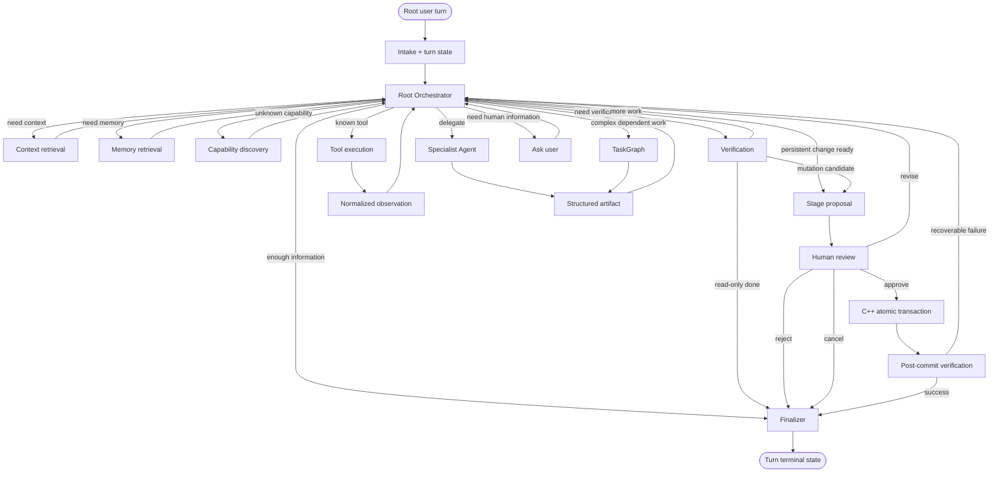
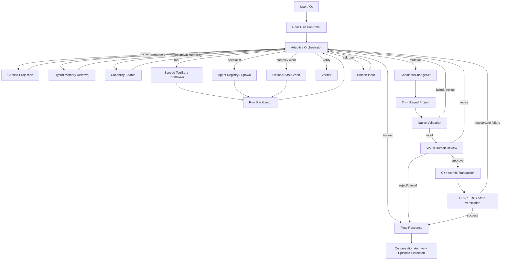

# CCad Agent production TODO

Check a box only after implementation and its required evidence exist.

### Sprint 998 active slice — explicit functional-block net retrieval (Tier 1, C3)

- [x] Add contract tests for typed board/schematic block-to-net edges, namespace separation, bounded context forwarding, incremental stale-edge replacement, and already-seeded active-net targets.
- [x] Implement only source-backed group/sheet net relations; keep PCB net IDs separate from schematic net IDs and do not infer connectivity.
- [x] Carry the retained edge count through context metadata, JSON-RPC, Agent workspace state, and activity status; preserve explicit edges when the target net is already an exact seed.
- [x] Add isolated provider-disabled GUI-map scenario; verify the disposable board group, exact context count, transcript, and Settings dialog.
- [x] Run focused Python contracts, Pyright (0 diagnostics), Qt MinGW Release build, and full CTest (115/115).
- [x] Inspect all four scoped screenshots and review the 10-action GUI-map report, stdout, and stderr (stderr empty).
- [x] Update C3, feature, codebase, progress, and the interaction-plan record; staged secret-pattern scan and `git diff --check` pass.
- [x] Commit and push the verified slice (`21bf3d6`); hosted CI/PR inspection remains open.

### Sprint 999 active slice — manifest digest casing interoperability

- [x] Add a contract that reproduces the PowerShell `Get-FileHash` uppercase-digest commit message.
- [x] Accept uppercase and lowercase SHA-256 hex in evidence references while validating the manifest digest case-insensitively.
- [x] Run evidence-checker contracts and the official non-visual Qt Release/full CTest gate; inspect manifest and logs.
- [x] Update handover/progress/feature/TODO records, scan staged additions, and commit/push verified files.

### Sprint 997 active slice — PCB-only geometry relationships (Tier 1, C3)

- [x] Keep board and schematic coordinates in separate spatial domains; retrieval contracts cover both coordinate-space exclusions.
- [x] Retrieve nearby PCB footprints from an exact PCB-footprint anchor; tests verify provenance and geometric distance.
- [x] Expand an exact placement region to intersecting typed PCB objects; tests verify inclusion, exclusion, and moved-region refresh.
- [x] Preserve relation provenance and included counts through bounded context, IPC, and Agent status; the UI reports included nearby-footprint and region-member counts.
- [x] Cover inclusion, exclusion, movement, incrementality, and bounded-context behavior with focused Python contracts and full CTest (115/115).
- [x] Verify the disposable-board flow with the official mapped GUI harness; inspect all four screenshots and stdout/stderr logs. Manifest: `artifacts/evidence/sprint997-project-geometry-relations-ui-pass.json` (SHA-256 `104DC06FB7BA39509639D3BA7B49FE4D82BF5871AEC945E2B067C73C8B965C16`).
- [x] Update handover docs and feature/progress records; `git diff --check` passes.
- [x] Run redacted tracked-tree and staged-addition credential scans before commit; zero staged matches, with only two pre-existing documentation examples and one untouched synthetic fixture in the full tracked tree.
- [x] Commit and push the verified slice (`21bf3d6`); hosted CI/PR inspection remains open.
- [ ] Inspect hosted CI status for the pushed SHA.

### Sprint 996 active slice — reconcile visual-validation replacement proposal

- [x] Read the supplied replacement set in full and compare each proposed file with the current workflow, verifier, app-owned UI-map harness, evidence checker, commit hook, CI, and ignore rules.
- [x] Keep the existing functional verifier and CI architecture; reject illustrative nonexistent wrappers, broad artifact unignoring, and unsupported self-hosted/branch-protection claims.
- [x] Document canonical paths, one end-of-slice gate, verified unchanged-code reuse, and workspace-only screenshot/log policy.
- [x] Add and pass the visual-harness policy contract for canonical entry points and evidence handling.
- [x] Run the official non-visual verifier; inspect its manifest and all logs (Qt MinGW Release; full CTest 115/115). Manifest: `artifacts/evidence/sprint996-validation-reconciliation.json` (SHA-256 `06AD438359BB59D8D8B5D1B6E52A366CE9EBC2F2370CE9871268AD374382D45F`).
- [x] Run redacted tracked-tree and staged-diff credential scans; staged additions are clean, and existing token-shaped fixture/documentation matches were classified as non-secrets.
- [x] Commit and push the documentation/test slice (`21bf3d6` includes `2169827`).
- [ ] Inspect hosted CI for the pushed SHA after a PR is available.

Scope boundary: this updates the workflow contract only. Existing scripts, commit hook, CI lanes, and artifact policy remain authoritative; no GUI wrapper, self-hosted runner, or repository branch-protection setting is fabricated.

### Sprint 995 active slice — stable schematic pin identity persistence (Tier 1, C3)

- [x] Add source-level coverage for native `SchPin.id` round-trip and the existing derived-identity path for records without IDs.
- [x] Read optional `id` from symbol-declared pins and write it only when non-empty, preserving compatibility with older project JSON.
- [x] Pass focused serializer and project-index tests; Pyright reports zero diagnostics for the affected retrieval module.
- [x] Pass Qt MinGW Release build and full CTest (115/115) through `scripts/verify_sprint.ps1 -NonVisual`; inspect its logs and manifest. Manifest: `artifacts/evidence/sprint995-schematic-pin-identities.json` (SHA-256 `21c857fa71413cdb262e3018cdd56db0485d46b6caae1383664b148e46254561`).
- [x] Update feature/codebase/progress/C3 documentation and record the verified manifest metadata.
- [x] Run redacted credential-pattern scans: zero matches in staged files; the tracked repository has one pre-existing synthetic test fixture in `scripts/test_memory_store.py`.
- [x] Commit and push this verified slice (`21bf3d6` includes `3c69d86`).
- [ ] Inspect hosted CI on the pushed SHA before merge.

Scope boundary: this preserves the source IDs that CCad currently serializes; library-definition pin identities and unrelated missing graph edges remain open.

### Sprint 994 completed slice — local evidence to independent CI handoff

- [x] Clarify that local verification and a passing evidence manifest precede commit/push; pushing triggers independent CI, and merge waits for the actual green result.
- [x] Keep GUI screenshots/logs workspace-only and hash-checked locally; commit only source, tests, documentation, interaction plans, and manifest metadata.
- [x] Add a visual-harness policy contract for CI handoff and evidence exclusion; focused CTest passed.
- [x] Reuse the existing app-owned Qt UI-map verifier, manifest validator, commit hook, and hosted CI instead of introducing fictional wrapper scripts or an unconfigured runner.
- [x] Add a truthful non-visual evidence-verification mode for process-only slices; it retains Qt preflight, Release build, full CTest, and the required generated manifest while forbidding use for GUI changes.

### Sprint 993 completed slice — explicit functional-block context (Tier 1, C3)

- [x] Derive searchable blocks only from typed user groups and serialized schematic sheet hierarchy; retain source provenance.
- [x] Resolve and expose bounded source member IDs, current PCB/schematic members, related nets, and derivable physical bounds.
- [x] Rebuild block membership from each current project revision; expand matched blocks through typed member relationships.
- [x] Carry safe block metadata through the bounded provider context and report its count in the live Agent context event.
- [x] Add retrieval, unresolved-member, revision, context-budget, and incremental-removal contracts.
- [x] Prove the included block count in the live GUI-map Agent context with provider disabled (10 mapped actions; four inspected states; isolated transcript verified).
- [x] Update the C3 checklist, feature, codebase, progress, and backlog records.
- [x] Complete Qt MinGW Release build and full CTest (115/115).
- [x] Complete provider-disabled mapped GUI validation; inspect four distinct screenshots and captured stdout/stderr.
- [x] Run added-line credential-pattern scan and `git diff --check`.
- [x] Keep generated logs/screenshots workspace-only; locally verify artifact hashes while preserving hash metadata in committed evidence.
- [x] Add six manifest-policy contracts, PowerShell syntax validation, and focused GUI-harness CTest.
- [x] Commit and push verified Sprint 993 source, tests, docs, interaction plan, and manifest; exclude generated screenshots/logs.

Evidence: `artifacts/evidence/sprint993-functional-block-context-publish-ready.json` (SHA-256 `8753A1ABDA9444A08B8B1E41D5D3D34B129A107719D75E8903CB9AE552598400`).

Scope boundary: no labels are inferred by a model, and no semantic/vector project retrieval is claimed. Connectivity-only grouping, library-definition-only components, richer sheet net summaries, and vector retrieval remain open.

### Sprint 992 active slice — declared schematic pins and annotations (Tier 1, C3)

- [x] Index connected and unconnected symbol-declared pins with safe typed metadata and correct net membership.
- [x] Retrieve serialized schematic annotations and rule-area/table content; never index embedded bitmap payloads.
- [x] Prove incremental add/remove, exact retrieval, serialization, UI-map context, build, CTest, and reviewed evidence.
- [x] Update feature, codebase, progress, and C3 relationship coverage records.

Evidence: 34/34 project-index contracts; Pyright 0 diagnostics; Qt MinGW Release build; CTest 115/115; 10 successful mapped interactions, four inspected screenshots, no provider request, and reviewed stdout/stderr. Hash-bound manifest: `artifacts/evidence/sprint992-schematic-pin-retrieval-verified-final.json`.
Scope boundary at Sprint 992: the current CCad JSON reader/writer omitted `SchPin.id`, so file-loaded pin identities were derived from symbol, unit, and pin number/name. Sprint 995 now preserves optional native IDs; unsupported library-definition pin identities and broader source-model graph relationships remain open.

### Sprint 991 active slice — opt-in local semantic memory retrieval (Tier 1, M4)

References checked before implementation: [Ollama embedding guide](https://docs.ollama.com/capabilities/embeddings), [Ollama `/api/embed`](https://docs.ollama.com/api/embed), and [LangChain embeddings overview](https://docs.langchain.com/oss/python/integrations/embeddings). Embeddings use one pinned model identity for query and documents; semantic results augment fielded lexical retrieval rather than replacing exact-term matching. Endpoint is loopback-only and never triggers model installation.

- [x] Add bounded, opt-in local embedding backend with exact installed-model readiness/version checks, strict vector validation, and safe categorized errors.
- [x] Fuse semantic candidate rankings with existing title/content/tag lexical rankings and apply cosine-aware bounded MMR; retain lexical-only fallback on every embedding failure.
- [x] Bound and invalidate process-only embedding caches on model, namespace, memory content, tier disable, clear, and compaction changes.
- [x] Persist semantic enable/endpoint/model settings; show truthful runtime status in Personalisation → Memory.
- [x] Add protocol, loopback safety, semantic paraphrase, cache invalidation, failure fallback, GUI contract, and CTest coverage.
- [x] Run focused language-server/contracts; then Qt MinGW Release build and full CTest gate (115/115). clangd was run on changed Qt translation units; its optional ExtractFunction actions emitted internal break/continue messages, with no compiler diagnostic or build failure.
- [x] Verify settings through the official isolated-profile GUI-map harness; inspect four distinct screenshots and stdout/stderr. Seven mapped interactions succeeded, two typed fields changed, unavailable Ollama state displayed truthfully, and explicit dark-theme checkbox/group-box styling passed targeted GUI CTest plus a fresh GUI capture.
- [x] Keep semantic endpoint/model fields reachable through the live UI map, and preserve readable dark styling and scroll visibility in Personalisation.
- [x] Add a local evidence runner, manifest/artifact hash validator, commit-msg hook, and hosted CI evidence check; a passing manifest does not replace screenshot review.
- [x] Update codebase/features/progress/TODO in this change set.
- [x] Run redacted repository/staged secret scan; the only repository match is a pre-existing synthetic fixture in untouched `scripts/test_memory_store.py`, with zero staged matches.
- [ ] Finish diff review, commit and push this branch; merge to `main` only after the actual CI check is green, then verify SHA and remove only this completed branch.

Scope boundary: local Ollama semantic retrieval is optional and remains off unless enabled. A missing service/model or bad response leaves lexical retrieval available. This does not complete conversation-history semantic retrieval or project-entity embeddings.

### Sprint 990 completed slice — fielded memory ranking and bounded diversity (Tier 1, M4)

- [x] Index enabled project/conversation/user memory titles, content, and tags through separate lexical fields after existing scope and expiry gates.
- [x] Fuse field rankings deterministically with weighted reciprocal-rank fusion while retaining the minimum lexical-match floor.
- [x] Apply bounded, deterministic maximal-marginal-relevance selection to reduce redundant memory context.
- [x] Return only safe score/rank/channel provenance and opaque namespace identity; do not expose memory payloads in diagnostics.
- [x] Contract-test cross-field retrieval, tag retrieval, stable fusion, diversity, result bounds, and lifecycle isolation.
- [x] Run changed-module Pyright, focused contracts, Qt MinGW Release build, full CTest (114/114), and diff/secret scans.
- [x] Update lifecycle, feature, codebase, progress, and sprint notes.
- [x] Commit, fast-forward and push `main`, verify the remote SHA, and remove only this completed sprint branch.

Scope boundary: this adds lexical field fusion and diversity only. Embeddings, importance/recency/usage adjustments, preference/correction weighting, and provider-tokenizer budgeting remain open. It does not make paraphrase retrieval semantic.

### Sprint 989 active slice — bounded BM25 memory/history retrieval (Tier 1, M4-A)

- [x] Replace simple memory and TurnRecord overlap ordering with deterministic BM25 ranking and matched-term/score provenance.
- [x] Search compact prior-thread recaps only after an exact native-project scope filter; expand a bounded set into source-linked TurnRecords.
- [x] Keep retrieval bounded and inject at most eight prior turns; preserve thread, turn, and message source IDs in provider context.
- [x] Contract-test ranking, empty/weak matches, active-project isolation, current-thread exclusion, bounds, and source provenance.
- [x] Run changed-module Pyright (0 diagnostics), focused retrieval contracts, Qt MinGW Release build, full CTest (114/114), and a staged secret scan.
- [x] Update lifecycle, feature, codebase, progress, and sprint notes; commit, merge/push `main`, verify remote SHA, and remove only this completed branch.

Scope boundary: this slice implemented BM25 lexical retrieval only. Sprint 990 adds fielded RRF/MMR for memory records; embeddings, preference/correction weighting, and provider-tokenizer budgeting remain open. Do not mark full M4 complete.

### Sprint 988 completed slice — project-scoped durable memory (Tier 1, C2)

- [x] Store project LTM in a stable, opaque namespace derived from the native project ID; keep conversation LTM and global episodic records isolated.
- [x] Automatically retrieve matching project records across threads for that same project; reload on project switch and fail closed when project identity is absent.
- [x] Support project memory through existing add/list/update/delete/clear flows; keep full reset explicit and preserve other projects during ordinary operations.
- [x] Include truthful project-memory availability/count and namespace provenance in context state; keep contents out of diagnostics.
- [x] Invalidate cached context and pending project-memory compaction plans when project identity changes.
- [x] Add persistence, isolation, active retrieval, CRUD, reset, manifest, and stale-plan contracts; run focused tests, Pyright, Qt Release build, and full CTest (113/113).
- [x] Update memory lifecycle, feature, codebase, progress, backlog, and sprint documentation; run redacted secret scan.
- [x] Commit verified changes, push `main`, verify remote SHA, then remove only the completed sprint branch.

References checked: [LangGraph long-term memory](https://docs.langchain.com/oss/python/langgraph/add-memory) recommends durable cross-session storage in scoped namespaces; CCad retains its local JSON store and uses the native project ID as the scope identity. Project data must never be inferred from a display name or shared across projects. Semantic ranking, preference/correction evidence, embedding retrieval, and provider-tokenizer budgeting remain separate open work.

### Sprint 987 completed slice — schematic fields and safe sheet identity (Tier 1, C3)

- [x] Index typed symbol field names/text/visibility and sheet title plus relative path.
- [x] Preserve bounded properties and relative sheet paths through context packaging; reject sensitive keys and absolute paths.
- [x] Send native project ID with Agent turn context; keep serialized schematic state inspectable through the typed project-state query.
- [x] Pass 32 focused project-index/context tests and changed-module Pyright.
- [x] Verify provider-disabled live context has nonzero project retrieval, includes the field/path, and retains transcript across `/clear`; inspect three screenshots and stdout/stderr.
- [x] Pass Qt MinGW Release build and full CTest (113/113); run redacted secret scan and update handover docs.
- [x] Commit, fast-forward/push GitHub `main`, verify remote SHA, and remove only the completed sprint branch.

Scope boundary: rule IDs, project artifact identities, notes, generated functional-block summaries, and annotations remain open because the typed model does not currently provide complete authoritative records for them.

### Sprint 986 completed slice — typed-project spatial retrieval (Tier 1, C3)

- [x] Add explicit bounded bounding-box retrieval over indexed entity AABBs; preserve deterministic ordering and incremental stale-geometry removal.
- [x] Retrieve live DRC/ERC records through explicit affected-object links when their target objects intersect the requested region; exclude unrelated distant diagnostics.
- [x] Cover every currently serialized PCB collection's declared layer fields and test sheet/symbol, schematic-net/PCB-net ID, component/footprint, and diagnostic/object relationships.
- [x] Include typed descriptions, rule values, and diagnostic code/severity/message in safe exact/BM25 indexing; reject secret-shaped fields.
- [x] Avoid rebuilding entity documents for unchanged typed snapshots; key reuse to the project plus attached live diagnostics, not ephemeral GUI selection/layer state.
- [x] Pass 29 project-index plus 7 context-broker contracts and changed-module Pyright; run the 10k-track C3 benchmark and record cold/cached/single-entity-update behavior.
- [x] Verify a provider-disabled mapped Agent request phrased as a bounded PCB rectangle against an isolated board; authoritative DRC and `project.context` confirm `ZERO_LENGTH_TRACK` is linked to `T_SPRINT986_ZERO`, the assembled context reports project/diagnostic counts, and no provider request is sent. Inspect the three distinct before/DRC-ready/result screenshots and stdout/stderr.
- [x] Pass Qt MinGW Release build (21/21) and full CTest (113/113); run staged redacted secret scan and update codebase/features/progress/TODO together.
- [x] Commit `5c69720`, fast-forward and push GitHub `main`, verify remote SHA `5c6972085f70d10ca53de1dc03f4bef238441350`, and remove only the completed sprint branch.

Scope boundary: full C3 remains open for model identities/relationships CCad does not serialize, functional-block semantics, transaction-delta-driven index maintenance, and additional representative retrieval-quality/performance gates. Benchmark timings are local measurements, not performance guarantees.

### Sprint 985 completed slice — typed project relationships and live diagnostics (Tier 1, C3)

- [x] Include bounded authoritative DRC/ERC diagnostics with engine, code, severity, and object identity in live `project.context`.
- [x] Index explicit group membership, route endpoints, teardrop anchors, diagnostic targets, and actual schematic-page hierarchy; never infer missing model relationships.
- [x] Preserve graph edges and diagnostic fields through bounded retrieval and remove stale edges on incremental updates.
- [x] Pass 24 focused project-index/context-broker tests and changed-module Pyright 1.1.414 (0 diagnostics).
- [x] Verify the real `ZERO_LENGTH_TRACK` diagnostic for `T_SPRINT985_ZERO` in the disposable-project GUI-map flow; seven mapped interactions, nine screenshots inspected, stdout/stderr reviewed, no provider request.
- [x] Pass Qt MinGW Release build and full CTest (113/113); update handover, feature, progress, and this TODO; run redacted secret scan.
- [x] Commit verified slice `bf2b530`, fast-forward/push `main`, verify remote SHA `bf2b530ca04024c2a3ad5373502631441f7565e5`, and remove only the completed sprint branch.

Scope boundary: this slice closes explicit-link and diagnostic retrieval coverage only; broader all-entity graph/layer coverage, benchmark coverage, and C3 completion remain open.

### Sprint 984 active slice — exact native PCB-net retrieval (Tier 1, C3)

- [x] Derive bounded board-net index nodes from net IDs present on native typed board objects; preserve net ID and member relationships without claiming physical continuity.
- [x] Ensure a full colon-delimited schematic-pin identity wins over its embedded net-name token, including when natural-language text precedes the identity.
- [x] Preserve the native board-net association semantics in bounded provider context and expose the number of actually packaged board-net records in safe turn metadata and the Agent activity line.
- [x] Add board-only, exact retrieval, bounded-context, structured-ID, and incremental net reassignment/stale-membership regression contracts.
- [x] Pass the 23 focused project-index contracts, changed-module Pyright 1.1.414 (0 diagnostics), Qt MinGW Release build, and full CTest (113/113).
- [x] Pass the provider-disabled seven-action GUI-map query against the real `agent-catalog` project; verify displayed board-net count, transcript retention/clear behavior, inspect all three distinct screenshots, and review stdout/stderr.
- [x] Update handover/features/progress and this checklist; the production TODO is the canonical backlog, so no duplicate backlog file was created. Run the staged secret scan.
- [x] Commit the verified slice as `06a6c3d`, fast-forward and push `main`, verify GitHub SHA `06a6c3debb4495e7db6ce1ca55196c17bf3d5abf`, and remove the completed sprint branch.

### Sprint 983 active slice — production-shaped project-index coverage (Tier 1, C3)

References checked: [KiCad board file format](https://dev-docs.kicad.org/en/file-formats/sexpr-pcb/) models layers, setup, footprints, graphics, images, tracks, and zones as typed board sections; [KiCad PCB Editor](https://docs.kicad.org/10.0/en/pcbnew/pcbnew.html) describes pads, tracks, vias, and zones as distinct physical/net objects. CCad retains its own serialized model; this slice indexes the actual CCad JSON fields and does not infer rule IDs or layer membership absent from the kernel model.

- [x] Index production `padstack.layer_set`, preferred route-request layer, explicit single/multiple layers, and via endpoints with incremental stale-edge removal.
- [x] Retrieve typed layer-bearing board object variants, including zones, arcs, graphics, dimensions, text, barcodes, reference images, tables, targets, and teardrops; exclude reference-image bytes.
- [x] Index typed keepout/placement-region rectangle bounds and board scalar design-rule values; preserve values through bounded provider context.
- [x] Add regressions against nested padstack serialization, each layer-bearing object family, rectangle bounds, rule edits, incremental index changes, and compaction.
- [x] Pass changed-module Pyright (0 diagnostics), Qt MinGW Release build, and full CTest (113/113).
- [x] Pass adapted provider-disabled GUI-map query against a disposable project with nested serialized pad layers; complete seven mapped actions, inspect three feature-relevant screenshots and stdout/stderr. The turn included 10 typed project matches and four distinct PCB layer IDs; no provider request was sent.
- [x] Update handover/features/progress/backlog and this checklist; staged secret scan has zero findings. The tracked-repository scan found one expected synthetic GitHub-token fixture in the redaction test only.
- [x] Commit the verified slice, fast-forward/push `main`, verify remote SHA, and remove the completed sprint branch.

### Sprint 982 active slice — multilayer typed-project context (Tier 1, C3)

References checked: [KiCad PCB Editor via and layer-stack behavior](https://docs.kicad.org/10.0/en/pcbnew/pcbnew.html) defines through vias as spanning front-to-back copper, while blind, buried, and microvias use their declared endpoints; [KiCad legacy board-format reference](https://dev-docs.kicad.org/en/file-formats/legacy-pcb/) records explicit via start/end layer semantics. This slice applies the board's outer copper layers to newly placed through vias and indexes every declared layer membership without claiming complete entity-graph coverage.

- [x] Index via start/end layers and declared pad layer sets as exact, incremental project relationships; preserve bounded layer IDs in retrieved context and safe per-turn metadata.
- [x] Ensure normal mapped canvas placement and the existing automation placement path both persist the board-derived outer copper endpoints for a through via.
- [x] Add regressions for retrieval from either endpoint, incremental endpoint changes, pad multi-layer membership, and context-budget preservation.
- [ ] Finish project-graph coverage; Sprint 986 now contract-tests layer membership for every currently serialized PCB collection and bounded object-linked diagnostics. Unavailable kernel identities/edges remain explicitly open below.
- [x] Pass Qt MinGW Release build and full CTest (113/113); pass the provider-disabled GUI-map scenario with nine mapped actions, a disposable project, persisted F.Cu/B.Cu endpoints, non-empty per-turn PCB layer context, and five inspected screenshots; review stdout/stderr.
- [x] Update handover, features, progress, backlog and this checklist; record wider project-graph/layer coverage as open.
- [x] Scan and publish only verified files to GitHub `main`; remove the completed local sprint branch.

### Sprint 981 active slice — schematic net-member retrieval (Tier 1, C3)

- [x] Expand each bounded `schematic_net.members` entry into an independently retrievable pin identity linked to its source net and symbol/component.
- [x] Retrieve sibling net members and schematic symbols through explicit logical membership; keep board-pad/track associations separately labeled and never infer geometric continuity.
- [x] Include only actually packaged schematic pin/symbol counts in the safe per-turn metadata and Agent activity line.
- [x] Prove incremental membership edits remove stale pins/edges without rebuilding unchanged entities; bound extraction work for multi-sheet netlists.
- [x] Pass focused project-index/context contracts (13/13), Pyright 1.1.414 (0 diagnostics), clangd 19.1.7 with the Qt/MinGW compile database (no source diagnostics; optional `agent_panel.cpp` ExtractFunction action probe has known analyzer-internal errors), Qt Release build, full CTest (113/113), and a provider-disabled seven-action GUI-map scenario with all four generated screenshots plus logs inspected.
- [x] Update handover/feature/progress docs; staged added-line secret scan is clean (tracked repository scan found only 3 pre-existing synthetic/test-context patterns).

### Sprint 980 active slice — deterministic typed-project retrieval (Context Runtime C3)

Research: [KiCad PCB Editor](https://docs.kicad.org/7.0/en/pcbnew/pcbnew.html) separates layers, objects, and nets as distinct board views; [KiCad board file format](https://dev-docs.kicad.org/en/file-formats/sexpr-pcb/) identifies tracks, vias, zones, footprints, pads, and layers as structured board entities. CCad retrieval follows its native typed snapshot and deliberately labels net association separately from physical copper continuity.

- [x] Implement/test deterministic exact, BM25, net/component/layer association, and coordinate-based retrieval from the active typed project snapshot; include bounded results, secret redaction, and content-revision updates.
- [x] Inject relevant project entities into the actual provider context, preserve them when a large project snapshot is compacted, and report safe retrieval counts/revision/method.
- [x] Run focused context contracts, changed-module Pyright, Qt MinGW Release build, full CTest (113/113), and scoped GUI-map validation (seven actions, 10 project matches, four inspected screenshots, provider disabled, stdout/stderr reviewed).
- [x] Update architecture/features/progress and this checklist; staged secret scan passed; commit `4d87b23` merged and pushed to GitHub `main`; delete the completed local sprint branch (no remote sprint branch required cleanup).

### Sprint 979 active slice — Pyright analysis and protocol boundary

References checked: [Pyright configuration: `maxCodeComplexity`](https://github.com/microsoft/pyright/blob/main/docs/configuration.md) exposes the analyzer's complexity guard, and [Pyright issue 3138](https://github.com/microsoft/pyright/issues/3138) explains why oversized control-flow scopes stop analysis. This slice decomposes runtime code; it does not suppress the diagnostic or raise the limit.

- [x] Move bounded provider model-catalog HTTP requests and response parsing to `src/ccad_agent/model_catalog.py`, preserving explicit refresh, auth headers, timeout bounds, safe failure classification, and the existing JSON-RPC facade.
- [x] Extract one user-turn handler from the JSON-RPC loop while preserving dispatcher continuation, process state, cancellation, memory, conversation, and trace behavior.
- [x] Add a CTest-registered protocol-boundary contract and update provider catalog contracts to inspect the owning runtime modules; verify controlled-response parser tests with zero provider/network calls.
- [x] Resolve Pyright's `orchestrator.py` complexity cutoff without suppressions; targeted Pyright 1.1.414 reports zero diagnostics for the orchestrator and model catalog.
- [x] Pass Qt MinGW Release build and full CTest (112/112); targeted live GUI-map scenario completed seven mapped actions with provider disabled, and all four distinct retained screenshots plus stdout/stderr were inspected.
- [x] Update codebase map, feature inventory, progress, backlog; scan staged changes and publish verified changes to GitHub `main`.

### Sprint 978 active slice — one Langfuse root per Agent turn

References Checked: [Langfuse SDK instrumentation](https://langfuse.com/docs/observability/sdk/instrumentation) documents active-context nesting; [Langfuse sessions](https://langfuse.com/docs/observability/features/sessions) documents propagating one stable conversation session ID to child observations. `context_broker.py` and the orchestrator confirm the recap was packaged but not supplied to automatic-memory deduplication.

- [x] Open one `agent.turn` root and bind the durable thread session before context construction.
- [x] Keep context assembly, memory retrieval, context packaging, and LangGraph invocation under that trace; close root before export/readback.
- [x] Close and flush early-exit turns without a provider call; preserve truthful disabled/unconfigured tracing behavior.
- [x] Deduplicate automatic memories against recent conversation and the actual thread recap; include recap changes in cache invalidation and reuse dedup context during targeted refresh.
- [x] Verify real Langfuse SDK ancestry with a local in-memory exporter, source-order contract, recap-dedup/cache/refresh regressions, Qt Release, full CTest (111/111), and seven mapped GUI interactions with four inspected screenshots and reviewed logs.
- [x] Resolve Pyright's `orchestrator.py` complexity cutoff; telemetry, ContextBroker, and new regression contracts are clean under Pyright 1.1.414 (Sprint 979).
- [ ] Follow-on: semantic memory relevance, provider-tokenizer budgeting, and preference/correction-aware ranking.

### Sprint 977 active slice — deterministic context and memory retrieval

- [x] Extract bounded, secret-redacted task/editor/selection/entity/history signals without an LLM call.
- [x] Assemble a versioned per-thread TurnContext with deterministic, scope-filtered memory retrieval, provenance, and cache invalidation.
- [x] Inject a bounded memory summary and content-free tier/scope manifest into the actual provider context package.
- [x] Bound retrieved memory separately by configurable estimated-token and record limits; preserve valid package serialization under overflow.
- [x] Add a real read-only `ccad_search_memory` LangChain tool for targeted in-turn memory retrieval and version refresh.
- [x] Add focused no-network tests for signal redaction, relevance, scope isolation, cache/write invalidation, targeted refresh, provider tool composition, and package budgets.
- [x] Pass Qt MinGW Release build and full CTest (110/110); pass changed-module Pyright and clangd; complete seven mapped GUI actions with four inspected screenshots and reviewed stdout/stderr; run repository and staged-diff secret scans before commit.
- [x] Follow-on completed in Sprint 978: same-root context/graph tracing and deduplication against recent conversation plus thread recap.

### Sprint 976 conversation-store slice

- [x] Persist full conversation messages per thread with tool-call identity and secret redaction.
- [x] Bound provider history by estimated tokens and message count without splitting recent tool turns.
- [x] Store source-linked TurnRecords and bounded thread recap; retrieve them into provider context.
- [x] Keep `/cc` and `/clear` model projection separate from canonical transcript.
- [x] Verify restart/thread isolation with real JSON-RPC subprocesses; zero provider calls.
- [x] Verify chat, persistence status, and `/clear` through the isolated live GUI-map flow.
- [x] Run focused Python tests, Pyright, clangd, Release build, full CTest, visual inspection, and secret scan.
- [x] Update handover, feature, lifecycle, progress, backlog, and TODO documentation in the implementation commit.
- [ ] Follow-on: migrate existing checkpoint-only history, add history UI/resume integration, and semantic retrieval beyond lexical turn search.

## Update protocol and active slice

Update this file in the same commit as each implementation slice.

### Sprint 975 memory-management feedback

- [x] Return authoritative add/update/delete/reset success and failure events to the settings UI.
- [x] Keep memory controls disabled while writes are pending; refresh only after backend success and confirm destructive deletion.
- [x] Preserve deletion of the specifically selected durable record across a thread switch during confirmation.
- [x] Validate add/update/delete and empty-input rejection through mapped GUI actions against an isolated durable store.
- [x] Show confirmed memory-reset count or backend error; mapped validation deletes one isolated record and refreshes tier counts.
- [x] Log every mapped action; retain only distinct screenshots proving dialogs, operation results, confirmation, and restored UI.
- [x] Fix GUI-map test fixture text accidentally rendered over the live menu bar.

Remaining memory/context lifecycle and orchestration work below remains open.

### Sprint 974 active slice - reviewed durable-memory compaction

- [x] Bound same-tier, same-namespace, same-scope durable-memory selection; reject secret-bearing sources and unsafe summaries.
- [x] Add explicit plan, provider-send, review, apply, and cancel stages; provider calls use the selected model with tools disabled.
- [x] Keep plans process-only and expiring; clear them on memory disable and thread/namespace changes.
- [x] Revalidate records before provider transmission and atomically replace only unchanged records after explicit apply.
- [x] Add offline/store contracts and real JSON-RPC lifecycle coverage; prove no-provider paths preserve storage.
- [x] Pass Qt MinGW Release build and full CTest (106/106); run seven mapped Agent interactions in an isolated profile, inspect all seven screenshots and stdout/stderr.
- [x] Update feature, handover, progress, and backlog docs; fix preflight acceptance of the valid `UNINITIALIZED` compiler cache type.
- [ ] Verify one opt-in real provider summary and reviewed apply on disposable memory; this slice made no quota-consuming provider request.
- [x] Run redacted tracked-repository and staged-diff secret scans; staged diff is clean, with only an existing synthetic token-shaped test fixture in `scripts/test_memory_store.py` found in tracked sources.
- [x] Commit only the verified files; exclude unrelated GUI edits, local configs, logs, screenshots, and generated projects.
- [x] Push the verified commit to the sprint branch.

Reference checked: [LangGraph long-term memory](https://docs.langchain.com/oss/python/langgraph/add-memory) describes durable memory lifecycle and namespace/scope boundaries. CCad compaction is explicit and reviewed; generated output is never persisted automatically.

### Sprint 973 active slice - provider/model capability and limit truth

- [x] Verify the provider adapters, documented model presets, dynamic model metadata, and safe failure categories against official provider docs.
- [x] Preserve OpenRouter/Cerebras tool-support and context metadata without returning raw provider payloads.
- [x] Remove the unused Cerebras snapshot and stale model-detail fields; advertise only fields returned by live model-catalog parsers.
- [x] Distinguish explicit Google quota/rate errors from ambiguous `RESOURCE_EXHAUSTED`; never retry limit failures automatically.
- [x] Run provider contract tests, changed-module Pyright, Qt Release build, full CTest (104/104), and provider Settings UI-map validation (18 screenshots inspected; stdout/stderr reviewed).
- [x] Update provider compatibility, feature, progress, backlog, and handover records; scan secrets and publish only the verified files.

### Sprint 972 active slice - provider SDK error fidelity

- [x] Extract nested HTTP/gRPC status, structured provider error codes, and bounded `Retry-After` without logging provider bodies or secrets.
- [x] Distinguish exhausted quota/credits from transient rate limits across chat and model-catalog refresh paths.
- [x] Disable implicit OpenAI/Anthropic retries where supported; document Gemini adapter's fixed internal retry behavior.
- [x] Verify provider error, retry, secret-redaction, and no-network contracts; run Qt Release, full CTest, Python/Pyright, and targeted UI-map evidence.
- [x] Update provider behavior docs, progress/backlog, and publish only the verified slice.

### Sprint 971 active slice - durable memory activation and failure truth

- [x] Create/open durable memory storage before enabling LTM or episodic retrieval; never interpret corrupt/unreadable storage as empty.
- [x] Persist memory preferences atomically before runtime activation and report save/activation state through the same IPC event.
- [x] On backing-store failure, unload the affected runtime cache, disable retrieval, report unknown durable counts, and preserve damaged bytes.
- [x] Prove LTM disable preserves its durable record and LangGraph checkpoint; prove episodic toggling leaves project data unchanged.
- [x] Prove reset refusal without confirmation and GUI confirmation cancellation; preserve the isolated memory record.
- [x] Prove Personalisation GUI can create a durable LTM record with title, scope, and content through mapped controls; preserve other-profile settings and memory.
- [x] Run Qt MinGW Release build, full CTest, changed-module Pyright, UI-map screenshots/log inspection, secret scan, and scoped commit/push.

Durable semantic memory-record compaction remains a separate open item; this slice does not mark it complete.

### Sprint 970 active slice - semantic chat-history compaction

- [x] Replace count-only `/cc` and `/compact` behavior with a real selected-model summary; preserve the newest four messages exactly and never enable tools for this request.
- [x] Bound and sanitize historical input, reject unsafe or non-compacting model output, and keep provider failures/quota use truthful.
- [x] Replace and verify the real LangGraph checkpoint history; refuse pending graph work and restore prior history if replacement verification fails.
- [ ] Trace compaction under the current conversation session with safe provider/model, counts, usage, and request-state metadata.
- [x] Explain provider/quota use before the request and report whether a request was actually sent; no-op when there is no compactable history.
- [x] Add offline contracts for input bounds, safety, summary validation, real LangGraph checkpoint replacement, and pending-review refusal.
- [x] Exercise `/cc` from the real Agent composer through seven mapped GUI interactions; inspect each screenshot and stdout/stderr.
- [x] Run Qt MinGW Release build, full CTest (103/103), and changed-module Pyright (0 diagnostics).
- [ ] Complete the bundled Python contract sweep; its broad source-contract run encountered unrelated failures and hung in an independent local OpenAI-compatible harness, so no pass is claimed.
- [x] Keep durable memory-record compaction separate from chat-history compaction; Sprint 974 adds its explicit reviewed plan/send/apply lifecycle.

References checked: LangGraph's official [short-term memory guide](https://langchain-ai.github.io/langgraph/how-tos/cross-thread-persistence-functional/) documents summarizing earlier history, message deletion through `RemoveMessage` with an `add_messages` reducer, and the need to preserve valid provider tool-call/result sequences. The installed LangGraph 0.2.62 implementation was also inspected because its pinned API does not export `REMOVE_ALL_MESSAGES`; CCad therefore removes existing message IDs individually and verifies the resulting checkpoint.

### Sprint 969 active slice — local large-context explanation

### Sprint 969 active slice — local large-context explanation

- [x] Add `/context [draft]` as an explicit local preview using real project context, enabled-memory retrieval, current conversation, system instructions, and bound tool schemas.
- [x] Reuse the provider request budget/accounting path; show only counts, estimates, memory lifecycle/ranking, and model-limit availability.
- [x] Ensure preview and command help do not call a provider, execute tools, persist the draft, alter conversation history, or reveal prompt/design/memory text.
- [x] Prove the real Python child process crosses the large-context threshold without provider initialization; inspect safe stdout/stderr.
- [x] Automatically explain the end-to-end context and memory assembly in chat whenever the configured large-context threshold is crossed; show safe counts, estimates, omissions, and privacy boundaries, never source contents.
- [x] Prove slash palette and local preview in the app-owned GUI-map harness; ingest and inspect every screenshot and review stdout/stderr.
- [x] Run Qt Release build and full CTest (100/100); run Pyright on changed Python modules (0 diagnostics).
- [ ] Complete clangd source check.
- [x] Update handover, feature inventory, progress, backlog, and memory/context lifecycle documentation with verified behavior and limitations.
- [x] Run redacted tracked-repository and staged-diff secret-pattern scans; one repository hit was an intentional existing memory-store test fixture and the staged diff had zero matches.
- [x] Commit and push only verified files; no keys, logs, screenshots, generated projects, or unrelated changes are staged.

### Sprint 949 checklist

- [x] Native catalog transport before provider activation.
- [x] JSON schema to provider-safe `StructuredTool` conversion.
- [x] ToolNode and provider binding rebuild from native catalog.
- [x] Native method ID and authoritative broker-result preservation.
- [x] Catalog IPC contract, focused CTest, and scoped UI-map validation.
- [x] Qt Release build and full CTest gate (92/92).
- [x] Bounded real-provider catalog tool call and broker result.

### Sprint 966 active slice — provider failures and live Langfuse export

- [x] Preserve quota/rate-limit/connection categories through wrapped SDK errors.
- [x] Show actionable, secret-safe provider failure guidance in chat.
- [x] Flush development turns and expose safe trace/export status in logs and Settings.
- [x] Verify a current real Agent turn appears in the configured Langfuse project (live turn returned `trace test`; exact trace readback verified, 16 spans; screenshot `artifacts/screenshots/sprint966-live-turn/08-live-trace-status.png`).
- [x] Show `verified` only after fetching the exact exported trace ID; distinguish queued, transport success, pending readback, and failure.
- [x] In development, log safe per-turn trace ID, span count, and backend-readback result for debugging.
- [x] When context crosses the configured large-context threshold, explain its build and memory lifecycle with source counts, estimates, overflow/omission details, enabled tiers, ranking, and separately sent request inputs; live provider-backed chat rendering remains an opt-in evidence item below.
- [x] Run full CTest (93/93), app-owned GUI-map live turn and Settings checks; inspect every screenshot and captured stdout/stderr (empty).
- [x] Allow the official launcher to target an alternate built executable when the user's active GUI holds `ccad_gui.exe` open.

### Sprint 967 active slice — full provider-request and memory accounting

- [x] Measure the live system prompt, context package, conversation messages, and bound tool schemas without exporting their contents.
- [x] Mark context source channels truthfully; conversation history is sent separately from the project/memory envelope.
- [x] Report enabled/loaded/persistent/retrieved STM, LTM, and episodic counts with retrieval rank, overlap score, and opaque namespace identity.
- [x] Show a full count-only chat explanation and structured `CCAD_TRACE_DEBUG` stderr record when estimated input exceeds the configurable large-context threshold.
- [x] Label token counts as estimates, flag unestimated multimodal blocks, and report unknown model limits as unavailable rather than inventing a limit.
- [x] Preserve a valid bounded context envelope on overflow; report the project summary, exact retained/omitted memory counts, and retrieval provenance.
- [x] Add Python contracts for component counts, privacy, multimodal estimates, memory ranking, disabled-tier exclusion, and overflow accounting.
- [x] Resolve the six existing Pyright diagnostics in the touched orchestration module without suppressing analysis.
- [x] Make a feature-specific large-context explanation visible in live Agent chat without spending a provider request; inspect rendered screenshots and logs (Sprint 969 `/context` preview).
- [x] Run the Qt Release build and full CTest gate (98/98).
- [x] Validate memory Settings/Manage Memories through the live GUI map; inspect all 26 screenshots and captured stdout/stderr. Large-context chat rendering remains a separate unchecked provider-backed item above.
- [x] Run redacted repository/staged secret scans; commit and push only verified files.

### Sprint 968 active slice — task-scoped STM and memory duplicate safety

- [x] Give STM a distinct task UUID, held only during explicit `/task start` to `/task end` scope; isolate sessions and reject non-retained STM writes.
- [x] Bound active task/session scopes and STM records; clear ended, replaced, and evicted scopes.
- [x] Detect normalized exact duplicates and high lexical-overlap near-duplicates consistently on add/update; report the existing record without overwriting it.
- [x] Expose `/task start|status|end` in the chat slash palette and command help without invoking the model.
- [x] Add task-scope, isolation, replacement, end, eviction, and near-duplicate regression coverage.
- [x] Run Qt Release build and full CTest gate (99/99).
- [x] Validate task commands through 8 GUI-map actions per run; inspect both 12-image screenshot runs, stdout, and stderr, including a >20-second live run.
- [x] Run staged-diff secret scan; commit and push code, tests, docs, and TODO together.

#### References checked

Langfuse's current [LangChain integration](https://langfuse.com/integrations/frameworks/langchain) uses `langfuse.langchain.CallbackHandler`; the [SDK instrumentation guide](https://langfuse.com/docs/observability/sdk/instrumentation) documents buffered export and explicit `flush()`; the [masking guide](https://langfuse.com/docs/observability/features/masking) recommends export-stage `mask_otel_spans`. CCad retains metadata-only sanitization and flushes per turn only in the configured development environment; this sprint's exact-ID readback verified delivery to the Langfuse project selected by the stored credentials.

## Provider, context, and memory

- [x] Restore persisted provider, model, and OS-vault credential before first chat turn.
- [x] Verify provider adapters, documented model presets, and failure categories against official documentation; distinguish capability-unknown custom/local models and ambiguous Google limits.
- [x] Map explicit provider catalog refresh failures to safe authentication, permission, payment, rate-limit, timeout, connection, and invalid-response categories.
- [x] Resolve the remaining Pyright complexity diagnostic in the provider/orchestration module without suppressing analysis.
- [x] Build bounded context from project, PCB, schematic, selection, coordinates, layers, nets, rules, libraries, tool state, conversation, and memories.
- [x] Report safe metadata for the exact context package sent on each turn.
- [x] Calculate/report the full provider-request budget across system instructions, conversation messages, project snapshot, retrieved memories, and bound tool schemas; label estimates and model limits accurately.
- [x] Make context source metadata match actual provider input (history is carried as separate messages while the v2 envelope stores only a count).
- [x] Implement STM, conversation-long-term, and episodic memory: retrieval, scope, ranking, update, deletion, reset, expiry, bounded retention, and secret rejection; finish UI CRUD/reset interaction evidence.
- [x] Route `/memory` CRUD through MemoryManager tier/namespace rules so writes are retrievable only through the matching enabled tier.
- [x] Give STM a distinct task identity with `/task start|status|end` and cache-isolation validation; keep LTM keyed to thread and episodic keyed to local OS user.
- [x] Align memory retrieval with tier/namespace isolation; keep `scope` as explicit list/delete metadata rather than claiming it filters retrieval.
- [x] Define memory capture as explicit Manage Memories or `/memory` operations; ordinary chat is not automatically captured.
- [x] Publish `docs/devops/memory-context-lifecycle.md` with end-to-end context/memory flow and explicit gaps.
- [x] Add semantic compaction for durable memory records; bounded newest-64 retention, exact normalized deduplication, and lexical near-duplicate rejection are implemented. Sprint 970 compacts conversation history only.

## Typed CCad tool surface

- [ ] Generate one typed registry from real CLI, core transactions, UI-map, DRC/ERC, library/catalog, schematic, PCB, routing, export, inspection, memory, and evidence surfaces.
  - [x] Publish native GUI methods and real CLI command descriptors in one discovery response; mark only broker-backed GUI methods callable.
  - [x] Derive CLI command effect metadata through the shared CCad command policy classifier.
  - [x] Verify discovery contains the exact CLI help inventory and Python binds only callable GUI broker methods.
  - [x] Give Python JSON-RPC controls typed parameter, response, transport, dispatchability, and secrecy metadata; test uniqueness and memory safety semantics.
  - [x] Merge Python control-plane descriptors into GUI `agent.methods`/`agent.method_schema` discovery without presenting them as model-callable tools.
  - [x] Audit `ccad_core::Transaction`: current API builds/serializes diffs and impact only; no kernel apply/undo dispatcher exists to register as callable.
  - [ ] Expose kernel transaction capabilities only after the real apply/undo/verify execution path is wired; retain explicit unavailable state until then.
- [x] Give each supported command schemas, examples, validation, side-effect class, context needs, and result shape.
- [ ] Add guarded real CLI execution with structured stdout, stderr, artifacts, and safe failure mapping.
- [ ] Add deterministic unit-aware calculator and coordinate-transform tool.
- [ ] Add constrained project-scoped Python computation with explicit artifacts, no inherited secrets or shell interpolation, bounded execution, and approval for persistence.
- [x] Add screenshot/evidence capture with viewport, layer, and selection metadata.
- [ ] Add UI-map inspection and mapped-action tools; never fixed-coordinate scripts for normal operation.
- [ ] Add exact PCB/schematic state inspection and typed placement/edit transactions with units, snap, net, geometry, rules, and validation.
- [x] Let models compose real tools dynamically.

## Safety and approvals

- [ ] Keep read-only, calculation, screenshot, and dry-run calls immediate.
- [ ] Gate every persistent, destructive, external, CLI, Python-write, export, or process action before execution.
- [ ] Bind approval to immutable typed action plan and project/context revision; expire stale approvals.
- [ ] Support approve, reject, revise, cancel, undo, and post-action verification through transaction/audit path.
- [ ] Block command injection, unrestricted filesystem access, secret exposure, and unbounded subprocess/network execution.
- [x] Remove fabricated runner success when no executor exists; report `task_executor_unavailable` with zero tool/project action.

## Real orchestration validation

- [ ] Prove a real model reports exact tools and exact context received.
- [ ] Run a bounded real tool-call for each provider/model account the user elects to validate; report account/model-specific results without generalizing them to all models.
- [ ] Prove read-only calls do not open approval UI.
- [ ] Prove approved disposable-board PCB mutation: inspect, calculate, propose, visual diff, approve, transact, verify, DRC, screenshot, undo.
- [ ] Prove equivalent schematic, catalog, DRC/ERC, export, guarded CLI, calculator, Python, screenshot, and UI-map flows.
- [ ] Prove failure, cancellation, schema-invalid, stale-approval, provider/process error, and resume paths cannot mutate incorrectly.

## Langfuse observability

- [ ] Add masked Langfuse public key, secret key, base URL, enable, and export-status controls.
- [x] Store tracing credentials separately in Windows Credential Manager; never in args, project/config files, logs, prompts, screenshots, or git.
- [x] Initialize Langfuse before first traced graph call and attach official callback to every invocation.
- [ ] Trace context, memory, routing, generations, plans, approvals, tool execution, transactions, verification, failures, latency, tokens, model/provider.
- [ ] Use conversation/thread sessions, safe tags, and deliberate redaction.
- [ ] Run opt-in real trace and inspect hierarchy, cost/token metrics, tool spans, approval path, and redaction.
- [ ] Diagnose stale/missing newest-turn traces: correlate each submitted turn with its fresh trace ID, export/flush result, and a development-visible local log; prove Langfuse's latest trace is retrievable after refresh without treating older traces as success.

## Autorouter

- [ ] Audit KiCad autorouter architecture, dependencies, data model, and licensing.
- [ ] Define native CCad routing interface for geometry, layers, nets, constraints, keepouts, clearance, vias, widths, and DRC.
- [ ] Port or reimplement only legally compatible components behind the kernel.
- [ ] Add deterministic previews, scoring, visual diff, approval application, rollback, and DRC verification.
- [ ] Add reproducible route-quality coverage for clearances, continuity, keepouts, layers/vias, and supported differential pairs.

## Delivery gates

- [x] Install and verify global C++/Qt, Python, and CMake language servers; expose the real Qt/MinGW compile database to clangd.
- [x] Bound agent-orchestrator completion tests so stalled callbacks fail explicitly instead of hanging the CTest gate.
- [ ] Write contract tests before behavior changes.
- [x] Build Qt and run targeted/full CTest.
- [x] Run scoped UI-map/mouse-keyboard validation; inspect screenshots and logs.
- [x] Run bounded real provider tests.
- [x] Run redacted tracked-repository and staged-diff secret-pattern scans before this commit; inspect and document only redacted match locations.
- [ ] Update architecture, feature, CLI, methodology, provider, memory, tracing, autorouter, backlog, and progress docs in the same commit.
- [x] Commit only verified source/tests/docs; never keys, vault data, local config, logs, screenshots, generated boards, or unrelated user files.

## UI truthfulness and parity

- [ ] Fix dark-theme rendering of the MCP Servers table, including readable header, empty-state, and row backgrounds.
- [ ] Replace text-only proposal review with typed staged PCB/schematic before/after renders and real change lists.
- [ ] Make proposal review a scrollable chat popout with viewport controls, object focus, and DRC/ERC delta.
- [ ] Add editable annotations, reviewer comments, structured revision scope, revise/reject/cancel, and one approval boundary.
- [ ] Render no preview for unsupported actions; report the exact unavailable/staging reason without fabricated geometry.
- [x] Fix live Agent Settings opening and modeless dialog discovery through the UI map.
- [x] Make quick DRC execute authoritative DRC or remove the chip; do not merely insert `/drc`.
- [x] Map `/drc` to authoritative `project.drc`, return its diagnostics, and never leave a chat turn at “Running DRC checks…”.
- [x] Preserve 429/quota/rate-limit categories from provider SDK exceptions; never relabel them `provider_unavailable`.
- [x] Remove the stale Gemini adapter notice that says no provider was contacted after a configured provider has initialized or completed a real call.
- [ ] Bind one immutable proposal/call ID to one approval and one execution; reject duplicate/replayed approval results.
- [ ] Never narrate a failed UI gesture or transaction as a completed board change; surface the authoritative failure reason.
- [ ] Make DRC marker visibility explicit and map each canvas marker to its diagnostic instead of silently drawing a center marker on every errored object.
- [x] Commit supported agent zone, keepout, and graphic mutations through typed board data, persist/redraw them, and clear stale interaction anchors.
- [x] Reject agent graphic endpoints outside the board outline instead of committing a DRC-error marker.
- [ ] Make collapsed Agent dock restorable through a mapped action and release its unused dock space.
- [x] Expose Layers/Objects child tabs as stable UI-map targets.
- [ ] Give Preferences-menu actions stable UI-map targets and dispatch; validate a real menu-to-dialog path.
- [ ] Repair Layers / Objects dock topology: prevent Agent dock from crushing the Appearance panel; preserve user dock geometry and minimum usable widths.
- [ ] Add adaptive right-dock behavior: side-by-side on wide windows, tabified Layers/Agent on constrained widths.
- [x] Remove native dotted focus rectangles application-wide while preserving themed keyboard-focus indication.
- [x] Preserve board-object selection as geometry-based highlighting rather than a generic focus rectangle.
- [ ] Implement real collapsible conversation-history sidebar with pinned/recent sessions.
- [ ] Implement New Chat as a real session/thread operation and bind it to LangGraph thread identity.
- [ ] Bind current chat title to durable session metadata.
- [ ] Replace dead `action:agent_menu` with actual history/back behavior.
- [ ] Replace all temporary/stand-in Agent icons with semantic, theme-aware CCad icons.
- [ ] Remove `Summarize`, `Run DRC`, and `Route` quick chips unless they remain intentional product actions.
- [ ] Replace text-path attachment insertion with structured attachment transport.
- [ ] Hide voice control until real STT capture/transcription exists.
- [ ] Replace fake context-refresh chat message with real context state inspection.
- [ ] Implement circular context-usage indicator using actual/estimated token usage and selected-model context limit.
- [ ] Make `show_context_usage` control visibility only; do not confuse it with context refresh or settings.
- [ ] Add context-breakdown popover for conversation/project/memory/tool-schema contribution.

## Marketplace

- [ ] Remove "Live" naming until catalogue contents are actually live/dynamic.
- [ ] Replace hardcoded pseudo-plugin catalogue with one typed marketplace registry.
- [ ] Implement real search filtering.
- [ ] Implement working category navigation for workflows, prompts, hooks, tools, and plugins.
- [ ] Add typed Marketplace cards with Install/Remove/Enable/Open-details actions.
- [x] Remove false "activated and hooked into context" claims when installation has not occurred.
- [ ] Implement one real marketplace install/uninstall backend path; do not mutate config independently of tool execution.
- [ ] Clear Marketplace callbacks safely on dialog destruction.
- [ ] Persist installed/enabled state through the canonical `plugins` / `workflows` schema.

## Slash command registry

- [ ] Replace GUI hardcoded slash list plus separate `/commands` and `/help` strings with one authoritative command registry.
- [ ] Provide syntax and plain-language description for every slash command in autocomplete.
- [ ] Add `/memory` to slash autocomplete.
- [ ] Make `/help` an alias/view over the same registry as `/commands`.
- [ ] Validate `/workflow use:` against installed workflows.
- [ ] Either implement `chaining_phase` semantics or remove `/workflow chaining phase:`.
- [ ] Add hook list/remove/validation/persistence instead of free-form string append only.
- [ ] Make `/set provider:model` use the same canonical provider/model state as Settings.
- [ ] Preserve `/cc`/`/compact` as bounded context compaction and implement provider-backed semantic summarization (Sprint 970); durable memory-record semantic compaction remains separate.
- [ ] Replace fake `/schedule` string queue with a real persistent scheduler before exposing the command.
- [ ] Make `/marketplace` open Marketplace and `/marketplace install <id>` execute real install.
- [x] Fix `/drc` to invoke authoritative read-only `project.drc`.
- [ ] Scope `/route` wording to actual routing capability; do not claim complete autorouting until autorouter exists.
- [ ] Keep `/place` behind real typed placement tools and normal approval flow.
- [ ] Keep `/design` but remove fabricated fallback pins on generation failure.
- [ ] Make `/clear` clear the current UI/thread context consistently, without deleting persistent memories.
- [ ] Implement a real `/settings` native action.
- [x] Implement `/revise` through the pending proposal/thread path or stop generating it from the UI.

## Langfuse observability

- [ ] Use Langfuse as the only user-facing observability backend for the current product slice; keep generic OTel internal.
- [x] Add Settings -> Observability -> Langfuse.
- [x] Add enable state, public key, secret key, base URL, environment, test/status controls.
- [x] Store Langfuse secret key in the OS credential vault, never config/project/logs/prompts.
- [x] Update LangChain integration to the current `langfuse.langchain.CallbackHandler` API.
- [x] Pin a tested Langfuse SDK major/minor range instead of unconstrained `langfuse>=2.30.0`.
- [x] Replace import-time-only tracer/callback initialization with reconfigurable `LangfuseRuntime`.
- [ ] Wire `agent.langfuse_set_config`, `agent.langfuse_set_secret`, `agent.langfuse_status`, and `agent.langfuse_test` through the live Settings test/status controls.
- [ ] Use durable Agent thread ID as Langfuse session ID.
- [ ] Trace agent run, prompt assembly, model calls, routing, tool calls, approvals, transactions, verification, DRC/ERC, retries, cancellation, and failures.
- [ ] Verify a failed provider turn still exports its root observation and a current trace identifier to the selected Langfuse project.
- [ ] Record provider/model/token/cost/latency when available.
- [ ] Implement Langfuse `mask_otel_spans` redaction before export.
- [ ] Default prompt contents, raw tool arguments, screenshots, and project contents to OFF.
- [x] Flush Langfuse on explicit test, application shutdown, and bounded process termination.
- [ ] Prove one opt-in real Langfuse trace contains the expected hierarchy and no secrets.

## Audit intake — 2026-09-22

- [ ] Re-run CI on the current branch head and record the exact workflow SHA/results.
- [ ] Eliminate Linux `-Werror` unused-function regressions in Agent Settings.
- [ ] Keep provider retry/error classification defined before every call site and covered by the Python CI contract.
- [ ] Remove compatibility `action.drc`, `action.route`, and `action.place` success payloads unless they delegate to authoritative operations.
- [ ] Collapse duplicate C++/Python orchestration ownership: Python plans; C++ brokers, policies, transactions, verification, and undo.
- [ ] Remove empty C++ ContextBuilder loaders or implement their documented behavior.
- [ ] Remove static C++ run/session identities and provider-disabled pseudo-tasks from production paths.
- [ ] Make UI status/model/mode/permission chips authoritative or remove them.
- [ ] Make context token counts model-specific, tokenizer-backed where possible, and visibly estimated otherwise.
- [ ] Add structured attachment content to human-message IPC, context policy, and provider invocation.
- [ ] Add capture, transcription, edit, and send flow before exposing voice input.
- [ ] Migrate plugin/workflow configuration to one canonical schema with backward-compatible reads.
- [ ] Restrict Marketplace catalog entries to verified installable/runtime-loadable capabilities.
- [ ] Give Marketplace item records IDs, type, source, version, installed/enabled state, permissions, and capabilities.
- [ ] Implement one canonical Marketplace loader, install/remove/enable path, and runtime-load verification.
- [ ] Replace all command-list copies with a single registry consumed by autocomplete, `/commands`, and `/help`.
- [ ] Disable or remove commands without an executing backend: schedule, chaining phase, Marketplace install, and unsupported route/place modes.
- [ ] Make `/settings` invoke the native Settings action through the broker.
- [ ] Define one `/clear` operation across visible transcript, thread/checkpoint runtime, and preserved memory tiers.
- [ ] Implement per-tier STM, LTM, and episodic capture/retrieval namespaces, ranking, expiry, compaction, reset, and redaction.
- [ ] Ensure memory toggle-off unloads only process state; separate reset/delete remains confirmed and durable.
- [ ] Bind every proposal to base revision, immutable typed change set, preview artifact, and single-use approval token.
- [ ] Stage every supported mutation in a project copy before preview; reject unsupported staging truthfully.
- [ ] Render typed PCB and schematic before/after overlays, object lists, coordinate annotations, and DRC/ERC deltas.
- [ ] Focus/zoom actual editor objects from change-list and review annotations.
- [ ] Run post-commit verification, DRC/ERC, screenshot evidence, and undo/targeted revert through the same transaction audit path.
- [ ] Implement stale proposal, cancellation, rejection, duplicate/replay, and failed-gesture protection contracts.
- [ ] Persist and restore dock geometry without overriding user layout after startup.
- [ ] Add semantic, theme-consistent icons for all Agent controls; remove Unicode and stand-in icon mixes.
- [ ] Persist durable chat history metadata, pinned/recent grouping, current title, and thread/session resume.
- [ ] Use Langfuse as the only user-facing tracing backend while retaining OTel solely as transport/instrumentation.
- [ ] Store and remove Langfuse public/secret credentials through the OS vault with no config, prompt, event, screenshot, or git leakage.
- [ ] Expose canonical `agent.langfuse_*` config/status/test methods or document stable aliases across GUI, CLI, and Python IPC.
- [ ] Add spans for context, memory, supervisor/router/librarian, model generation, plan, tool, approval, transaction, verification, DRC/ERC, retry, cancellation, and failure.
- [ ] Emit safe provider/model, token, cost, latency, workflow, thread/session, revision, and outcome metadata.
- [ ] Apply centralized redaction before every Langfuse/OTel export and keep prompt, tool arguments, screenshots, and design contents opt-in.
- [ ] Flush tracing on explicit test, clean shutdown, and bounded child-process termination.
- [ ] Fetch and inspect an opt-in trace from Langfuse, including hierarchy, observations, tokens/costs, tool spans, approval path, and redaction.
- [ ] Group future changes into cohesive user-visible slices: implementation, tests, docs, TODO, and verification evidence in one commit.

## Atomic implementation breakdown — SPA parity and native Qt adaptation

This section decomposes the existing production TODO into bounded implementation slices for GPT-5.6 Luna.

The interactive SPA is a behavioral and visual reference only. Production implementation remains native Qt using the existing CCad design system, C++ project kernel, Python/LangGraph orchestrator, UI-map, transaction system, and Agent IPC.

Do not mark a parent feature complete because its widget exists. A feature is complete only when the GUI, runtime state, backend path, persistence where required, tests, and visual/runtime evidence all agree.

### Reference UI contract

- [ ] Add the final Agent SPA to the repository as a product/reference artifact without adding a web runtime dependency.
- [ ] Document that the SPA is not production frontend code and must not be embedded into CCad.
- [ ] Map every SPA surface to its intended native Qt window, dock, dialog, widget, or editor overlay.
- [ ] Map every interactive SPA control to a stable semantic UI-map ID before implementing it in Qt.
- [ ] Map every interactive control to its authoritative backend owner: Qt, Python/LangGraph, C++ core, transaction system, provider adapter, memory runtime, Marketplace registry, or Langfuse runtime.
- [ ] Treat the supplied handwritten designs and final SPA as the target product UI where they conflict with older Agent dashboard/status-chip designs.
- [ ] Remove obsolete screenshots/mockups from active product documentation or clearly label them historical.
- [ ] Keep a single UI parity document listing each reference screen, corresponding Qt surface, backend contract, implementation state, and validation evidence.

## Native Agent shell

### Agent dock structure

- [ ] Reduce the visible Agent dock to the product surfaces actually required by the reference design.
- [ ] Remove permanent provider/run/session/trace/permission status-dashboard strips from normal chat UI.
- [ ] Keep internal telemetry/run/session/provider state in models/runtime state instead of hidden QLabel/QWidget containers.
- [ ] Keep developer diagnostics accessible through an explicit developer/debug surface rather than normal user UI.
- [ ] Remove legacy run-queue presentation when no actual runtime event stream backs it.
- [ ] Remove static/fabricated plan steps such as generic “Read context / Collect evidence / Apply changes”.
- [ ] Render runtime activity only from actual orchestration/tool events.
- [ ] Ensure no widget is retained solely because an old UI test expects it; update tests to match the product contract instead.
- [ ] Give the Agent dock a stable minimum width that does not crush the Layers/Objects panel.
- [ ] Make Agent dock hide/show/collapse preserve the active conversation and runtime thread.
- [ ] Restore the Agent dock through a stable `action:show_agent` UI-map action after it is hidden.
- [ ] Persist only presentation state such as dock visibility, width, and sidebar collapse state through native Qt window-state persistence.

### Agent header

- [ ] Implement semantic history/back icon rather than hamburger/menu stand-in.
- [ ] Implement current conversation title bound to durable session metadata.
- [ ] Implement Templates action as a real template/prompt picker.
- [ ] Make template selection insert content into the composer without automatically sending it.
- [ ] Keep Settings opening modeless and discoverable through the UI map.
- [ ] Implement a real close/hide Agent action that does not destroy thread state.
- [ ] Remove obsolete header controls not present in the approved design.
- [ ] Use the same icon system and visual language as the rest of CCad rather than mixed Unicode, Material-like inline SVG, and placeholder glyphs.

## Conversation history and New Chat

### History sidebar

- [ ] Implement a native collapsible conversation-history sidebar inside the Agent surface.
- [ ] Expanded sidebar must show New Chat, search, pinned sessions, and recent sessions.
- [ ] Collapsed sidebar must reduce to a narrow icon rail instead of consuming the full width.
- [ ] Persist expanded/collapsed state and last usable width as UI state.
- [ ] Do not persist conversation content inside arbitrary Qt widget settings.
- [ ] Implement search over actual durable Agent session metadata.
- [ ] Implement session row selection using actual session/thread/checkpoint identifiers.
- [ ] Implement pinned/unpinned session state.
- [ ] Implement rename session.
- [ ] Implement delete session with confirmation and clear storage semantics.
- [ ] Implement “Show all” or equivalent full history browser if history exceeds the compact sidebar.
- [ ] Show actual last-used timestamps rather than hardcoded example dates.
- [ ] Show actual project association where available.

### New Chat

- [ ] Add stable `action:agent_new_chat`.
- [ ] Generate a new durable Agent session ID.
- [ ] Generate/bind a new LangGraph thread ID.
- [ ] Send the new thread ID through the existing thread-binding IPC path.
- [ ] Create clean per-thread conversation state.
- [ ] Clear only the visible/new-thread conversation state.
- [ ] Preserve provider/model settings.
- [ ] Preserve project state.
- [ ] Preserve enabled durable memory tiers according to their scopes.
- [ ] Preserve previous session records and checkpoints.
- [ ] Add the new session to history immediately.
- [ ] Update the chat title to the new session title.
- [ ] Generate/update a useful conversation title after the first user turn without overwriting an explicit user rename.
- [ ] Prove switching between two sessions restores the correct thread/checkpoint state without mixing messages or tool results.

## Layers / Objects / Agent dock topology

- [ ] Keep `Layers / Objects` usable when the Agent panel is open.
- [ ] Give Layers/Objects a nonzero minimum usable width.
- [ ] Keep Agent dock minimum width consistent with the approved reference.
- [ ] Use side-by-side right docks only when the main window has enough horizontal space.
- [ ] Automatically tabify Layers/Objects and Agent at constrained widths instead of squeezing either panel into a sliver.
- [ ] Choose a tested responsive threshold based on Qt logical pixels rather than one unverified hardcoded physical-screen assumption.
- [ ] Preserve the user’s manually rearranged dock topology after startup.
- [ ] Do not repeatedly call `resizeDocks()` in ways that overwrite user-adjusted dock sizes.
- [ ] Persist/restore dock topology with the native Qt main-window state mechanism.
- [ ] Expose `Layers`, `Objects`, and `Nets` child tabs as stable UI-map targets.
- [ ] Verify opening Agent does not hide, clip, or collapse Layers unexpectedly.
- [ ] Verify resizing the window across the responsive threshold does not orphan a dock or destroy its state.

## Focus, selection, and native theme consistency

- [ ] Remove the unwanted native dotted focus rectangle from interactive UI controls.
- [ ] Suppress the native `PE_FrameFocusRect` centrally rather than patching individual widgets inconsistently.
- [ ] Preserve keyboard accessibility with an explicit solid focus border/highlight.
- [ ] Apply the same focus language to buttons, list items, text inputs, combo boxes, side navigation, Marketplace cards, and review controls.
- [ ] Verify mouse interaction does not leave dotted rectangles on clicked widgets.
- [ ] Verify keyboard Tab navigation still visibly indicates focus.
- [ ] Use CCad/KiCad-derived theme colours instead of introducing an unrelated SaaS visual language.
- [ ] Use existing application font/fallbacks; do not require bundled web fonts.
- [ ] Use restrained borders, separators, corners, and status colours consistent with the main editor.
- [ ] Avoid unnecessary pills/status chips.
- [ ] Avoid decorative cards when a normal desktop form/list/control is sufficient.

## Agent icon system

- [ ] Define one native semantic icon registry for Agent UI.
- [ ] Add proper history icon.
- [ ] Add proper new-chat icon.
- [ ] Add proper collapse/expand icons.
- [ ] Add proper templates icon.
- [ ] Add proper Marketplace icon.
- [ ] Add proper settings icon.
- [ ] Add proper attachment icon.
- [ ] Add proper context-usage icon/ring treatment.
- [ ] Add proper microphone icon.
- [ ] Add proper Send/Stop icon.
- [ ] Add proper Approve icon.
- [ ] Add proper Revise icon.
- [ ] Add proper Reject icon.
- [ ] Add proper Undo/Revert icon.
- [ ] Add proper Locate/Focus icon for visual review.
- [ ] Add proper annotation/comment/highlight/rectangle/measure icons.
- [ ] Remove icon comments containing “stand-in”.
- [ ] Remove Unicode glyphs used as permanent production icons where a native icon should exist.
- [ ] Use theme-aware icon colours/states for enabled, disabled, hover, pressed, and selected states.
- [ ] Verify every Agent icon at normal and high-DPI scaling.

## Chat timeline and activity rendering

- [ ] Replace monolithic chat HTML/string rendering with typed timeline items where practical.
- [ ] Define typed user-message item.
- [ ] Define typed assistant-message item.
- [ ] Define typed activity-group item.
- [ ] Define typed proposal/change-review item.
- [ ] Define typed verification-result item.
- [ ] Define typed error/notice item.
- [ ] Define typed evidence item.
- [ ] Render raw tool names/arguments only in an explicit expandable developer/details view.
- [ ] Render user-facing activity summaries from actual tool/orchestration events.
- [ ] Never synthesize “Ran DRC”, “Updated board”, “Applied route”, or similar activity unless authoritative backend evidence exists.
- [ ] Keep streaming assistant text distinct from tool activity.
- [ ] Correlate tool call, tool result, proposal, approval, transaction, and verification by stable IDs.
- [ ] Ensure failed tool calls remain visually failures and cannot be converted into completion language.
- [ ] Group related tool operations into a compact activity group instead of flooding chat with one card per low-level call.
- [ ] Make evidence cards show actual DRC/ERC counts, screenshots, artifacts, or result summaries where present.

## Composer

### Message input

- [ ] Keep one multiline composer field.
- [ ] Support Enter/Shift+Enter behavior consistently with the approved interaction model.
- [ ] Add generation Stop action only while a turn is actively running.
- [ ] Cancel a running model/tool flow through the real runtime cancellation path.
- [ ] Preserve unsent composer text when opening Settings, Marketplace, or visual review.
- [ ] Preserve unsent composer text when history is collapsed/expanded.
- [ ] Disable Send only when there is genuinely nothing valid to submit.

### Attachments

- [ ] Replace `[Attached: <path>]` prompt insertion with structured attachment objects.
- [ ] Define attachment ID.
- [ ] Define display name.
- [ ] Define canonical path/resource handle.
- [ ] Define MIME/type.
- [ ] Define attachment kind.
- [ ] Define byte size.
- [ ] Define allowed context policy.
- [ ] Add attachment chips/rows above the composer.
- [ ] Add attachment remove action before sending.
- [ ] Support CCad/KiCad PCB files.
- [ ] Support CCad/KiCad schematic files.
- [ ] Support text.
- [ ] Support Markdown.
- [ ] Support JSON.
- [ ] Support supported image formats.
- [ ] Extend `human_message` IPC with structured attachments.
- [ ] Ensure binary content is not dumped into logs.
- [ ] Ensure attachment paths are not exported to Langfuse unless explicitly safe/redacted.
- [ ] Add provider/context handling for text attachments.
- [ ] Add project-context handling for PCB/schematic attachments.
- [ ] Add image attachment handling only for providers/runtime paths that genuinely support it.
- [ ] Reject unsupported file types truthfully.

### Voice / STT

- [ ] Keep voice control hidden or disabled until a real STT backend exists.
- [ ] Remove `[STT Recording...]` text insertion.
- [ ] Define recording state.
- [ ] Define cancel-recording action.
- [ ] Define transcription state.
- [ ] Insert final transcript into composer rather than auto-send.
- [ ] Allow user to edit transcript before sending.
- [ ] Surface transcription errors without fabricating text.
- [ ] Add STT provider/model configuration only after a real implementation exists.

## Context usage indicator

- [ ] Replace settings/gear stand-in with a real circular context usage indicator.
- [ ] `show_context_usage` must control visibility only.
- [ ] Clicking the context indicator must never append a fake Agent chat message.
- [ ] Derive selected model context limit from authoritative provider/model metadata when available.
- [ ] Do not hardcode `128k` globally.
- [ ] Use provider tokenizer/token accounting when available.
- [ ] Mark estimated token counts with `~`.
- [ ] Define context usage percentage from current assembled context tokens / selected model context limit.
- [ ] Add context breakdown popover.
- [ ] Report conversation token contribution.
- [ ] Report project/PCB/schematic contribution.
- [ ] Report active selection contribution.
- [ ] Report memory contribution by enabled tier.
- [ ] Report attachments contribution.
- [ ] Report tool-schema contribution.
- [ ] Report system/custom-instruction contribution where safe.
- [ ] Show compaction state when `/cc` has compacted older context.
- [ ] Keep context breakdown metadata safe and secret-free.
- [ ] Update indicator after provider/model changes.
- [ ] Update indicator after attachments change.
- [ ] Update indicator after memory tier enable/disable.
- [ ] Update indicator after compaction.
- [ ] Update indicator after significant tool/context refresh.

## Settings information architecture

- [ ] Keep Settings as one modeless native Qt window.
- [ ] Keep one left navigation list.
- [ ] Keep one stacked content area.
- [ ] Keep one canonical Save Preferences path.
- [ ] Keep Cancel from mutating persisted settings.
- [ ] Ensure Settings initializes from actual `agent.get_config`/runtime state rather than stale widget defaults.
- [ ] Ensure asynchronous Settings callbacks are disconnected safely on dialog destruction.
- [ ] Keep categories in the agreed order:
  - [ ] General.
  - [ ] Configuration.
  - [ ] Personalisation.
  - [ ] MCP.
  - [ ] Providers & Models.
  - [ ] Observability.
  - [ ] Plugins.
  - [ ] Workflows/Hooks.
- [ ] Remove duplicated controls when one preference appears in more than one page without a deliberate reason.
- [ ] Make every Settings control correspond to one canonical config/runtime field.
- [ ] Read back persisted config after save and verify the round trip before reflecting success.

## Settings — General

- [ ] Keep theme control bound to actual theme state.
- [ ] Keep grid spacing control bound to actual editor grid state.
- [ ] Keep autosave preference truthful.
- [ ] Keep restore-session preference truthful.
- [ ] Add chat review behavior: Inline vs Detached.
- [ ] Add context usage visibility toggle.
- [ ] Add include-current-project-context toggle if context assembly supports it.
- [ ] Add include-current-selection toggle if context assembly supports it.
- [ ] Add Marketplace button visibility toggle only if product still requires user-configurable visibility.
- [ ] Add voice button visibility only after STT capability exists.
- [ ] Add confirmation-before-persistent-change setting bound to approval policy.
- [ ] Do not add settings that merely alter labels while backend behavior remains unchanged.

## Settings — resolved Configuration

- [ ] Rename any misleading `config.toml` preview to `Resolved configuration` while JSON remains the persisted format.
- [ ] Generate the preview from the effective canonical configuration rather than reconstructing it independently in Qt.
- [ ] Exclude provider secrets.
- [ ] Exclude Langfuse secrets.
- [ ] Exclude vault material.
- [ ] Exclude ephemeral approval tokens.
- [ ] Show provider/model.
- [ ] Show sandbox/approval policy.
- [ ] Show project configuration.
- [ ] Show memory tier enablement.
- [ ] Show personalisation.
- [ ] Show MCP server configuration without secrets.
- [ ] Show installed/enabled plugins.
- [ ] Show installed/enabled workflows.
- [ ] Show hook configuration.
- [ ] Show observability non-secret configuration.
- [ ] Add Copy action.
- [ ] Keep preview read-only unless an explicitly validated advanced raw-config editor is later implemented.

## Settings — Personalisation

### Personality and custom instructions

- [ ] Bind Agent Personality to actual system-prompt construction.
- [ ] Bind Custom Instructions to actual system-prompt construction.
- [ ] Verify both are present in the exact context/prompt metadata without exposing them to unsafe traces by default.
- [ ] Add Edit personality only if personality definitions are genuinely editable.
- [ ] Remove decorative personality controls with no runtime effect.

### Memory tier controls

- [x] Move STM, LTM, and episodic enablement to the canonical Personalisation memory section; Release build and mapped validation passed.
- [x] Render each memory tier as an independent checkbox/toggle.
- [x] Define STM as current goal/task working memory; `/task start|status|end` supplies its explicit task boundary (99/99 CTest; mapped GUI evidence inspected).
- [x] Define LTM as current conversation/thread durable memory.
- [x] Define episodic memory as cross-conversation/project experiences on this local user/device.
- [ ] Enabling a tier must create/open its backing store/namespace if required.
- [x] Enabling a tier loads relevant entries into bounded runtime state.
- [x] Enabling a tier permits explicit capture/update for that tier.
- [x] Enabling a tier permits query-ranked retrieval from that tier.
- [x] Disabling a tier stops new capture for that tier.
- [x] Disabling a tier stops retrieval/context injection for that tier.
- [x] Disabling a tier unloads its process/runtime cache immediately.
- [x] Disabling a tier preserves durable records.
- [x] Add `Manage memories` with tier-aware list/add/update/delete IPC and mapped UI controls; persistent CRUD button interactions remain open evidence.
- [x] Add explicit `Reset/Delete memories` separately from enable/disable.
- [ ] Require confirmation before destructive reset/delete.
- [x] Report enabled state, loaded runtime count, and persistent count truthfully where practical.
- [ ] Ensure disabling LTM does not delete ordinary chat transcript/checkpoint state.
- [ ] Ensure disabling episodic memory does not erase project/conversation state.
- [ ] Implement per-tier ranking/retrieval and not one shared flat store presented as three different systems.
- [ ] Reject/redact legacy secret-bearing records before memory persistence and display; writes are rejected, legacy values are excluded from runtime/UI, but remaining redaction evidence is pending.
- [x] Implement expiry policy with timezone-aware ISO-8601 values and load/retrieval cleanup.
- [ ] Implement semantic compaction policy for durable memory records; current retention cap is 64 records per tier namespace. Conversation `/cc` compaction is implemented separately in Sprint 970.
- [ ] Implement semantic near-duplicate handling; exact duplicates and high lexical-overlap duplicates are handled, but semantic similarity remains unimplemented.
- [x] Implement per-scope deletion.
- [x] Implement complete reset across durable namespaces.
- [ ] Add IPC/runtime state event for memory tier enable/disable instead of waiting only for application restart.

## Providers & Models

- [ ] Keep one canonical provider ID shared by Settings, composer selector, `/set`, config, and runtime.
- [ ] Keep one canonical model ID shared by Settings, composer selector, `/set`, config, and runtime.
- [ ] Remove duplicate GUI-only provider/model state.
- [ ] Populate provider list only with adapters that are genuinely supported/configurable.
- [ ] Keep OpenAI adapter truthful.
- [ ] Keep Anthropic adapter truthful.
- [ ] Keep Gemini adapter truthful.
- [ ] Keep OpenRouter adapter truthful.
- [ ] Keep Cerebras adapter truthful.
- [ ] Keep Ollama/local adapter truthful.
- [ ] Keep OpenAI-compatible adapter truthful.
- [ ] Do not add Hugging Face, Kimi, DeepSeek, or another provider merely as a dropdown string without a working adapter/compatible endpoint contract.
- [ ] Implement provider-specific model catalogue retrieval where the provider offers it.
- [ ] Cache successful model catalogues.
- [ ] Keep custom model ID support for compatible/local endpoints where discovery is unavailable.
- [ ] Do not hardcode model metadata as authoritative.
- [ ] Show context window only from provider/catalogue data or clearly labelled curated metadata.
- [ ] Show pricing only from authoritative/current provider metadata.
- [ ] Show tool-calling capability where known.
- [ ] Show text/input/output modality where known.
- [ ] Do not invent parameter counts.
- [ ] Keep `Refresh models` explicit rather than silently performing network access.
- [ ] Persist selected provider/model after successful save.
- [ ] Restore selected provider/model before the first Agent turn.
- [ ] Use OS-vault/session credentials for providers.
- [ ] Never persist provider secrets in `agent_config.json`.
- [ ] Test provider without mutating persisted provider/model settings unless user saves them.
- [ ] Report authentication, permission, model-not-found, credit/quota, rate-limit, connection, timeout, and provider-unavailable categories distinctly.
- [x] Preserve provider SDK error category/status when safe, including wrapped exceptions.
- [x] Explain quota, payment, rate-limit, connection, and authentication failures in chat without exposing SDK text.
- [ ] Never include response bodies containing secrets in GUI error messages or traces.

## Langfuse and internal OTel instrumentation

### User-facing Langfuse page

- [ ] Keep Langfuse as the only user-facing observability product for this slice.
- [ ] Keep generic OpenTelemetry instrumentation internal unless an advanced developer mode is explicitly added later.
- [ ] Add/retain `Enable Langfuse tracing`.
- [ ] Add/retain public key field.
- [ ] Add/retain secret key field.
- [ ] Add/retain base URL.
- [ ] Add/retain environment.
- [ ] Add/retain service name.
- [ ] Add real test connection/export action.
- [ ] Show separate states for configured, enabled, exporter initialized, and last test.
- [ ] Never display `Connected` merely because credentials were saved.
- [ ] Store public/secret credential material according to the agreed vault policy.
- [ ] Never write secret key into normal config.
- [ ] Never export Langfuse credentials to Langfuse itself.

### Langfuse runtime

- [ ] Keep observability runtime reconfigurable after Settings changes.
- [ ] Flush/shutdown previous Langfuse client before replacing configuration.
- [ ] Use current supported Langfuse SDK APIs.
- [ ] Use official LangChain/LangGraph callback integration.
- [ ] Attach callback to every intended graph/model invocation.
- [ ] Use durable Agent thread ID as Langfuse session ID.
- [ ] Record safe provider/model metadata.
- [ ] Record token usage when returned by provider.
- [ ] Record cost only from reliable pricing/usage information.
- [ ] Record latency.
- [ ] Trace context assembly.
- [ ] Trace memory retrieval.
- [ ] Trace supervisor/router/librarian nodes.
- [ ] Trace model generations.
- [ ] Trace tool calls.
- [ ] Trace approval wait/decision.
- [ ] Trace staged transaction generation.
- [ ] Trace transaction commit.
- [ ] Trace DRC/ERC verification.
- [ ] Trace retry.
- [ ] Trace cancellation.
- [ ] Trace failure.
- [ ] Flush on explicit test.
- [ ] Flush on normal Agent-process shutdown.
- [ ] Flush on bounded application shutdown.
- [ ] Do not swallow exporter shutdown errors silently in validation/debug mode.

### OTel internal instrumentation

- [ ] Keep OpenTelemetry as the instrumentation/transport layer underneath Langfuse where required.
- [ ] Keep generic OTel endpoint/header configuration out of normal Settings while Langfuse is the selected product.
- [ ] Do not show a second competing “OTel tracing” plugin in Marketplace if tracing is already an integrated Langfuse capability.
- [ ] Centralize trace attribute redaction before export.
- [ ] Redact API keys.
- [ ] Redact authorization headers.
- [ ] Redact passwords.
- [ ] Redact provider secrets.
- [ ] Redact Langfuse secret key.
- [ ] Redact sensitive filesystem paths according to policy.
- [ ] Keep prompt contents opt-in.
- [ ] Keep raw tool arguments opt-in.
- [ ] Keep screenshots opt-in.
- [ ] Keep raw board/schematic contents opt-in.
- [ ] Add one real opt-in end-to-end Langfuse trace validation and inspect it manually.

## MCP settings

- [ ] Replace stub MCP Settings rows with typed MCP server records.
- [ ] Define server ID.
- [ ] Define display name.
- [ ] Define enabled/configured state.
- [ ] Define transport.
- [ ] Define command/path for stdio.
- [ ] Define argument list.
- [ ] Define working directory where needed.
- [ ] Define host for network transports.
- [ ] Define port where applicable.
- [ ] Add Add Server.
- [ ] Add Edit Server.
- [ ] Add Remove Server.
- [ ] Add Enable/Disable Server.
- [ ] Persist canonical `mcp_servers`.
- [ ] Normalize persisted MCP schema on load.
- [ ] Distinguish `Configured` from `Connected/Ready`.
- [ ] Do not show a green enabled/connected status unless actual initialization succeeded.
- [ ] Reuse the existing CCad MCP bridge rather than creating another native-control protocol.
- [ ] Apply normal tool/approval policy to MCP-provided actions.
- [ ] Never allow an MCP server to bypass CCad mutation approval.

## Marketplace native redesign

### Catalogue model

- [ ] Remove “Live” from Marketplace title until catalogue contents are genuinely dynamically discovered.
- [ ] Define one typed Marketplace item schema.
- [ ] Add item ID.
- [ ] Add item type.
- [ ] Add name.
- [ ] Add description.
- [ ] Add version.
- [ ] Add source/provider.
- [ ] Add installed state.
- [ ] Add enabled state.
- [ ] Add capabilities.
- [ ] Add required permissions.
- [ ] Add compatibility requirements.
- [ ] Add actual runtime availability.
- [ ] Separate workflow items.
- [ ] Separate prompt items.
- [ ] Separate hook items.
- [ ] Separate tool items.
- [ ] Separate plugin items.

### Catalogue source

- [ ] Remove hardcoded pseudo-plugin records presented as real Marketplace availability.
- [ ] Implement one canonical catalogue provider.
- [ ] Do not claim AutoRouter, KiCad Sync, Freerouting Hook, OTel plugin, or other item is installable unless a real installation/runtime load path exists.
- [ ] Do not represent integrated core functionality as an installable plugin unless it genuinely is one.
- [ ] Make Settings Plugins/Workflows and Marketplace read from the same registry.
- [ ] Remove duplicate `installed_plugins` / `plugins` schema.
- [ ] Remove duplicate `active_workflows` / `workflows` schema.
- [ ] Add backward-compatible migration reads for old keys.
- [ ] Persist only canonical keys after migration.

### Marketplace UI

- [ ] Implement search.
- [ ] Implement All category.
- [ ] Implement Workflows category.
- [ ] Implement Prompts category.
- [ ] Implement Hooks category.
- [ ] Implement Tools category.
- [ ] Implement Plugins category.
- [ ] Show actual source/version/install state.
- [ ] Implement details view.
- [ ] Implement real Install only where supported.
- [ ] Implement real Remove only where supported.
- [ ] Implement real Enable/Disable only where runtime loading exists.
- [ ] Show `Unavailable` instead of a working-looking Install button for unsupported items.
- [ ] Clear asynchronous Marketplace callback on dialog destruction.
- [ ] Prevent callbacks from targeting a destroyed dialog.
- [ ] Verify installed/enabled state survives restart.
- [ ] Verify removing an item removes its actual runtime capability.
- [ ] Never report “activated and hooked into context” unless runtime evidence verifies it.

## Workflows and hooks

### Workflows

- [ ] Define one canonical installed-workflow registry.
- [ ] Define one canonical active-workflow state.
- [ ] Validate `/workflow use:` against installed workflows.
- [ ] Remove arbitrary free-form activation of nonexistent workflow names.
- [ ] Define workflow phases explicitly where supported.
- [ ] Implement chaining phase semantics before exposing the command.
- [ ] Remove chaining-phase controls/commands if no runtime behavior consumes them.
- [ ] Make workflow settings modify the same state consumed by LangGraph.
- [ ] Make Marketplace workflow installation update the same canonical workflow registry.
- [ ] Add workflow enable/disable state.
- [ ] Add workflow details.
- [ ] Add workflow compatibility/required-tools metadata.

### Hooks

- [ ] Keep actual supported hook lifecycle points explicit.
- [ ] Support post-prompt.
- [ ] Support pre-tool-call.
- [ ] Support post-tool-call.
- [ ] Support pre-exit/end.
- [ ] Support pre-node/post-node only when their contract is intentionally exposed.
- [ ] Replace free-form `active_hooks.append(string)` behavior with typed hook records.
- [ ] Add hook ID.
- [ ] Add hook name.
- [ ] Add trigger.
- [ ] Add enabled state.
- [ ] Add prompt/action body.
- [ ] Add tool/node filter.
- [ ] Add workflow filter where useful.
- [ ] Add persistence.
- [ ] Add list.
- [ ] Add edit.
- [ ] Add remove.
- [ ] Add enable/disable.
- [ ] Validate hook targets.
- [ ] Execute configured hook at its actual runtime lifecycle point.
- [ ] Prevent hooks from bypassing tool policy/approval.
- [ ] Trace hook execution safely in Langfuse.

## Canonical slash command registry

- [ ] Create one authoritative slash-command registry in the orchestration/runtime layer.
- [ ] Expose registry to Qt through IPC.
- [ ] Make composer autocomplete consume this registry.
- [ ] Make `/commands` render this registry.
- [ ] Make `/help` render/filter this same registry.
- [ ] Define command name.
- [ ] Define syntax.
- [ ] Define plain-language description.
- [ ] Define category.
- [ ] Define availability.
- [ ] Define required capability.
- [ ] Define whether the command is read-only, runtime-only, or can lead to mutation.
- [ ] Hide/disable unavailable commands rather than pretending they work.

### Slash command definitions

- [ ] `/commands` — show the canonical available command catalogue with syntax, description, and availability.
- [ ] `/help [command]` — display help from the same canonical registry; do not maintain a second hardcoded help list.
- [ ] `/set <provider>:<model>` — change the active provider and model using the same canonical state as Settings and the composer model selector.
- [ ] `/cc` — compact older conversation/context while retaining recent turns, pinned constraints, useful summaries, tool state, and revision identity.
- [ ] `/compact` — alias for `/cc`.
- [ ] `/memory list [scope:<scope>]` — list stored memory records in the requested enabled/persistent scope.
- [ ] `/memory add ...` — add a memory through the canonical typed memory manager with scope, redaction, ranking metadata, and persistence.
- [ ] `/memory update <id> ...` — update one persistent memory record through the canonical memory manager.
- [ ] `/memory delete <id>` — delete one explicit memory record.
- [ ] `/memory clear <scope|all>` — destructively clear the explicit scope only after confirmation where appropriate; this is different from toggling a memory tier off.
- [ ] `/workflow use: <name>` — activate an installed validated workflow.
- [ ] `/workflow chaining phase: <phase>` — configure the supported chaining phase only after the runtime consumes the value; otherwise remove this command.
- [ ] `/workflow chaining state: <true|false>` — enable/disable supported workflow chaining using the canonical workflow runtime.
- [ ] `/hooks` — list actual configured hooks and their enable state.
- [ ] `/hooks add ...` — add a typed hook only if command-based hook editing is intentionally supported.
- [ ] `/hooks remove <id>` — remove a real configured hook.
- [ ] `/schedule ...` — create/manage persisted scheduled Agent jobs only after a real scheduler exists; otherwise hide the command.
- [ ] `/marketplace` — open the native Marketplace window.
- [ ] `/marketplace install <id>` — install a real installable Marketplace item through the same canonical installation backend as the GUI.
- [ ] `/drc` — run authoritative read-only `project.drc`, return actual diagnostics, and require no mutation approval.
- [ ] `/route` — enter/request routing through currently supported typed routing tools; wording must not imply full autorouting until the autorouter exists.
- [ ] `/place` — enter/request placement through typed placement tools and normal mutation approval.
- [ ] `/design` — open/use the real component-design path; generation failure must remain a failure and must never fabricate VCC/GND/IN/OUT pins.
- [ ] `/explain` — explain the current design/selection from actual assembled context without mutating the project.
- [ ] `/clear` — clear current thread/chat runtime consistently while preserving persistent memories unless explicitly deleted.
- [ ] `/settings` — invoke the real native Settings action.
- [ ] `/revise` — revise the current pending proposal with structured feedback in the same Agent thread and approval lifecycle.
- [ ] Add command-specific tests for every command advertised as available.
- [ ] Remove commands from autocomplete until their executing backend passes its contract test.

## Scheduled Agent jobs

- [ ] Do not expose `/schedule` as complete while it only appends strings to an in-memory list.
- [ ] Define typed scheduled-job schema.
- [ ] Add job ID.
- [ ] Add enabled state.
- [ ] Add prompt.
- [ ] Add schedule/recurrence.
- [ ] Add next-run time.
- [ ] Add project/session scope.
- [ ] Add creation/update timestamps.
- [ ] Persist jobs.
- [ ] Reload jobs after application restart.
- [ ] Add disable.
- [ ] Add delete.
- [ ] Add run-now where safe.
- [ ] Ensure scheduled jobs use the normal Agent context/orchestration path.
- [ ] Ensure scheduled persistent mutations still require normal approval unless a future explicitly designed unattended policy exists.
- [ ] Ensure scheduled jobs cannot inherit unrestricted secrets/subprocess permissions.

## Proposal and approval data model

- [ ] Define one `PendingAgentChange`/equivalent typed proposal model.
- [ ] Include immutable proposal/change-set ID.
- [ ] Include Agent thread ID.
- [ ] Include correlated tool call ID(s).
- [ ] Include tool names.
- [ ] Include exact validated typed arguments.
- [ ] Include base project revision.
- [ ] Include staged project revision.
- [ ] Include `ProjectDiff`.
- [ ] Include preview transaction.
- [ ] Include affected object IDs.
- [ ] Include affected nets.
- [ ] Include affected layers.
- [ ] Include verification evidence.
- [ ] Include annotations/revision feedback.
- [ ] Include proposal creation timestamp.
- [ ] Include approval token/state.
- [ ] Keep proposal immutable after it is shown; revision must create a new proposal/version.
- [ ] Bind one approval decision to one exact proposal/call ID.
- [ ] Make approval token single-use.
- [ ] Reject replayed approval.
- [ ] Reject approval for a different tool/action.
- [ ] Expire proposal when base project revision changes.
- [ ] Regenerate preview after stale-state detection.
- [ ] Never apply a proposal that was not the one visually reviewed.

## Staged mutation engine

- [ ] Stage mutating Agent operations against a project copy.
- [ ] Never modify `project_cache_` merely to create a preview.
- [ ] Reuse native CCad CAD operation code for staged and live execution.
- [ ] Run validation against staged state.
- [ ] Compute `diffProjects(before, staged)`.
- [ ] Build transaction from the real diff.
- [ ] Generate typed change list from the real diff.
- [ ] Return explicit `preview_unavailable` for unsupported mutation types.
- [ ] Return exact staging failure reason.
- [ ] Do not manufacture before/after geometry.
- [ ] Add staged preview support incrementally for each supported mutation.
- [ ] Start with route-track preview if it is the only genuinely supported preview.
- [ ] Add via preview.
- [ ] Add footprint placement/move preview.
- [ ] Add schematic symbol placement/move preview.
- [ ] Add wire preview.
- [x] Add zone preview.
- [x] Add keepout preview.
- [ ] Add supported property/edit preview.
- [ ] Do not mark proposal-review parity complete until PCB and schematic pathways both have real staged state.

## Visual PCB/schematic diff review

### Review window

- [ ] Replace text-only “BEFORE / AFTER” proposal browser with native EDA visual review.
- [ ] Support PCB review tab.
- [ ] Support Schematic review tab.
- [ ] Support structured Change List tab.
- [ ] Use actual staged `Project` state for proposed rendering.
- [ ] Use actual live/base project for old rendering.
- [ ] Never render arbitrary fake board thumbnails as authoritative review.

### Editor focus and zoom

- [ ] Clicking `View details` switches to the correct PCB/Schematic editor.
- [ ] Locate all affected object IDs.
- [ ] Compute affected CAD-space bounding box.
- [ ] Center editor on affected region.
- [ ] Zoom to a useful review level.
- [ ] Highlight selected diff object.
- [ ] Clicking a change-list item focuses the corresponding real editor object.
- [ ] Clicking a locate/crosshair action focuses the corresponding object.
- [ ] Preserve board/schematic coordinates rather than screenshot pixel coordinates.

### Old/new overlay

- [ ] Render old tracks/wires/objects using muted versions of their actual theme/layer colours.
- [ ] Render proposed objects using normal active theme/layer colours.
- [ ] Avoid hardcoded generic green/red when it conflicts with actual layer colours.
- [ ] Show deleted geometry as muted/ghosted old geometry.
- [ ] Show added geometry as proposed geometry.
- [ ] Show moved objects at old and new positions.
- [ ] Show route replacement as old route ghost plus proposed route.
- [ ] Show via additions/removals.
- [ ] Show width changes.
- [ ] Show net/layer changes.
- [ ] Add old-overlay visibility toggle.
- [ ] Keep review overlays separate from permanent project rendering.

### Change list/details

- [ ] Show object ID.
- [ ] Show change type.
- [ ] Show before value/geometry.
- [ ] Show after value/geometry.
- [ ] Show net.
- [ ] Show layer.
- [ ] Show width/via dimensions where relevant.
- [ ] Show reason/Agent intent where available.
- [ ] Show DRC/ERC before/preview delta.
- [ ] Never invent a “reason” when the runtime did not provide one.

## Review annotations

- [ ] Add select tool.
- [ ] Add comment annotation.
- [ ] Add arrow annotation.
- [ ] Add highlight/paint annotation.
- [ ] Add rectangular region annotation.
- [ ] Add measure tool.
- [ ] Add clear annotations.
- [ ] Store annotations in CAD coordinate space.
- [ ] Attach annotations to object IDs where possible.
- [ ] Keep annotation data separate from project geometry.
- [ ] Serialize annotations into structured revision feedback.
- [ ] Allow annotation selection/edit/delete.
- [ ] Preserve annotations while the same proposal is open.
- [ ] Clear annotations when proposal is discarded unless user intentionally saves them into revision feedback.

## Revise proposal flow

- [ ] Implement dedicated native Revise dialog/window.
- [ ] Show current proposal summary.
- [ ] Show base/proposed preview.
- [ ] Ask “What should the agent change before resubmitting?”
- [ ] Add Avoid this area option.
- [ ] Add Keep original route here option.
- [ ] Add Use fewer vias option.
- [ ] Add Do not change track width option.
- [ ] Add Preserve component placement option.
- [ ] Add Revise only selected objects option.
- [ ] Add free-text feedback.
- [ ] Add Open annotation view.
- [ ] Add Entire proposal scope.
- [ ] Add Selected changes only scope.
- [ ] Add Reject proposal.
- [ ] Add Cancel.
- [ ] Add Send for revision.
- [ ] Serialize structured selected object IDs.
- [ ] Serialize selected regions/coordinates.
- [ ] Serialize annotations.
- [ ] Serialize explicit constraints.
- [ ] Serialize free-text feedback.
- [ ] Resolve/release current paused pending call safely.
- [ ] Feed revision request back into the same LangGraph thread.
- [ ] Generate a fresh proposal ID/version after revision.
- [ ] Do not mutate the project during revision.

## Approve / Reject / Cancel / Undo / Revert

### Approve

- [ ] Verify live project revision still matches proposal base revision.
- [ ] Reject stale proposal before commit.
- [ ] Push native undo snapshot immediately before approved commit.
- [ ] Apply exact approved transaction only.
- [ ] Prevent execution of additional unreviewed operations under the same approval token.
- [ ] Verify authoritative mutation result.
- [ ] Run required DRC/ERC/post-action checks.
- [ ] Add result to transaction/audit trail.
- [ ] Render completion only after authoritative success.

### Reject

- [ ] Reject through the existing pending approval continuation.
- [ ] Record proposal rejection.
- [ ] Do not mutate live project.
- [ ] Return control to the same Agent thread cleanly.

### Cancel

- [ ] Cancel review/pending operation through explicit cancellation state.
- [ ] Do not convert Cancel into Reject unless contract deliberately defines that behavior.
- [ ] Do not leave Python/LangGraph indefinitely blocked after cancellation.

### Undo/Revert

- [ ] Make one approved logical Agent action one coherent undoable operation.
- [ ] Use native project undo snapshot/transaction mechanics.
- [ ] Show `Undo changes` when no unrelated later edits would be destroyed.
- [ ] Show `Revert this change…` when later unrelated edits exist.
- [ ] Implement targeted revert from transaction/diff where required.
- [ ] Never ask the LLM to “reconstruct” the previous project as the primary undo mechanism.
- [ ] Verify undo/revert restores project state.
- [ ] Record undo/revert in audit/transaction timeline.

## Native typed tool surface decomposition

- [ ] Enumerate every currently registered Agent/native method.
- [ ] Remove duplicate aliases unless compatibility requires them.
- [ ] Mark compatibility aliases deprecated.
- [ ] Ensure aliases delegate to authoritative methods rather than returning fabricated `{ok:true}`.
- [ ] Remove fake `action.route` success interception.
- [ ] Remove fake `action.place` success interception.
- [ ] Remove fake compatibility DRC payload if it does not delegate to real `project.drc`.
- [ ] Define one source for method ID.
- [ ] Define method description.
- [ ] Define JSON schema.
- [ ] Define side-effect class.
- [ ] Define approval requirement.
- [ ] Define context requirement.
- [ ] Define dry-run support.
- [ ] Define result schema.
- [ ] Define examples.
- [ ] Define expected failure reasons.
- [ ] Define evidence requirements.
- [ ] Generate provider `StructuredTool` bindings from this registry.
- [ ] Generate tool help/documentation from this registry where possible.
- [ ] Keep native authoritative result unchanged through Python and back to GUI.

## C++ / Python orchestration ownership cleanup

- [ ] Document Python/LangGraph as the only model/planning owner.
- [ ] Document C++ as native tool broker/policy/project/transaction/verification owner.
- [ ] Remove production dependence on C++ `EDAAgent::decompose()` provider pseudo-planning.
- [ ] Remove blocked `agent.plan_with_provider` pseudo-task from user-visible runtime path.
- [ ] Remove static `run_001`, `user`, `workspace`, `main` session identities from production behavior.
- [ ] Remove/retire empty C++ `ContextBuilder::load_stable_prompts()`.
- [ ] Remove/retire empty C++ `ContextBuilder::load_project_memory()`.
- [ ] Remove/retire empty C++ `ContextBuilder::load_repo_map()`.
- [ ] If any loader is retained, implement its real documented behavior and test it.
- [ ] Keep C++ `ToolBroker` for native policy/execution where useful.
- [ ] Keep C++ transaction/preview/undo functions authoritative.
- [ ] Do not create a second model router in C++.
- [ ] Remove architecture/documentation claims that C++ has capabilities it no longer owns.

## Truthful component generation

- [ ] Remove generic fallback `VCC/GND/IN/OUT` pins after model/generation failure.
- [ ] Return explicit generation failure.
- [ ] Preserve original provider/tool error category safely.
- [ ] Require valid generated symbol/footprint schema before preview.
- [ ] Validate pins/pads.
- [ ] Validate numbering.
- [ ] Validate geometry.
- [ ] Validate units.
- [ ] Require review/approval before project persistence.
- [ ] Add failure regression test proving no fabricated component is created.

## DRC/ERC interaction parity

- [ ] Keep `/drc` read-only and immediate.
- [ ] Ensure quick DRC uses the same authoritative DRC method.
- [ ] Remove duplicate fake DRC implementations.
- [ ] Correlate every visual DRC marker with a real diagnostic ID.
- [ ] Remove generic center-of-object error markers with no diagnostic mapping.
- [ ] Add marker visibility control.
- [ ] Selecting diagnostic focuses actual object/location.
- [ ] Selecting canvas marker opens/selects the corresponding diagnostic.
- [ ] Include DRC before/preview/after counts in change review when relevant.
- [ ] Run post-commit DRC for PCB changes where required.
- [ ] Run ERC for schematic changes where required.
- [ ] Never report successful verification when the validator failed to run.

## Security and execution boundaries

- [ ] Keep read-only native tool calls immediate.
- [ ] Keep calculator immediate.
- [ ] Keep dry-run immediate.
- [ ] Define screenshot policy explicitly because screenshot capture can expose sensitive design data even if it does not mutate the project.
- [ ] Gate persistent mutation.
- [ ] Gate destructive mutation.
- [ ] Gate external process execution.
- [ ] Gate CLI execution according to typed allowlist/policy.
- [ ] Gate Python persistence.
- [ ] Gate export/file writes.
- [ ] Validate all file paths against project/sandbox policy.
- [ ] Prevent shell interpolation.
- [ ] Do not inherit unnecessary secrets into subprocesses.
- [ ] Bound subprocess duration.
- [ ] Bound output size.
- [ ] Bound network access.
- [ ] Reject commands outside the supported CCad executable surface.
- [ ] Redact secrets from stderr/stdout before GUI/log/trace propagation.
- [ ] Add regression tests for prompt injection attempting to bypass tool policy.
- [ ] Add regression tests for command injection.
- [ ] Add regression tests for path traversal.
- [ ] Add regression tests for secret exfiltration through tool arguments.
- [ ] Add regression tests for stale/replayed approval.

## CI / CT / CD reliability

- [ ] Fix all Linux `-Werror` failures before claiming a green full gate.
- [ ] Remove or use dead helper functions such as stale credential helpers rather than leaving unused-function CI failures.
- [ ] Ensure provider error-classification helpers are defined/imported before every call site.
- [ ] Add the provider retry regression that previously exposed `NameError: classify_provider_error`.
- [ ] Run Python contract suite on the branch head after every orchestration/provider slice.
- [ ] Run native build after every Qt/C++ slice.
- [ ] Run GUI tests after every Agent UI slice.
- [ ] Run full CTest before marking a slice complete.
- [ ] Run official GUI-map/mouse-keyboard validation for every visible Agent UI change.
- [ ] Inspect every produced screenshot instead of only generating it.
- [ ] Inspect stdout.
- [ ] Inspect stderr.
- [ ] Treat a build failure as failed verification even if a later CLI-only test passes.
- [ ] Do not quote an older `91/91` run as proof for a newer branch head.
- [ ] Record exact tested SHA with every full-gate claim.
- [ ] Record exact workflow/run ID for CI evidence.
- [ ] Re-run CI after fixing a CI-specific Linux warning/error.
- [ ] Do not mark a checkbox complete from a local Windows run when its required CI contract is cross-platform.
- [ ] Add secret scan before final commit/push.
- [ ] Add staged-diff secret scan.
- [ ] Ensure generated screenshots/logs/local config/keys are not staged.

## Commit discipline for Luna

- [ ] Do not make one commit per checkbox.
- [ ] Do not make documentation-only follow-up commits for a feature whose code was just committed.
- [ ] Do not make “fix typo”, “fix lint”, “fix unused helper”, “fix test expected string”, and “update progress” microcommits when they are consequences of the same implementation slice.
- [ ] Before committing, run the slice’s tests so trivial follow-up fixes remain inside the same commit.
- [ ] Bundle source + tests + UI-map + docs + TODO update + evidence references into one logical commit.
- [ ] Use one commit for Agent shell/history/dock parity.
- [ ] Use one commit for composer/context/attachments parity.
- [ ] Use one commit for Settings/Personalisation/memory parity.
- [ ] Use one commit for Providers/Langfuse parity.
- [ ] Use one commit for Marketplace/workflow/hook registry.
- [ ] Use one commit for canonical slash-command registry.
- [ ] Use one commit per coherent staged-review capability slice rather than per button.
- [ ] Use one commit for CI repair when the repair is independent of a feature slice.
- [ ] Do not update progress/TODO claiming completion before tests have run.
- [ ] Include exact verification commands/results in the commit body.
- [ ] Keep commit messages in the repository’s required `Why / Changed / Behavior / Verification / Demo` structure.
- [ ] Do not commit generated boards, keys, local config, logs, transient screenshots, vault material, or unrelated files.
- [ ] Squash/rework obvious same-slice microcommits before merging where practical.

## Suggested implementation slices for Luna

### Slice A — Shell and dock parity

- [ ] Repair Layers/Objects vs Agent dock topology.
- [ ] Add adaptive tabification.
- [x] Remove dotted native focus rectangle and retain themed keyboard-focus feedback.
- [ ] Replace stand-in icons needed by the shell.
- [ ] Implement history sidebar visual structure.
- [ ] Implement New Chat/thread creation.
- [ ] Implement history collapse/expand.
- [ ] Implement session title binding.
- [ ] Remove obsolete top-level status/dashboard clutter.
- [ ] Add UI-map targets.
- [ ] Add native GUI tests.
- [ ] Run screenshot validation.
- [ ] Commit as one slice.

### Slice B — Composer and context

- [ ] Replace fake attachment text with structured attachment objects.
- [ ] Implement attachment visual rows.
- [ ] Implement attachment IPC.
- [ ] Replace gear/context stand-in with circular context indicator.
- [ ] Make context visibility setting control visibility.
- [ ] Add context breakdown.
- [ ] Remove fake context-refresh message.
- [ ] Hide voice until STT exists.
- [ ] Canonicalize composer model selector with Settings.
- [ ] Add tests and screenshots.
- [ ] Commit as one slice.

### Slice C — Settings and memory

- [ ] Restructure Settings to match approved information architecture.
- [ ] Remove duplicate memory controls.
- [ ] Add real three-tier memory toggles to Personalisation.
- [ ] Implement enable/load/unload semantics.
- [ ] Separate disable from destructive delete/reset.
- [ ] Canonicalize plugins/workflows config keys.
- [ ] Fix resolved configuration page.
- [ ] Add config round-trip tests.
- [ ] Add memory runtime tests.
- [ ] Add Settings screenshots.
- [ ] Commit as one slice.

### Slice D — Providers and Langfuse

- [ ] Canonicalize provider/model state.
- [ ] Verify provider catalog/adapter behavior.
- [ ] Finish Langfuse Settings.
- [ ] Finish reconfigurable Langfuse runtime.
- [ ] Bind thread/session ID.
- [ ] Complete trace hierarchy.
- [ ] Complete centralized redaction.
- [ ] Run real opt-in test trace.
- [ ] Add provider/Langfuse tests.
- [ ] Add screenshots.
- [ ] Commit as one slice.

### Slice E — Marketplace, workflows, hooks

- [ ] Replace pseudo Marketplace catalogue.
- [ ] Define typed registry.
- [ ] Implement search/categories/details.
- [ ] Implement truthful installation availability.
- [ ] Canonicalize plugin/workflow config.
- [ ] Implement typed workflows.
- [ ] Implement typed hooks.
- [ ] Remove false installation claims.
- [ ] Add tests and screenshots.
- [ ] Commit as one slice.

### Slice F — Slash commands

- [ ] Create canonical command registry.
- [ ] Generate autocomplete from registry.
- [ ] Generate `/commands` from registry.
- [ ] Generate `/help` from registry.
- [ ] Add descriptions for every command.
- [ ] Hide/remove commands without backend.
- [ ] Fix `/settings`.
- [ ] Fix `/clear`.
- [ ] Validate `/workflow`.
- [ ] Integrate `/marketplace`.
- [ ] Integrate `/set`.
- [ ] Keep `/drc` authoritative.
- [ ] Test every advertised command.
- [ ] Commit as one slice.

### Slice G — Proposal staging and review foundation

- [ ] Define immutable pending change model.
- [ ] Bind proposal ID/call ID/base revision.
- [ ] Stage supported mutation in copied project.
- [ ] Compute real diff.
- [ ] Build preview transaction.
- [ ] Render real change list.
- [ ] Implement stale-proposal detection.
- [ ] Implement single-use approval.
- [ ] Add tests.
- [ ] Commit as one slice.

### Slice H — PCB visual review

- [ ] Replace text-only PCB review.
- [ ] Focus/zoom actual editor.
- [ ] Add old/new theme-derived overlays.
- [ ] Add track/via change list.
- [ ] Add annotations.
- [ ] Add Approve/Revise/Reject.
- [ ] Add post-commit DRC.
- [ ] Add Undo/Revert.
- [ ] Add full disposable-board orchestration proof.
- [ ] Commit as one slice.

### Slice I — Schematic visual review

- [ ] Add staged schematic preview.
- [ ] Add symbol/wire/net change list.
- [ ] Add old/new schematic overlay.
- [ ] Add schematic annotations.
- [ ] Add ERC delta.
- [ ] Reuse same approval/revision/undo contracts.
- [ ] Add equivalent schematic orchestration proof.
- [ ] Commit as one slice.

### Slice J — Remaining execution surfaces

- [ ] Complete guarded CLI execution.
- [ ] Complete calculator/coordinate-transform tool.
- [ ] Complete constrained Python computation.
- [ ] Complete export path.
- [ ] Complete exact UI-map action surface.
- [ ] Complete memory tool surface.
- [ ] Prove every surface through real orchestration.
- [ ] Commit in coherent capability groups rather than one commit per tool.

## Final product parity gate

Do not claim Agent UI parity until all of the following are simultaneously true.

- [ ] Layers/Objects and Agent docks remain usable at target window sizes.
- [x] No unwanted dotted focus rectangles remain in the scoped settings/Agent UI validation.
- [ ] Conversation history is real and collapsible.
- [ ] New Chat creates a real independent thread.
- [ ] Conversation switching restores the correct thread.
- [ ] Header icons are semantic and theme-consistent.
- [ ] No obsolete status-chip/dashboard slop remains in normal chat.
- [ ] Attachments are structured.
- [ ] Context usage is real/estimated honestly and model-specific.
- [ ] Voice is hidden unless STT is real.
- [ ] Settings controls all have real runtime/config effects.
- [ ] STM/LTM/episodic toggles have distinct real runtime semantics.
- [ ] Provider/model state is canonical across all UI/commands/runtime.
- [ ] Langfuse configuration is real and secret-safe.
- [ ] Marketplace shows only truthful capabilities/install state.
- [ ] Slash autocomplete has canonical descriptions and no fake commands.
- [ ] Read-only tools do not request mutation approval.
- [ ] Persistent mutations always use the staged proposal/approval boundary.
- [ ] PCB visual diff operates on real staged geometry.
- [ ] Schematic visual diff operates on real staged geometry.
- [ ] Review can focus/zoom actual changed objects.
- [ ] Review annotations are stored in CAD coordinates.
- [ ] Revise feeds structured feedback into the same thread.
- [ ] Reject/cancel cannot mutate.
- [ ] Approval cannot be replayed or applied after stale revision.
- [ ] Commit result is authoritative.
- [ ] Post-action verification is authoritative.
- [ ] Undo/Revert uses native project transaction state.
- [ ] One complete real-provider PCB workflow has been demonstrated end-to-end.
- [ ] One complete real-provider schematic workflow has been demonstrated end-to-end.
- [ ] One real Langfuse trace has been inspected for hierarchy and redaction.
- [ ] Current branch head passes the full build/test gate.
- [ ] Current branch head passes the official GUI validation gate.
- [ ] Current branch head passes secret scanning.
- [ ] TODO/progress/docs describe the actual current implementation without overstating capability.

## Langfuse trace topology — one complete trace per Agent prompt

The required observability topology is:

`CCad conversation/thread = Langfuse session`

`one user prompt / Agent turn = one Langfuse trace`

`every operation caused by that turn = nested Langfuse observations inside that trace`

Do not create independent top-level traces for model calls, tools, routing nodes, context assembly, memory retrieval, approvals, transactions, or verification when they belong to the same Agent turn.

### Canonical trace identity

- [ ] Assign one stable `turn_id` when `human_message` is accepted.
- [ ] Create exactly one Langfuse trace identity for that turn.
- [ ] Keep that trace identity unchanged from prompt receipt through final Agent completion.
- [ ] Bind the trace to the durable CCad Agent `thread_id` through Langfuse `session_id`.
- [ ] Use the same `session_id` for every turn belonging to the same CCad conversation.
- [ ] Create a new trace for the next independently submitted user prompt while keeping the same session ID.
- [ ] Do not use a new Langfuse session for every prompt.
- [ ] Do not use one Langfuse trace for the entire lifetime of a long chat.
- [ ] Do not create one top-level trace per tool call.
- [ ] Do not create one top-level trace per model generation.
- [ ] Do not let LangChain/LangGraph callbacks create orphan traces outside the active CCad turn trace.
- [ ] Record the Langfuse trace ID in the Agent turn/runtime state.
- [ ] Record the Langfuse root observation ID where needed for resume/reparenting.
- [ ] Keep trace IDs out of project files unless deliberately required for audit metadata.
- [ ] Expose a developer-only `Open trace in Langfuse` action for the current/completed turn where a trace URL is available.

### Root Agent-turn observation

- [ ] Start one root observation when a user prompt enters the Agent runtime.
- [ ] Name the root consistently, for example `agent.turn`.
- [ ] Use an appropriate Langfuse observation type such as `agent` or `span`.
- [ ] Make the root observation active before context construction begins.
- [ ] Run the LangGraph invocation while this root observation is the active OTel/Langfuse context.
- [ ] Pass the official Langfuse LangChain callback while the same root trace context is active.
- [ ] Ensure callback-created model/chain/tool observations inherit the active turn trace instead of becoming independent traces.
- [ ] End the logical turn trace only when the turn reaches an actual terminal state:
  - [ ] completed.
  - [ ] failed.
  - [ ] cancelled.
  - [ ] explicitly abandoned.
- [ ] Do not end the turn trace merely because the Agent requested a tool.
- [ ] Do not end the turn trace merely because human approval is required.
- [ ] Distinguish total end-to-end duration from active-compute duration so human approval waiting does not hide model/tool performance.

### Conversation/session grouping

- [ ] Propagate the durable CCad `thread_id` as Langfuse `session_id`.
- [ ] Propagate `session_id` at the start of the trace so all child observations inherit it.
- [ ] Verify all turns from one CCad chat appear grouped together in one Langfuse session.
- [ ] Verify switching to another CCad chat produces a different Langfuse session ID.
- [ ] Verify resuming an old CCad thread reuses its original Langfuse session ID.
- [ ] Never derive `session_id` from temporary QWidget addresses, process IDs, run counters, or random telemetry fallback IDs.
- [ ] Keep one explicit mapping:
  `CCad durable thread ID -> Langfuse session ID`.
- [ ] Add a regression test proving two prompts in one chat create two traces inside one session.
- [ ] Add a regression test proving prompts in different chats do not enter the same session.

### Required observation hierarchy

For a non-trivial Agent turn, the Langfuse trace should resemble this logical tree:

`agent.turn`
- `input.receive`
- `context.assemble`
  - `project.snapshot`
  - `pcb.context`
  - `schematic.context`
  - `selection.context`
  - `rules.context`
  - `libraries.context`
  - `attachments.process`
  - `memory.retrieve`
    - `memory.stm`
    - `memory.ltm`
    - `memory.episodic`
  - `tool_catalog.bind`
  - `context.compact` when applicable
- `agent.orchestration`
  - `supervisor`
  - `router`
  - `librarian` when used
  - `workflow.select`
  - other real graph nodes
- `model.generate`
- `tool.call`
  - `tool.validate`
  - `policy.evaluate`
  - `approval.evaluate`
  - `broker.dispatch`
  - `tool.execute`
  - `tool.result`
- additional `model.generate` observations as the Agent reasons after tool results
- `proposal.stage` when mutation is proposed
  - `project.clone`
  - `mutation.stage`
  - `project.diff`
  - `transaction.build`
  - `preview.validate`
  - `drc.preview` / `erc.preview`
  - `preview.render`
- `approval`
  - `approval.wait`
  - `approval.decision`
- `transaction.commit` when approved
- `verification`
  - `project.verify`
  - `drc.after`
  - `erc.after`
  - `screenshot.capture` when enabled
- `final.generate`
- `turn.complete`

Only create observations for operations that actually execute.

### Observation typing

- [ ] Record LLM/provider calls as Langfuse `generation` observations.
- [ ] Record Agent orchestration as `agent`/`chain`/`span` observations according to current supported Langfuse types.
- [ ] Record actual native tool invocations as `tool` observations.
- [ ] Record memory retrieval as `retriever` or appropriately named span observations.
- [ ] Record policy/guardrail decisions using a suitable `guardrail` or span observation.
- [ ] Record context construction, diff generation, transactions, and verification as spans.
- [ ] Do not represent every operation as a generic generation.
- [ ] Do not represent tool calls as model generations.
- [ ] Preserve correct parent-child relationships so the Langfuse tree itself explains why each operation occurred.

### Context assembly detail

- [ ] Add `context.assemble` under the current turn trace.
- [ ] Record safe metadata for project context contribution.
- [ ] Record safe metadata for PCB contribution.
- [ ] Record safe metadata for schematic contribution.
- [ ] Record safe metadata for active selection contribution.
- [ ] Record safe metadata for rules/libraries contribution.
- [ ] Record safe metadata for attachment contribution.
- [ ] Record safe metadata for enabled memory contribution.
- [ ] Record safe metadata for tool-schema contribution.
- [ ] Record total token estimate/actual count when available.
- [ ] Record model context limit when authoritative metadata exists.
- [ ] Record whether token count was exact or estimated.
- [ ] Record compaction occurrence and before/after token counts.
- [ ] Do not export raw project/design contents by default.
- [ ] Do not export raw prompt text by default.
- [ ] Use hashes, counts, IDs, sizes, revision IDs, and redacted summaries when raw content export is disabled.

### Memory detail

- [ ] Create one parent `memory.retrieve` observation when memory retrieval runs.
- [ ] Record STM retrieval separately when enabled.
- [ ] Record LTM retrieval separately when enabled.
- [ ] Record episodic retrieval separately when enabled.
- [ ] Record candidate count.
- [ ] Record selected count.
- [ ] Record ranking strategy/version.
- [ ] Record token contribution.
- [ ] Record scope.
- [ ] Record cache/store hit state where useful.
- [ ] Never export secret-bearing raw memory values unless explicitly enabled and redacted.
- [ ] Record memory writes/update/delete operations as nested observations when they actually occur.
- [ ] Ensure disabled memory tiers produce no retrieval/write observation except an optional safe `disabled` metadata state.

### Model-generation detail

- [ ] Every real provider request must appear as a nested Langfuse generation inside the current turn trace.
- [ ] Record provider.
- [ ] Record exact model ID.
- [ ] Record model parameters that are safe to expose.
- [ ] Record input token count.
- [ ] Record output token count.
- [ ] Record cached token usage where supplied.
- [ ] Record total token count.
- [ ] Record provider-returned usage metadata.
- [ ] Record cost when calculated from authoritative pricing/usage information.
- [ ] Record request latency.
- [ ] Record time-to-first-token where measurable.
- [ ] Record retry number.
- [ ] Record finish reason.
- [ ] Record safe provider error category.
- [ ] Never expose provider API keys, authorization headers, raw secret-bearing request metadata, or unredacted exception bodies.

### Tool-call detail

- [ ] Each actual tool call must appear under the Agent step/model reasoning that caused it.
- [ ] Record native method ID.
- [ ] Record `call_id`.
- [ ] Record side-effect classification.
- [ ] Record dry-run state.
- [ ] Record approval requirement.
- [ ] Record schema-validation result.
- [ ] Record policy decision.
- [ ] Record broker dispatch.
- [ ] Record execution duration.
- [ ] Record authoritative success/failure.
- [ ] Record safe result summary.
- [ ] Record artifact IDs where relevant.
- [ ] Preserve exact authoritative failure category.
- [ ] Keep raw tool arguments disabled by default.
- [ ] Redact tool argument fields before export when detailed tracing is enabled.
- [ ] Do not create a successful tool span when the native broker reports failure.

### Proposal/approval detail

- [ ] Keep the proposal lifecycle inside the same prompt trace that produced the proposal.
- [ ] Record proposal/change-set ID.
- [ ] Record base project revision.
- [ ] Record staged project revision.
- [ ] Record affected-object count.
- [ ] Record affected-net/layer counts.
- [ ] Record `ProjectDiff` summary.
- [ ] Record preview validation result.
- [ ] Record DRC/ERC before/preview delta.
- [ ] Record whether the proposal was shown to the user.
- [ ] Add `approval.wait`.
- [ ] Add `approval.decision`.
- [ ] Record decision as approve/reject/revise/cancel.
- [ ] Record human wait duration separately from active compute time.
- [ ] Do not record raw reviewer comments by default.
- [ ] Record safe revision metadata such as selected-object count and constraint categories.
- [ ] If the user chooses Revise inside the proposal UI, keep it within the originating turn trace where technically practical because it is continuation of the same pending Agent request.
- [ ] If the user submits a completely new independent composer prompt, create a new trace.

### Approval pause/resume trace continuity

- [ ] Persist `trace_id` with the pending Agent turn before entering human approval wait.
- [ ] Persist the relevant parent/root observation identity needed to restore hierarchy.
- [ ] On approval/revision/cancellation resume, restore the same trace context.
- [ ] Use Langfuse/OTel trace-context APIs rather than generating a new unrelated trace after resume.
- [ ] Ensure resumed tool/transaction/verification observations retain the original turn trace ID.
- [ ] Handle LangGraph checkpoint resume without losing Langfuse trace correlation.
- [ ] Handle asynchronous Qt -> Python approval continuation without losing trace correlation.
- [ ] Handle process boundaries/restarts using explicit trace context when continuation of the same logical turn is supported.
- [ ] Generate a new trace only when the logical Agent turn has actually ended and a new turn begins.
- [ ] Add a regression test that pauses on approval, resumes, and verifies pre-approval and post-approval observations share the same trace ID.
- [ ] Add a regression test for Revise preserving the intended trace/session relationship.
- [ ] Add a regression test for cancellation closing the originating turn trace cleanly.

### Transaction and verification detail

- [ ] Record transaction build as a child observation.
- [ ] Record transaction ID.
- [ ] Record base revision.
- [ ] Record committed revision.
- [ ] Record operation count.
- [ ] Record native commit success/failure.
- [ ] Record stale-revision rejection.
- [ ] Record rollback where it occurs.
- [ ] Record DRC result after commit.
- [ ] Record ERC result after commit.
- [ ] Record screenshot/evidence capture metadata when enabled.
- [ ] Record undo/revert when it occurs as part of the same still-active interaction.
- [ ] If Undo/Revert is requested later as a separate user interaction, create a new trace within the same conversation session and link safe transaction/proposal IDs through metadata.

### Final response detail

- [ ] Record the final provider generation separately from intermediate reasoning/model calls.
- [ ] Record final turn state.
- [ ] Record safe output metadata.
- [ ] Record whether project state changed.
- [ ] Record final project revision.
- [ ] Record final DRC/ERC summary when relevant.
- [ ] Record proposal state if the turn ended pending/rejected/cancelled.
- [ ] Close the root turn observation after the final terminal state has been recorded.
- [ ] Flush according to the existing bounded Langfuse runtime policy.

### Required trace metadata

- [ ] Propagate `session_id = durable CCad thread ID`.
- [ ] Propagate safe trace name such as `ccad.agent.turn`.
- [ ] Add `turn_id`.
- [ ] Add provider ID.
- [ ] Add model ID.
- [ ] Add workflow ID where active.
- [ ] Add project revision/hash rather than raw project contents.
- [ ] Add project mode/type such as PCB/schematic/mixed where useful.
- [ ] Add proposal ID when present.
- [ ] Add transaction ID when present.
- [ ] Add result state.
- [ ] Add application/version/build SHA where useful.
- [ ] Add safe tags such as `ccad-agent`, provider, workflow, PCB/schematic.
- [ ] Do not use high-cardinality raw filenames, filesystem paths, prompt text, or secret values as tags.

### Trace input/output privacy

- [ ] Keep raw prompt contents OFF by default.
- [ ] Keep raw assistant output contents OFF by default if the current privacy policy requires it.
- [ ] When prompt-content tracing is disabled, record prompt hash/length/token count instead.
- [ ] Keep raw tool arguments OFF by default.
- [ ] Keep raw tool result payloads OFF by default.
- [ ] Keep screenshots OFF by default.
- [ ] Keep PCB/schematic raw data OFF by default.
- [ ] Keep memory contents OFF by default.
- [ ] Expose separate explicit opt-in controls for content-bearing trace data if retained as a product requirement.
- [ ] Apply central redaction before Langfuse/OTel receives any attribute or payload.
- [ ] Test representative nested structures for recursive secret redaction.

### No orphan-trace rule

- [ ] Add a development assertion/diagnostic for Agent operations emitted without an active `turn_id`.
- [ ] Add a development assertion/diagnostic for tool/model observations emitted without the expected trace context.
- [ ] Detect a model call that unexpectedly creates a second top-level trace during one Agent turn.
- [ ] Detect a tool call that unexpectedly creates a second top-level trace during one Agent turn.
- [ ] Detect approval resume that loses the originating trace ID.
- [ ] Log a safe diagnostic locally when trace parenting is lost.
- [ ] Do not silently accept fragmented traces as successful observability.

### LangGraph callback integration

- [ ] Start the CCad root turn observation before invoking the graph.
- [ ] Enter the Langfuse attribute-propagation scope before invoking the graph.
- [ ] Pass the official Langfuse callback to the graph invocation inside that scope.
- [ ] Keep manually instrumented CCad spans inside the same active OTel context.
- [ ] Verify LangGraph node observations nest beneath `agent.orchestration`.
- [ ] Verify generations created by the LangChain/LangGraph integration remain inside the turn trace.
- [ ] Verify native tool spans correlate back to the tool call requested by the corresponding generation.
- [ ] Avoid instrumenting the same model/tool call twice through both automatic and manual instrumentation.
- [ ] Define which layer owns each observation to prevent duplicate spans.

### Recommended ownership of trace observations

- [ ] CCad turn wrapper owns `agent.turn`.
- [ ] Context builder owns `context.assemble`.
- [ ] Memory manager owns memory observations.
- [ ] LangGraph integration owns graph/chain/model-generation observations where it already instruments them correctly.
- [ ] CCad tool broker owns native tool execution observations.
- [ ] Approval manager owns approval observations.
- [ ] Staging/transaction layer owns proposal/diff/transaction observations.
- [ ] DRC/ERC subsystem owns verification observations.
- [ ] Do not let Qt widgets create business-logic traces directly.
- [ ] Qt may attach UI action metadata/events to an existing turn but must not become the observability source of truth.

### Langfuse inspection acceptance test

A single real Agent prompt must be manually inspected in Langfuse before this section is complete.

- [ ] Start one new CCad conversation.
- [ ] Submit one prompt that requires project context.
- [ ] Confirm exactly one Agent-turn trace is created for that prompt.
- [ ] Confirm its Langfuse session ID matches the CCad thread ID.
- [ ] Confirm context assembly is visible underneath the trace.
- [ ] Confirm memory retrieval is visible if enabled.
- [ ] Confirm supervisor/router/other real graph nodes are visible.
- [ ] Confirm every provider generation is visible as a generation observation.
- [ ] Confirm token usage is visible where the provider supplies it.
- [ ] Confirm cost appears only when reliable pricing is available.
- [ ] Confirm every tool call is visible and correctly parented.
- [ ] Confirm read-only tool calls remain inside the same trace.
- [ ] Use a mutation prompt that requires proposal/approval.
- [ ] Confirm proposal staging is visible.
- [ ] Confirm approval wait is visible.
- [ ] Approve the proposal.
- [ ] Confirm approval continuation remains in the same trace.
- [ ] Confirm transaction commit is visible.
- [ ] Confirm DRC/ERC verification is visible.
- [ ] Confirm final Agent generation is visible.
- [ ] Confirm the trace terminates with the actual final outcome.
- [ ] Confirm no extra top-level trace was created for any model call.
- [ ] Confirm no extra top-level trace was created for any tool call.
- [ ] Confirm no extra top-level trace was created after approval resume.
- [ ] Confirm a second user prompt creates a second trace inside the same Langfuse session.
- [ ] Confirm the Langfuse session view therefore reconstructs the complete CCad chat across prompt-level traces.
- [ ] Inspect all observation inputs/outputs/metadata for credential leakage.
- [ ] Verify provider secrets are absent.
- [ ] Verify Langfuse secret/public credential material is absent from observation payloads.
- [ ] Verify authorization headers are absent.
- [ ] Verify raw project contents are absent when content tracing is disabled.
- [ ] Verify raw prompt/tool arguments are absent when their opt-ins are disabled.
- [ ] Save the trace ID/URL and exact tested CCad SHA as validation evidence.

### Trace tree quality gate

Do not mark Langfuse observability complete merely because data appears in Langfuse.

- [ ] One prompt must read visually as one coherent tree.
- [ ] A developer must be able to answer “why did this tool run?” from its parent observations.
- [ ] A developer must be able to see which model generation requested a tool.
- [ ] A developer must be able to see which tool result returned to the Agent.
- [ ] A developer must be able to distinguish reasoning/model latency from tool latency.
- [ ] A developer must be able to distinguish active compute time from human approval waiting time.
- [ ] A developer must be able to inspect retries and their causes.
- [ ] A developer must be able to inspect the proposal/approval/transaction sequence.
- [ ] A developer must be able to determine the exact terminal failure stage without reading local logs.
- [ ] A developer must be able to correlate the trace with the CCad thread, turn, proposal, transaction, and project revision without exposing sensitive project contents.
- [ ] There must be no unexplained sibling/top-level observations caused by broken OTel context propagation.

## Native Qt UI implementation discipline — reference SPA is authoritative

The SPA has already been produced. Do not redesign it again. Its purpose is to stop autonomous UI invention by the coding agent.

- [ ] Treat the approved SPA as a visual/behavioral specification, not as source code to embed.
- [ ] Do not introduce React, WebView, Electron, Node, npm, browser runtime, or web dependencies into CCad to reproduce the SPA.
- [ ] Rebuild each reference interaction using the existing Qt widget/framework architecture.
- [ ] Reuse existing CCad/KiCad-derived theme tokens, icon infrastructure, spacing, docks, tabs, menus, dialogs, and editor views where possible.
- [ ] Do not independently “improve”, simplify, or reinterpret the approved layout without an explicit product decision.
- [ ] Do not replace approved UI with generic AI/SaaS dashboard patterns.
- [ ] Do not add decorative status cards, telemetry dashboards, progress chips, assistant avatars, pills, or sidebars absent from the reference merely because they are common in AI products.
- [ ] Do not omit a reference control merely because its backend is not yet implemented.
- [ ] When a required backend is missing, implement the backend or keep the control explicitly disabled/unavailable; do not replace it with a fake action.
- [ ] Do not wire reference controls to placeholder chat messages.
- [ ] Do not recreate visible UI state by parsing prose from the model.
- [ ] Drive UI state from typed backend events/models.
- [ ] Preserve the existing native editor, Layers/Objects surface, toolbars, status bar, menus, and application identity around the Agent UI.
- [ ] Use the reference SPA only to determine information architecture, layout hierarchy, interaction behavior, visibility rules, and state transitions.
- [ ] Use the current native CCad codebase to determine actual implementation classes, signals/slots, models, tools, transactions, project state, and backend ownership.
- [ ] For every SPA control, document:
  - [ ] corresponding Qt widget/class.
  - [ ] semantic UI-map ID.
  - [ ] signal.
  - [ ] slot/controller.
  - [ ] backend RPC/tool/state dependency.
  - [ ] enabled/disabled condition.
  - [ ] loading state.
  - [ ] error state.
  - [ ] persistence requirement.
  - [ ] required test.
- [ ] Verify each completed native screen side-by-side against the SPA reference.
- [ ] Capture a native screenshot at the same approximate window dimensions as its SPA reference.
- [ ] Inspect spacing, hierarchy, visibility, icon semantics, typography, control grouping, disabled states, and dock proportions.
- [ ] Do not accept “functionally similar” if the native implementation has obviously drifted into another layout.
- [ ] Do not accept visually matching UI when controls are backed by stubs.
- [ ] Require both visual parity and backend truthfulness before marking a UI slice complete.

## UI stub elimination gate

Before declaring the Agent UI complete, audit every interactive element.

- [ ] Clicking every visible button must invoke a real action, open a real surface, or truthfully report unavailable.
- [ ] Every checkbox/toggle must change canonical state consumed by the runtime.
- [ ] Every dropdown must use canonical state and valid options.
- [ ] Every status indicator must be produced from authoritative state.
- [ ] Every list must be populated from real data or explicitly labelled example/empty state.
- [ ] Every progress indicator must reflect measurable work.
- [ ] Every count must derive from actual data.
- [ ] Every install button must have a real installation backend.
- [ ] Every Enable toggle must actually affect runtime capability.
- [ ] Every Save operation must persist and read back successfully.
- [ ] Every Reset/Delete operation must actually perform its documented destructive action.
- [ ] Every preview must derive from staged project data.
- [ ] Every Approve action must commit exactly what was previewed.
- [ ] Every Reject/Cancel action must demonstrably avoid mutation.
- [ ] Every Undo/Revert action must operate on native project history/transaction state.
- [ ] Remove all remaining production strings such as:
  - [ ] `Stand-in`.
  - [ ] `TODO` used behind visible working-looking controls.
  - [ ] `mock`.
  - [ ] `fake`.
  - [ ] `placeholder`.
  - [ ] fabricated `ok:true` responses.
  - [ ] fabricated completion prose.
- [ ] Search the full Agent-related source tree for these patterns before the final parity gate.
# Orchestration Runtime v2, Memory v2, Capability Discovery, and Multi-Agent Architecture

This section extends the existing CCad Agent production TODO. It does not replace already verified Sprint 949–974 work.

The implementation must evolve the current LangGraph/C++/Qt architecture incrementally. Do not introduce a second competing orchestration framework and do not rewrite functioning provider, tool-broker, approval, transaction, memory, or Langfuse contracts merely to resemble another framework.

The architectural ideas below are derived from the useful patterns observed in current CCad, OpenAI Codex, Ruflo, LangGraph, and the earlier CCad orchestration design:

- adaptive cyclic graph orchestration rather than a fixed linear chain;
- capability discovery instead of exposing every tool/skill/agent on every turn;
- durable thread/turn identity;
- bounded specialist agents;
- structured artifacts instead of shared mutable files or giant agent-to-agent chats;
- complete conversation persistence separate from model-context compaction;
- automatic but governed episodic-memory extraction;
- lexical + semantic memory/tool/skill retrieval;
- explicit retries, back-edges, replanning, partial invalidation, and resume;
- immutable revisioned project snapshots;
- staged batch mutation and one authoritative C++ commit path;
- one Langfuse session per conversation and one Langfuse trace per root user turn;
- deterministic budgets, permissions, loop detection, approval, validation, and transaction safety around all model-selected behavior.

A parent task is complete only when all required subtasks are complete and their required tests/evidence exist.

Do not check a parent while one of its required children remains open.

A parent task and all of its completed children belong to the same logical implementation commit.

---

## Architecture invariants

These are non-negotiable constraints for all work below.

- [ ] Keep Python/LangGraph as the sole model reasoning, planning, routing, specialist-agent, skill-selection, memory-retrieval, and multi-agent orchestration owner.
- [ ] Keep C++ core as the authoritative owner of project state, CAD operations, DRC/ERC, geometry/rules, staging, transactions, undo/revert, and authoritative mutation results.
- [ ] Keep Qt as the native presentation and human-interaction layer.
- [ ] Keep Langfuse as observability, not operational state.
- [ ] Keep the Run Ledger as orchestration/run-state truth.
- [ ] Keep the Project Kernel as CAD/design-state truth.
- [ ] Keep the conversation store as human-visible thread-history truth.
- [ ] Keep memory stores as learned-history/knowledge truth.
- [ ] Never reconstruct authoritative run/project state from rendered chat prose.
- [ ] Never let hidden Qt widgets become backend state containers.
- [ ] Never let a specialist Agent directly commit authoritative project mutations.
- [ ] Never allow memory, skills, plugins, MCP, or subagents to bypass ToolBroker/policy/approval/transaction boundaries.
- [ ] Never allow model confidence or specialist consensus to override deterministic project validation.
- [ ] Never expose fake capabilities, fake success, fake installation, fake traces, fake previews, fake memories, fake tools, fake agents, or fake verification.
- [ ] Preserve existing verified provider/catalog/ToolBroker IPC contracts wherever possible.
- [ ] Extend the current LangGraph graph incrementally rather than replacing it with a new external orchestration runtime.
- [ ] Treat Ruflo/Codex techniques as architectural inspiration, not as dependencies that must be embedded into CCad.

---

# Adaptive cyclic orchestration graph

## Parent task: replace fixed routing assumptions with a general adaptive decision loop

The CCad runtime is a cyclic adaptive state graph, not a mandatory linear workflow.

After every material observation, the root Orchestrator must be able to reconsider what happens next.

### Required top-level behavior

- [ ] Preserve the current LangGraph conditional-loop architecture as the migration base.
- [ ] Replace hard-coded long-term `supervisor -> router/librarian` assumptions with one structured Orchestrator decision contract.
- [ ] Keep current `router` and `librarian` nodes working during migration.
- [ ] Register existing router/librarian behavior as capabilities before deleting any working path.
- [ ] Do not require every turn to create a formal plan.
- [ ] Do not require every turn to create a TaskGraph.
- [ ] Do not require every turn to spawn a specialist.
- [ ] Do not require every turn to run a Verifier Agent.
- [ ] Allow simple requests to remain root-Agent-only.
- [ ] Allow direct read-only tool use when the root Agent already knows the required capability.
- [ ] Allow direct final response when no additional action is required.
- [ ] Allow the root Orchestrator to change domains when new evidence changes its understanding of the task.
- [ ] Allow repeated return to the Orchestrator after context, memory, tool, specialist, verification, approval revision, or failure observations.

### Canonical high-level graph

Implement behavior equivalent to:



- [ ] Document this as a graph of possible transitions, not a workflow that every turn traverses.
- [ ] Keep runtime transition predicates explicit and testable.
- [ ] Ensure new tool/skill/agent capabilities can be added without adding a bespoke top-level graph branch for each capability.

---

## Parent task: structured Orchestrator decisions

### Decision schema

- [ ] Introduce a typed `NextAction` or equivalent decision object.
- [ ] Give every decision a stable decision ID.
- [ ] Include decision kind.
- [ ] Include optional target capability/tool/agent/task.
- [ ] Include structured arguments.
- [ ] Include safe rationale summary suitable for audit/debugging.
- [ ] Include required artifact/context references.
- [ ] Include expected output type.
- [ ] Include retry/replan lineage when applicable.
- [ ] Validate every decision before executing it.

Support decision kinds equivalent to:

- [ ] `respond`.
- [ ] `retrieve_context`.
- [ ] `retrieve_memory`.
- [ ] `discover_capability`.
- [ ] `invoke_tool`.
- [ ] `delegate`.
- [ ] `create_task_graph`.
- [ ] `continue_task_graph`.
- [ ] `verify`.
- [ ] `stage_change`.
- [ ] `request_human_input`.
- [ ] `retry`.
- [ ] `replan`.
- [ ] `finish`.
- [ ] `fail`.

### Deterministic runtime enforcement

- [ ] The model chooses desired semantic next action.
- [ ] The runtime validates whether that transition is legal.
- [ ] The runtime rejects unknown decision kinds.
- [ ] The runtime rejects unknown capability IDs.
- [ ] The runtime rejects disallowed tools for the current Agent.
- [ ] The runtime rejects mutation outside the staging/approval path.
- [ ] The runtime rejects stale-revision operations.
- [ ] The runtime rejects budget-exceeded actions.
- [ ] The runtime rejects recursion/spawn-depth violations.
- [ ] The runtime rejects invalid task dependencies.
- [ ] The runtime reports rejection back to the Orchestrator as a structured observation rather than silently changing behavior.

---

# Back-edges, retries, replanning, and cycles

## Parent task: make back-edges first-class

The graph must support controlled cyclic execution.

Do not model every backwards transition as the same generic retry.

### Retry

Use retry only when the operation itself is still appropriate and failure appears transient.

Examples:

- provider timeout;
- temporary connection failure;
- retryable MCP transport error;
- bounded provider 429 according to retry policy.

- [ ] Add typed retry reason.
- [ ] Add retry counter.
- [ ] Add retry delay/backoff metadata.
- [ ] Add maximum retries per action.
- [ ] Preserve action lineage.
- [ ] Do not retry deterministic validation/schema/policy failures unchanged.

### Correction loop

A correction loop occurs when an action executed but its result failed verification.

Example:

`candidate route -> staged DRC failure -> modify candidate route`.

- [ ] Distinguish correction from provider/tool retry.
- [ ] Preserve valid context/evidence.
- [ ] Invalidate only artifacts derived from the invalid candidate.
- [ ] Send structured verification failures back to the planning Agent.
- [ ] Require a materially changed candidate before restaging after repeated identical failure.

### Replan

A replan occurs when newly observed evidence invalidates assumptions or the current approach.

- [ ] Add explicit replan transition.
- [ ] Record why prior plan/task subtree was invalidated.
- [ ] Preserve still-valid evidence/artifacts.
- [ ] Mark obsolete tasks/artifacts superseded rather than silently deleting history.
- [ ] Allow replan to select a completely different domain/capability.
- [ ] Allow PCB work to trigger schematic investigation.
- [ ] Allow schematic work to trigger PCB investigation.
- [ ] Allow missing library/data evidence to trigger Library/Datasheet Agent work.
- [ ] Allow verification failures to route back to any relevant capability, not only the immediately previous node.

### Human revision loop

- [ ] Treat Revise as a graph back-edge, not a completely unrelated new run.
- [ ] Preserve originating thread ID.
- [ ] Preserve originating turn/trace relationship according to the existing trace-continuity policy.
- [ ] Preserve base project revision unless it has become stale.
- [ ] Preserve accepted constraints/artifacts.
- [ ] Invalidate only proposal/candidate parts affected by revision feedback.
- [ ] Generate a new proposal version/ID after revision.

---

## Parent task: checkpointed jumps and partial re-execution

Do not allow unrestricted arbitrary goto.

Use typed checkpoints and dependency invalidation.

### Checkpoint classes

Support material checkpoints equivalent to:

- [ ] `turn_started`.
- [ ] `context_ready`.
- [ ] `inspection_complete`.
- [ ] `task_graph_ready`.
- [ ] `candidate_ready`.
- [ ] `staging_complete`.
- [ ] `verification_complete`.
- [ ] `proposal_ready`.
- [ ] `approval_wait`.
- [ ] `transaction_committed`.
- [ ] `post_verification_complete`.

### Resume/jump behavior

- [ ] Give material checkpoints stable IDs.
- [ ] Record their dependency/artifact set.
- [ ] Allow resume from a valid checkpoint.
- [ ] Prevent resume when its base project revision is stale unless a supported deterministic rebase exists.
- [ ] Compute downstream invalidation from changed dependencies.
- [ ] Preserve unaffected upstream artifacts.
- [ ] Do not rerun expensive inspection/context work unnecessarily after a local revision.
- [ ] Re-run all validation affected by changed candidate operations.
- [ ] Never skip mandatory safety/approval/verification merely because execution resumed from a later checkpoint.

---

# Loop detection and bounded execution

## Parent task: deterministic run budgets

### Root-turn budgets

- [ ] Maximum provider/model calls.
- [ ] Maximum tool calls.
- [ ] Maximum total tokens.
- [ ] Maximum total wall time.
- [ ] Maximum retries.
- [ ] Maximum replans.
- [ ] Maximum specialist Agents.
- [ ] Maximum concurrent Agents.
- [ ] Maximum Agent spawn depth.
- [ ] Maximum TaskGraph nodes.
- [ ] Maximum repeated identical failure count.

### Per-Agent budgets

- [ ] Provider/model-call budget.
- [ ] Tool-call budget.
- [ ] Token budget.
- [ ] Wall-time budget.
- [ ] Specialist delegation budget.
- [ ] Retry budget.

### Failure fingerprinting

- [ ] Normalize and fingerprint:
  - [ ] task ID/type.
  - [ ] Agent ID.
  - [ ] tool/method.
  - [ ] normalized arguments.
  - [ ] failure category.
  - [ ] project revision.
- [ ] Detect repeated identical failures.
- [ ] Detect repeated equivalent candidate generation.
- [ ] Detect circular Agent delegation.
- [ ] Detect circular TaskGraph dependencies.
- [ ] Detect no-progress execution.
- [ ] Detect repeated stale-state execution.
- [ ] On loop detection, require replan, escalation, human input, or terminal failure.
- [ ] Do not silently continue consuming provider quota after loop detection.
- [ ] Add deterministic tests proving loops terminate inside configured bounds.

---

# Optional TaskGraph execution

## Parent task: TaskGraph as an optional Orchestrator capability

A TaskGraph is useful for complex work but is not the universal execution model.

### Task schema

- [ ] Stable task ID.
- [ ] Parent task ID where nested.
- [ ] Root run/turn ID.
- [ ] Description/goal.
- [ ] Required capabilities.
- [ ] Input artifact references.
- [ ] Output artifact schema.
- [ ] Dependency IDs.
- [ ] State.
- [ ] Assigned Agent where applicable.
- [ ] Budget.
- [ ] Project revision dependency.
- [ ] Retry/replan lineage.
- [ ] Created/started/finished timestamps.
- [ ] Failure category.

### Task states

Support:

- [ ] pending.
- [ ] ready.
- [ ] running.
- [ ] waiting.
- [ ] blocked.
- [ ] completed.
- [ ] failed.
- [ ] cancelled.
- [ ] superseded.

### Nested tasks

- [ ] Allow a parent task to contain bounded subtasks.
- [ ] Allow subtasks to depend on sibling tasks.
- [ ] Aggregate child completion into parent state deterministically.
- [ ] Parent task cannot become completed while required child tasks remain incomplete.
- [ ] A task may dynamically request additional subtasks if new evidence justifies them.
- [ ] Newly added tasks must still obey root budgets and dependency validation.

### Parallel execution

- [ ] Run independent read-only tasks in parallel where safe.
- [ ] Join on explicit dependency barriers.
- [ ] Do not parallelize operations that depend on a previous mutation/stage result.
- [ ] Do not allow parallel live project mutations.
- [ ] Record parallel branches separately in Run Ledger and Langfuse.

---

# Capability Registry and dynamic discovery

## Parent task: create one searchable capability layer

A capability may be:

- tool;
- skill;
- specialist Agent;
- MCP capability;
- plugin capability;
- workflow capability.

### Capability Registry

- [ ] Add a read-only derived `CapabilityRegistry`.
- [ ] Build it from authoritative underlying registries rather than duplicating definitions.
- [ ] Index Tool Registry.
- [ ] Index Skill Registry.
- [ ] Index Agent Registry.
- [ ] Index MCP-discovered capabilities.
- [ ] Index verified Plugin Registry.
- [ ] Index verified Workflow Registry where useful.
- [ ] Give every capability a stable ID.
- [ ] Give every capability a kind.
- [ ] Add short description.
- [ ] Add domain.
- [ ] Add capability tags/keywords.
- [ ] Add side-effect classification.
- [ ] Add required context.
- [ ] Add required permissions.
- [ ] Add availability/readiness state.
- [ ] Add version/source.
- [ ] Add expected input/output types.

### Capability discovery

- [ ] Add model/runtime `capability.search`.
- [ ] Search lexical metadata.
- [ ] Add semantic search when embedding backend is operational.
- [ ] Return bounded top-N candidates.
- [ ] Return type and safe summary rather than dumping complete detailed schemas.
- [ ] Require a second selection/load step before exposing large tool/skill definitions where appropriate.
- [ ] Never return unavailable/stub capabilities as executable.

---

# Progressive tool disclosure

## Parent task: separate Tool Registry from TurnToolSet

### Authoritative Tool Registry

- [ ] Preserve one canonical executable registry.
- [ ] Keep native C++ method ID authoritative.
- [ ] Keep JSON schema.
- [ ] Keep validation.
- [ ] Keep side-effect class.
- [ ] Keep approval requirement.
- [ ] Keep context needs.
- [ ] Keep result schema.
- [ ] Keep runtime availability.
- [ ] Keep authoritative broker dispatch.

### Tool exposure classes

Add:

- [ ] eager.
- [ ] deferred.
- [ ] internal/hidden.

### TurnToolSet

- [ ] Build a bounded provider-visible tool set per generation/step.
- [ ] Preselect obvious tools using domain/task/workflow/editor signals.
- [ ] Keep capability/tool search available when the required capability is unknown.
- [ ] Bind full JSON schemas only for currently selected tools.
- [ ] Do not send the complete CCad tool surface on every provider request.
- [ ] Keep execution possible only through the authoritative Tool Registry/ToolBroker.
- [ ] Tool discovery never itself grants execution permission.
- [ ] Re-run ToolBroker/policy validation at execution.

### Tool search

- [ ] Use BM25/FTS lexical tool search.
- [ ] Add optional semantic tool search.
- [ ] Rank using domain/task relevance.
- [ ] Boost capabilities matching active PCB/schematic context.
- [ ] Boost workflow-required capabilities.
- [ ] Preserve deterministic side-effect/policy filtering before final exposure.
- [ ] Measure provider tool-schema token reduction.
- [ ] Measure tool-selection accuracy.
- [ ] Add regression tests for tools that should and should not be exposed for representative prompts.

---

# Progressive skill disclosure

## Parent task: separate Agent, Skill, and Tool concepts

The definitions are:

`Agent = reasoning role`

`Skill = procedural/domain guidance`

`Tool = executable capability`

### Skill Registry

- [ ] Stable skill ID.
- [ ] Name.
- [ ] Short descriptor.
- [ ] Full procedural content.
- [ ] Version.
- [ ] Source.
- [ ] Domain.
- [ ] Required context.
- [ ] Required capabilities/tools.
- [ ] Applicability rules.
- [ ] Trust level.
- [ ] Enabled/disabled state.

### Progressive loading

- [ ] Expose only compact skill descriptors during initial routing.
- [ ] Select skills with deterministic lexical search first.
- [ ] Add optional semantic skill retrieval.
- [ ] Load full procedural skill instructions only after selection.
- [ ] Prevent loaded skills from being automatically learned into episodic memory as user preferences.
- [ ] Validate required tools before skill activation.
- [ ] Keep skills incapable of bypassing normal policies.
- [ ] Add skill provenance to Langfuse/Run Ledger when used.

---

# Agent Registry and specialist Agents

## Parent task: bounded Agent Registry

### Agent descriptor

- [ ] Stable Agent ID.
- [ ] Role/capability description.
- [ ] Allowed domains.
- [ ] Allowed ToolSet/capability families.
- [ ] Allowed side-effect ceiling.
- [ ] Required context projection.
- [ ] Available skills.
- [ ] Default model-routing policy.
- [ ] Input artifact schemas.
- [ ] Output artifact schemas.
- [ ] Spawn eligibility.
- [ ] Maximum nested spawn permission.

### Initial specialist set

Do not create dozens of decorative Agents.

Start with verified roles:

- [ ] Root Orchestrator/Supervisor.
- [ ] Context Librarian.
- [ ] PCB Inspector.
- [ ] Schematic Inspector.
- [ ] Rules/DRC/ERC Analyst where distinct specialization proves useful.
- [ ] Library/Datasheet Analyst.
- [ ] Routing Planner.
- [ ] Placement Planner.
- [ ] Design/Manufacturability Reviewer.
- [ ] Verifier.

### Specialist behavior

- [ ] Specialists receive scoped task + scoped context.
- [ ] Specialists do not automatically receive entire parent conversation history.
- [ ] Specialists do not automatically receive all memory.
- [ ] Specialists do not automatically receive all tools.
- [ ] Specialists may request more permitted context.
- [ ] Specialists may request capability discovery.
- [ ] Specialists may invoke allowed read-only/calculation/staging tools.
- [ ] Specialists return structured artifacts.
- [ ] Specialists cannot directly commit authoritative project mutations.
- [ ] Specialists cannot independently write global user preference memories.
- [ ] Specialists may submit memory candidates/evidence to the memory subsystem.

---

# Subagent lifecycle and spawn control

## Parent task: safe bounded multi-agent execution

### Spawn reservation

- [ ] Reserve Agent slot before spawning.
- [ ] Reject spawn when total/concurrent limits are exhausted.
- [ ] Track parent Agent.
- [ ] Track child Agent.
- [ ] Track task assignment.
- [ ] Track spawn depth.
- [ ] Prevent duplicate active task paths where inappropriate.
- [ ] Release reservation after completion/failure/cancel.
- [ ] Recover leaked reservation after abnormal termination.

### Agent lifecycle

Support:

- [ ] spawn.
- [ ] run.
- [ ] publish artifact.
- [ ] wait.
- [ ] message through structured channel where required.
- [ ] interrupt.
- [ ] cancel.
- [ ] close.
- [ ] follow-up task.
- [ ] status/list.

### Communication

- [ ] Prefer structured artifacts over arbitrary free-form Agent-to-Agent conversations.
- [ ] Allow bounded structured messages only when direct coordination is necessary.
- [ ] Never rely on shared mutable filesystem files as primary communication.
- [ ] Never use full shared conversational history as the default multi-agent coordination mechanism.

---

# Run Blackboard and Artifact Store

## Parent task: structured shared run state

### Blackboard

Create a run-scoped blackboard containing references to:

- [ ] goal.
- [ ] constraints.
- [ ] task graph.
- [ ] findings.
- [ ] evidence.
- [ ] candidate plans.
- [ ] candidate operations.
- [ ] verification results.
- [ ] questions.
- [ ] proposal references.
- [ ] approval references.
- [ ] transaction references.
- [ ] failure/retry/replan history.

### Artifact base metadata

Every artifact must include:

- [ ] artifact ID.
- [ ] kind/schema version.
- [ ] producer Agent.
- [ ] producer task.
- [ ] run ID.
- [ ] thread/turn ID.
- [ ] base project revision where relevant.
- [ ] creation timestamp.
- [ ] provenance/source references.
- [ ] validity/stale state.
- [ ] content hash where useful.

### Required artifact types

- [ ] Finding.
- [ ] Evidence.
- [ ] Constraint.
- [ ] Question.
- [ ] CandidatePlan.
- [ ] CandidateOperation.
- [ ] CandidateChangeSet.
- [ ] VerificationResult.
- [ ] ToolEvidence.
- [ ] MemoryCandidate.
- [ ] ExternalArtifactReference.

### Large artifacts

- [ ] Store large data once in an artifact store.
- [ ] Put artifact references on the Blackboard.
- [ ] Let Agents retrieve detailed content on demand.
- [ ] Do not copy large project snapshots/tool output into every Agent context.
- [ ] Bound artifact read size.
- [ ] Redact artifacts before provider exposure according to data policy.

---

# Immutable project snapshots and multi-agent file safety

## Parent task: prohibit concurrent authoritative file mutation

- [ ] Every specialist working on CAD state binds to an immutable base project revision.
- [ ] Use typed project/context queries rather than agents independently opening/editing project files where native access exists.
- [ ] Do not let two Agents concurrently write the same project files.
- [ ] Do not use text-file merge semantics for PCB/schematic collaboration.
- [ ] Do not expose half-written files to sibling Agents.
- [ ] All persistent CAD mutation passes through one staged C++ transaction path.
- [ ] Mark artifacts stale if their base revision no longer matches the authoritative project.

### External-tool isolated workspaces

Only create physical task workspaces when an external tool genuinely requires files.

- [ ] Create per-run/task temporary workspace.
- [ ] Copy/materialize only required inputs.
- [ ] Keep authoritative project unchanged.
- [ ] Do not inherit unnecessary secrets/environment variables.
- [ ] Bound filesystem access.
- [ ] Bound process duration.
- [ ] Bound output size.
- [ ] Import outputs as typed artifacts.
- [ ] Validate imported results before using them in project staging.
- [ ] Clean up temporary workspace according to policy.

---

# Batch editing and CandidateChangeSet

## Parent task: restore/implement first-class batch editing

A coherent engineering change should normally be staged and reviewed as one logical batch rather than several independent live mutations.

### CandidateChangeSet

- [ ] Stable change-set ID.
- [ ] Base project revision.
- [ ] Producer task/Agent.
- [ ] Ordered typed operation list.
- [ ] Dependencies between operations where necessary.
- [ ] Affected object IDs.
- [ ] Affected nets.
- [ ] Affected layers.
- [ ] Affected regions.
- [ ] Engineering intent/reason.
- [ ] Required verification set.
- [ ] Provenance.

### Batch staging

- [ ] Clone/stage from one immutable base revision.
- [ ] Apply the entire candidate batch to staged state.
- [ ] Validate individual operations.
- [ ] Validate interactions among operations.
- [ ] Run required DRC/ERC/connectivity/rule checks against the complete staged batch.
- [ ] Compute one ProjectDiff from base to staged result.
- [ ] Build one reviewable proposal.
- [ ] Never apply individual batch members live before approval.

### Partial revision

- [ ] Give each operation stable operation ID.
- [ ] Let review select specific operations/objects for revision.
- [ ] Preserve explicitly accepted candidate operations where still valid.
- [ ] Replace/revise selected candidate operations.
- [ ] Rebuild the resulting complete candidate batch.
- [ ] Restage the complete resulting batch.
- [ ] Re-run all affected verification.
- [ ] Never assume retained operations remain valid after another operation changes.

### Partial approval

- [ ] Do not commit arbitrary unchecked subsets directly from old staged state.
- [ ] If product permits partial acceptance, derive a fresh CandidateChangeSet containing the accepted subset.
- [ ] Restage and reverify that new set.
- [ ] Present the exact resulting set before final commit when required by approval policy.

---

# Multi-agent candidate generation and semantic conflict detection

## Parent task: safe combination of parallel candidate work

### Independent candidates

- [ ] Allow multiple Agents to propose competing CandidateChangeSets from the same base revision.
- [ ] Stage candidates independently.
- [ ] Compare deterministic metrics.
- [ ] Never merge their project files.

### Candidate scoring

Where applicable record:

- [ ] DRC/ERC result.
- [ ] connectivity correctness.
- [ ] route length.
- [ ] via count.
- [ ] clearance.
- [ ] congestion.
- [ ] layer usage.
- [ ] keepout/rule compliance.
- [ ] affected-object count.
- [ ] user constraints.
- [ ] engineering intent satisfaction.

### Semantic conflict detection

Before combining candidate sets check:

- [ ] same object overlap.
- [ ] same net overlap.
- [ ] spatial/region overlap.
- [ ] component dependencies.
- [ ] zone dependencies.
- [ ] keepout dependencies.
- [ ] global rule/settings dependencies.
- [ ] stackup dependencies.
- [ ] shared schematic connectivity dependencies.

### Combination

- [ ] Combine only where policy allows.
- [ ] Build a new combined CandidateChangeSet.
- [ ] Restage from the same authoritative base.
- [ ] Re-run complete verification.
- [ ] Do not treat separately valid candidates as automatically valid when combined.

---

# Run Ledger

## Parent task: create one orchestration source of truth

### Run record

- [ ] Root run ID.
- [ ] durable thread ID.
- [ ] turn ID.
- [ ] Langfuse trace ID/reference.
- [ ] user goal.
- [ ] normalized intent.
- [ ] project base revision.
- [ ] TaskGraph.
- [ ] Agents.
- [ ] decisions.
- [ ] artifacts.
- [ ] tool calls/results.
- [ ] retries.
- [ ] replans.
- [ ] proposal IDs.
- [ ] approval states.
- [ ] transaction IDs.
- [ ] verification results.
- [ ] budget usage.
- [ ] terminal state.
- [ ] failure category.
- [ ] timestamps.

### Run Ledger rules

- [ ] Chat UI reads presentation state derived from Run Ledger/runtime events.
- [ ] Qt widgets do not become run state.
- [ ] Langfuse may mirror Run Ledger events but is never required to reconstruct execution.
- [ ] Persist enough state for safe approval/checkpoint resume.
- [ ] Keep sensitive content out of ledger fields that do not require it.
- [ ] Add migration/versioning for persisted run records.

---

# Context projections for multiple Agents

## Parent task: per-Agent context views

- [ ] Define context projection policy by Agent capability.
- [ ] Root Agent receives broad but bounded turn context.
- [ ] PCB Agent receives relevant PCB state, region, nets, rules, findings, and task.
- [ ] Schematic Agent receives relevant symbols/wires/connectivity/ERC/task.
- [ ] Library Agent receives relevant component identifiers/datasheet/library evidence.
- [ ] Verifier receives goal, constraints, proposed diff, deterministic evidence, and relevant findings rather than planner scratch history.
- [ ] Do not automatically pass every previous Agent message into every specialist.
- [ ] Pass artifact references instead of large payloads where practical.
- [ ] Allow an Agent to request additional permitted context if initial projection is insufficient.
- [ ] Account context/token usage per Agent.
- [ ] Record projection metadata in Langfuse without raw sensitive contents by default.

---

# Conversation-first Memory v2

## Parent task: preserve existing Sprint 970–974 work while correcting product semantics

Product definitions:

`Working Memory = temporary task-specific scratch state`

`STM = complete current conversation/thread transcript`

`LTM = durable archive/index of all thread transcripts`

`Episodic Memory = distilled important reusable knowledge`

### Existing STM migration

- [ ] Rename current task-scoped process-only STM implementation to Working Memory / Task Scratchpad.
- [ ] Preserve existing `/task` functionality.
- [ ] Preserve existing task-scope bounds.
- [ ] Migrate config/state safely.
- [ ] Do not silently present task scratchpad as complete conversation STM.

### Canonical conversation store

- [ ] Add durable thread store.
- [ ] Persist complete chronological user-visible conversation events.
- [ ] Keep thread IDs stable across resume.
- [ ] Keep turn IDs stable.
- [ ] Keep tool/approval/transaction references where required to reconstruct chat.
- [ ] Do not store private chain-of-thought.
- [ ] Redact secrets before persistence.
- [ ] Current active thread becomes STM.
- [ ] All persisted threads collectively form LTM archive/index.
- [ ] Do not physically duplicate the same transcript into separate STM and LTM copies.

### Compaction separation

- [ ] Keep full canonical transcript intact after `/cc`.
- [ ] Compact only the model-facing context/checkpoint projection.
- [ ] Keep recent messages verbatim as required by compaction policy.
- [ ] Keep summaries linked to the source message range they summarize.
- [ ] Reopening History must show the complete transcript, not only compacted summary.
- [ ] Provider context may remain compact while human-visible transcript remains complete.

---

# Automatic episodic-memory generation

## Parent task: separate memory use from memory generation

### User controls

- [ ] `Use memories`.
- [ ] `Generate memories`.
- [ ] `Memory summary`.
- [ ] `Manage memories`.
- [ ] `Reset memories`.

### Semantics

- [ ] `Use memories=off` stops future retrieval/injection but preserves stored memory.
- [ ] `Generate memories=off` stops new automatic extraction but preserves existing memory.
- [ ] Allow `Use=on, Generate=off`.
- [ ] Allow `Use=off, Generate=on`.
- [ ] Manual memory CRUD remains available independently.

---

## Parent task: per-thread background memory extraction

Borrow the useful Codex pattern without coupling to Codex internals.

- [ ] Process eligible completed/idle root threads.
- [ ] Exclude ephemeral/no-memory threads.
- [ ] Claim jobs atomically.
- [ ] Prevent duplicate concurrent processing.
- [ ] Bound job count.
- [ ] Bound extraction concurrency.
- [ ] Add retry/backoff.
- [ ] Record success/no-memory/failure states.
- [ ] Use no mutation tools.
- [ ] Use no project-write capability.
- [ ] Apply provider/quota policy.
- [ ] Support dedicated memory-extraction model/configuration.
- [ ] Redact input before provider call.
- [ ] Trace safely in Langfuse.

### Extraction priorities

- [ ] Explicit user preferences.
- [ ] User corrections.
- [ ] stable user constraints.
- [ ] important project decisions.
- [ ] verified recurring project conventions.
- [ ] reusable workflow lessons.
- [ ] meaningful failures worth avoiding.
- [ ] unresolved important issues.

### Things that must not become user memory automatically

- [ ] one-off request unless explicitly scoped durably.
- [ ] system prompt.
- [ ] developer instructions.
- [ ] AGENTS instructions.
- [ ] loaded skill text.
- [ ] tool schema.
- [ ] MCP description.
- [ ] retrieved memory text.
- [ ] subagent speculation.
- [ ] unsupported assistant inference.
- [ ] credentials/secrets.

---

# Episodic memory schema and write gate

## Parent task: typed provenance-bearing memory

### Memory schema

- [ ] memory ID.
- [ ] kind.
- [ ] scope.
- [ ] content.
- [ ] importance.
- [ ] confidence.
- [ ] explicit-user-evidence flag.
- [ ] source thread IDs.
- [ ] source turn/event IDs.
- [ ] source evidence class.
- [ ] created timestamp.
- [ ] updated timestamp.
- [ ] last used.
- [ ] last verified.
- [ ] embedding model/version where applicable.
- [ ] expiry/decay.
- [ ] supersedes.
- [ ] contradictions.
- [ ] active/superseded/deleted state.
- [ ] auto-generated vs user-authored/pinned.

### Write gate

- [ ] Validate authorized namespace/scope.
- [ ] Prevent specialist Agents from directly writing global user preferences.
- [ ] Detect exact duplicate.
- [ ] Detect semantic near-duplicate.
- [ ] Detect contradiction.
- [ ] Preserve contradictory evidence.
- [ ] Require explicit supersession for correction.
- [ ] Bound automatic writes per extraction run.
- [ ] Apply kind-specific TTL/decay.
- [ ] Require provenance.
- [ ] Apply secret rejection/redaction.
- [ ] Never let similarity/confidence override security/scope policy.

---

# Global memory consolidation

## Parent task: second-stage memory distillation

- [ ] Run separately from per-thread extraction.
- [ ] Serialize global consolidation.
- [ ] Bound source candidate set.
- [ ] Consider importance.
- [ ] Consider explicitness of user evidence.
- [ ] Consider repeated independent support.
- [ ] Consider recency.
- [ ] Consider usage.
- [ ] Consider contradictions.
- [ ] Consider supersession.
- [ ] Keep project-specific facts project-scoped.
- [ ] Promote global user preference only with appropriate evidence.
- [ ] Prevent stale evidence from resurrecting corrected memories.
- [ ] Produce bounded user-facing Memory Summary.
- [ ] Preserve detailed provenance outside the summary.
- [ ] Leave previous valid memory intact if consolidation fails.

---

# Hybrid semantic + lexical memory retrieval

## Parent task: replace simple overlap ranking with bounded hybrid retrieval

### Lexical

- [x] Add actual BM25 retrieval for enabled memory tiers and conversation TurnRecords.
- [x] Rank episodic records alongside the other enabled memory tiers.
- [x] Search compact thread recaps before opening only matching source-linked turns.
- [x] Index project-memory titles, content, and tags in bounded fielded lexical retrieval (Sprint 990; generated semantic summaries remain open).

### Semantic

- [ ] Add pluggable embedding backend.
- [ ] Support explicit readiness state.
- [ ] Never silently perform paid embedding calls.
- [ ] Never silently download a large model.
- [ ] Persist embedding model/version.
- [ ] Invalidate/rebuild incompatible embeddings after model change.
- [ ] Keep lexical-only fallback fully functional.

### Ranking

- [x] Hard-filter scope/authorization first.
- [x] Filter inactive/deleted/expired memory.
- [x] Retrieve bounded BM25 candidates and stop below the minimum lexical-match floor.
- [ ] Retrieve semantic candidates.
- [x] Fuse title/content/tag lexical rankings with weighted reciprocal-rank fusion (Sprint 990).
- [ ] Add bounded importance/recency/usage adjustments.
- [x] Apply bounded deterministic MMR selection to reduce duplicate memory context (Sprint 990).
- [ ] Optional cross-encoder rerank only when actually installed/operational.
- [x] Bound candidate, recap-expansion, result, and injected-history stages.
- [x] Bound final memory context by token budget.
- [x] Return rank, score, matched-term, namespace, and source-pointer provenance.

### Historical conversation search

- [x] Search project-scoped thread summaries before retrieving historical turns.
- [x] Retrieve relevant TurnRecords only from ranked recaps, never complete historical transcripts.
- [x] Preserve exact source thread/turn/message pointers in provider context.
- [x] Stop below a two-term lexical match for multi-term queries rather than injecting weak matches.

---

# Memory Explorer

## Parent task: native user-manageable memory UI

- [ ] Add Memory Summary.
- [ ] Add Manage action.
- [ ] Add native Memory Explorer.
- [ ] Add search.
- [ ] Add kind filter.
- [ ] Add scope filter.
- [ ] Add Global/User filter.
- [ ] Add Project filter.
- [ ] Add active/superseded/deleted status.
- [ ] Add provenance/source conversation.
- [ ] Add `Why was this saved?`.
- [ ] Add created/updated/last-used information.
- [ ] Add Edit.
- [ ] Add Forget/Delete.
- [ ] Add Pin/Protect where supported.
- [ ] Add Disable without delete where useful.
- [ ] Add open source conversation.
- [ ] Add reset by scope.
- [ ] Require destructive confirmation.
- [ ] Apply memory edits to runtime retrieval state without application restart.
- [ ] Prevent stale consolidation from recreating explicitly forgotten/corrected memory.

---

# Evidence reconciliation and verification

## Parent task: deterministic evidence beats model opinion

Adopt precedence broadly equivalent to:

`authoritative native project/validator result > verified external source > structured specialist evidence > model inference`

- [ ] Record evidence source/type.
- [ ] Do not resolve deterministic DRC disagreement by Agent vote.
- [ ] Do not resolve project-state disagreement by Agent vote.
- [ ] Query current native project state where inexpensive.
- [ ] Treat model confidence only as metadata.
- [ ] Preserve disagreement artifacts for debugging when useful.

---

## Parent task: dedicated Verifier Agent for complex work

- [ ] Verifier receives goal.
- [ ] Verifier receives constraints.
- [ ] Verifier receives candidate ProjectDiff.
- [ ] Verifier receives deterministic DRC/ERC/connectivity/rule evidence.
- [ ] Verifier receives relevant structured specialist findings.
- [ ] Verifier does not require full hidden planner transcript.
- [ ] Verifier may identify missing evidence.
- [ ] Verifier may request another inspection/replan.
- [ ] Verifier cannot override deterministic validator failure.
- [ ] Verifier is optional for simple read-only requests.
- [ ] Verifier usage is budgeted.

---

# Model routing evolution

## Parent task: deterministic model eligibility before learned routing

- [ ] Respect explicit user-selected provider/model unless auto-routing is enabled.
- [ ] Record task requirements.
- [ ] Record tool-calling requirement.
- [ ] Record context-window requirement.
- [ ] Record vision/multimodal requirement.
- [ ] Record reasoning requirement.
- [ ] Record latency/cost preference.
- [ ] Record provider health.
- [ ] Filter models lacking required capabilities.
- [ ] Do not route to an incompatible model because it is cheaper/faster.

### Outcome collection

Record by task class:

- [ ] model/provider.
- [ ] success/failure.
- [ ] latency.
- [ ] tokens.
- [ ] cost.
- [ ] retries.
- [ ] user revision.
- [ ] rejection.
- [ ] undo.
- [ ] DRC/ERC outcome.
- [ ] final verification result.

### Later adaptive routing

- [ ] Keep learned routing disabled until sufficient real outcome data exists.
- [ ] Add reset/disable.
- [ ] Version routing state.
- [ ] Add circuit breaker for failing provider/model combinations.
- [ ] Evaluate Ruflo-style cost/outcome/bandit routing only after deterministic routing is stable.
- [ ] Do not introduce learned routing into the critical path without controlled evaluation.

---

# Langfuse trace topology for graph and multi-agent execution

## Parent task: one conversation session, one root trace per user turn

### Session

- [ ] `Langfuse session_id = durable CCad thread ID`.
- [ ] All user turns in one conversation use the same session.
- [ ] Different conversations use different sessions.

### Root trace

- [ ] Create `begin_turn()` immediately after a root human turn is accepted.
- [ ] Enter Langfuse session before context/memory assembly.
- [ ] Create one `agent.turn` root observation before any child activity.
- [ ] Fix current `assemble-context` ordering so it cannot become an orphan top-level trace.
- [ ] Keep trace active through the entire logical turn.
- [ ] Preserve trace identity across approval/checkpoint resume.
- [ ] End/flush only at actual terminal turn state.

### Required hierarchy

A complex turn should resemble:

```text
agent.turn
├── intake
├── memory.retrieve
├── context.assemble
├── orchestrator
├── task_graph                     if used
│   ├── specialist.pcb
│   │   ├── model.generate
│   │   └── tool.call
│   ├── specialist.schematic
│   │   ├── model.generate
│   │   └── tool.call
│   └── join
├── capability.search              if used
├── tool.call
├── stage
│   ├── clone/snapshot
│   ├── candidate.apply
│   ├── diff
│   └── preview.verify
├── verifier                       if used
├── approval
│   ├── wait
│   └── decision
├── transaction
├── post.verify
├── final.generate
└── turn.complete
```

- [ ] Parallel Agents appear as sibling branches of the same trace.
- [ ] Subagents do not create unrelated top-level traces.
- [ ] Tool calls retain Agent/task parentage.
- [ ] Retry/replan cycles remain inside the same root turn trace.
- [ ] Record active compute separately from human approval wait.
- [ ] Record Agent/task/model/tool cost attribution where available.
- [ ] Add no-orphan-trace diagnostics in development/test mode.

---

# Orchestration observability and debugging

## Parent task: make every runtime decision inspectable

- [ ] Record Orchestrator decision kind.
- [ ] Record selected capability.
- [ ] Record TaskGraph creation/update.
- [ ] Record Agent spawn/close.
- [ ] Record Artifact production.
- [ ] Record capability/tool/skill search.
- [ ] Record retry.
- [ ] Record correction.
- [ ] Record replan.
- [ ] Record budget usage.
- [ ] Record loop detection.
- [ ] Record stale revision.
- [ ] Record approval.
- [ ] Record transaction.
- [ ] Record verification.
- [ ] Do not expose hidden chain-of-thought.
- [ ] Store only safe rationale/decision summaries.

---

# Migration from current CCad graph without breaking verified behavior

## Parent task: incremental migration sequence

### Migration A — decision contract

- [ ] Add `NextAction` around current supervisor.
- [ ] Map current routing mode to `router`.
- [ ] Map current placement mode to `librarian`.
- [ ] Preserve existing ToolNode.
- [ ] Preserve existing provider/catalog behavior.
- [ ] Preserve existing tests.

### Migration B — capability registry

- [ ] Register existing tools.
- [ ] Register router/librarian as current Agent capabilities.
- [ ] Add capability discovery without changing current default behavior.
- [ ] Add tests.

### Migration C — progressive tools

- [ ] Introduce Tool exposure classes.
- [ ] Introduce TurnToolSet.
- [ ] Keep authoritative ToolBroker unchanged.
- [ ] Compare token/tool accuracy before switching default.
- [ ] Add tests.

### Migration D — Blackboard/Run Ledger

- [ ] Add typed run/artifact state.
- [ ] Emit current router/librarian results as artifacts.
- [ ] Keep existing visible behavior.
- [ ] Add tests.

### Migration E — bounded specialists

- [ ] Add Agent Registry.
- [ ] Add first real specialist.
- [ ] Add scoped context/tool set.
- [ ] Add spawn budgets.
- [ ] Add lifecycle tests.

### Migration F — optional TaskGraph

- [ ] Add TaskGraph only after basic specialist/artifact flow is stable.
- [ ] Keep simple prompts outside TaskGraph.
- [ ] Add parallel read-only task validation.

### Migration G — remove obsolete duplicate C++ planning

- [ ] Retire `EDAAgent::decompose()` pseudo-provider planning.
- [ ] Remove static `run_001/user/workspace/main`.
- [ ] Remove or genuinely implement empty ContextBuilder loaders.
- [ ] Update architecture docs/tests.
- [ ] Keep C++ tool/project/transaction authority.

---

# C++/Python ownership cleanup

## Parent task: remove duplicate orchestration ownership

- [ ] Python owns goal interpretation.
- [ ] Python owns task decomposition.
- [ ] Python owns Agent routing.
- [ ] Python owns capability discovery.
- [ ] Python owns Skill selection.
- [ ] Python owns memory retrieval.
- [ ] Python owns model routing.
- [ ] Python owns TaskGraph.
- [ ] C++ owns ToolBroker.
- [ ] C++ owns native policy enforcement.
- [ ] C++ owns authoritative project state.
- [ ] C++ owns staged project state.
- [ ] C++ owns ProjectDiff.
- [ ] C++ owns transaction commit.
- [ ] C++ owns undo/revert.
- [ ] C++ owns native DRC/ERC/geometry validation.
- [ ] Qt owns native UI and human decisions.
- [ ] Langfuse owns observability only.
- [ ] Delete/deprecate any component that claims overlapping ownership without real functionality.

---

# UI integration for new orchestration without UI clutter

## Parent task: expose useful activity, not internal swarm noise

### Normal user chat

Show compact truthful phases such as:

- [ ] Inspecting PCB.
- [ ] Checking schematic.
- [ ] Running DRC.
- [ ] Comparing routing alternatives.
- [ ] Preparing proposal.
- [ ] Waiting for approval.
- [ ] Verifying applied changes.

### Do not expose by default

- [ ] raw Agent IDs.
- [ ] provider retries.
- [ ] token counters per specialist.
- [ ] scheduler internals.
- [ ] TaskGraph node IDs.
- [ ] internal capability ranking.
- [ ] status-chip dashboard.
- [ ] raw LangGraph state.

### Developer/debug surface

- [ ] Run/task tree.
- [ ] Agent state.
- [ ] tool/capability selection.
- [ ] artifact list.
- [ ] budget usage.
- [ ] retries/replans.
- [ ] trace link.
- [ ] model/provider usage.
- [ ] failure categories.

Keep this separate from normal Agent UI.

---

# SPA parity integration

## Parent task: ensure the existing SPA remains the UI contract

- [ ] Do not redesign the SPA again merely because orchestration changes.
- [ ] Keep current approved Agent shell/history/composer/settings/review behavior.
- [ ] Map new orchestration activity into existing timeline/activity UI rather than adding another orchestration dashboard.
- [ ] Map specialist parallel activity into compact grouped activity rows.
- [ ] Map proposal/revise/approve behavior into the existing review UI.
- [ ] Keep one-to-one SPA -> Qt -> UI-map -> backend contract matrix.
- [ ] Do not claim parity until both visual behavior and backend behavior are real.
- [ ] Update the parity matrix when new orchestration capabilities affect user-visible state.

---

# Task grouping and commit discipline for Luna

The following structure is mandatory for implementation work.

A **Group** is a coherent production capability.

A **Task** is a meaningful implementation unit inside the group.

A **Sub-task** is an atomic code/test/documentation action inside a task.

Do not commit each sub-task separately.

Do not commit each checkbox separately.

Complete the selected Group/Task boundary coherently and include all completed children in the same commit.

## Commit rules

- [ ] Every logical implementation commit contains production implementation.
- [ ] Same commit contains its contract/unit tests.
- [ ] Same commit contains UI-map changes where relevant.
- [ ] Same commit contains documentation changes.
- [ ] Same commit contains TODO checkbox changes.
- [ ] Same commit references verification evidence.
- [ ] Do not create a second `update docs` commit immediately after a feature commit.
- [ ] Do not create a second `fix test` commit for predictable test breakage that should have been caught before commit.
- [ ] Do not create one commit per file.
- [ ] Do not create one commit per checkbox.
- [ ] Do not commit partially wired UI as if the parent task is complete.
- [ ] Do not check a parent task until all required children for that parent are complete.
- [ ] If a group is too large, split at a natural independently functional architectural boundary before editing.

---

# Recommended implementation groups

## Group O1 — Current graph ownership cleanup

Complete in one coherent slice:

- [ ] typed root decision contract.
- [ ] preserve router/librarian behavior through adapter.
- [ ] document graph transition semantics.
- [ ] remove obvious stale duplicate C++ planner state that can be retired safely in this slice.
- [ ] ownership contract tests.
- [ ] architecture docs.
- [ ] TODO update.
- [ ] full required verification.

## Group O2 — Run Ledger + Blackboard

Complete together:

- [ ] Run Ledger schema.
- [ ] Artifact base schema.
- [ ] Finding/Evidence/Constraint/CandidatePlan artifacts.
- [ ] runtime production of artifacts.
- [ ] persistence/checkpoint integration.
- [ ] Langfuse IDs.
- [ ] tests/docs.

## Group O3 — Capability + Tool progressive disclosure

Complete together:

- [ ] CapabilityRegistry.
- [ ] Tool exposure classes.
- [ ] TurnToolSet.
- [ ] lexical tool search.
- [ ] deterministic preselection.
- [ ] provider schema reduction.
- [ ] executor compatibility.
- [ ] tests measuring correct exposure and unchanged broker execution.

## Group O4 — Skill Registry

Complete together:

- [ ] Skill schema.
- [ ] registry.
- [ ] lexical skill retrieval.
- [ ] progressive loading.
- [ ] tool-requirement validation.
- [ ] memory-contamination protections.
- [ ] tests/docs.

## Group O5 — Agent Registry + bounded subagent lifecycle

Complete together:

- [ ] Agent descriptor.
- [ ] spawn reservation.
- [ ] concurrency/depth budgets.
- [ ] Agent context projection.
- [ ] scoped ToolSet.
- [ ] lifecycle operations.
- [ ] artifact return.
- [ ] first real specialist.
- [ ] tests/docs.

## Group O6 — Optional TaskGraph

Complete together:

- [ ] Task schema.
- [ ] dependencies.
- [ ] nested tasks.
- [ ] state transitions.
- [ ] parallel read-only execution.
- [ ] join.
- [ ] replan/supersede.
- [ ] budgets.
- [ ] persistence.
- [ ] tests/docs.

## Group O7 — Retry/replan/loop control

Complete together:

- [ ] typed retry.
- [ ] correction.
- [ ] replan.
- [ ] checkpoint resume.
- [ ] failure fingerprints.
- [ ] no-progress detection.
- [ ] recursion/delegation detection.
- [ ] budget enforcement.
- [ ] tests demonstrating termination.

## Group M1 — Conversation store + STM/LTM semantic migration

Complete together:

- [ ] durable full transcript store.
- [ ] active thread STM.
- [ ] archived threads LTM.
- [ ] task STM rename to Working Memory.
- [ ] `/cc` separation from transcript persistence.
- [ ] migration.
- [ ] history integration.
- [ ] tests/docs.

## Group M2 — Automatic episodic extraction

Complete together:

- [ ] Use/Generate controls.
- [ ] eligible thread jobs.
- [ ] job claiming.
- [ ] extractor.
- [ ] evidence filtering.
- [ ] candidate schema.
- [ ] write gate.
- [ ] redaction.
- [ ] tests/docs.

## Group M3 — Episodic consolidation

Complete together:

- [ ] bounded global consolidation.
- [ ] contradiction/supersession handling.
- [ ] user Memory Summary.
- [ ] stale-evidence prevention.
- [ ] tests/docs.

## Group M4 — Hybrid retrieval

Complete together:

- [x] BM25 lexical retrieval (Sprint 989) and fielded lexical RRF/MMR memory ranking (Sprint 990; semantic candidates remain open).
- [ ] embedding abstraction.
- [ ] semantic candidate retrieval.
- [x] deterministic fielded lexical ranking fusion for memory records (Sprint 990; semantic fusion remains open).
- [x] bounded memory diversity reranking (Sprint 990; history diversity remains open).
- [x] Bounded same-project thread-summary retrieval (Sprint 989).
- [ ] benchmarks/tests.
- [ ] safe fallback.

## Group M5 — Memory Explorer

Complete together:

- [ ] Summary.
- [ ] Manage UI.
- [ ] search/filter.
- [ ] provenance.
- [ ] edit.
- [ ] delete/forget.
- [ ] source conversation.
- [ ] reset.
- [ ] runtime refresh.
- [ ] visual validation.

## Group B1 — CandidateChangeSet batch staging

Complete together:

- [ ] typed batch operations.
- [ ] operation IDs.
- [ ] staging.
- [ ] complete batch validation.
- [ ] ProjectDiff.
- [ ] proposal.
- [ ] tests.

## Group B2 — Partial revision and semantic conflict detection

Complete together:

- [ ] retained/replaced operation handling.
- [ ] dependency invalidation.
- [ ] restaging.
- [ ] semantic overlap checks.
- [ ] combined candidate revalidation.
- [ ] tests.

## Group L1 — Langfuse graph topology repair

Complete together:

- [ ] root trace before context assembly.
- [ ] session before child observations.
- [ ] one trace per root turn.
- [ ] subagent branches.
- [ ] TaskGraph branches.
- [ ] tool parentage.
- [ ] approval resume trace continuity.
- [ ] budget/retry/replan spans.
- [ ] real trace inspection.

---

# Standing execution procedure for each Group

At the beginning of a Group:

- [ ] Fetch/inspect latest remote sprint branch.
- [ ] Record exact branch and HEAD SHA.
- [ ] Inspect `git status`.
- [ ] Preserve unrelated local/user changes.
- [ ] Read the production TODO top-to-bottom.
- [ ] Read relevant architecture/progress/backlog docs.
- [ ] Read `.agents/workflows/visual-validation.md` for any user-visible slice.
- [ ] Inspect existing implementation before designing replacements.
- [ ] Inspect callers.
- [ ] Inspect existing tests.
- [ ] Identify already-complete work and do not reimplement it.
- [ ] State the chosen Group and exact required children before editing.

During implementation:

- [ ] Keep production code fully functional.
- [ ] No placeholder success.
- [ ] No demo-only production implementation.
- [ ] No dead control presented as active.
- [ ] No stub tool presented as available.
- [ ] Use focused tests/language-server/static checks while developing.
- [ ] Emit brief factual progress updates during long tool/build/research batches.
- [ ] Do not claim completion in progress updates.

At the end:

- [ ] Run focused tests for the Group.
- [ ] Run one authoritative required Qt build.
- [ ] Run one authoritative full CTest gate.
- [ ] Run Python contracts where relevant.
- [ ] Run real-provider validation only where explicitly required/opted in.
- [ ] Run UI-map and visual-validation workflow once for all UI touched by the Group.
- [ ] Ingest and inspect every required screenshot.
- [ ] Inspect stdout/stderr.
- [ ] Run secret scan.
- [ ] Update TODO only for items actually verified.
- [ ] Update architecture/progress/methodology docs in same commit.
- [ ] Commit the entire Group or natural independently functional sub-boundary together.
- [ ] Push the verified commit.
- [ ] Record exact SHA and verification evidence.
- [ ] State which Group completed, remaining items in current priority tier, and next Group.

---

# Final Orchestration Runtime v2 acceptance gate

Do not claim the new orchestration architecture complete until all of the following hold.

- [ ] Root Agent can answer a simple request without unnecessary TaskGraph/subagents.
- [ ] Root Agent can dynamically discover an initially unexposed tool.
- [ ] Root Agent can dynamically discover/load a skill.
- [ ] Root Agent can spawn a bounded specialist when useful.
- [ ] Specialist receives scoped context and tools.
- [ ] Specialist returns structured artifact rather than mutating project.
- [ ] Root Agent can create an optional dependency TaskGraph.
- [ ] Independent read-only tasks can execute in parallel.
- [ ] A verification failure can back-edge to the appropriate planner/specialist.
- [ ] New evidence can trigger a full replan into another domain.
- [ ] Repeated failures terminate through loop detection/budget enforcement.
- [ ] Revision can invalidate only affected proposal descendants.
- [ ] A batch of typed operations can be staged atomically.
- [ ] Partial revision rebuilds/restages/reverifies the resulting complete batch.
- [ ] Multiple candidate Agents can produce independent candidates without file races.
- [ ] Candidate combination uses semantic conflict detection and complete revalidation.
- [ ] No specialist directly commits authoritative project state.
- [ ] Every committed mutation still passes one C++ staging/approval/transaction path.
- [ ] Project revision changes invalidate stale artifacts/proposals safely.
- [ ] STM is the complete current conversation.
- [ ] LTM is the durable conversation archive.
- [ ] Working Memory remains task-specific scratch state.
- [ ] `/cc` never destroys canonical thread history.
- [ ] Episodic memories can be generated automatically under policy.
- [ ] User can disable generation separately from usage.
- [ ] Every generated memory has provenance.
- [ ] User can inspect/edit/forget memory through Memory Explorer.
- [ ] Memory retrieval supports lexical search.
- [ ] Memory retrieval supports semantic search when operational.
- [ ] Hybrid retrieval respects scope/security before similarity.
- [ ] Tool schemas are progressively disclosed rather than always dumping the full registry.
- [ ] Skill contents are progressively disclosed.
- [ ] One CCad conversation maps to one Langfuse session.
- [ ] One root user prompt maps to exactly one top-level Langfuse trace.
- [ ] Parallel/subagent work appears beneath that trace.
- [ ] Retry/replan/approval cycles remain inside that trace.
- [ ] Run Ledger reconstructs operational flow without relying on chat text.
- [ ] Project Kernel remains authoritative for design truth.
- [ ] Current full build/test/visual/security gates pass on the exact final branch SHA.

---

# Final target architecture

The target runtime architecture is:



The essential architecture is:

**The CCad Agent runtime is a bounded, revision-aware, cyclic adaptive graph rather than a fixed workflow pipeline. The Agent decides dynamically what information, capability, tool, skill, specialist, task decomposition, verification, or human input it needs next. Deterministic CCad infrastructure decides whether those requested transitions are legal, executes authoritative CAD operations, controls mutation, detects loops/staleness, enforces budgets and approvals, and verifies what is actually true.**

### Automatic memory context assembly

- [ ] Context creation must automatically retrieve likely-relevant memories before the first model call of a root turn.
- [ ] Do not require the LLM to issue `memory.search` merely to discover whether relevant memory exists.
- [ ] Build the automatic retrieval query from user prompt, normalized goal, active project, active editor, selected objects, relevant nets/components, workflow/domain, and current thread state.
- [ ] Inject a bounded Memory Summary containing high-value stable user/project knowledge.
- [ ] Inject a bounded top-K set of automatically retrieved relevant memories.
- [ ] Include a compact Memory Manifest describing available memory scopes/categories without injecting their full contents.
- [ ] Reuse the resulting TurnMemoryContext across subsequent model calls in the same turn.
- [ ] Do not rerun full automatic memory retrieval at every graph node.
- [ ] Refresh/extend TurnMemoryContext only after a meaningful task/domain/evidence change or explicit Agent memory request.
- [ ] Let the Agent issue deeper `memory.search` when new facts discovered during execution make additional historical knowledge relevant.
- [ ] Merge deep-retrieval results into the current turn memory context with deduplication and token-budget enforcement.
- [ ] Record whether each memory entered context through Memory Summary, automatic retrieval, or explicit deep retrieval.
- [ ] Report safe retrieval metadata in Langfuse under `memory.retrieve`.
- [ ] Measure first-turn automatic retrieval recall and unnecessary-memory injection rate.
- [ ] Measure extra model/tool calls avoided by automatic retrieval compared with on-demand-only memory search.
- # Context Runtime v2 — automatic conversation, memory, and project retrieval

This section defines how model context is constructed for every root turn and every specialist Agent.

The canonical stored conversation/project may be arbitrarily large. The model context must remain a bounded, dynamically constructed working set.

Context construction must not start empty and must not require the LLM to repeatedly discover basic relevant memory/project state through extra model calls.

The target model is:

`Canonical history/project state -> searchable indexes -> ContextBroker -> bounded TurnContext -> Agent`

Context is rebuilt at the beginning of each root user turn and may be selectively extended during execution when new information changes what is relevant.

---

## Parent task: introduce one canonical ContextBroker

- [ ] Introduce one `ContextBroker` or equivalent runtime owner for provider-bound context construction.
- [ ] Do not let individual Agent nodes independently assemble unrelated context packages.
- [ ] Build the initial root-turn context before the first reasoning/model call.
- [ ] Initial context must never be intentionally empty when useful conversation/project/memory state exists.
- [ ] Keep canonical stored data separate from the bounded context sent to a provider.
- [ ] Keep raw conversation storage separate from model-facing conversation projection.
- [ ] Keep project state/indexes separate from model-facing project projection.
- [ ] Keep memory storage/indexes separate from model-facing retrieved memory.
- [ ] Keep tool/skill registries separate from provider-visible capability descriptions.
- [ ] Version the context-package schema.
- [ ] Record exact source/provenance metadata for every context component.
- [ ] Keep content redaction/privacy policy centralized in the ContextBroker.
- [ ] Keep context construction deterministic except for explicitly configured semantic retrieval/reranking components.

---

# Initial root-turn context construction

## Parent task: automatically build useful context before the first model call

The first model call of a root user turn should receive a bounded useful working set assembled automatically.

### Deterministic turn signals

Extract without a generative LLM where possible:

- [ ] current project ID.
- [ ] current project revision.
- [ ] active editor.
- [ ] current PCB/schematic sheet.
- [ ] active selection.
- [ ] visible/selected object IDs.
- [ ] reference designators mentioned by the user.
- [ ] net names mentioned by the user.
- [ ] layer names mentioned by the user.
- [ ] coordinates/regions mentioned by the user.
- [ ] component/library identifiers.
- [ ] DRC/ERC diagnostic IDs.
- [ ] active workflow.
- [ ] current task identity.
- [ ] explicit slash command.
- [ ] obvious operation class such as inspect, route, place, explain, review, export, verify, or modify.
- [ ] exact project entities referenced in the message.
- [ ] lexical query terms useful for project/memory retrieval.
- [ ] semantic retrieval query text.

### Initial context package

Before the first model call, assemble a bounded context containing:

- [ ] system/developer-safe Agent instructions.
- [ ] current user request.
- [ ] current goal/task state.
- [ ] current project identity/revision.
- [ ] active editor/selection state.
- [ ] recent raw conversation window.
- [ ] compact older conversation recap where required.
- [ ] relevant historical TurnRecords.
- [ ] Working Memory / current task scratch state.
- [ ] bounded Memory Summary.
- [ ] automatically retrieved relevant episodic memories.
- [ ] automatically retrieved relevant project entities/state.
- [ ] relevant DRC/ERC/rule information.
- [ ] compact capability/skill/tool manifest.
- [ ] exact provider-visible tool schemas selected for this step.
- [ ] current attachment metadata/content according to attachment policy.
- [ ] context budget/omission metadata.

- [ ] Do not require an initial `memory.search` call merely to discover that relevant memories exist.
- [ ] Do not require an initial project-search tool call merely to discover obvious explicitly referenced objects.
- [ ] Do not require a first LLM classifier call solely to construct basic context when deterministic retrieval can do it.
- [ ] Keep all automatically retrieved content bounded by the selected-model context budget.

---

# Recent conversation reinforcement

## Parent task: always preserve enough recent raw conversation to maintain immediate continuity

The complete STM transcript is stored durably, but only a recent model-facing window is sent verbatim.

### Recent raw message window

- [ ] Include recent conversation messages verbatim on every provider call unless an operation explicitly requires another context policy.
- [ ] Preserve at least the most recent user turn and its resulting assistant/tool interaction.
- [ ] Prefer preserving at least the most recent two user turns when the context budget allows.
- [ ] Do not rely on fixed message count alone.
- [ ] Replace the long-term `last N messages` policy with a token-budgeted recent-message window.
- [ ] Keep a configurable hard maximum message count as a safety bound.
- [ ] Walk backward from the newest messages until the allocated recent-conversation token budget is reached.
- [ ] Never split a provider tool-call/tool-result pair.
- [ ] Preserve approval/revise/reject messages required to understand current pending state.
- [ ] Preserve the currently active user request verbatim.
- [ ] Preserve the current unsatisfied user constraints verbatim where practical.
- [ ] Do not let old large tool results consume the entire recent-message budget.
- [ ] Replace large old tool results with structured artifact references/compact summaries after their immediate reasoning step no longer requires the raw payload.
- [ ] Record which raw messages were included and omitted through safe message IDs/counts.

### Recent-state reinforcement

- [ ] Include a compact `Current Turn State` block on repeated model calls.
- [ ] Include current goal.
- [ ] Include current unresolved constraints.
- [ ] Include current task/Agent assignment.
- [ ] Include important findings discovered so far.
- [ ] Include current candidate/proposal state.
- [ ] Include current project revision.
- [ ] Include pending human decision where relevant.
- [ ] Include retry/replan state where relevant.
- [ ] Do not force the model to infer current state solely from a long message transcript.

---

# Structured TurnRecords

## Parent task: summarize completed turns into searchable structured records

Keep complete raw messages, but additionally build one compact `TurnRecord` for each completed root user turn.

### TurnRecord schema

- [ ] stable turn ID.
- [ ] thread ID.
- [ ] user-request summary.
- [ ] explicit user constraints.
- [ ] referenced project objects/nets/layers.
- [ ] Agent work summary.
- [ ] important tools/capabilities used.
- [ ] important findings.
- [ ] important decisions.
- [ ] result/outcome.
- [ ] proposal/approval outcome where applicable.
- [ ] transaction ID where applicable.
- [ ] project revision before.
- [ ] project revision after.
- [ ] important user follow-up/correction.
- [ ] unresolved questions.
- [ ] artifact references.
- [ ] DRC/ERC result summary.
- [ ] timestamp.
- [ ] semantic-search text.
- [ ] lexical-search fields.

### TurnRecord generation

- [ ] Generate TurnRecord only from actual recorded events/results.
- [ ] Do not store private chain-of-thought.
- [ ] Do not infer unsupported user emotions/preferences.
- [ ] Record user frustration/preferences only when explicitly expressed or otherwise supported by the memory-evidence policy.
- [ ] Keep raw messages as source of truth.
- [ ] Keep pointers from every TurnRecord back to exact source message/event IDs.
- [ ] Make TurnRecord generation bounded.
- [ ] Regenerate/invalidate a TurnRecord if its source event set changes.
- [ ] Index TurnRecords for lexical and semantic retrieval.

### Historical conversation retrieval

- [ ] Search TurnRecords before loading raw old conversation history.
- [ ] Retrieve compact relevant TurnRecords into initial context.
- [ ] Load exact historical messages only when the Agent needs additional detail.
- [ ] Preserve source thread/turn/message IDs when historical content is loaded.
- [ ] Prevent unrelated old conversations from flooding context solely because they are recent.

---

# Thread recap / hierarchical conversation compression

## Parent task: maintain a compact thread-level recap separate from raw STM

- [ ] Maintain a bounded thread recap derived from completed TurnRecords.
- [ ] Thread recap must not replace or destroy the complete canonical transcript.
- [ ] Include major goals.
- [ ] Include important decisions.
- [ ] Include active constraints.
- [ ] Include unresolved issues.
- [ ] Include major project changes.
- [ ] Include current project revision relationship.
- [ ] Include user corrections that remain relevant.
- [ ] Keep recap provenance to source TurnRecords.
- [ ] Update recap incrementally after completed root turns.
- [ ] Keep recap under a strict token budget.
- [ ] Use recap as background context when the raw conversation window no longer includes older relevant turns.
- [ ] Ensure `/cc` and automatic recap generation operate on provider-facing context projections, never by deleting canonical raw thread history.

---

# Automatic memory retrieval during context creation

## Parent task: retrieve likely-relevant memory automatically before reasoning

- [x] Run automatic memory retrieval during initial ContextBroker assembly.
- [ ] Construct the retrieval query from:
- [x] current user request.
- [x] normalized goal.
- [x] active project identity.
- [x] active editor.
- [x] selected objects.
- [x] explicit components/nets/layers.
- [x] workflow/domain signals.
- [x] current task.
- [x] relevant recent TurnRecord summaries.
- [x] Apply tier/namespace scope filters before relevance ranking.
- [x] Retrieve enabled user/episodic memories where allowed.
- [x] Retrieve LTM records scoped to the active native project identity across conversation threads (Sprint 988).
- [x] Retrieve thread-scoped memories where useful.
- [x] Include a bounded stable Memory Summary.
- [x] Include bounded top-K automatically retrieved memories.
- [x] Deduplicate automatic memories against both recent conversation and thread recap (Sprint 978 regression coverage).
- [ ] Prefer explicit user preferences/corrections over inferred memories.
- [x] Keep retrieval within its bounded estimated memory token budget.
- [x] Record retrieval provenance/rank metadata.

---

# Memory Manifest

## Parent task: let the Agent know what additional memory exists without injecting everything

- [x] Add a compact `MemoryManifest` to provider context.
- [x] Manifest contains category/scope availability, not full memory contents.
- [x] Include approximate counts for available global user memories.
- [x] Include current-project memory availability and count without exposing content (Sprint 988).
- [x] Include relevant historical thread-summary count.
- [ ] Include available procedural/reusable lesson categories where supported.
- [x] Include semantic-retrieval readiness.
- [x] Keep manifest small and bounded.
- [x] Never expose memory contents solely through the manifest.
- [x] Let the Agent use deep `memory.search` after discovering a new information need.
- [x] Do not force a deep memory-search call merely to know whether a memory category exists.

---

# Evolving TurnContext

## Parent task: context may grow/change within a root turn without rebuilding everything every step

- [ ] Create `TurnContext v1` before the first Agent call.
- [ ] Reuse unchanged context components across subsequent model calls in the same turn.
- [ ] Do not rerun complete memory/project retrieval at every graph node.
- [ ] Append/replace working findings as tools and specialists return evidence.
- [ ] Convert large raw tool results into compact structured artifacts once raw detail is no longer immediately required.
- [ ] Keep artifact references available for re-expansion.
- [x] Maintain context version number.
- [x] Record which observation caused a context version change.
- [ ] Keep stable source IDs across context versions.

### Context-refresh triggers

Run targeted retrieval refresh when one or more of the following occurs:

- [ ] Agent discovers an important previously unknown component.
- [ ] Agent discovers an important previously unknown net.
- [ ] Agent changes from PCB to schematic domain.
- [ ] Agent changes from schematic to PCB domain.
- [ ] Agent discovers a new functional block.
- [ ] Agent discovers that its initial interpretation was wrong.
- [x] Agent explicitly requests deeper memory retrieval.
- [ ] Agent explicitly requests deeper project retrieval.
- [ ] Specialist task requires additional permitted context.
- [ ] user revision materially changes the requested scope.
- [ ] project revision materially changes.
- [ ] current retrieval confidence/relevance is insufficient.

### Targeted refresh

- [ ] Refresh only affected memory/project/context channels.
- [x] Preserve still-valid memory entries during a targeted memory refresh.
- [x] Merge new memory results with deduplication.
- [ ] Remove/invalidate stale project-derived context.
- [x] Re-apply memory retrieval budget after refresh.
- [ ] Do not blindly append until model context overflows.

---

# Context budgeting

## Parent task: one explicit token-aware context budgeter

- [ ] Derive total context limit from authoritative selected-model metadata where available.
- [ ] Mark context limit unavailable when not known.
- [ ] Reserve output-generation budget.
- [ ] Reserve tool/continuation safety headroom.
- [ ] Allocate remaining input budget across context channels.
- [ ] Allocate system/custom-instruction budget.
- [ ] Allocate recent-conversation budget.
- [ ] Allocate thread-recap/TurnRecord budget.
- [ ] Allocate memory budget.
- [ ] Allocate project-context budget.
- [ ] Allocate tool-schema budget.
- [ ] Allocate working-artifact/tool-result budget.
- [ ] Allocate attachment budget.
- [ ] Keep a configurable reserve for later in-turn retrieval.
- [ ] Allow allocation to adapt by task type.
- [ ] Prefer more project budget for CAD inspection/design turns.
- [ ] Prefer more conversation/memory budget for user-preference/history questions.
- [ ] Never silently truncate structured content in a way that corrupts a tool-call/result sequence.
- [ ] Report omitted/truncated channels/counts safely.
- [ ] Update the circular context-usage UI from this real budget/accounting state.

---

# Project Knowledge Index

## Parent task: add searchable project knowledge instead of repeatedly dumping the whole PCB/schematic

The current typed PCB/schematic project should be indexed structurally. Do not treat KiCad/CCad files as generic text chunks.

### Exact identity index

Index exact identifiers for:

- [x] reference designators.
- [x] component UUIDs/object IDs for indexed native project entities.
- [x] symbol IDs.
- [x] footprint IDs.
- [x] pad IDs.
- [x] net IDs/names.
- [x] layer IDs/names.
- [x] Relative sheet paths (absolute paths are excluded from retrieval).
- [ ] rule IDs.
- [x] DRC/ERC diagnostic lookup IDs/codes and affected-object IDs.
- [x] zone/keepout IDs.
- [x] track/via IDs.
- [ ] project artifact IDs.

### Lexical/BM25 project index

Index textual fields such as:

- [x] component reference.
- [x] component value.
- [x] component descriptions and typed footprint/library identifiers when present.
- [x] library descriptions when serialized by the native entity.
- [x] net names present in the native schematic/PCB entity fields.
- [x] labels.
- [x] sheet names/titles.
- [x] schematic symbol properties/fields (bounded scalar text and visibility).
- [ ] notes.
- [ ] rule descriptions.
- [x] DRC/ERC diagnostic codes, severity, engine, and messages.
- [ ] generated functional-block summaries.
- [ ] project annotations beyond the currently serialized schematic objects.
- [x] Index serialized schematic textboxes, graphics, junctions, no-connects, markers, bus entries, rule areas, and tables with bounded text; exclude bitmap payloads (Sprint 992).

- [x] Use actual deterministic BM25 scoring over bounded per-entity postings rather than simple substring matching for broad textual retrieval.

---

# Project connectivity/relationship graph

## Parent task: use EDA structure as a first-class retrieval mechanism

Represent/traverse relationships such as:

- [x] schematic symbol -> all serialized declared pins (connected and unconnected; Sprint 992; library definitions absent from the project snapshot remain open).
- [x] connected schematic pin -> source schematic net via exact typed net-member identity (Sprint 981).
- [x] schematic net -> schematic wires and labels (shared typed net membership; not geometric continuity proof).
- [x] schematic symbol -> matching schematic/PCB component identity; remaining annotation/footprint source-link metadata stays open.
- [x] PCB footprint/component identity -> its typed pads.
- [x] pad -> PCB net association (not electrical continuity proof).
- [x] net -> tracks.
- [x] net -> vias.
- [x] net -> zones.
- [x] object -> layer for every currently serialized PCB object collection (Sprint 986 contract coverage; future model types require explicit additions).
- [x] object -> DRC/ERC diagnostic.
- [x] component -> nearby PCB components (exact PCB footprint anchors and board-coordinate footprint-AABB distance; Sprint 997 verified).
- [ ] component -> associated decoupling/passive components where deterministically derivable.
- [x] schematic net -> PCB net where serialized IDs match; association does not assert physical continuity.
- [x] serialized schematic page -> symbols; file-path and hierarchy identity coverage remains separate.
- [x] region -> objects (exact placement-region identity and intersecting board AABBs; Sprint 997 verified).
- [x] functional block -> components/nets (typed source-backed membership and native net IDs; Sprint 998; no connectivity inference).
- [ ] candidate/proposal -> affected objects.

### Graph retrieval

- [x] Expand exact user references through indexed component, layer, and shared-net association edges.
- [x] Bound traversal depth to one relationship hop.
- [x] Bound result count.
- [x] Prefer exact and lexical matches over relationship expansion and spatial proximity.
- [x] Keep traversal deterministic.
- [x] Include source object IDs for all graph-derived context.
- [x] Refresh/incrementally reconcile against the authoritative live project snapshot before returning results.

---

# PCB spatial retrieval

## Parent task: use board geometry to retrieve nearby relevant state

- [x] Add bounded grid spatial index for typed PCB geometry bounding boxes.
- [x] Search around selected/exact object anchors when a proximity request is present.
- [x] Search by explicit bounding box.
- [x] Search by coordinate.
- [x] Search nearby tracks.
- [x] Search nearby vias.
- [x] Search nearby footprints.
- [x] Search nearby zones.
- [x] Search nearby keepouts.
- [x] Search relevant layers.
- [x] Search DRC/ERC markers linked to objects in/near the region.
- [x] Bound spatial radius/result count.
- [x] Let exact object/net relationships rank ahead of arbitrary geometric proximity.

---

# Semantic/vector project retrieval

## Parent task: add semantic search over meaningful project entities

Do not embed every primitive track segment by default.

### Semantic entities to index

Prefer embeddings for:

- [ ] project summary.
- [ ] schematic sheet summaries.
- [ ] functional blocks.
- [ ] components.
- [ ] component/library descriptions.
- [ ] nets with useful semantic descriptions.
- [ ] design-rule groups.
- [ ] DRC/ERC issue clusters.
- [ ] important PCB regions.
- [ ] project annotations.
- [ ] verified design-decision summaries.

### Avoid wasteful primitive embedding

- [ ] Do not embed every raw track purely from coordinates unless proven useful.
- [ ] Do not embed every via purely from geometry unless proven useful.
- [ ] Use exact/graph/spatial retrieval for primitive geometry.
- [ ] Generate semantic summaries for regions/nets/components where vector search adds value.

### Embedding lifecycle

- [ ] Use pluggable embedding backend.
- [ ] Persist embedding model/version.
- [ ] Cache embeddings.
- [ ] Update only changed semantic entities.
- [ ] Never mix incompatible embedding dimensions/models silently.
- [ ] Keep full lexical/exact/graph fallback if semantic backend is unavailable.
- [ ] Never claim semantic project retrieval when embeddings are unavailable.

---

# Hybrid project retrieval

## Parent task: combine exact, lexical, graph, spatial, and semantic retrieval

For each root query:

- [ ] resolve exact references first.
- [ ] expand relevant graph relationships.
- [ ] add relevant spatial PCB neighborhood.
- [ ] run BM25/FTS search.
- [ ] run semantic search when available.
- [ ] merge/fuse result rankings.
- [ ] deduplicate same object appearing through several retrieval channels.
- [ ] apply project-revision/staleness checks.
- [ ] rank authoritative current project objects above stale derived summaries.
- [ ] bound final project-context result by object count and token budget.
- [ ] preserve retrieval reason/provenance for every included project object.

### Retrieval rationale metadata

For each included item record safe metadata such as:

- [ ] exact-reference match.
- [ ] lexical match.
- [ ] semantic match.
- [ ] graph-neighbor relation.
- [ ] spatial-neighbor relation.
- [ ] selected-object relation.
- [ ] active-net relation.
- [ ] DRC/ERC relation.
- [ ] Agent explicit retrieval request.

---

# Functional block indexing

## Parent task: support high-level subsystem retrieval in large projects

Examples:

`USB-C interface`

`buck converter`

`MCU core`

`crystal/clock`

`sensor front-end`

`motor driver`

`power input`

### Block creation

- [x] Prefer existing serialized schematic hierarchy/sheets where available (Sprint 993; direct sheet membership only).
- [ ] Use deterministic connectivity grouping where practical.
- [x] Use serialized component and library metadata from current block members (Sprint 993).
- [x] Use explicit user-created PCB/schematic groups as block sources; no model-generated project truth (Sprint 993).
- [ ] Optionally use an LLM-generated block label only as a derived indexed artifact with source/provenance, never as project truth.
- [x] Store resolved members and bounded original member IDs with source provenance (Sprint 993).
- [x] Store related native net IDs for resolved members (Sprint 993).
- [x] Store a board-space bounding region from resolved physical member geometry where derivable; never combine PCB and schematic coordinates (Sprint 993).
- [x] Rebuild membership on current project revision and remove stale block documents incrementally (Sprint 993).

### Retrieval

- [x] Let lexical natural-language queries search explicitly named functional blocks; semantic/vector matching remains unimplemented (Sprint 993).
- [x] Expand a matched block to its current direct typed PCB/schematic members and native relationships (Sprint 993).
- [x] Keep block search documents, member IDs, expansion count, and context payload within existing index/context bounds (Sprint 993).
- [x] Bind each returned block to the active project-index revision so stale derived block data is not treated as current (Sprint 993).

---

# Incremental project-index updates

## Parent task: avoid rebuilding all project indexes after every edit

- [ ] Track project revision associated with each index entry.
- [ ] Track source object IDs.
- [ ] Track source hashes where useful.
- [ ] On transaction commit, identify changed objects/nets/regions.
- [ ] Update exact identity index for changed objects.
- [ ] Update FTS fields for changed objects.
- [ ] Update graph edges affected by changed connectivity.
- [ ] Update spatial index for moved/added/deleted geometry.
- [ ] Recompute semantic summaries/embeddings only for affected semantic entities.
- [ ] Mark derived entries stale until successfully refreshed.
- [ ] Never serve stale derived information as authoritative current state without a stale marker/verification.
- [ ] Rebuild complete index only when schema/version corruption or broad migration requires it.

---

# Per-Agent context projections

## Parent task: derive specialist-specific views from the shared TurnContext

### Root Orchestrator projection

Include:

- [ ] current goal.
- [ ] recent conversation.
- [ ] thread recap/relevant TurnRecords.
- [ ] relevant memories.
- [ ] broad relevant project context.
- [ ] Blackboard summary.
- [ ] capability manifest.
- [ ] current budgets.

### PCB specialist projection

Include only relevant:

- [ ] PCB objects.
- [ ] nets.
- [ ] layers.
- [ ] geometry.
- [ ] rules.
- [ ] spatial region.
- [ ] DRC.
- [ ] relevant artifacts.
- [ ] task constraints.
- [ ] scoped tools/skills.

### Schematic specialist projection

Include only relevant:

- [ ] sheets.
- [ ] symbols.
- [ ] pins.
- [ ] schematic nets.
- [ ] labels.
- [ ] ERC.
- [ ] linked footprints/nets where needed.
- [ ] relevant artifacts.
- [ ] scoped tools/skills.

### Library specialist projection

Include only relevant:

- [ ] component identifiers.
- [ ] library metadata.
- [ ] datasheet references/artifacts.
- [ ] footprint/symbol state.
- [ ] user/project requirements.
- [ ] scoped tools/skills.

### Verifier projection

Include:

- [ ] original goal.
- [ ] explicit constraints.
- [ ] candidate ProjectDiff.
- [ ] deterministic DRC/ERC/connectivity evidence.
- [ ] relevant findings.
- [ ] affected object state.
- [ ] required acceptance criteria.
- [ ] Do not automatically include planner's entire conversational scratch history.

- [ ] Account token/context use independently per specialist.
- [ ] Do not duplicate the entire parent context into every child Agent.
- [ ] Let specialists request additional permitted context through the ContextBroker.

---

# Tool-result compression and artifact promotion

## Parent task: keep long-running turns from accumulating raw tool payloads indefinitely

- [ ] Keep full raw tool result in the Run Artifact Store where required.
- [ ] Keep immediate raw result available for the next reasoning step.
- [ ] Promote stable important information into typed Finding/Evidence artifacts.
- [ ] Replace old large raw payload in provider context with compact artifact summary/reference after it is no longer directly required.
- [ ] Preserve exact raw artifact access through an explicit artifact/tool lookup.
- [ ] Never discard authoritative evidence solely to save tokens.
- [ ] Do not repeatedly resend identical large tool output on every provider call.
- [ ] Account raw vs summarized artifact tokens separately.

---

# Context refresh after project mutation

## Parent task: ensure context never continues reasoning against stale project state

- [ ] On staged-project generation, distinguish live-project context from staged-project context.
- [ ] Label staged context with staged revision/change-set ID.
- [ ] After approved transaction, invalidate live-project context derived from the old revision.
- [ ] Refresh affected project entities/indexes.
- [ ] Update current TurnContext to the committed revision.
- [ ] Remove superseded staged artifacts from active context while preserving audit history.
- [ ] Run post-commit retrieval/verification against committed authoritative state.
- [ ] Prevent an Agent from continuing to act on pre-commit geometry after project revision advances.

---

# Context caching

## Parent task: avoid unnecessary repeated retrieval work

- [ ] Cache TurnContext components by source/version.
- [ ] Cache project retrieval results against project revision + query/signals.
- [ ] Cache memory retrieval against memory index revision + query/scope.
- [ ] Cache static system/custom instructions.
- [ ] Cache selected skill contents by version.
- [ ] Cache provider-visible tool schemas by registry version.
- [ ] Invalidate cache deterministically when underlying source changes.
- [ ] Do not cache secret-bearing provider responses beyond their documented lifecycle.
- [ ] Record cache hit/miss metadata for development diagnostics.

---

# Context observability

## Parent task: make context construction inspectable without leaking content

Under the existing root Langfuse `agent.turn` trace:

- [ ] Add `context.assemble` under the same root `agent.turn` trace.
- [ ] Add `conversation.retrieve`.
- [ ] Add `memory.retrieve` under the same root `agent.turn` trace.
- [ ] Add `project.retrieve`.
- [ ] Add `project.exact`.
- [ ] Add `project.graph`.
- [ ] Add `project.spatial`.
- [ ] Add `project.lexical`.
- [ ] Add `project.semantic` when used.
- [ ] Add `capability.preselect`.
- [ ] Add `context.budget`.
- [ ] Add targeted `context.refresh` observations when context materially changes.
- [x] Record token/character/memory counts for context assembly.
- [ ] Record exact vs estimated token accounting.
- [x] Record retrieval result counts.
- [x] Record omission counts.
- [x] Record context version.
- [x] Record project revision.
- [x] Record safe source IDs/hashes where appropriate.
- [x] Keep raw prompt/project/memory contents disabled by default.
- [ ] Do not create separate top-level traces for context sub-operations.

---

# Context quality tests

## Parent task: verify retrieval usefulness, not merely implementation

### Conversation tests

- [ ] Recent user correction remains visible in the next Agent call.
- [ ] Older relevant TurnRecord can be retrieved after leaving the raw recent-message window.
- [ ] `/cc` does not remove canonical conversation history.
- [ ] Large old tool output does not crowd out the current user request.
- [ ] Tool-call/tool-result sequences remain valid.
- [ ] Current pending proposal/revision state survives context rebuilding.

### Memory tests

- [ ] Explicit relevant user preference is automatically retrieved.
- [ ] Irrelevant preference is omitted.
- [ ] Paraphrased memory can be found semantically.
- [ ] Exact memory term can be found lexically.
- [ ] Wrong-project memory cannot cross scope.
- [ ] Forgotten/deleted memory cannot re-enter context.
- [ ] Deep memory search can extend TurnContext without duplicating existing results.

### Project tests

- [ ] `U3` query resolves exact U3.
- [ ] Net-name query resolves exact net.
- [ ] Natural-language component description can retrieve the correct candidate through semantic search.
- [ ] Graph traversal retrieves electrically connected relevant objects.
- [ ] Spatial retrieval finds nearby PCB geometry.
- [ ] Large project query remains bounded.
- [ ] Unrelated project sections remain omitted.
- [ ] Project edit invalidates stale derived retrieval state.
- [ ] Semantic index failure falls back truthfully to exact/lexical/graph retrieval.

### Context-evolution tests

- [ ] Initial TurnContext is created before the first model call.
- [ ] Same TurnContext components are reused where no semantic change occurs.
- [ ] New important tool evidence triggers only targeted context expansion where appropriate.
- [ ] PCB-to-schematic domain shift triggers relevant project/memory refresh.
- [ ] Context never grows without token-budget enforcement.
- [ ] Context version/provenance can explain why a newly retrieved item appeared.

---

# Context Runtime implementation group

## Group C1 — Conversation projection and TurnRecords

Complete in one coherent implementation slice:

- [x] token-budgeted recent raw conversation window.
- [x] TurnRecord schema.
- [x] TurnRecord persistence.
- [x] thread recap.
- [x] raw-history preservation.
- [x] `/cc` separation from canonical history.
- [x] historical TurnRecord retrieval.
- [x] context tests.
- [x] docs/TODO/evidence.

## Group C2 — ContextBroker and automatic memory retrieval

Complete together:

- [x] deterministic signal extraction.
- [x] initial ContextBroker for thread- and project-scoped memory retrieval and provider package assembly.
- [x] automatic memory retrieval.
- [x] Memory Summary injection.
- [x] Memory Manifest.
- [x] TurnContext versioning/caching.
- [x] targeted memory refresh.
- [x] bounded memory token budgeting.
- [x] Langfuse context hierarchy: context and graph observations are children of one per-turn root; real SDK parent/trace identity contract passes (Sprint 978).
- [x] tests/docs.

## Group C3 — Project exact/lexical/graph/spatial retrieval

Complete together:

- [x] Exact identity index for implemented typed entity classes; remaining entity coverage stays open above.
- [x] Deterministic BM25 index for implemented typed entity text; remaining text-field coverage stays open above.
- [ ] project relationship graph (Sprints 981/984/985/986 cover net membership, board-net identity, typed explicit links, diagnostics, serialized sheet-symbol membership, and cross-domain matching IDs; Sprint 995 preserves serialized symbol-declared pin IDs. Library-definition pin, artifact, proposal, and further graph coverage remains open).
- [x] PCB spatial index for supported typed entity geometry, explicit bounding-box queries, and linked DRC/ERC diagnostic retrieval.
- [x] Hybrid deterministic project retrieval.
- [x] Content revision/staleness handling against the live typed snapshot.
- [x] Incremental per-entity index updates for changes/additions/deletions.
- [ ] Full C3 completion, remaining source-model relationships and transaction-delta updates; Sprint 986 adds bbox/diagnostic contracts, all serialized layer-bearing collections, and a 10k-object benchmark; tests/docs.

## Group C4 — Semantic project retrieval

Complete together:

- [ ] semantic project entity schema.
- [ ] embedding backend.
- [ ] semantic entity summaries.
- [ ] vector retrieval.
- [ ] hybrid fusion with exact/BM25/graph/spatial results.
- [ ] incremental embedding update.
- [ ] truthful lexical-only fallback.
- [ ] retrieval benchmarks.
- [ ] tests/docs.

## Group C5 — Per-Agent context projection and artifact compression

Complete together:

- [ ] root projection.
- [ ] PCB projection.
- [ ] schematic projection.
- [ ] library projection.
- [ ] verifier projection.
- [ ] tool-result artifact promotion.
- [ ] large-result compression.
- [ ] context refresh after mutation.
- [ ] specialist token accounting.
- [ ] tests/docs.

---

# Final Context Runtime acceptance gate

Do not claim context architecture complete until all of the following are true.

- [ ] First model call receives useful non-empty context automatically.
- [ ] Relevant memories are automatically attached without an initial LLM memory-search call.
- [ ] The Agent can still request deeper memory retrieval after discovering new information.
- [ ] Recent raw conversation reinforces immediate current state.
- [ ] Recent conversation uses token budgeting rather than fixed message count alone.
- [ ] Complete STM transcript remains durably available even when only a small recent window is sent to the model.
- [ ] Every completed root turn has a structured searchable TurnRecord.
- [ ] Older relevant TurnRecords can re-enter context without injecting entire old conversations.
- [ ] Thread recap remains compact and linked to source turns.
- [ ] Large tool results become retrievable artifacts rather than being resent forever.
- [ ] Exact PCB/schematic references are retrieved without semantic search.
- [ ] Project connectivity graph contributes relevant context.
- [ ] PCB spatial retrieval contributes nearby relevant geometry.
- [ ] BM25/FTS contributes textually relevant project context.
- [ ] Semantic project search finds useful non-exact natural-language matches when enabled.
- [ ] Individual raw track/via primitives are not unnecessarily embedded.
- [ ] Project-derived context is revision-aware.
- [ ] Project index updates incrementally after changes.
- [ ] Context evolves when new evidence materially changes the task.
- [ ] Full context retrieval is not rerun blindly at every graph step.
- [ ] Each specialist receives a scoped context projection rather than a complete copy of the parent context.
- [ ] Context always remains under the selected-model budget.
- [ ] The context-usage UI reflects the same real ContextBroker accounting.
- [ ] Langfuse shows context construction/retrieval under the same root Agent turn trace.
- [ ] Retrieval tests demonstrate useful relevance and exclusion of unrelated information.
