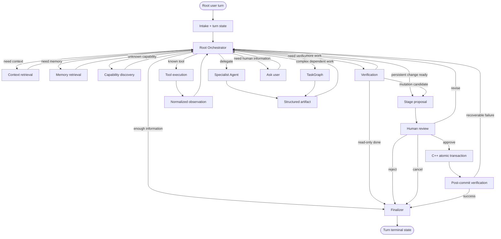
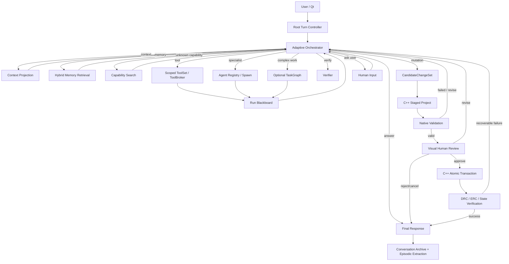

# CCad Agent production TODO

### Sprint 1054 — Agent runtime contract reconciliation and read-only approval safety

- [x] Reconcile the broader offline Agent contract gate with the actual runtime: method catalog parity, context-turn lifecycle, durable approval metadata, Cerebras model fallback, and tool-result ACK ordering.
- [x] Make tool approval policy honor authoritative native-catalog `read_only`; keep dry runs immediate and unknown `ui.*` tools fail-closed behind approval.
- [x] Register process-local broker correlation before publishing a tool call; acknowledge only a correlated result, verified with a local OpenAI-compatible provider and the actual top-level JSON-RPC result shape.
- [x] Remove the obsolete removed-`ui_add_polygon` schema test; verify history RPCs are included in the discoverable method catalog.
- [x] Run all 97 offline Agent contract scripts after building the native MCP executable; resolve failures rather than skip tests.
- [x] Run changed-module Pyright (0 diagnostics) and the official Qt/MinGW Release/full CTest gate (126/126); no GUI behavior changed. Passing manifest `artifacts/evidence/sprint-1054-agent-contract-reconciliation-r4.json`, SHA-256 `9723E3580429BC2C494CE326255172882818037D8B0A9997212E63C58C53789E`.
- [x] Update the handover, feature inventory, progress, consolidated backlog, and this TODO; preserve proof and leave unrelated worktrees/evidence untouched.
- [x] Complete redacted tracked-text and staged-addition secret checks, commit the verified slice, push the feature branch, and verify the exact remote SHA. The scan found four token-shaped test-fixture matches across three existing test files; review confirmed fixtures, and staged additions contain zero matches. Hosted CI remains open until a PR targets `main` because CI does not run on feature-branch pushes.

### Sprint 1053 — preserve one trace across approval and tool resume (in progress)

- [x] Keep the per-turn Langfuse root open while a graph awaits human tool approval; resume approval, native tool dispatch, and graph continuation under the original trace context.
- [x] Isolate paused-turn context from unrelated protocol/status requests, and close roots with truthful completed, failed, cancelled, abandoned, or reconfigured state.
- [x] Reset live trace ID/export counts at turn start; expose current turn state and trace/export fields through `agent.langfuse_status` and Settings.
- [x] Add regression coverage for approval/dispatch ancestry, waiting-turn rejection, fresh trace state, disabled tracing, local Langfuse v4 OTLP ingestion, and Settings status schema.
- [x] Changed-module Pyright is clean; focused tracing/runtime/catalog/UI contracts and Langfuse v4 local ingestion pass.
- [x] Run the isolated Qt/MinGW Release build and full CTest (126/126), then the app-owned mapped Settings → Observability sequence; inspect its four meaningful screenshots and both logs. Passing manifest: `artifacts/evidence/sprint-1053-langfuse-tool-continuation-r8.json` (SHA-256 `08D07370264982B3237026CB37B4D771FC74B47E472D1B31F468FB00238AB985`).
- [x] Run redacted repository and staged-diff secret scans and complete the sprint evidence manifest before commit or merge. The 912-file tracked-text scan found one existing synthetic GitHub-shaped token in a test fixture; the 17-file staged diff has zero credential-pattern matches.
- [ ] Verify the next real opted-in Agent turn in Langfuse via exact trace-ID observation readback. Cloud project access is not assumed, so local OTLP acceptance remains distinct from Cloud receipt.

Check a box only after implementation and its required evidence exist.

### Sprint 1052 — truthful memory-retrieval trace metadata (Tier 1)

- [x] Emit bounded Langfuse `memory.retrieve` metadata for retrieval/cache status, lexical and semantic channel state, safe counts, and hashed exposure provenance; keep all metadata scalar strings and exclude memory content, IDs, and raw failure reasons.
- [x] Add no-network metadata privacy/type contracts and verify flattened attributes through the real Langfuse SDK with an in-memory OpenTelemetry exporter.
- [x] Run changed-module Pyright (0 diagnostics), Qt/MinGW Release, full CTest (126/126), and official nonvisual evidence gate; manifest `artifacts/evidence/sprint-1052-memory-retrieval-observability.json`, SHA-256 `5DF6C86B758825A8A9ACEDD746FE684760E07C3B9EE3784481138A273C7C774F`.
- [x] Verify pushed exact-SHA hosted CI: `main` SHA `32402327f8afa52e17e0f6922ea51f769c7b743a`, run `36690506400`, all five jobs passed; delete merged Sprint 1052 local/remote refs. Keep detached prior worktree because it contains untracked user evidence.

### Sprint 1051 — integration delivery follow-up

- [x] Push and merge verified integration to `main`; all five hosted CI jobs pass on `c7221577a1f81db4b587f8f9a9240dcff67b68ff`. Delete merged local/remote feature refs after confirming commit reachability.
- [ ] Capture visible proof of the Agent Settings dialog; the prior checkpoint showed the Agent panel, so dialog visual validation is not claimed.

### Sprint 1051 — integration of editor context and transcript provenance

- [x] Merge Sprint 1039 transcript/approval provenance and Sprint 1038 editor-aware context with current `main`, preserving the newer typed retrieval-channel, provider, and approval-expiry behavior.
- [x] Preserve the safe active-editor retrieval domain through the typed project-retrieval adapter; add a contract proving schematic context reports `search_domain=schematic`.
- [x] Align checkpoint replay coverage with the actual `(content, artifact)` tool-result contract while preserving once-only broker event emission.
- [x] Pass changed-module Pyright (0 diagnostics), focused transcript/retrieval/context contracts, Qt/MinGW Release, and full CTest (126/126); inspect the official mapped UI report and all four retained screenshots. Manifest `artifacts/evidence/sprint-1051-context-provenance-merge-r4.json`, SHA-256 `3874F8674AEC91B14D6C9BD334C1B012B8AECAE5418743F77F8C460E3CC7CC3F`.
- [x] Verify exact native schematic selection (`U1`) and editor switching with the app-owned GUI map; no provider request was made. Captured stderr is empty. Settings/category controls were mapped and clicked, but the captured Settings checkpoint displays the Agent panel rather than the dialog, so Settings visual proof is not claimed.
- [x] Verify exact-SHA hosted CI, merge/push to `main`, and remove local/remote feature branch refs; keep the worktree detached because it contains untracked evidence that must not be deleted.
- [ ] Capture the Settings dialog itself in a distinct screenshot before claiming Settings visual validation.

### Sprint 1039 — Transcript transaction provenance (Tier 1)

- [x] Attach authoritative transaction/revision metadata to exact transcript tool-call/result events; derived event metadata excludes arguments and result text.
- [x] Prove multi-operation correlation and omit ambiguous turn-level transaction/proposal/approval summaries; reject duplicate call-ID result matching and ignore forged approval fields in model-visible output.
- [x] Persist opaque proposal IDs, approval IDs, and explicit approved/rejected/cancelled decisions through Qt IPC, LangGraph content/artifact results, checkpoint resume, canonical transcript, and exact correlated TurnRecord events; approval is never inferred from tool success.
- [x] Prove committed result, rejection, cancellation, checkpoint restart, metadata privacy, result-content preservation, and single/multi-operation summaries with offline contracts.
- [x] Run corrected Qt MinGW Release, full CTest (120/120), focused Python conversation store/runtime/checkpoint contracts including restart accept/reject/cancel, and changed-module Pyright (0 diagnostics); inspect verifier output and evidence.
- [x] Update codebase map, feature inventory, progress, backlog, and this TODO; corrected evidence manifest is `artifacts/evidence/sprint-1039-approval-provenance-r3.json` (SHA-256 `08E8ED4983FE9ED637EBD61B79A0A1FD63407DE03CDAAB03FE860F80DA259455`).
- [x] Run redacted repository and staged-diff secret scans; both reported no findings.
- [x] Commit this verified slice (`a94094b`) and push the feature branch; the remote ref matches the published commit.
- [ ] Open/update the PR, verify hosted CI on its exact head SHA, then merge to `main` only after all required checks pass.

Evidence: `artifacts/evidence/sprint-1039-transcript-event-provenance.json`, SHA-256 `003A2EC0917B14DC49C7C4ACC59DC64310C994D49E19D5BF3576B7B07AF374C6`. Qt/MinGW Release gate passed with no work required; CTest passed 120/120. GUI validation is not applicable because no GUI behavior changed.

### Sprint 1038 — Editor-aware PCB/schematic context and selection

- [x] Include the active editor and exact selected typed object in every Qt project-context envelope; never reuse stale selection from the other canvas.
- [x] Resolve schematic canvas selection by its native object ID and expose `ui.select_canvas_object` for both supported editors with explicit canvas validation.
- [x] Pass the active editor into bounded project retrieval; explicit query domain takes precedence, otherwise use current editor, then existing safe fallback.
- [x] Preserve the retrieval domain in bounded provider context and safe context-state metadata so the Agent can report board versus schematic matches truthfully.
- [x] Add contracts for exact selection identity, both editor domains, precedence, context digest/cache separation, and retrieval metadata.
- [x] Pass Qt MinGW Release/full CTest and app-owned mapped interaction plan; inspect only distinct before, schematic-selection, settings, and restored-state screenshots and captured logs.
- [x] Record evidence: Qt/MinGW Release build, full CTest 120/120, 14 successful GUI-map interactions, four inspected screenshots, stdout reviewed, stderr empty. Manifest `artifacts/evidence/sprint-1038-agent-context-editor-r8.json`, SHA-256 `2FAE6F84E7C5A4F645AF1BB360B2259EB4447A40DCC9F7D6237F40669EF84FDD`.

Scope note: the final capture returns to the PCB tab on a schematic-only test fixture, so the empty PCB canvas is expected. This verifies editor switching, not PCB design content. Context remains limited to data available from typed project sources; unsupported object classes and absent domain data are reported unavailable, not invented.
### Sprint 1050 — deterministic approval expiry and one-use replay boundary

- [x] Add an injected monotonic clock so the broker's five-minute approval deadline is deterministic in contract tests; expired approval returns `approval_expired` exactly at the deadline and never invokes the executor.
- [x] Reject expired-token replay/reissue, preserve separate expired, consumed, and unknown outcomes, and verify valid fresh grants execute once; existing contracts cover exact method/arguments/call ID/revision binding, stale-plan rejection, and cancellation.
- [x] Use clangd 19.1.7 with the configured Qt/MinGW compilation database; the changed test translation unit reports zero diagnostics. clangd parsed the implementation but its optional ExtractFunction probe emitted internal break/continue errors; official MinGW compilation is authoritative.
- [x] Run the official nonvisual Qt/MinGW Release build and full CTest (128/128); inspect logs and manifest `artifacts/evidence/sprint-1050-approval-expiry.json`, SHA-256 `7A4ADA67A3B25C8B657285E53E2D676A03E8B434EA988A9A8F094025B1A142C3`.
- [x] Update the codebase map, feature inventory, progress, and this TODO; no GUI behavior changed.
- [x] Run redacted tracked-repository and staged-diff scans; both report no high-confidence credential patterns.
- [x] Commit `a1ef20d05469fab4c3796f5e3ef64fd0348fbd1a`; push and fast-forward merge to `main`; hosted CI run `36677881521` passed all five jobs on the exact SHA. The merged Sprint 1050 branch was removed after verification.

### Sprint 1049 — R7 expanded retrieval calibration

- [x] Add balanced source-described positives and semantic hard negatives for each retrieval task in calibration and held-out splits; advance fixture revisions and dataset to 1.3.0.
- [x] Preserve actual semantic candidate IDs/scores in benchmark 1.5.0 reports and add calibration-only, model/task/corpus/evaluation/surface-scoped cutoff analysis that does not alter production settings.
- [x] Run 32 real local reports across EmbeddingGemma/Nomic, two splits, exact/lexical/semantic/hybrid/full project modes, and lexical/semantic/hybrid memory modes; analyze calibration and held-out outcomes without claiming an unsupported gain.
- [x] Pass dataset, benchmark, threshold-analysis, Python compilation, and changed-module Pyright checks before the full build.
- [x] Run the official Qt/MinGW Release build and full CTest gate (128/128); no GUI behavior changed, so use the official nonvisual verifier and inspect its logs/manifest `artifacts/evidence/sprint-1049-r7-retrieval-evaluation.json`, SHA-256 `A3F16839F979CF70AFD9B8CA73A040FA9E03A62D4C979ABF5069082A284FF99D`.
- [x] Update codebase map, feature inventory, retrieval capability matrix, progress, and this TODO with verified build/test evidence.
- [x] Run redacted repository and staged-diff secret scans; staged additions have zero credential-pattern matches. The tracked scan finds three existing synthetic test tokens and two path-name false positives; stage this slice's source, tests, docs, and required hash manifest only, excluding workspace-only benchmark reports and all pre-existing user changes.
- [x] Commit `77a04d1c11f04d67cec7538df1cfa05f3e24118b`, push and fast-forward merge to `main`; hosted CI run `36673762055` passed on that exact SHA, then remove the merged local/remote Sprint 1049 branch.

### Sprint 1048 — Python CI checkpoint-restart schema parity

- [x] Fix the checkpoint-restart fake model to read provider-safe function declarations, matching `bind_native_tools()` rather than expecting `StructuredTool` objects.
- [x] Reproduce the pre-fix failure, then pass the first/resume subprocess pairs for accepted, denied, and canceled calls.
- [x] Run the complete hosted `agent-python` contract script set locally, Python compilation, Pyright 1.1.414 (0 diagnostics), Qt/MinGW Release build, and full CTest (127/127); no GUI behavior changed.
- [x] Push and fast-forward merge the fix to `main`; confirm remote SHA `5860e066cde6d65acc827588a238b4e1d66b494b` and hosted CI run `36666758062` passes all five jobs.
- [x] Update progress and feature records with the CI result and manifest `artifacts/evidence/sprint-1048-checkpoint-ci-contract-r2.json` (SHA-256 `B890AD40E7A44D82497B61348F4C88440FDAAAAC017F27DA52C81B2A6466A74C`).
- [x] Delete merged local and remote branches for Sprints 1043, 1046, 1047, and 1048; preserve active Sprint 1039 and its separate worktree.

### Sprint 1047 — memory and project-entity retrieval ablations

- [x] Expand the versioned corpus to dataset 1.2.0 with separate project-entity and memory-retrieval cases in calibration and held-out splits; preserve distinct identities and hard distractors.
- [x] Pass selected lexical/semantic channels into the memory manager before ranking; default retrieval remains hybrid, while lexical-only avoids embedding calls and semantic-only does not compute lexical scores.
- [x] Add memory lexical, semantic, and hybrid modes plus a complete deterministic+semantic project mode; policy-disallowed semantic cases are excluded, not scored as misses.
- [x] Execute 32 real local-model runs across two splits, two installed models, five project modes, and three memory modes; pin EmbeddingGemma digest `85462619ee721b466c5927d109d4cb765861907d5417b9109caebc4e614679f1` and Nomic digest `0a109f422b47e3a30ba2b10eca18548e944e8a23073ee3f3e947efcf3c45e59f` in reports.
- [x] Keep semantic retrieval disabled as a default/promotion decision: project-entity cases are only one per split and lexical already retrieves them; memory cases are only one calibration and two held-out, and semantic-only does not consistently outrank lexical. Broader corpus, hard-negative, and model/task-scoped acceptance work remains open.
- [x] Add pre-implementation contracts for corpus split integrity, channel selection, execution-time channel propagation, and policy exclusion; focused dataset, benchmark, memory-manager, and typed retrieval tests pass.
- [x] Run changed-module Pyright (0 diagnostics), official Qt/MinGW Release verification, and full CTest (127/127); inspect logs and final nonvisual manifest `artifacts/evidence/sprint-1047-memory-retrieval-ablation-final.json`, SHA-256 `833B2BAC2C7050AC9A267ED19F76F9A0259D63783B8E7BAD4C9E3A37AAD67247`. The final manifest reuses the earlier full-suite pass because subsequent code change only advanced benchmark metadata; focused benchmark contracts were rerun after that change.
- [x] Run redacted tracked-repository and staged-diff secret scans; tracked matches are four existing synthetic test sentinels in three test files, while staged additions contain no high-confidence credential patterns.
- [x] Commit `21f3a8c38608e4ac4ed46bd7e0bed8e1c4df2349`, push branch `sprint-1047-memory-retrieval-ablation`, and confirm the exact remote SHA matches. This slice was merged to `main`; its hosted run exposed the checkpoint-fixture mismatch, fixed and verified by Sprint 1048.

References checked: Google’s [EmbeddingGemma model card](https://ai.google.dev/gemma/docs/embeddinggemma/model_card) and Nomic’s [official embedding API](https://github.com/nomic-ai/nomic/blob/main/nomic/embed.py) define retrieval-specific query/document embedding behavior. Current integration follows the previously recorded task-prompt protocol; this slice measures retrieval relevance and does not change model prompts.

### Sprint 1046 — retrieval channel ablations

- [x] Make `ProjectIndex.retrieve` honor requested exact, lexical, semantic, graph, and spatial channels before ranking; preserve the default all-channel behavior.
- [x] Pass typed `RetrievalRequest.channels` into the real project-index execution path; test lexical-only avoids embeddings and semantic-only ranks an independently retrieved semantic match.
- [x] Add benchmark execution modes for exact, lexical, semantic, and hybrid retrieval; exclude semantic-disallowed cases explicitly rather than counting them as misses.
- [x] Run all four modes on calibration and held-out splits with installed EmbeddingGemma and Nomic; semantic/hybrid still returned 2/2 hard negatives, while held-out semantic-only recall@3 was below lexical-only for both models.
- [x] Run changed-module Pyright (0 diagnostics) and official Qt/MinGW Release/full CTest (127/127); inspect logs and manifest `artifacts/evidence/sprint-1046-retrieval-mode-ablations.json` SHA-256 `BBBE80736F07302E7C88086C2A2E69EAF8F9A6BD97ED456DDF97817F1F7A374C`.
- [x] Update codebase map, feature inventory, and progress with model digests, comparisons, and remaining limitations.
- [x] Run redacted tracked-repository/staged-diff/file scans; the three tracked matches are two legacy `task-workspace` artifact-path false positives and one synthetic test sentinel; staged additions have zero credential-pattern matches.
- [x] Commit, push, and verify the exact remote branch SHA; later merged to `main` and the served branch was pruned after hosted CI.
- [x] Continue expanding retrieval corpus and scope threshold evidence by model digest, task, corpus, and evaluation version; Sprint 1049 added scoped offline calibration profiles and broader hard-negative coverage, without promoting a universal semantic threshold.

### Sprint 1045 — semantic retrieval corpus expansion

- [x] Add separate source-grounded component-function and design-intent cases to calibration and held-out splits.
- [x] Run semantically eligible hard engineering negatives through the real semantic channel; preserve explicit semantic-use policy in reports.
- [x] Add split integrity, expected-identity, hard-negative, and requested-channel contracts before code changes.
- [x] Run real installed EmbeddingGemma and Nomic calibration/held-out retrieval; both produced false positives on 2/2 semantic hard negatives per split, so no semantic-gain/model-winner claim is made.
- [x] Run changed-module Pyright (0 diagnostics), official Qt/MinGW Release, full CTest (127/127), and non-visual evidence manifest `artifacts/evidence/sprint-1045-semantic-corpus.json` SHA-256 `BA42002CC9161CDEB951D724FEF486A1B05FE8C02DE9CBF8975A3DFA29C5160F`; GUI behavior unchanged.
- [x] Update TODO, codebase map, feature inventory, and progress in this change set.
- [x] Run redacted staged-diff and staged-file secret scans (zero matches); commit/push `d2ddd81` and exact remote SHA `d2ddd811881b02a5c7e8f1944170e76a4e514575`.
- [x] Continue R7 with real retrieval-mode ablations in Sprint 1046; model/task/corpus/version-scoped threshold evidence remains open.

### Sprint 1044 — explicit embedding task protocol

- [x] Apply official model-specific retrieval query/document prompts; isolate similarity prompts from retrieval.
- [x] Report backend, model digest, observed dimension, task mode, and normalization; invalidate stale process vectors on identity/dimension changes.
- [x] Preserve lexical fallback, restrict lazy vector rebuilds to authorized retrieval candidates, and never install/download models implicitly.
- [x] Cover exact prompt formats, model/digest changes, dimension drift, lexical fallback, and no-download behavior with protocol contracts.
- [x] Re-run calibration and held-out retrieval against installed local EmbeddingGemma and Nomic; record identity and measured outcomes without model-winner claims.
- [x] Pass changed-module Pyright, focused Agent contracts, Qt/MinGW Release, and full CTest (127/127); non-visual manifest `artifacts/evidence/sprint-1044-embedding-task-protocol.json` SHA-256 `1EF8A5BE78F9E66D898DB2C9DBA8DC9C84E980799DA079C1385E464DFFF5A4B2`.
- [x] Update codebase map, feature inventory, progress, and retrieval backlog in this slice.
- [x] Run redacted tracked-repository and staged-addition secret scans; three tracked files contain known synthetic test fixtures, staged additions have zero credential-pattern matches. Stage only verified code, docs, tests, and evidence manifest.
- [x] Commit `862793b6f7a1ec3e413820b8857a34d1c5849638` and push; `git ls-remote` confirms the feature branch points to that exact tested SHA.
- [ ] Verify hosted CI on the exact pushed SHA when a PR/manual workflow event exists; branch-only pushes do not trigger CI.

### Sprint 1043 live provider turn follow-up

- [x] Add response-contract checks: empty text/empty text blocks are invalid, while text, structured content, and native tool-call-only responses are accepted. Focused contracts pass 14/14; changed-module Pyright reports zero diagnostics.
- [x] Reject an empty successful provider response as categorized `empty_response`; surface that a response arrived but carried no answer/tool call instead of persisting a blank completed assistant turn.
- [x] Publish safe provider dispatch-start/response-received lifecycle metadata and expose dispatch-start in GUI workspace state; update the live-turn harness to record that event rather than infer request dispatch from successful tool execution.
- [x] Run Qt/MinGW Release, full CTest, and the official mapped local-Qwen live-turn scenario; require a named native method, accepted broker result, and count-bearing final answer. Sprint r16 passed: Release build, CTest 127/127, one `project.object_counts` call, one accepted broker result, completed run state, and visible count-bearing final. Manifest `artifacts/evidence/sprint-1043-live-tool-turn-r16.json`; four distinct GUI checkpoints and captured logs inspected.
- [ ] Live-turn r8: Qt/MinGW Release and full CTest passed 127/127; all four distinct mapped GUI screenshots were inspected. The GUI truthfully recorded `provider_dispatch_started=true`, and local Ollama logged HTTP 200, but Qwen returned no answer or tool call. The new `empty_response` handling surfaced a categorized failure and no native tool/broker result occurred. The harness now stops on this explicit empty-response text; the end-to-end native-tool requirement remains open. Manifest `artifacts/evidence/sprint-1043-live-tool-turn-r8.json`.
- [ ] Live-turn r9: rebuilt final code and reran full CTest (127/127); the corrected app-owned harness stopped on the categorized empty response and preserved its seven mapped UI interactions plus four inspected visual checkpoints. Dispatch began, but Qwen again returned no answer/tool call; no broker result or count-bearing final was produced. Do not mark model-backed orchestration complete. Manifest `artifacts/evidence/sprint-1043-live-tool-turn-r9.json`.
- [ ] Live-turn r10: Release build and full CTest passed 127/127. The app-owned GUI used a concise exact-method prompt; the model still returned `empty_response`, with zero native calls and accepted broker results. The screenshot confirms honest failure reporting. Manifest `artifacts/evidence/sprint-1043-live-tool-turn-r10.json`.
- [ ] Recognize the narrowly defined natural-language request for footprint, track, and via counts as `project.object_counts`; focused selection/schema contracts pass 20/20. This improves intent-based schema selection but does not prove or fix live model execution; r11 remains failed and further adapter/model diagnosis is required.
- [ ] Live-turn r11: rebuilt after natural-language intent selection; Qt/MinGW Release and full CTest passed 127/127, focused contracts and Pyright passed. The mapped run still returned `empty_response` with zero tool calls, accepted results, or final counts. Four distinct visual states were retained; model-backed tool execution remains unresolved. Manifest `artifacts/evidence/sprint-1043-live-tool-turn-r11.json`.
- [x] Correct narrowed-tool instructions so a restricted method does not conflict with full-catalog `project.state` guidance; explicitly bind zero-argument tools to `{}` and select `project.object_counts` for the tested plain-language count request.
- [x] Report read-only broker calls as awaiting a result, not approval; make backend running/completed/pending state authoritative in AgentPanel workspace state, and emit each replayed checkpoint call once per stable call ID.
- [x] Live-turn r16 proves one local-Qwen `project.object_counts` call, one authoritative broker result, `run_state=completed`, and a visible answer with footprint, track, and via counts. Focused contracts pass 28/28, approval-state contract passes, and Pyright reports zero diagnostics in changed Python files. This verifies only this read-only flow, not all providers, tools, mutation approvals, or the whole orchestration surface. Evidence: `artifacts/evidence/sprint-1043-live-tool-turn-r16.json`.

### Sprint 1043 — retrieval benchmark corpus (active)

- [x] Add versioned, task-separated calibration and held-out datasets with source/project revisions, expected identities, rationale, hard distractors, board-scale/repeated-class coverage, and explicit semantic-use policy; Pyright is clean and Qt/MinGW Release plus full CTest pass 125/125. Manifest `artifacts/evidence/sprint-1043-retrieval-corpus.json` (SHA-256 `2F2033BD8B66312E8AE032BC8793B5BA83542B0E3F353A25C41B440644A52B90`).
- [x] Execute calibration and held-out cases through real `ProjectIndex`, `MemoryManager`, and `ConversationStore` retrieval; report ranked quality and bounded-context measurements without synthetic retrieval hits.
- [x] Measure in-memory index build/update, query percentiles, process peak RSS, temporary-store disk use, and versioned execution reports; retain missing measurements as explicit `not measured` statuses.
- [x] Measure held-out semantic retrieval and query/document embedding latency with installed local `embeddinggemma` and `nomic-embed-text`; reports distinguish model/channel and offline lexical-only results.
- [x] Measure real semantic-service failure and recovery through production retrieval: Ollama's missing-model response is classified, lexical fallback returns a truthful partial result, and reconfiguration restores semantic results; calibration/held-out reports record failure and recovery latency.
- [x] Measure a follow-up Agent tool call in an end-to-end model-backed context turn using locally installed `qwen2.5:3b`; r16 proves activation, the named `project.object_counts` request, accepted broker result, and count-bearing final response. This narrow read-only sample does not establish general tool/provider reliability.
- [ ] Sprint 1043 live-turn attempt r7: Qt/MinGW Release and full CTest passed 127/127, focused tool-selection/runtime tests passed 9/9, Pyright reported zero diagnostics, and clangd reported zero errors. The mapped UI exercised the board/schematic/Agent tabs, chat input/submit, and Settings open/close; its report records provider initialized but `provider_request_sent=false`, zero `project.object_counts` calls, zero accepted broker results, and no count summary. All four distinct screenshots were inspected. Do not close the live-turn requirement until the report proves the named call, authoritative broker result, and final response. The visual attempt failed its acceptance check; a separate official non-visual build/CTest manifest passes as recorded below.
- [x] Implement conservative explicit-method schema narrowing and preserve declared context requirements; provider activation publishes redacted readiness. Focused contracts pass 9/9, Pyright reports zero diagnostics, clangd reports zero errors, and official Qt/MinGW Release plus full CTest pass 127/127. Non-visual manifest `artifacts/evidence/sprint-1043-provider-tool-schema-r1.json` (SHA-256 `577E80E79842AA730BD6DDACEB6C4AA9BF974FBE919D4665F553024FACBDFDFE`). This does not complete phase/intent/workflow selection or prove a model-backed tool result.
- [x] Run Qt/MinGW Release, full CTest (126/126), and changed-script Pyright after real failure/recovery instrumentation; official non-visual manifest `artifacts/evidence/sprint-1043-semantic-recovery.json` SHA-256 `DFADF456236ECFA471FA15966ED740E16CC97FFBDD599A7D9CC7C422D5555AC6`.
- [x] Run redacted repository/staged-diff secret scans; three existing credential-shaped matches are synthetic test values, and staged additions have zero matches.
- [x] Commit and push verified slice as `0812739`; `git ls-remote` confirms exact branch head `0812739d842f664eda088e756eb63bb583c5f240`.
- [x] Commit and push measured semantic-retrieval follow-up as `8bf986e`; `git ls-remote` confirms exact branch head `8bf986e236f7a2deb40a9b8f4921a1f04ffbe14f`.
- [x] Commit and push measured semantic failure/recovery slice as `8121c1e`; `git ls-remote` confirms exact branch head `8121c1e02cde6f24118680ca3fdacbe1f00b11d7`.
- [ ] Inspect hosted CI for exact pushed SHA after a pull-request event; branch-only pushes do not trigger this repository's configured workflow.

### Sprint 1042 — provider error contract test scope

- [x] Fix the provider error-classification source contract to inspect only `provider_error_user_message`, so unrelated malformed-tool safety messages elsewhere in the orchestrator do not fail the test.
- [x] Remove OpenTelemetry exporter private-field assertions; the actual local OTLP receiver contract remains authoritative for Langfuse v4 endpoint, auth, and ingestion headers.
- [x] Align the Pyright CI-configuration contract with the checked-in source-plus-benchmark include list and both configured execution environments.
- [x] Reproduce every `agent-python` workflow test locally with the project virtual environment, including isolated checkpoint accept, deny, and cancel restarts.
- [x] Pass provider-error classification, runtime observability, and local Langfuse v4 ingestion tests; telemetry-module Pyright reports zero diagnostics.
- [x] Run the official Qt/MinGW Release and full CTest verifier (124/124); final combined-fix evidence is `artifacts/evidence/sprint-1042-ci-contracts-final.json` (SHA-256 `3AE77DBFD402C70835532730A3EEABA7EA6A9B90D93D36F2216ED63C4190CF9F`).
- [x] Run the staged-diff credential scan; no credential-pattern matches were found.
- [x] Verify hosted CI run #576 is green on exact code commit `9f4e418f99f9365c03705c8c0135305f7fd05d44` (all five jobs passed).

### Sprint 1041 — retrieval architecture boundary

- [x] Compare embedded CCad retrieval, SQLite FTS5, Typesense, exact cosine, and USearch ANN across capability, license, deployment/Windows, process/startup, memory/disk, update/indexing, packaging, failures, privacy, synchronization, testing, rollback, and maintenance; keep backend adoption benchmark-gated.
- [x] Record authoritative project-model rules, channel separation, backend-independent boundary, and the reversible current-backend decision in `docs/decisions/ADR-agent-retrieval-architecture.md`.
- [x] Add bounded typed `RetrievalRequest`, canonical `RetrievalHit` / `RetrievalResult`, channel and truthful status contracts.
- [x] Adapt the real ProjectIndex and MemoryManager; enforce project/thread identity, support typed filters and requested field projection, and carry source revision/provenance.
- [x] Route initial and refreshed ContextBroker retrieval through canonical results while preserving the provider-facing project-context schema.
- [x] Add focused CTest registration and prove request bounds, canonical identities, field projection, scope mismatch, disabled memory status, and existing context payload compatibility; run changed-module Pyright and related retrieval suites.
- [x] Run the official Qt/MinGW Release and complete CTest verifier; inspect logs and record passing evidence `artifacts/evidence/sprint-1041-retrieval-contracts-r2.json` (124/124; SHA-256 `A51AA31EAA0AA10BBF079BC579E53512B355FC3A549D74593C5E95AC49BA7BC3`).
- [x] Run redacted tracked-repository and staged-addition secret scans; four existing pattern-bearing files were inspected and contain test-only redaction sentinels, and staged additions contain zero credential-pattern matches; stage only verified source, tests, docs, and evidence.
- [ ] Commit and push the verified slice; confirm the remote branch points to the exact tested commit.

### Sprint 1040 - safe memory writes with semantic retrieval enabled

- [x] Remove uncalibrated semantic-similarity rejection from add/update; keep normalized exact and lexical duplicate protection.
- [x] Prove writes succeed for semantic matches and when embedding retrieval is unavailable; preserve secret rejection and semantic retrieval fallback contracts.
- [x] Update handover and feature descriptions to state semantic embeddings are retrieval-only.
- [x] Run changed-module Pyright and focused semantic, memory lifecycle, and memory-command contracts.
- [x] Run official Qt/MinGW Release and full CTest verifier (123/123); inspect logs and record passing evidence manifest.
- [x] Run redacted tracked-repository and staged-addition secret scans; zero high-confidence credential-pattern matches. Stage only verified files.
- [x] Commit and push the verified source, tests, docs, and manifest; hosted CI status remains a separate check for the pushed SHA.

### Sprint 1038 - semantic memory duplicate calibration (historical)

- [x] Prototype same-tier semantic duplicate rejection on add/update, then remove the uncalibrated write-time gate in Sprint 1040 after measured false rejections; semantic embeddings remain retrieval-only.
- [x] Keep normalized exact and lexical duplicate checks independent of semantic retrieval enablement or readiness; semantic retrieval itself retains its tested safe fallback.
- [x] Cover semantic add/update, namespace isolation, pre-embedding secret rejection, disabled mode, unavailable backend, and cache behavior in offline contracts.
- [x] Use documented sentence-similarity prompts for EmbeddingGemma and Nomic clustering prompts for duplicate checks; local Ollama contracts verify exact query/document inputs.
- [x] Expand and calibrate 71 labeled duplicate plus 71 hard-negative pairs against both current model digests; hash the corpus and report threshold errors in `scripts/benchmark_semantic_memory_duplicates.py`.
- [x] Resolve the measured precision/recall conflict without blocking legitimate writes: semantic similarity is retrieval-only; exact and lexical duplicate guards remain. Tested model thresholds do not justify automatic semantic rejection.
- [ ] Recalibrate every newly introduced model digest before changing the cutoff or claiming broad paraphrase recall.
- [x] Run changed-module Pyright and focused memory/semantic contracts.
- [x] Run the official nonvisual Qt/MinGW Release and full CTest gate after correcting the Nomic prompt and expanding the calibration corpus; inspect preflight/build/CTest logs and record fresh manifest `artifacts/evidence/sprint-1038-nomic-memory-dedupe-recalibration.json` (123/123).
- [x] Update progress, feature inventory, codebase map, and this TODO with the measured Nomic prompt/calibration results and correct the already-pushed baseline commit reference.
- [x] Run redacted tracked-repository and staged-addition scans for this follow-up; five tracked pattern hits were reviewed as an environment-variable name or deliberate test sentinels, and staged additions had zero matches. Stage only verified source, tests, docs, and manifest.
- [x] Complete official Qt/MinGW Release + full CTest nonvisual gate (123/123); inspect preflight/build/CTest logs and calibration manifest `artifacts/evidence/sprint-1038-nomic-memory-dedupe-recalibration.json` (pass; logs retained workspace-only).
- [x] Update codebase map, feature inventory, progress, and this TODO in the same slice, including measured prompt/corpus results.
- [x] Run redacted tracked-repository and staged-diff secret scans; staged additions have zero credential-pattern matches. Existing tracked hits were reviewed as test sentinels or `solder-mask`/artifact-name false positives; commit and push only verified source, tests, docs, benchmark, and manifest on the feature branch.

References: [Google EmbeddingGemma model card](https://ai.google.dev/gemma/docs/embeddinggemma/model_card) prescribes `task: sentence similarity | query:`; [Nomic Embed Text v1.5 model card](https://huggingface.co/nomic-ai/nomic-embed-text-v1.5) specifies `clustering:` for similarity grouping and semantic duplicate removal. Dataset v2 SHA-256 is recorded in `docs/devops/progress.md`; this CCad-specific corpus is not a general-language benchmark.

### Sprint 1037 — one-use approvals, truthful tool IDs, and project undo/redo

- [x] Bind each broker grant to exact method, arguments, provider call ID, and live design revision; consume once, expire, and revoke on cancel/reject. Sprint 1050 adds deterministic exact-deadline expiry and prevents expired-token reissue.
- [x] Use parsed typed `dry_run` only; reject malformed provider calls and legacy text tools without synthetic IDs or execution; focused broker/Python contracts pass.
- [x] Persist project Undo/Redo restoration atomically and verify board state after keyboard shortcuts and native actions on a disposable project.
- [x] Pass approval replay/staleness/cancellation and dry-run contracts, provider-ID runtime contract, GUI Undo/Redo test, and Pyright (0 diagnostics in changed orchestrator module). Sprint 1050 adds a deterministic five-minute expiry/replay contract.
- [x] Pass Qt/MinGW Release build and full CTest (123/123) in the inspected `sprint-1037-agent-safety-r4` verifier run.
- [x] Pass the mapped GUI sequence; inspect four distinct before/staged/undo/redo screenshots and stdout/stderr in `sprint-1037-agent-safety-r4`.
- [x] Update handover/features/progress and check only verified items; redacted tracked-repository and staged-diff scans report no high-confidence credential patterns in Sprint 1050.
- [x] Commit and push scoped source, tests, docs, and manifest as `a1ef20d05469fab4c3796f5e3ef64fd0348fbd1a`; exact-SHA hosted CI passed in run `36677881521`.
### Sprint 1036 follow-up — Langfuse v4 metadata attribute contract

- [x] Reproduce the reported Langfuse v4 metadata type warning with the real SDK and local OTLP receiver; normalize redacted scalar observation metadata to strings capped at 200 characters and omit structured values. Local ingestion contract passes.
- [x] Re-run Pyright (0 diagnostics), focused compaction/store/context/Langfuse v4 wire contracts, Qt/MinGW Release (`ninja: no work to do`), and full CTest (122/122); inspect all command output on 2026-09-29. Desktop/runtime visual validation and Cloud receipt remain separate unchecked gates below.
- References checked: [Langfuse Python v3-to-v4 migration](https://langfuse.com/docs/observability/sdk/upgrade-path/python-v3-to-v4) caps propagated metadata strings at 200 characters; [Langfuse OTLP v4 migration](https://langfuse.com/integrations/native/opentelemetry/migration-to-v4) requires explicit observation metadata and relevant correlating attributes on spans. CCad redacts first, converts supported scalar metadata, drops structured values, and verifies the emitted OTLP protobuf locally.
- [ ] Validate the live GUI/Agent process loads the corrected Python runtime and reports fresh trace export status; visual verification waits for the desktop to be unlocked.
- [ ] Do not claim current Cloud receipt without a fresh trace ID and confirmed Langfuse readback.

Check a box only after implementation and its required evidence exist.

### Sprint 1036 — Conversation STM and compaction provenance

- [x] Keep active-thread conversation context explicitly distinct from Working Memory scratch and durable cross-turn indexes; report only the safe tier, scope, and message count in request metadata.
- [x] Persist the canonical source message IDs, their sequence bounds, explicit non-colliding recap ID, and snapshot high-water message ID with each model-facing compaction projection; refuse missing IDs or a transcript that advanced during summarization, preserve full transcript, and migrate existing schema-v3 stores without data loss.
- [x] Keep provenance IDs out of provider transcript text, public compaction events, and user-facing summaries; verify source ordering and reject missing/foreign message references.
- [x] Show Conversation STM as a separate read-only active-thread status; keep the `ltm` checkbox bound to durable thread-scoped memory and state that ordinary transcript history is independent.
- [x] Add contracts before behavior changes for bounded source selection, migration, exact source ranges, missing-ID/stale-snapshot refusal, report privacy, context metadata, and GUI label; focused contracts and Pyright pass, Qt/MinGW Release build and full CTest pass (122/122).
- [x] Complete visible GUI verification for the settings label and active-thread description; 10 mapped interactions and all five screenshots passed inspection (`artifacts/evidence/sprint-1036-conversation-stm-unlocked.json`).
- [x] Complete proposal-ID and approval-decision linkage through authoritative Qt approval IPC; Sprint 1039 persists IDs and decisions as private, allowlisted tool-result artifacts and links only by exact tool-call identity.

### Graphic proposal diff acceptance — user-visible failure reproduction

- [ ] Trace the exact staged change-set/object IDs and source revision through the preview pipeline; never substitute current-project or unrelated geometry for a proposal.
- [ ] Render the authoritative base revision on the left and staged revision on the right, using identical coordinate domain, orientation, viewport dimensions, visible layers, center, and zoom.
- [ ] Derive a shared camera from changed-object bounds plus nearby context; fail closed if any proposed object is absent, stale, hidden, clipped, off-camera, or illegible in either pane.
- [ ] Require additions to be absent-before/visible-after, modifications to show old-before/new-after, and removals to show old-before with a clearly labelled ghost-after.
- [ ] Keep unchanged geometry in normal layer/theme colors; highlight only verified changed geometry using the existing active-selection style, with operation-specific distinctions that remain readable.
- [ ] Add typed fixtures for the reported rectangle/copper-zone and line cases plus routed PCB and schematic edits; verify visible object IDs, selection focus, and DRC/ERC deltas rather than trusting a textual change list.
- [ ] After approval, verify the exact reviewed change-set is applied once, visible in the live PCB/schematic view, and still present after save/reload; no preview is acceptable as proof of application.

### Sprint 1035 — Langfuse v4 SDK freshness and visible proposal diff contract

- [x] Upgrade the pinned Langfuse Python SDK from the historical 4.7.x floor to the current stable v4 patch line (`>=4.15.6,<4.16.0`); preserve the v4 OTLP endpoint, ingestion header, privacy exporter, and v4 Observations API behavior.
- [x] Extend the local OTLP receiver contract to exercise the real LangChain callback beneath the Agent-turn root, including v4 session/name/metadata propagation and safe exporter routing.
- [x] Run trace hierarchy, local ingestion, exporter reconfiguration/readback, privacy, and Pyright checks under resolved SDK 4.15.6; evidence is in `docs/devops/sprints/sprint-1035-langfuse-v4-readiness.md`.
- [x] Refresh the seven-row Langfuse v4 readiness report; project, evaluator, export, and Cloud-canary results remain explicitly blocked without configured project access.
- [x] Record current official guidance: Python SDK 4.7.0+ and direct OTLP with the v4 ingestion header are realtime-compatible; avoid legacy ingestion/API paths before the 2026-11-16 Cloud cutoff.
- [x] Do not claim Cloud delivery, project migration, export compatibility, or evaluator readiness from local tests alone.
- [ ] Keep proposal-diff acceptance grounded in the authoritative staged object and revision: added geometry absent before/present after, edits show old/new geometry, removals show old geometry and an explicitly labelled ghost.
- [ ] Use one changed-object-focused synchronized camera in before/after; fail review when changed geometry is hidden, stale, off-camera, clipped, or illegible, even if the text change list exists.
- [ ] Keep unchanged geometry in normal layer/theme colors and show only actual changed geometry in the existing active-selection highlight style; test this against the supplied “change absent in both panes” reproduction.
- [ ] After approval, confirm the reviewed stable object/change-set ID is present in the live PCB/schematic view and survives save/reload; do not accept a change-list-only preview as visual proof.

### Sprint 1034 — Langfuse v4 code compatibility

- [x] Inventory Langfuse references in Agent source/scripts/docs and resolve installed Python SDK/Pydantic versions (`langfuse 4.7.1`, `pydantic 2.13.4`); only `src/ccad_agent/requirements.txt` declares the SDK and no Python lockfile is present.
- [x] Add Langfuse v4 realtime-ingestion header to direct OTLP/HTTP export while retaining Basic Auth and metadata-only span filtering.
- [x] Move exact-trace readback from deprecated trace-detail API to v4 `api.observations.get_many`, with trace filtering and cursor pagination.
- [x] Bound routine development-turn readback separately from the longer explicit connection-test readback; report indexed observation count and never equate collector acceptance with backend receipt.
- [x] Add v4 compatibility tests for endpoint/region/header/readback/pagination/privacy, pass Python analysis, Release build, and full CTest (120/120); manifest `artifacts/evidence/sprint-1034-langfuse-v4-compatibility.json` (SHA-256 `F3905B76E182FE1AC91B803B86E7B4315BDF4E49DFCD301B002360B1AB434752`).
- [x] Verify the configured Langfuse SDK/exporter over actual local OTLP HTTP/protobuf, including v4 path/header/auth, safe root IO, parent-child identity, propagated correlation, and credential absence; official Release build and full CTest pass 122/122 in `sprint-1034-langfuse-v4-wire-contract`.
- [x] Audit repository evaluator, dataset/experiment, API, and export consumers and record findings; project-owned state remains explicitly blocked without Langfuse access.
- [ ] Send an opt-in non-production canary and verify the actual Langfuse Cloud hierarchy, metadata, session, usage, and filtering after access is configured.
- [ ] Keep the canary project-dependent: do not request or commit credentials; after project access exists, send a uniquely tagged non-production turn, flush, fetch by its fresh trace ID, inspect root/child observations and propagated session/filter fields, and record delivery separately from local exporter acceptance.
- [x] Return and persist the seven-row Langfuse v4 readiness report with project-dependent checks explicitly blocked until validated.

### Sprint 1033 — Agent startup and provider IPC reliability

- [x] Defer real LangGraph `ToolNode` import and graph compilation until an agent run or checkpoint operation needs the graph.
- [x] Fail selected remote-provider initialization as `missing_api_key` before importing its SDK when no credential exists.
- [x] Setting an inactive provider credential must preserve other provider credentials and must not initialize the active provider adapter.
- [x] Restore the existing model clients after a transient provider test; do not reconstruct the selected adapter as a side effect.
- [x] Keep provider protocol cold-start test within its existing 20-second bound and retain secret-redaction assertions.
- [x] Update the Agent UI runtime source contract to verify the actual safe `AgentChatBrowser` Markdown implementation.
- [x] Run the exact hosted Python script set, Pyright (0 diagnostics), Python compilation, and checkpoint accept/deny/cancel restart tests.
- [x] Pass Qt/MinGW Release and full CTest (120/120); inspect preflight/build/CTest logs and manifest `artifacts/evidence/sprint-1033-agent-lazy-graph.json` (SHA-256 `2213A62EFD3A8B994A6D55234748D263CF0DFF42F13F92F1DDF6F818FB6B7FF5`).
- [ ] Open a pull request for the pushed branch and verify all hosted CI jobs on its exact head SHA before merging to `main`; the workflow runs only on `main` pushes, pull requests targeting `main`, or manual dispatch, and no run currently exists for this branch head.
- [x] Sprint 1054 reconciles stale runtime assertions in the broader offline Agent gate: method-catalog parity, pending-approval metadata, provider/Cerebras fallback, tool-approval policy, tool-result ACK ordering, and obsolete removed-`ui_add_polygon` schema test. Full gate/build evidence remains recorded in the Sprint 1054 block above.

### Sprint 1033 follow-up — Chat message-format compatibility

- [x] Keep Python-to-Qt message formatting explicit: ordinary notices are plain, model replies are Markdown, and unlabelled legacy assistant replies still render Markdown.
- [x] Cover absent/Markdown/plain format decisions and preserve raw-HTML, remote-image, unsafe-link, and literal-user-text protections.
- [x] Rebuild Release, pass full CTest (120/120), and validate a fresh mapped Agent transcript; inspect six screenshots and stdout/stderr. Manifest `artifacts/evidence/sprint-1033-agent-markdown-fallback.json` (SHA-256 `760E9E02539C7E390A9030058C23409EB7D9BA5C19937541575E1BC0E55CFCF7`).

Initial hosted failure: run `36308918584` (#572) failed in `agent-python`; core Linux, core Windows, GUI Linux, and evidence-manifest lanes passed. Local reproduction identified slow, irrelevant adapter initialization in provider-control IPC. Local implementation gates now pass; hosted verification on this branch remains required.

The stale-contract group and full offline Agent gate are repaired in Sprint 1054; all 97 scripts pass against the built native MCP executable. Keep the separate hosted-CI/merge requirement open until the exact pushed branch head has a green hosted run.

### Sprint 1032 — Agent Markdown current-runtime recheck

- [x] Rebuild/run the current Qt Release app through the official mapped history scenario; verify persisted assistant Markdown is formatted, user text stays literal, and no provider request is needed.
- [x] Inspect all six distinct screenshots and captured stdout/stderr; full CTest passes 120/120. Evidence: `artifacts/evidence/sprint-1032-agent-markdown-runtime.json` (SHA-256 `4B4A5E7BAEC37E8339A62762ADC140DC1F5AE3FBD3CA2640F3AF1581CA7D2899`).
- [x] Trace the live response contract: Python labels completed model replies `content_format=markdown`; Qt forwards that flag to the safe Markdown renderer. Current Release GUI did not reproduce the raw-Markdown report; restart an already-open older GUI process to load the verified renderer.

Scope: verification and diagnosis only; no Markdown parser/provider semantics changed.

### Sprint 1030 — Conversation history and checkpoint migration

References checked: [LangGraph checkpoint reference](https://langchain-ai.github.io/langgraph/reference/checkpoints/) documents checkpoints as graph-state snapshots grouped by stable `thread_id`; `get_state` is the authoritative read path. CCad imports only the resolved messages for the matching thread into its separate canonical transcript, leaving LangGraph checkpoint data unchanged.

- [x] Register empty threads and return safe conversation metadata through JSON-RPC.
- [x] Restore full redacted transcripts in Agent chat by stable thread ID.
- [x] Add History and New Chat controls; prevent thread switches while proposals/approvals are pending.
- [x] Import legacy LangGraph checkpoint messages atomically when canonical history is empty.
- [x] Verify checkpoint migration, restart isolation, full transcript restoration, and zero provider calls.
- [x] Run official mapped GUI interaction and inspect screenshots/stdout/stderr; 10 mapped interactions and six reviewed images. Evidence: `artifacts/evidence/sprint-1030-conversation-history-r11.json` (SHA-256 `93AFA82AF574A432D09526641319E9483C8FBD31BEF3F9D831C4A00467BD059C`).
- [x] Pass Pyright (0 diagnostics), Qt Release build, full CTest (120/120), docs, and secret-scan gates for the verified source diff.
- [ ] Complete a clean clangd diagnostic pass for the changed Qt translation units; clangd 19.1.7 stalled beyond two minutes on `agent_panel.cpp` and emitted internal `ExtractFunction` break/continue errors, so this check remains unverified.
- [ ] Commit and push the verified Sprint 1030 slice.

Scope: Group M1 only. Sidebar/pin/recent UX and semantic history search remain open.

### Sprint 1031 — Safe end-to-end Markdown in Agent chat

References checked before implementation: [Qt 6 `QTextDocument` Markdown support](https://doc.qt.io/qt-6/qtextdocument.html) provides CommonMark/GitHub-dialect parsing, including tables, and `MarkdownNoHTML` to discard embedded HTML; [Qt 6 `QTextBrowser` link handling](https://doc.qt.io/qt-6/qtextbrowser.html) allows automatic navigation to be disabled and links to be filtered through `anchorClicked`. CCad will use those native facilities only for assistant-authored message blocks and will separately prevent remote image loading and unsafe URL navigation.

- [x] Render assistant Markdown as formatted chat content instead of showing raw Markdown delimiters.
- [x] Preserve headings, lists, GitHub tables, links, inline emphasis, and fenced code in live messages and resumed transcripts.
- [x] Keep user text and system/status notices plain text; distinguish them from assistant-authored Markdown.
- [x] Apply a bounded, safe Markdown rendering policy: disable raw HTML, allow only explicit credential-free HTTP(S) links, and block file navigation plus all image/resource loading.
- [x] Add Qt contracts for Markdown structure, literal user text, link policy, code blocks, and persisted transcript rendering.
- [x] Validate a persisted engineering reply in the live Agent panel; inspect six distinct screenshots and stdout/stderr. Evidence: `artifacts/evidence/sprint-1031-agent-markdown-r2.json` (SHA-256 `782F76E6033FB34DE0AACEA3C0F91DF10D53AF34E32561B06231D85239A52572`).
- [x] Pass Qt Release build, full CTest (120/120), Pyright (0 diagnostics), and update feature/handover/progress docs. clangd's incomplete result is tracked above rather than claimed passed.

Scope: native Qt rich-text rendering only; no provider prompt or response semantics change.

### Sprint 1029 — CI / CTest / CD incident recheck

- [x] Refresh live main status: run `36288660706` (#571) succeeds on exact SHA `be0275e7bce37f2b4a4ba8d773b0aaabd5968732`; all five jobs pass, including Linux core, Linux GUI, and Windows core CTest. The latest 30 main-branch runs contain no failures.
- [x] Inspect current main run `36286955736` on exact SHA `b6e228d5b99f40293e79b6945d386bd7da950e50`; all five jobs pass, including the Linux core, Linux GUI, and Windows core CTest jobs.
- [x] Inspect the latest historical red cluster (#539/#540): all three native CTest lanes failed the same `agent_project_index` test because it read an ignored local demo-board fixture absent from clean runners; later source repair removed that dependency.
- [x] Run the official nonvisual Release/full-CTest verifier on unchanged source, reusing the previously passing Sprint 1028 build/test logs; manifest `artifacts/evidence/sprint-1029-ci-ct-cd-status-refresh.json` (SHA-256 `C2EFA9E277CF3819F0776F3D7E0CEAEFF69D443D1976AA84CAE43FE048EF33BD`).
- [x] Confirm `.github/workflows/ci.yml` is the sole workflow and CD has no configured release/deployment target; missing CD is not a failing pipeline.
- [ ] Define the desktop release artifact, destination, trigger, signing, permissions, and rollback policy before adding CD.

Finding: the reported red checks are stale failures on superseded commits. No CI/CTest source edit is justified while exact current `main` is green; do not invent a delivery destination.

### Sprint 1028 — CI, CTest, and CD status reconciliation

- [x] Inspect live GitHub Actions status: latest run `36285258780` succeeds on current `main` SHA `21e0368c74df21cd99246af55258a46ac9af47b`; all five jobs pass, with CTest in the Linux core, Linux GUI, and Windows core jobs.
- [x] Trace latest historical failure `36234661589` (SHA `fc1b960e340d4634fa412f91c6a8a7ae7e810a63`) to the already-repaired test dependency on an ignored local demo-board fixture; subsequent runs pass.
- [x] Run official Qt/MinGW Release verification locally; preflight and build pass and full CTest passes 120/120. Workspace-only manifest `artifacts/evidence/sprint-1028-ci-ct-cd-reconciliation.json` (SHA-256 `2CE020755EA214FB5E3B000B11B805CD75C763CD5314B52FB467D0AE7453C8B9`).
- [x] Pass CI failure-propagation and clean-checkout regression contracts.
- [x] Confirm `.github/workflows/ci.yml` is the only workflow; CD is not configured because no release artifact, destination, or publishing policy is defined. Do not treat missing CD as a failed pipeline or invent a deployment target.

### Sprint 1027 — Working Memory semantics and CI/CTest reliability

- [x] Rename task-scoped, process-only scratch memory in user-facing text and canonical runtime state to Working Memory; keep `stm` as a backward-compatible input alias.
- [x] Preserve durable ConversationStore transcript independently from task scratch memory and persistent LTM/episodic records.
- [x] Safely migrate saved `memory.stm` preferences to `memory.working_memory` and verify settings/runtime/context metadata agree.
- [x] Pass targeted memory/config/orchestration contracts, Pyright, Qt MinGW Release, and full CTest; verify the Settings flow through the app-owned UI map and inspect distinct screenshots/logs. Final local evidence: `artifacts/evidence/sprint-1027-working-memory-semantics-r3.json` (SHA-256 `4B0A68AC1B3B5379C75484422EADDAE3881B9A2796086C0EA802311364E0CE9A`); CTest 120/120, 10 mapped interactions, five inspected screenshots, stderr empty.
- [x] Reconcile the historical CTest red cluster against live Actions: run #540's `agent_project_index` failure was an ignored local demo-fixture dependency; subsequent hosted runs #541–#567 pass.
- [x] Make the Python CI log tee preserve every command's exit status; add a regression contract and simulate both failing and successful shell paths.
- [x] Move artifact uploads to Node 24-compatible `actions/upload-artifact@v6`; pin Ubuntu/Windows runner labels to avoid implicit OS image migration.
- [x] Pass full local verification and all hosted jobs on exact pushed `main` SHA `eb36b3e8f617589d484c2ff2032e1e65df304c71`; run #568 passed `agent-python`, `core-linux`, `gui-linux`, `core-windows`, and `evidence-manifest`.
- [ ] Keep CD explicitly unconfigured until the desktop release artifact, destination, trigger, signing, permissions, and rollback policy are defined; do not publish to an invented target.

### Sprint 1026 — Pyright workspace and CI integration (Tier 1)

- [x] Configure Pyright's execution environment for CCad's script-style Agent imports, so root-workspace analysis resolves sibling modules correctly.
- [x] Configure the Python CI lane to run pinned Pyright 1.1.414 and retain its output with job diagnostics.
- [x] Add a regression contract for the analyzer version and module search configuration.
- [x] Verify root-level analysis covers all 22 Agent modules with zero diagnostics; run the focused context/project-index contracts.
- [x] Pass the official Qt/MinGW Release/full CTest gate (120/120) and commit its evidence manifest `artifacts/evidence/sprint-1026-pyright-workspace-config.json` (SHA-256 `EB4A701A7EF14865B90F52730365279446AD91585AC9A4032779669700D8863A`).
- [x] Update handover, feature, progress, backlog, and this checklist.
- [x] Confirm all five hosted CI jobs pass on exact pushed `main` SHA `bb4da1ac35c9013ca101631f87a4e374fabd120d`: run `36278814002` (`agent-python`, `core-linux`, `gui-linux`, `core-windows`, `evidence-manifest`). Docs-only closure reused passing local evidence in `artifacts/evidence/sprint-1026-pyright-ci-closure.json` (SHA-256 `9F235FCB897E78C75BD7D6C58A0EAB9DA17D2FEFF88E98CE071805BD2B9C06FF`).

### Sprint 1025 — Active PCB layer/net context freshness (Tier 1)

- [x] Include the active PCB layer and net in bounded turn signals used for initial memory retrieval and project-index retrieval.
- [x] Include active layer/net in the context digest and cache identity so changing either cannot reuse stale turn context at an unchanged project revision.
- [x] Add regression contracts for query inclusion, memory retrieval relevance, cache hits for unchanged state, and invalidation for changed layer/net; prove orchestration passes live project state.
- [x] Pass focused contracts, Python syntax checks, and official Qt/MinGW Release/full CTest (120/120). Manifest `artifacts/evidence/sprint-1025-active-layer-context.json`, SHA-256 `4339E8EC64406982A656095744D50245E8FC933FC1FAD2B60F1A8720F1EAB157`.
- [x] Reconcile CI/CT/CD against live run `36273540241` on `main` SHA `d7208650d7bfa26700a63dca5a93070f58b0fe11`: all five configured jobs pass, with CTest in three native lanes. Historical run `36234661589` is superseded; the recorded cause is a test reading an ignored local demo-board fixture. CD has no workflow or deployment target and is therefore unconfigured, not failing.
- [x] Resolve the two root-invocation Pyright import-symbol diagnostics in `orchestrator.py` through a checked-in workspace configuration; root analysis covers all 22 Agent modules with zero diagnostics (Sprint 1026). No diagnostics were suppressed.
- [x] Publish the verified feature and re-check hosted CI on the exact merged commit: run `36275620425`, SHA `71f545945bf22f5da90211e1d6de4e18df63949d`, all five jobs pass.

Implementation boundary: active layer/net are transient UI state, not project-revision changes. They are now explicit retrieval signals and cache-key inputs; no persistent project model or UI behavior changed. No CI workflow edit was indicated by live evidence. Do not create a publishing pipeline until its artifact, destination, and release policy are specified.

### Sprint 1024 — Exact board-rule context and project-secret filtering (Tier 1)

- [x] Index scalar board design-rule settings as exact `board.design_rules.<field>` records, with explicit derived-path identity, original value, field name, and unit metadata; preserve the compatible aggregate rule record.
- [x] Exclude credential-shaped design-rule fields and secret-shaped values from provider-bound project snapshots.
- [x] Prove exact lookup, incremental update/deletion, unit labeling, and secret omission with focused contracts; run Pyright and Python syntax checks on changed modules.
- [x] Pass the official Qt/MinGW Release build and full CTest (120/120); publish workspace-only evidence manifest `artifacts/evidence/sprint-1024-project-rule-context.json` (SHA-256 `89D234C649F6EE53B9815B4EABD9FAE30B7652FC8DC0EB5D9A612BE13169CC8C`).
- [x] Run redacted tracked-tree and staged-added-line secret scans; all eight tracked matches are synthetic test sentinels, and the three staged matches are the new redaction-contract sentinels only.
- [x] Update this checklist, the consolidated backlog, codebase map, feature inventory, and progress record in this sprint.
Implementation boundary: CCad currently represents board design rules as scalar fields on one typed `DesignRules` object. The index therefore identifies each scalar by its stable typed field path and says so explicitly; it does not invent native rule IDs. Native per-rule IDs and source-authored prose descriptions remain open in the project-index backlog.

### Sprint 1023 — Memory secret-read boundary (Tier 1)

References checked: [OWASP Logging Cheat Sheet](https://cheatsheetseries.owasp.org/cheatsheets/Logging_Cheat_Sheet.html) recommends removing, masking, sanitizing, hashing, or encrypting secrets rather than recording them; [OWASP Secrets Management Cheat Sheet](https://cheatsheetseries.owasp.org/cheatsheets/Secrets_Management_Cheat_Sheet.html) calls for removal of secrets from logs. CCad preserves user-owned legacy store bytes and excludes unsafe records at public read/UI boundaries; explicit delete/reset remains the only destructive path.

- [x] Exclude legacy secret-bearing memory from every public store read, namespace load, retrieval-use result, compaction input, JSON-RPC response, and Manage Memories display without silently rewriting or deleting the source file.
- [x] Reject new secret-bearing metadata, including namespace and tags, and prove unsafe legacy IDs cannot be updated or returned.
- [x] Verify no sentinel appears in RPC stdout/stderr, visible widget text, or exported status metadata; prove persistent source bytes remain unchanged.
- [x] Pass focused memory contracts, changed-module Pyright (0 diagnostics), Qt MinGW Release build, full CTest (120/120), and app-owned UI-map scenario (9 successful interactions); inspect all five final screenshots and logs (stderr empty).
- [x] Record verified behavior in codebase map, feature inventory, progress, and consolidated backlog. Manifest `artifacts/evidence/sprint-1023-memory-secret-read-safety-r3.json`, SHA-256 `D408D1BD5B28CC846F02971D2DE672FAA972EA5DA8042C73249345AACFCCD64B`.

Implementation: the store recursively rejects credential-like JSON field names and secret-shaped values on all outward record paths. Source bytes remain intact unless the user explicitly deletes/resets them. The full evidence gate passed.

### Sprint 1022 — CI / CTest / CD failure diagnosis

- [x] Inspect hosted job-level logs: run `36234661589` failed the Linux core, Linux GUI, and Windows core CTest lanes on old SHA `fc1b960`; all three failed `agent_project_index` because one test opened ignored local fixture `artifacts/demos/sprint160-placement-crash-ci-final.ccad.json`.
- [x] Confirm the repair already on `main`: Sprint 1015 makes project-index contracts self-contained and includes a source contract preventing the regression.
- [x] Verify the repair on later hosted `main` runs, including run `36261448041` on merged SHA `bab8aed149015a6c763dfec861c86b7d69326d86`; all five jobs pass (`agent-python`, Linux core, Linux GUI, Windows core, evidence manifest).
- [x] Run the official nonvisual verifier; Qt/MinGW preflight passes and its timestamp-checked reuse confirms the unchanged source has a successful Release build and full CTest, 120/120. Manifest `artifacts/evidence/sprint-1022-ci-ct-cd-health.json`, SHA-256 `150D8C7DD2E41A417A8B76295BBF7E7300FABF1A196CA51DB07095E63CD28A43`.
- [x] Confirm `.github/workflows/ci.yml` is the sole configured workflow and that it runs CTest in all three native jobs; no CD workflow/deployment target exists, so delivery is unconfigured rather than failing.
- [x] Commit report `ab04db1`, fast-forward merge to `main`, push, and verify hosted CI run `36264153092` against exact SHA `ab04db1e0d417733da7966e16b5f634499f11ff4`; all five jobs pass.

Finding: the visible red badges are historical, superseded runs; the current workflow is green. The missing-fixture regression and earlier Sprint 1010 dependency/contract/`-Werror` failures are already repaired. No CI source change is justified by current evidence. Do not invent a CD target; release destination and publishing policy need a product decision.

### Sprint 1021 — Memory reset and transcript isolation (Tier 1)

- [x] Verify enabling LTM/episodic opens durable namespaces and reset requires explicit confirmation.
- [x] Prove disabling/resetting memory leaves canonical conversation transcript and project/checkpoint state intact.
- [x] Add real JSON-RPC restart contract covering both durable memory tiers and the existing conversation store.
- [x] Pass official Qt/MinGW Release build and full CTest (120/120); manifest `artifacts/evidence/sprint-1021-memory-transcript-isolation.json`, SHA-256 `5823B39C237831C88905F81736DAD94DB6F9DA69CD64D1F87CF4470D68FBE460`.
- [x] Run redacted changed-file secret scan; no credential-pattern additions. Record manifest; keep captured logs workspace-only.
- [x] Commit `2cce403`, locally merge and push `main` at `bab8aed`; hosted CI run `36261448041` passes all five jobs on that exact merged SHA. PR creation was unavailable to the connected GitHub integration (403), so CI ran from the authorized `main` push.

### Sprint 1020 — CI / CTest / CD failure report refresh

- [x] Inspect live GitHub Actions history and verify exact current `main` SHA `3587c6e4b50d5a899abb54aa08593b0c5baeb5f1`; run `36257220845` passes all five jobs: `agent-python`, `core-linux`, `gui-linux`, `core-windows`, and `evidence-manifest`.
- [x] Inspect recent red runs: CI/CTest failures were caused by Python dependency/contract drift and Linux `-Werror` (Sprint 1010), then Python-backed CTests reading an ignored local demo fixture (Sprint 1011); subsequent clean-checkout runs pass.
- [x] Confirm CTest currently runs in Linux core, Linux GUI, and Windows core jobs; the repository has one active workflow, `.github/workflows/ci.yml`.
- [x] Confirm there is no CD workflow or deployment target. CD is not failing; release artifact, destination, credentials/permissions, and trigger remain unspecified.

Current state: hosted CI and CTest are green on the exact current `main` SHA. Older red notifications are from superseded commits. No pipeline source was changed because no current CI/CTest failure reproduces, and creating a CD publisher without a defined destination would risk publishing to the wrong target.

### Sprint 1019 — CI / CTest / CD current-state verification

- [x] Query live GitHub Actions on the exact merged `main` SHA `8d678b92435bfa8a5ee0dad46f268f3273dae4de`; run `36256453720` passes `agent-python`, `core-linux`, `gui-linux`, `core-windows`, and `evidence-manifest`.
- [x] Inspect the historical red runs and confirm their causes were already repaired: CI dependency installation/Linux `-Werror` in Sprint 1010 and ignored demo-fixture dependency in Sprint 1011; 15 consecutive `main` runs now pass.
- [x] Run the official nonvisual Qt/MinGW Release and full CTest verifier; verifier rejected Sprint 1018 evidence reuse as stale, so rerun the full gate: build passed, CTest 120/120. Manifest `artifacts/evidence/sprint1019-ci-ct-reconciliation-r2.json` (SHA-256 `C2937FE61E2F6867E98FC436D2D9A80F738600CED3EF47D43C1545ACBE9F369F`).
- [x] Confirm GitHub currently has one active CI workflow and no CD workflow or configured deployment target; CD is unconfigured, not failing, and publishing destination/trigger must be chosen before implementation.

The current hosted status is green. Older red notifications refer to runs before the already-merged fixes; CTest is executed in the Linux core, Linux GUI, and Windows core CI jobs. Sprint 1019 was locally merged and pushed to `main`; its completed feature branch was removed locally and remotely. No GUI behavior changed in this status-only slice.

### Sprint 1017 - CI / CTest / CD health reconciliation

- [x] Query live GitHub Actions history and exact current `main` commit; latest run `36249116142` passed all five configured jobs on `011a754286d364b714dfbb64b268332d1b2c6a00`.
- [x] Reconcile preceding red runs with the already-landed Sprint 1010/1011 CI and clean-checkout CTest fixture repairs; later runs on `main` are green.
- [x] Run the official Qt/MinGW Release verifier and full CTest with its configured Qt runtime path; all 120 tests pass. Workspace-only evidence: `artifacts/evidence/sprint1017-ci-ct-cd-health.json` (SHA-256 `BE9FC68EE72E446A7075AFE9D3D7A3693046C4E7500CF3E290BC9C0C0BE8E47C`).
- [x] Confirm there is one active CI workflow and no configured CD workflow or deployment target; do not invent a publishing destination.

The first ad-hoc local `ctest` invocation omitted the required Qt runtime path and produced Windows loader errors for GUI tests before application code ran. The official verifier prepends the Qt/MinGW runtime and the complete run passes; this was an invocation-environment issue, not a current source/test failure.

### Sprint 1018 active slice — source-confirmed schematic power/passive relationships (Tier 1, C3)

References checked: [KiCad Schematic Editor 10.0](https://docs.kicad.org/10.0/en/eeschema/eeschema.html) treats power-input and passive as distinct declared electrical pin types used by ERC; CCad uses those same serialized type names. A same-net association helps the Agent find passives sharing a component's power-input pin, but does not establish decoupling intent or electrical behavior. CCad will associate only source-declared `power_in` and `passive` pins with exact unambiguous membership on the same explicit net and sheet; it will not infer from names, values, reference prefixes, or cross-sheet net labels. Tests cover exact and reverse retrieval, context transport, unconnected and cross-sheet cases, wrong types, ambiguous membership/reference, and revision updates.

- [x] Add query-time graph association over existing component/net indexes; do not materialize a dense all-to-all relationship graph.
- [x] Resolve source and target symbols only through unique typed IDs and unique references; suppress duplicate/missing identities.
- [x] Require a source-declared `power_in` pin and `passive` pin with same-sheet exact net membership; suppress ambiguous, unconnected, wrong-type, and cross-sheet matches.
- [x] Return the association in both retrieval directions and for uniquely referenced PCB footprints linked to schematic symbols.
- [x] Preserve relationship labels and explicit non-decoupling semantics through context-package allowlisting and budget-aware counts.
- [x] Add positive, reverse, negative, ambiguity, cross-sheet, context-broker/package, and source-revision regression contracts.
- [x] Run changed-module Pyright and official Qt/MinGW Release/full CTest; inspect the nonvisual manifest and complete logs.
- [ ] Keep decoupling-intent inference, standalone library-cache definitions, artifacts/proposals, and transaction-delta ingestion open; these require separate source contracts.
- [x] Commit, locally merge, push, and verify hosted CI: implementation `fcf6847`, merge commit `9ff6968bc11f21ddd45884bfe66223b75b87ac6a`; all five hosted jobs pass in run `36253952081`.

### Sprint 1016 active slice — embedded library pins and exact schematic/PCB identity links (Tier 1, C3)

- [x] Index embedded symbol-library definitions and pin metadata already serialized inside schematic components; identify source as the embedded project snapshot and key definition revisions by bounded content digest.
- [x] Link schematic instances and declared pins to embedded definitions only through exact component identity and unique pin number.
- [x] Link schematic pins to physical PCB pads only through a unique component reference and exact, case-preserving pin number; suppress ambiguous/missing matches and never infer by net name.
- [x] Preserve definition identity, pin metadata, and relationship provenance through bounded provider-context packaging.
- [x] Add contracts for definition retrieval, provider packaging, duplicate-number ambiguity, and edge removal after a project revision.
- [ ] Keep standalone library-cache definitions, artifacts/proposals, decoupling-intent inference, and transaction-delta ingestion open until their authoritative runtime/source contracts exist.
- [x] Run official Qt/MinGW Release + full CTest (120/120); inspect the official nonvisual manifest and logs. Manifest `artifacts/evidence/sprint1016-project-pin-relationships.json` (SHA-256 `827A69DB649AD6DFFF0526877802B4DBE86CCE2D26847E477DBBC86355CF7C95`).
- [x] Commit on `sprint-1016-project-pin-relationships`, merge locally to `main`, push upstream, and verify all five hosted CI jobs pass on exact merged SHA `2ce38f9a91fb1ad8590e4d112562e1d84f1a3dc4` (run `36248441890`).

### Sprint 1015 — CI / CTest follow-up

- [x] Inspect failed hosted runs #539 and #540 at job and verbose-test level; identify the clean-runner fixture failure.
- [x] Confirm the self-contained fixture repair is present on `main` at `4698996db768bd01f746a2a874edb07cff44a3c4`.
- [x] Verify subsequent hosted runs #541–#546; every configured job passes on #546 for exact `main` SHA `9d33693458ba0ad88f1b1c3bf9a15cecd4c8925e`.
- [x] Confirm no CD workflow/deployment target exists in this repository; no deployment failure can be repaired without a selected destination.
- [x] Remove the sprint verifier's obsolete fixed CTest count; retain full-zero-failure and source-timestamp checks.
- [x] Run official Qt/MinGW Release verification and full CTest (120/120); manifest `artifacts/evidence/sprint-1015-ci-ct-pipeline-triage.json` (SHA-256 `B2D42AA4CC2B83F6306BC84A73BBB7F9DC8D6AA165B4DB6B617FA7A292442084`).
- [x] Re-run the full official Qt/MinGW Release gate after checkout invalidated timestamp-based reuse; full CTest passes 120/120. Manifest `artifacts/evidence/sprint-1015-ci-ct-hosted-closure-r1.json` (SHA-256 `17A22EB1EA936A12A030B2901E441292650A5B2BB8AA59642D72D8967AAC8479`).
- [ ] Replace checkout-sensitive timestamp-only source freshness checks with content-bound evidence; current branch checkout refreshed timestamps, so the verifier conservatively rejected reuse despite identical Git source content.
- [x] Commit verified source/tests/docs/manifest (`3536bc4`), locally merge into `main` (`ce8a518`), push, and confirm all five hosted jobs pass on exact `main` SHA `ce8a518906baaef5b88e278aaa12675c3e6a447f` (run #547).
- [x] Commit and publish the final checklist/progress closure; confirm exact pushed `main` SHA `aa45f27ed1a78916a736d67acd2a6cec4d9a915f` passes all five hosted CI jobs in run #548.

### Sprint 1014 — CI / CT / CD status reconciliation

- [x] Inspect the latest public failure: run `36101062608` for old source SHA `214df8f`; Python protocol tests and six Python-backed Linux CTests failed on that revision.
- [x] Confirm follow-up repairs are present on current `main`: stale protocol contracts, test-only project fixtures, CI runtime dependencies, and hosted failure diagnostics were repaired in Sprints 1010/1011.
- [x] Verify the exact current `main` SHA `cae449782f841e443a534a5f7f4b1eef89d6c726`: hosted run `36239959391` passed all five configured jobs (Agent Python, Linux core, Linux GUI, Windows core, evidence-manifest).
- [x] Verify the Sprint 1014 merge SHA `e22d07cec1c21876b7515a16555bb5c3cb3b8825`: hosted run `36241720460` passed all five configured jobs.
- [x] Re-run official Qt/MinGW Release build and full CTest with the required Qt 6.11.1 runtime on `PATH`: 120/120 passed. Without that runtime path, GUI executables fail to load; this is an invocation/environment issue, not a reproduced test regression. Workspace-only manifest `artifacts/evidence/sprint-1014-ci-status-reconciliation.json` (SHA-256 `24737FCD2FD9491610F41EB66DBEF4AFA68814959504C50F64B1D00011885033`).
- [x] Audit deployment configuration: no CD workflow or deployment target exists; there is no CD failure to repair without a user-selected release/deployment destination.

### Sprint 1013 — real engineering calculator tools

- [x] Add deterministic, bounded dimensional arithmetic for mm, cm, nm, mil, inches, metres, degrees, radians, and impedance units.
- [x] Add typed coordinate rotation/translation and a constrained Hammerstad-Jensen microstrip estimate with explicit assumptions.
- [x] Register the calculators as actual read-only orchestration tools with validated schemas, examples, and safe failure categories.
- [x] Keep calculation results content-minimal; do not echo user formula text in tool output.
- [x] Write and pass calculator and native-catalog integration contracts; no provider call, project mutation, or output artifact.
- [x] Pass Pyright on the new calculator module and Qt/MinGW Release/full CTest (120/120); verifier manifest `artifacts/evidence/sprint-1013-agent-calculator.json`.
- [x] Confirm hosted CI passes on exact merged commit `cb2c184fc2202da4bbd976c0c91f814b9b4bce67` (run `36239405429`, all five jobs green); CD remains unavailable because no deployment target is configured.

### Sprint 1011 — failing CTest diagnostics

- [x] Rerun failed CTest cases verbosely on Linux core, Linux GUI, and Windows.
- [x] Publish one-test failure output in each job summary and preserve it as an artifact.
- [x] Add regression contract requiring all native jobs to retain failed-test detail.
- [x] Remove ignored `artifacts/demos` dependencies from project-index and agent-context geometry tests; use deterministic typed test data and guard against reintroduction.
- [x] Verify affected tests and CI regression contract; official Qt/MinGW Release build/full CTest pass 119/119, with workspace-only manifest `artifacts/evidence/sprint1011-ctest-fixture-fix.json`.
- [x] Inspect hosted failure output across Linux core, Linux GUI, and Windows; root cause was an untracked/ignored demo-board fixture required by two Python contracts.
- [x] Confirm hosted CI passes for main SHA `4698996db768bd01f746a2a874edb07cff44a3c4` (Python, Linux core, Linux GUI, Windows core, evidence-manifest).

### Sprint 1010 — CI/CTest failure repair

- [x] Align stale provider/checkpoint CI contracts to current typed method catalogs and runtime behavior.
- [x] Isolate local provider protocol test from persistent user state and bound its process wait.
- [x] Install Python agent requirements in each native CTest job.
- [x] Guard Windows-only credential code against Linux warnings-as-errors compilation.
- [x] Retain job configure/build/test logs and surface Linux compiler diagnostics.
- [x] Run complete Python CI lane and checkpoint restart matrix locally.
- [x] Run official Qt/MinGW Release build and full CTest verifier (119/119); commit workspace-only manifest after review.
- [x] Confirm hosted CI passes for main SHA `4698996db768bd01f746a2a874edb07cff44a3c4` (all configured jobs).
- [x] Audit CD: no deployment workflow or target is configured; do not invent a destination.

### Sprint 1006 completed slice - model-window-aware context allocation (Tier 1)

- [x] Derive active model context limits only from successful explicit provider catalog refreshes; keep catalog metadata process-local and keyed by exact provider/model.
- [x] Allocate at most 25% of a known model window, capped at 8,192 estimated tokens, to project context; preserve the existing configured character cap when metadata is unavailable.
- [x] Report catalog limit, allocation policy, package budget, and whole-request estimate without presenting character-based estimates as exact token counts.
- [x] Add no-network tests for catalog validation, exact model identity, refresh replacement/failure, bounded cache, allocation math, fallback, and report truthfulness.
- [x] Run changed-module Pyright, official Qt/MinGW Release build, complete CTest, and review evidence/logs.
- [x] Update progress, codebase map, feature inventory, and backlog in this slice.
- [x] Secret-scan staged diff; commit and push only verified source, tests, docs, and manifest.

Boundary: full-request exact pre-send tokenizer counting remains open. Gemini exact counting uses a separate provider request; no hidden count request is added to normal chat turns. Unknown provider/model metadata retains the bounded fixed-character fallback.

### Sprint 1005 active slice - provider-returned token accounting (Tier 1, M4)

References checked: Langfuse's current Python instrumentation documents updating an active generation with `usage_details` (`input`, `output`, optional `total`); provider SDK response metadata is the source for actual counts. CCad must not make extra count-token requests during normal turns because that changes provider network/quota behavior. See [Langfuse instrumentation](https://langfuse.com/docs/observability/sdk/instrumentation), [token and cost tracking](https://langfuse.com/docs/observability/features/token-and-cost-tracking), [Gemini token counting](https://ai.google.dev/gemini-api/docs/tokens), and [OpenRouter chat completions](https://openrouter.ai/docs/api/api-reference/chat/send-chat-completion-request).

- [x] Re-read `.agents/workflows/visual-validation.md` and audit the supplied replacement recipe against the checked-in verifier, app-owned GUI-map harness, commit hook, CI, and artifact policy; retain the working canonical infrastructure instead of importing nonexistent GUI wrappers or unsupported runner assumptions.
- [x] Normalize supported provider/LangChain response usage fields to bounded integer input/output/total values; never copy response content, request identifiers, or unrecognized metadata.
- [x] Associate actual counts with their generation observation and emit a safe post-response context-accounting event; preserve the separately labeled preflight estimate.
- [x] Aggregate actual usage across all model responses after the latest user message for final turn telemetry; label the estimate/delta as last-generation-only.
- [x] Emit optional content-free provider/model/token accounting to development stderr under `CCAD_TRACE_DEBUG`; do not let tracing update failures discard a successful model response.
- [x] Add deterministic no-network contracts for provider aliases, malformed values, current-turn aggregation, estimate pairing, Langfuse field mapping, and content/secret exclusion.
- [x] Use the applicable installed language servers: Pyright reports zero issues in the new accounting module and only the two existing orchestrator import-symbol errors; `cmake-language-server` 0.1.11 produced no usable response to the bounded LSP check, while authoritative CMake regeneration registered the added CTest successfully. No C++ files changed, so clangd was not applicable.
- [x] Run focused Pyright and the official non-visual Qt MinGW Release/full CTest gate; inspect the generated manifest and every captured log (116/116; manifest `artifacts/evidence/sprint1005-provider-usage-accounting-r2.json`, SHA-256 `0284C1508ED831158F8662FFEFF86BE1AD549B29817F25274A9972CCECE1009D`).
- [x] Update progress, feature inventory, codebase map, backlog, and this checklist; `git diff --check` passes.
- [x] Run redacted repository and staged-diff secret scans; the staged change is clean. The tracked-tree scan found only existing synthetic-token test fixtures in memory tests.
- [x] Commit and push the verified source/tests/docs/manifest on the active feature branch after local gates.
- [ ] Open the integration PR and inspect the actual hosted CI result for its exact head SHA; merge only after required checks pass.
- [ ] Run an opt-in real provider turn and fetch its trace from Langfuse to verify generation usage was exported and readable. No live provider request was made in this slice.
- [x] Implement opt-in provider-specific exact full-request pre-send token counting for Google Gemini; other providers and unsupported/multimodal payloads remain explicitly estimated or unavailable.

### Sprint 1007 completed slice - opt-in Gemini exact input count (Tier 1)

- [x] Add opt-in Gemini CountTokens preflight over the adapter-prepared system instruction, messages, and bound function declarations; disabled and unsupported providers issue no extra count request.
- [x] Expose a default-off Settings preference; disclose the additional request/quota/prompt-transmission impact; persist and verify reload through Agent configuration.
- [x] Publish safe exact-versus-estimated status and count metadata; stop before generation on confirmed count-endpoint auth/quota limits without retrying that blocked request.
- [x] Contract-test adapter request shape, count validation, failure categories, disabled/unsupported cases, and settings persistence.
- [x] Exercise Settings through the official GUI-map harness; inspect all ten retained interaction screenshots and stdout/stderr. Fix per-target screenshot filename collisions so each repeated mapped target remains inspectable.
- [x] Run Pyright checks, Qt/MinGW Release build, full CTest (119/119), and inspect workspace-only evidence manifest `artifacts/evidence/sprint1007-gemini-exact-count-capturefix.json` (SHA-256 `A0D10CAD459E05FAA46FBC4DAA04200F75FB2BCD7AA73F5FB25E2ABE2733887A`). clangd's bounded check produced no useful response; the compiler build is authoritative. No live Gemini request or Langfuse receipt was attempted.
- [x] Update codebase handover, feature inventory, progress, backlog, and this checklist; keep other-provider/multimodal counting and opt-in live trace receipt open.

### Sprint 1008 active slice - stable memory summary in initial context (Tier 1)

References checked: LangChain's [memory](https://docs.langchain.com/oss/python/langgraph/add-memory) and [context engineering](https://docs.langchain.com/oss/python/learn) guidance separates durable memory from bounded model-facing context. CCad keeps summaries deterministic and source-backed; no extra model call or inferred fact is introduced.

- [x] Put bounded content from stable LTM/episodic preferences and corrections, plus explicitly high-importance facts, into the initial context Memory Summary; exclude STM, low-importance facts, and secret-bearing rows.
- [x] Preserve explicit preference/correction ranking over inferred facts only after normal relevance and scope filtering; the offline memory-manager contract verifies correction precedence.
- [x] Add a regression contract proving summary content reaches the provider context package, stays bounded, and excludes task-only, low-priority, and secret-bearing records.
- [x] Make the visual-harness policy contract normalize Windows CRLF fixtures before comparing source fragments; focused Qt CTest passes after the portability correction.
- [x] Run changed-module Pyright (0 diagnostics) and the official Qt/MinGW Release/full CTest gate (119/119); inspect manifest and captured logs. Workspace-only manifest `artifacts/evidence/sprint1008-memory-summary-r2.json`, SHA-256 `CEAC8CE780EC8DFDBB7E5B09FA494ECB29D4B07CC1DEAC98536C8D3D5A12433D`.
- [x] Update progress, feature inventory, codebase map, backlog, and this TODO in the verified change set.
- [x] Run redacted repository and staged-diff secret scans; staged diff is clean. Repository scan finds only synthetic credential strings in `scripts/test_memory_store.py:76`. Stage only scoped source, tests, docs, and evidence manifest.
- [x] Commit verified files, merge locally, push `main`, and verify remote SHA (`a1603e0` feature commit; `5d6aab6` merge; remote main `5d6aab66871cf93e389c215920bfc7ee33a5f099`).

Scope boundary: this does not add generated semantic summaries, source-attribution labels for each memory entry, or a real-provider recall benchmark.

### Sprint 1009 active slice - memory exposure provenance (Tier 1)

References checked: Langfuse's [Python instrumentation documentation](https://langfuse.com/docs/observability/sdk/instrumentation) supports safe metadata on observations; LangGraph's [memory guide](https://langchain-ai.github.io/langgraph/how-tos/cross-thread-persistence-functional/) distinguishes thread memory from durable cross-session memory. CCad's addition is limited to content-free provenance describing which local context path surfaced each authorized record.

- [x] Label automatically retrieved memories and the subset actually included in Memory Summary.
- [x] Preserve and extend those labels when explicit deep memory search merges results into the active turn.
- [x] Report per-record exposure channels with opaque hashes only; raw memory IDs and contents stay out of context diagnostics and Langfuse metadata.
- [x] Make channel counts reflect entries and summary text that survive the final context-package budget.
- [x] Report the safe channel counts on context state and the Langfuse `memory.retrieve` / package observations.
- [x] Contract-test automatic/summary/deep overlap, tool-search output, budget omission, allowlisting, and secret/ID redaction.
- [x] Run applicable changed-module Pyright, official Qt/MinGW Release and full CTest; inspect the non-visual evidence manifest and logs (119/119; Pyright retains two pre-existing orchestrator import-symbol diagnostics).
- [x] Update progress, codebase map, feature inventory, backlog, and this checklist; run redacted staged-addition secret scan and `git diff --check`.
- [ ] Commit the verified slice on its feature branch; locally merge using Git after required hosted checks, resolve conflicts, then push `main` and verify remote SHA.

Scope boundary: no memory retrieval algorithm, memory content policy, provider request payload, or GUI behavior changes in this slice. Recall-quality measurement and a real remote Langfuse receipt remain open.

### Sprint 1004 active slice — lean, complete visual evidence policy

- [x] Align `AGENTS.md` with feature-specific visual checkpoints: record every mapped action, capture only distinct visual states, and inspect every retained image.
- [x] Document why the supplied replacement recipe must use the repository's app-owned GUI-map harness, evidence verifier, commit hook, CI, and workspace-only artifact policy rather than its nonexistent wrappers or unverified runner assumptions.
- [x] Extend the visual-harness policy contract to protect screenshot economy, complete action reporting, canonical wrappers, and truthful CI claims.
- [x] Run the official non-visual Qt/MinGW Release and full CTest gate; inspect manifest and logs (115/115). Manifest `artifacts/evidence/sprint1004-visual-evidence-checkpoints-final2.json` (SHA-256 `F743B798128570479738A3983E9AA168C2571F02640DC0B9E319AD227A62E183`).
- [x] Update this checklist, progress, feature inventory, codebase map, and process docs in the same verified change set.
- [x] Run redacted staged-diff secret scan; the explicitly staged paths contain no high-confidence credential patterns.
- [x] Commit and push the verified slice on the active feature branch.
- [ ] Inspect hosted CI for the exact pushed SHA after a PR is available; do not claim it green before that check exists.

### Sprint 1003 active slice - user-controlled memory importance (Tier 1, M4)

- [x] Add explicit integer importance 1–5 to memory records; default legacy/new records to neutral 3 without inferring priority.
- [x] Carry the optional priority through manager add/update, duplicate handling, slash commands, JSON-RPC schemas/results, and safe retrieval provenance.
- [x] Apply bounded 0.90–1.10 weighting only to candidates admitted by existing tier, namespace, expiry, and relevance gates.
- [x] Add a Personalisation → Manage Memories control; edit existing priority and show saved priority in the record list.
- [x] Add storage migration/validation, ranking, command/catalog, context allowlist, and GUI control contracts; focused Python contracts pass.
- [x] Run changed-module Pyright and Qt/MinGW clangd checks; record pre-existing diagnostics separately. Pyright: changed modules 0 diagnostics; orchestrator retains its two tracked `AgentConfigManager`/`ConfigPersistenceError` import-symbol diagnostics. clangd found and helped correct the Settings `QVariant::toInt` mismatch; `main.cpp` has no diagnostics. Its final Settings check reached the known optional `ExtractFunction` break/continue internal-error path; the Qt/MinGW compile remains the authoritative check.
- [x] Run the official Qt/MinGW Release build and complete CTest gate (115/115; verifier manifest `artifacts/evidence/sprint1003-memory-importance-release.json`, SHA-256 `981FF8D01D32234C15A16631839DE36D5CA7CA0FB345C60A5010C1D70E3E2E17`).
- [x] Run provider-disabled official UI-map scenario; exact priority 5 persisted and displayed; 15 mapped interactions and all 16 scoped screenshots inspected; stdout reviewed and stderr empty.
- [x] Update progress/features/codebase/backlog and evidence; run staged secret scan and `git diff --check`; commit `b01ca30` and feature-branch push verified. Main merge and hosted CI remain separate gates.

Scope boundary: priority is explicitly user-authored; it does not classify memories or bypass any retrieval scope/relevance/expiry filter. Weights are bounded to ±10% and metadata sent in context contains only the numeric weight. Provider-tokenizer budgeting remains open.

### Sprint 1002 active slice - bounded memory recency/usage ranking (Tier 1, M4)

- [x] Add bounded, deterministic recency and persisted retrieval-use weights after relevance filtering and before diversity selection.
- [x] Persist retrieval count/time without changing memory content; preserve usage metadata across record edits and keep STM counters process-local.
- [x] Report only numeric weights and a controlled persistence status through the allowlisted context manifest; exclude memory content.
- [x] Contract-test recency/usage ranking, count persistence, edit preservation, and safe context-package forwarding.
- [x] Run the full official non-visual Qt MinGW Release and CTest gate; inspect verifier output and manifest (115/115; manifest `artifacts/evidence/sprint1002-memory-ranking.json`, SHA-256 `CB8EF8DCA12816AE1C7E3761981B2C74FBCADE0AAE46A602A6360B27D4D27226`).
- [x] Update progress, feature inventory, codebase map, memory lifecycle, and backlog; redacted staged scan is clean. Tracked-tree scan reports only pre-existing matches in documentation/examples/tests; no staged diff matches.
- [x] Commit and push only verified scoped files; feature-branch push confirmed at Sprint 1002. Hosted CI and merge status remain separate; main is untouched.

Scope boundary: weighting changes ranking only among candidates already admitted by namespace, expiry, relevance, and enablement filters. Recency has a maximum +15% factor and decays over 90 days; usage influence has a maximum +10% factor at 32 uses. No user-importance signal is inferred or fabricated, and provider-tokenizer budgeting remains open.

### Sprint 1001 active slice - typed preference/correction memory retrieval (Tier 1, M4)

References checked before implementation: [LangGraph memory concepts](https://docs.langchain.com/oss/python/langgraph/add-memory) describe durable memories scoped by namespace; [LangChain embedding integrations](https://docs.langchain.com/oss/python/integrations/embeddings) document distinct query/document embedding paths and cache namespacing. This slice keeps memory meaning explicit and user-authored as `fact`, `preference`, or `correction`; it does not infer type from text or alter existing namespaces.

- [x] Persist and validate kind; read legacy records as `fact` without eager disk rewrite.
- [x] Carry kind through manager add/update, slash commands, JSON-RPC schema/results, search results, and provider context.
- [x] Rank only already-relevant preference/correction candidates with bounded deterministic weights; return content-free kind provenance.
- [x] Cover migration, validation, slash commands, ranking/provenance, package output, RPC, and Qt control contracts.
- [x] Verify isolated provider-disabled Manage Memories flow with mapped controls, saved kind, 15 inspected interaction screenshots, and reviewed stdout/stderr.
- [x] Run changed-module Pyright, Qt MinGW Release build, and full CTest; record actual results. Two existing `AgentConfigManager`/`ConfigPersistenceError` import-symbol diagnostics remain; no new diagnostics were introduced.
- [x] Update this TODO, progress, feature inventory, codebase map, and applicable backlog; run redacted staged secret scan.
- [x] Commit/push only verified scoped files; report PR and hosted CI separately. Feature-branch push verified; PR creation was denied by the GitHub integration (403), and the hosted status API returned no checks, so main was not merged.

Scope boundary: memory kind is a user-authored ranking signal, not model classification. Sprint 1002 adds bounded recency/usage weighting; provider-tokenizer budgets and a user-controlled importance signal remain open.

### Sprint 1000 active slice - opt-in semantic project retrieval (Tier 1, C4)

- [x] Reuse the configured loopback-only Ollama embedding backend; require explicit enablement and a ready installed model.
- [x] Embed bounded typed project descriptions, prioritize lexical candidates within the semantic cap, and exclude raw track/via primitives.
- [x] Cache query/entity vectors in bounded process memory and invalidate changed entity vectors and disabled backend state.
- [x] Add semantic ranking without displacing exact identity or discarding graph/spatial provenance; keep lexical fallback on failures.
- [x] Preserve safe semantic status, similarity, and included-result counts through the provider package and turn metadata.
- [x] Contract-test paraphrases, candidate bounds, cache invalidation, disable/re-enable, package propagation, and failure fallback.
- [x] Pass the final official non-visual verifier after cache-bound cleanup: Qt/MinGW Release build and CTest 115/115. Manifest `artifacts/evidence/sprint1000-semantic-project-retrieval-final.json` (SHA-256 `EEEF1B410719F7E3FB006986C49EFCBD6C983143147BCEECB64FD99C83BF73F4`). No GUI code changed; screenshots are not applicable.
- [x] Run Pyright on changed modules: index, broker, memory manager, and package report zero diagnostics; orchestrator retains two existing import-symbol diagnostics at `config` (both symbols are defined in `config.py`). Record this analyzer limitation rather than suppressing it.
- [x] Run staged-added-line and tracked-tree high-confidence secret scans; zero matches. Commit/push only the explicitly scoped source, tests, docs, and final manifest.

Scope boundary: this slice adds optional vector retrieval over existing typed entity text. It does not add a new entity schema, generated summaries, persistent embeddings, a real-model retrieval benchmark, or full C4 completion.

### Sprint 998 active slice — explicit functional-block net retrieval (Tier 1, C3)

- [x] Add contract tests for typed board/schematic block-to-net edges, namespace separation, bounded context forwarding, incremental stale-edge replacement, and already-seeded active-net targets.
- [x] Implement only source-backed group/sheet net relations; keep PCB net IDs separate from schematic net IDs and do not infer connectivity.
- [x] Carry the retained edge count through context metadata, JSON-RPC, Agent workspace state, and activity status; preserve explicit edges when the target net is already an exact seed.
- [x] Add isolated provider-disabled GUI-map scenario; verify the disposable board group, exact context count, transcript, and Settings dialog.
- [x] Run focused Python contracts, Pyright (0 diagnostics), Qt MinGW Release build, and full CTest (115/115).
- [x] Inspect all four scoped screenshots and review the 10-action GUI-map report, stdout, and stderr (stderr empty).
- [x] Update C3, feature, codebase, progress, and the interaction-plan record; staged secret-pattern scan and `git diff --check` pass.
- [x] Commit and push the verified slice (`21bf3d6`); hosted CI/PR inspection remains open.

### Sprint 999 active slice — manifest digest casing interoperability

- [x] Add a contract that reproduces the PowerShell `Get-FileHash` uppercase-digest commit message.
- [x] Accept uppercase and lowercase SHA-256 hex in evidence references while validating the manifest digest case-insensitively.
- [x] Run evidence-checker contracts and the official non-visual Qt Release/full CTest gate; inspect manifest and logs.
- [x] Update handover/progress/feature/TODO records, scan staged additions, and commit/push verified files.

### Sprint 997 active slice — PCB-only geometry relationships (Tier 1, C3)

- [x] Keep board and schematic coordinates in separate spatial domains; retrieval contracts cover both coordinate-space exclusions.
- [x] Retrieve nearby PCB footprints from an exact PCB-footprint anchor; tests verify provenance and geometric distance.
- [x] Expand an exact placement region to intersecting typed PCB objects; tests verify inclusion, exclusion, and moved-region refresh.
- [x] Preserve relation provenance and included counts through bounded context, IPC, and Agent status; the UI reports included nearby-footprint and region-member counts.
- [x] Cover inclusion, exclusion, movement, incrementality, and bounded-context behavior with focused Python contracts and full CTest (115/115).
- [x] Verify the disposable-board flow with the official mapped GUI harness; inspect all four screenshots and stdout/stderr logs. Manifest: `artifacts/evidence/sprint997-project-geometry-relations-ui-pass.json` (SHA-256 `104DC06FB7BA39509639D3BA7B49FE4D82BF5871AEC945E2B067C73C8B965C16`).
- [x] Update handover docs and feature/progress records; `git diff --check` passes.
- [x] Run redacted tracked-tree and staged-addition credential scans before commit; zero staged matches, with only two pre-existing documentation examples and one untouched synthetic fixture in the full tracked tree.
- [x] Commit and push the verified slice (`21bf3d6`); hosted CI/PR inspection remains open.
- [ ] Inspect hosted CI status for the pushed SHA.

### Sprint 996 active slice — reconcile visual-validation replacement proposal

- [x] Read the supplied replacement set in full and compare each proposed file with the current workflow, verifier, app-owned UI-map harness, evidence checker, commit hook, CI, and ignore rules.
- [x] Keep the existing functional verifier and CI architecture; reject illustrative nonexistent wrappers, broad artifact unignoring, and unsupported self-hosted/branch-protection claims.
- [x] Document canonical paths, one end-of-slice gate, verified unchanged-code reuse, and workspace-only screenshot/log policy.
- [x] Add and pass the visual-harness policy contract for canonical entry points and evidence handling.
- [x] Run the official non-visual verifier; inspect its manifest and all logs (Qt MinGW Release; full CTest 115/115). Manifest: `artifacts/evidence/sprint996-validation-reconciliation.json` (SHA-256 `06AD438359BB59D8D8B5D1B6E52A366CE9EBC2F2370CE9871268AD374382D45F`).
- [x] Run redacted tracked-tree and staged-diff credential scans; staged additions are clean, and existing token-shaped fixture/documentation matches were classified as non-secrets.
- [x] Commit and push the documentation/test slice (`21bf3d6` includes `2169827`).
- [ ] Inspect hosted CI for the pushed SHA after a PR is available.

Scope boundary: this updates the workflow contract only. Existing scripts, commit hook, CI lanes, and artifact policy remain authoritative; no GUI wrapper, self-hosted runner, or repository branch-protection setting is fabricated.

### Sprint 995 active slice — stable schematic pin identity persistence (Tier 1, C3)

- [x] Add source-level coverage for native `SchPin.id` round-trip and the existing derived-identity path for records without IDs.
- [x] Read optional `id` from symbol-declared pins and write it only when non-empty, preserving compatibility with older project JSON.
- [x] Pass focused serializer and project-index tests; Pyright reports zero diagnostics for the affected retrieval module.
- [x] Pass Qt MinGW Release build and full CTest (115/115) through `scripts/verify_sprint.ps1 -NonVisual`; inspect its logs and manifest. Manifest: `artifacts/evidence/sprint995-schematic-pin-identities.json` (SHA-256 `21c857fa71413cdb262e3018cdd56db0485d46b6caae1383664b148e46254561`).
- [x] Update feature/codebase/progress/C3 documentation and record the verified manifest metadata.
- [x] Run redacted credential-pattern scans: zero matches in staged files; the tracked repository has one pre-existing synthetic test fixture in `scripts/test_memory_store.py`.
- [x] Commit and push this verified slice (`21bf3d6` includes `3c69d86`).
- [ ] Inspect hosted CI on the pushed SHA before merge.

Scope boundary: this preserves the source IDs that CCad currently serializes; library-definition pin identities and unrelated missing graph edges remain open.

### Sprint 994 completed slice — local evidence to independent CI handoff

- [x] Clarify that local verification and a passing evidence manifest precede commit/push; pushing triggers independent CI, and merge waits for the actual green result.
- [x] Keep GUI screenshots/logs workspace-only and hash-checked locally; commit only source, tests, documentation, interaction plans, and manifest metadata.
- [x] Add a visual-harness policy contract for CI handoff and evidence exclusion; focused CTest passed.
- [x] Reuse the existing app-owned Qt UI-map verifier, manifest validator, commit hook, and hosted CI instead of introducing fictional wrapper scripts or an unconfigured runner.
- [x] Add a truthful non-visual evidence-verification mode for process-only slices; it retains Qt preflight, Release build, full CTest, and the required generated manifest while forbidding use for GUI changes.

### Sprint 993 completed slice — explicit functional-block context (Tier 1, C3)

- [x] Derive searchable blocks only from typed user groups and serialized schematic sheet hierarchy; retain source provenance.
- [x] Resolve and expose bounded source member IDs, current PCB/schematic members, related nets, and derivable physical bounds.
- [x] Rebuild block membership from each current project revision; expand matched blocks through typed member relationships.
- [x] Carry safe block metadata through the bounded provider context and report its count in the live Agent context event.
- [x] Add retrieval, unresolved-member, revision, context-budget, and incremental-removal contracts.
- [x] Prove the included block count in the live GUI-map Agent context with provider disabled (10 mapped actions; four inspected states; isolated transcript verified).
- [x] Update the C3 checklist, feature, codebase, progress, and backlog records.
- [x] Complete Qt MinGW Release build and full CTest (115/115).
- [x] Complete provider-disabled mapped GUI validation; inspect four distinct screenshots and captured stdout/stderr.
- [x] Run added-line credential-pattern scan and `git diff --check`.
- [x] Keep generated logs/screenshots workspace-only; locally verify artifact hashes while preserving hash metadata in committed evidence.
- [x] Add six manifest-policy contracts, PowerShell syntax validation, and focused GUI-harness CTest.
- [x] Commit and push verified Sprint 993 source, tests, docs, interaction plan, and manifest; exclude generated screenshots/logs.

Evidence: `artifacts/evidence/sprint993-functional-block-context-publish-ready.json` (SHA-256 `8753A1ABDA9444A08B8B1E41D5D3D34B129A107719D75E8903CB9AE552598400`).

Scope boundary: no labels are inferred by a model, and no semantic/vector project retrieval is claimed. Connectivity-only grouping, library-definition-only components, richer sheet net summaries, and vector retrieval remain open.

### Sprint 992 active slice — declared schematic pins and annotations (Tier 1, C3)

- [x] Index connected and unconnected symbol-declared pins with safe typed metadata and correct net membership.
- [x] Retrieve serialized schematic annotations and rule-area/table content; never index embedded bitmap payloads.
- [x] Prove incremental add/remove, exact retrieval, serialization, UI-map context, build, CTest, and reviewed evidence.
- [x] Update feature, codebase, progress, and C3 relationship coverage records.

Evidence: 34/34 project-index contracts; Pyright 0 diagnostics; Qt MinGW Release build; CTest 115/115; 10 successful mapped interactions, four inspected screenshots, no provider request, and reviewed stdout/stderr. Hash-bound manifest: `artifacts/evidence/sprint992-schematic-pin-retrieval-verified-final.json`.
Scope boundary at Sprint 992: the current CCad JSON reader/writer omitted `SchPin.id`, so file-loaded pin identities were derived from symbol, unit, and pin number/name. Sprint 995 now preserves optional native IDs; unsupported library-definition pin identities and broader source-model graph relationships remain open.

### Sprint 991 active slice — opt-in local semantic memory retrieval (Tier 1, M4)

References checked before implementation: [Ollama embedding guide](https://docs.ollama.com/capabilities/embeddings), [Ollama `/api/embed`](https://docs.ollama.com/api/embed), and [LangChain embeddings overview](https://docs.langchain.com/oss/python/integrations/embeddings). Embeddings use one pinned model identity for query and documents; semantic results augment fielded lexical retrieval rather than replacing exact-term matching. Endpoint is loopback-only and never triggers model installation.

- [x] Add bounded, opt-in local embedding backend with exact installed-model readiness/version checks, strict vector validation, and safe categorized errors.
- [x] Fuse semantic candidate rankings with existing title/content/tag lexical rankings and apply cosine-aware bounded MMR; retain lexical-only fallback on every embedding failure.
- [x] Bound and invalidate process-only embedding caches on model, namespace, memory content, tier disable, clear, and compaction changes.
- [x] Persist semantic enable/endpoint/model settings; show truthful runtime status in Personalisation → Memory.
- [x] Add protocol, loopback safety, semantic paraphrase, cache invalidation, failure fallback, GUI contract, and CTest coverage.
- [x] Run focused language-server/contracts; then Qt MinGW Release build and full CTest gate (115/115). clangd was run on changed Qt translation units; its optional ExtractFunction actions emitted internal break/continue messages, with no compiler diagnostic or build failure.
- [x] Verify settings through the official isolated-profile GUI-map harness; inspect four distinct screenshots and stdout/stderr. Seven mapped interactions succeeded, two typed fields changed, unavailable Ollama state displayed truthfully, and explicit dark-theme checkbox/group-box styling passed targeted GUI CTest plus a fresh GUI capture.
- [x] Keep semantic endpoint/model fields reachable through the live UI map, and preserve readable dark styling and scroll visibility in Personalisation.
- [x] Add a local evidence runner, manifest/artifact hash validator, commit-msg hook, and hosted CI evidence check; a passing manifest does not replace screenshot review.
- [x] Update codebase/features/progress/TODO in this change set.
- [x] Run redacted repository/staged secret scan; the only repository match is a pre-existing synthetic fixture in untouched `scripts/test_memory_store.py`, with zero staged matches.
- [ ] Finish diff review, commit and push this branch; merge to `main` only after the actual CI check is green, then verify SHA and remove only this completed branch.

Scope boundary: local Ollama semantic retrieval is optional and remains off unless enabled. A missing service/model or bad response leaves lexical retrieval available. This does not complete conversation-history semantic retrieval or project-entity embeddings.

### Sprint 990 completed slice — fielded memory ranking and bounded diversity (Tier 1, M4)

- [x] Index enabled project/conversation/user memory titles, content, and tags through separate lexical fields after existing scope and expiry gates.
- [x] Fuse field rankings deterministically with weighted reciprocal-rank fusion while retaining the minimum lexical-match floor.
- [x] Apply bounded, deterministic maximal-marginal-relevance selection to reduce redundant memory context.
- [x] Return only safe score/rank/channel provenance and opaque namespace identity; do not expose memory payloads in diagnostics.
- [x] Contract-test cross-field retrieval, tag retrieval, stable fusion, diversity, result bounds, and lifecycle isolation.
- [x] Run changed-module Pyright, focused contracts, Qt MinGW Release build, full CTest (114/114), and diff/secret scans.
- [x] Update lifecycle, feature, codebase, progress, and sprint notes.
- [x] Commit, fast-forward and push `main`, verify the remote SHA, and remove only this completed sprint branch.

Scope boundary at Sprint 990: this added lexical field fusion and diversity only. Sprint 991 added optional embeddings; Sprint 1001 adds explicit preference/correction weighting. Importance/recency/usage adjustments and provider-tokenizer budgeting remain open. It does not make lexical retrieval semantic.

### Sprint 989 active slice — bounded BM25 memory/history retrieval (Tier 1, M4-A)

- [x] Replace simple memory and TurnRecord overlap ordering with deterministic BM25 ranking and matched-term/score provenance.
- [x] Search compact prior-thread recaps only after an exact native-project scope filter; expand a bounded set into source-linked TurnRecords.
- [x] Keep retrieval bounded and inject at most eight prior turns; preserve thread, turn, and message source IDs in provider context.
- [x] Contract-test ranking, empty/weak matches, active-project isolation, current-thread exclusion, bounds, and source provenance.
- [x] Run changed-module Pyright (0 diagnostics), focused retrieval contracts, Qt MinGW Release build, full CTest (114/114), and a staged secret scan.
- [x] Update lifecycle, feature, codebase, progress, and sprint notes; commit, merge/push `main`, verify remote SHA, and remove only this completed branch.

Scope boundary at Sprint 989: this slice implemented BM25 lexical retrieval only. Sprint 990 adds fielded RRF/MMR, Sprint 991 adds semantic memory candidates, and Sprint 1001 adds preference/correction weighting. Provider-tokenizer budgets and remaining M4 controls remain open; do not mark full M4 complete.

### Sprint 988 completed slice — project-scoped durable memory (Tier 1, C2)

- [x] Store project LTM in a stable, opaque namespace derived from the native project ID; keep conversation LTM and global episodic records isolated.
- [x] Automatically retrieve matching project records across threads for that same project; reload on project switch and fail closed when project identity is absent.
- [x] Support project memory through existing add/list/update/delete/clear flows; keep full reset explicit and preserve other projects during ordinary operations.
- [x] Include truthful project-memory availability/count and namespace provenance in context state; keep contents out of diagnostics.
- [x] Invalidate cached context and pending project-memory compaction plans when project identity changes.
- [x] Add persistence, isolation, active retrieval, CRUD, reset, manifest, and stale-plan contracts; run focused tests, Pyright, Qt Release build, and full CTest (113/113).
- [x] Update memory lifecycle, feature, codebase, progress, backlog, and sprint documentation; run redacted secret scan.
- [x] Commit verified changes, push `main`, verify remote SHA, then remove only the completed sprint branch.

References checked: [LangGraph long-term memory](https://docs.langchain.com/oss/python/langgraph/add-memory) recommends durable cross-session storage in scoped namespaces; CCad retains its local JSON store and uses the native project ID as the scope identity. Project data must never be inferred from a display name or shared across projects. Semantic retrieval and explicit preference/correction evidence have since landed in Sprints 1000 and 1001; provider-tokenizer budgeting remains open.

### Sprint 987 completed slice — schematic fields and safe sheet identity (Tier 1, C3)

- [x] Index typed symbol field names/text/visibility and sheet title plus relative path.
- [x] Preserve bounded properties and relative sheet paths through context packaging; reject sensitive keys and absolute paths.
- [x] Send native project ID with Agent turn context; keep serialized schematic state inspectable through the typed project-state query.
- [x] Pass 32 focused project-index/context tests and changed-module Pyright.
- [x] Verify provider-disabled live context has nonzero project retrieval, includes the field/path, and retains transcript across `/clear`; inspect three screenshots and stdout/stderr.
- [x] Pass Qt MinGW Release build and full CTest (113/113); run redacted secret scan and update handover docs.
- [x] Commit, fast-forward/push GitHub `main`, verify remote SHA, and remove only the completed sprint branch.

Scope boundary: rule IDs, project artifact identities, notes, generated functional-block summaries, and annotations remain open because the typed model does not currently provide complete authoritative records for them.

### Sprint 986 completed slice — typed-project spatial retrieval (Tier 1, C3)

- [x] Add explicit bounded bounding-box retrieval over indexed entity AABBs; preserve deterministic ordering and incremental stale-geometry removal.
- [x] Retrieve live DRC/ERC records through explicit affected-object links when their target objects intersect the requested region; exclude unrelated distant diagnostics.
- [x] Cover every currently serialized PCB collection's declared layer fields and test sheet/symbol, schematic-net/PCB-net ID, component/footprint, and diagnostic/object relationships.
- [x] Include typed descriptions, rule values, and diagnostic code/severity/message in safe exact/BM25 indexing; reject secret-shaped fields.
- [x] Avoid rebuilding entity documents for unchanged typed snapshots; key reuse to the project plus attached live diagnostics, not ephemeral GUI selection/layer state.
- [x] Pass 29 project-index plus 7 context-broker contracts and changed-module Pyright; run the 10k-track C3 benchmark and record cold/cached/single-entity-update behavior.
- [x] Verify a provider-disabled mapped Agent request phrased as a bounded PCB rectangle against an isolated board; authoritative DRC and `project.context` confirm `ZERO_LENGTH_TRACK` is linked to `T_SPRINT986_ZERO`, the assembled context reports project/diagnostic counts, and no provider request is sent. Inspect the three distinct before/DRC-ready/result screenshots and stdout/stderr.
- [x] Pass Qt MinGW Release build (21/21) and full CTest (113/113); run staged redacted secret scan and update codebase/features/progress/TODO together.
- [x] Commit `5c69720`, fast-forward and push GitHub `main`, verify remote SHA `5c6972085f70d10ca53de1dc03f4bef238441350`, and remove only the completed sprint branch.

Scope boundary: full C3 remains open for model identities/relationships CCad does not serialize, functional-block semantics, transaction-delta-driven index maintenance, and additional representative retrieval-quality/performance gates. Benchmark timings are local measurements, not performance guarantees.

### Sprint 985 completed slice — typed project relationships and live diagnostics (Tier 1, C3)

- [x] Include bounded authoritative DRC/ERC diagnostics with engine, code, severity, and object identity in live `project.context`.
- [x] Index explicit group membership, route endpoints, teardrop anchors, diagnostic targets, and actual schematic-page hierarchy; never infer missing model relationships.
- [x] Preserve graph edges and diagnostic fields through bounded retrieval and remove stale edges on incremental updates.
- [x] Pass 24 focused project-index/context-broker tests and changed-module Pyright 1.1.414 (0 diagnostics).
- [x] Verify the real `ZERO_LENGTH_TRACK` diagnostic for `T_SPRINT985_ZERO` in the disposable-project GUI-map flow; seven mapped interactions, nine screenshots inspected, stdout/stderr reviewed, no provider request.
- [x] Pass Qt MinGW Release build and full CTest (113/113); update handover, feature, progress, and this TODO; run redacted secret scan.
- [x] Commit verified slice `bf2b530`, fast-forward/push `main`, verify remote SHA `bf2b530ca04024c2a3ad5373502631441f7565e5`, and remove only the completed sprint branch.

Scope boundary: this slice closes explicit-link and diagnostic retrieval coverage only; broader all-entity graph/layer coverage, benchmark coverage, and C3 completion remain open.

### Sprint 984 active slice — exact native PCB-net retrieval (Tier 1, C3)

- [x] Derive bounded board-net index nodes from net IDs present on native typed board objects; preserve net ID and member relationships without claiming physical continuity.
- [x] Ensure a full colon-delimited schematic-pin identity wins over its embedded net-name token, including when natural-language text precedes the identity.
- [x] Preserve the native board-net association semantics in bounded provider context and expose the number of actually packaged board-net records in safe turn metadata and the Agent activity line.
- [x] Add board-only, exact retrieval, bounded-context, structured-ID, and incremental net reassignment/stale-membership regression contracts.
- [x] Pass the 23 focused project-index contracts, changed-module Pyright 1.1.414 (0 diagnostics), Qt MinGW Release build, and full CTest (113/113).
- [x] Pass the provider-disabled seven-action GUI-map query against the real `agent-catalog` project; verify displayed board-net count, transcript retention/clear behavior, inspect all three distinct screenshots, and review stdout/stderr.
- [x] Update handover/features/progress and this checklist; the production TODO is the canonical backlog, so no duplicate backlog file was created. Run the staged secret scan.
- [x] Commit the verified slice as `06a6c3d`, fast-forward and push `main`, verify GitHub SHA `06a6c3debb4495e7db6ce1ca55196c17bf3d5abf`, and remove the completed sprint branch.

### Sprint 983 active slice — production-shaped project-index coverage (Tier 1, C3)

References checked: [KiCad board file format](https://dev-docs.kicad.org/en/file-formats/sexpr-pcb/) models layers, setup, footprints, graphics, images, tracks, and zones as typed board sections; [KiCad PCB Editor](https://docs.kicad.org/10.0/en/pcbnew/pcbnew.html) describes pads, tracks, vias, and zones as distinct physical/net objects. CCad retains its own serialized model; this slice indexes the actual CCad JSON fields and does not infer rule IDs or layer membership absent from the kernel model.

- [x] Index production `padstack.layer_set`, preferred route-request layer, explicit single/multiple layers, and via endpoints with incremental stale-edge removal.
- [x] Retrieve typed layer-bearing board object variants, including zones, arcs, graphics, dimensions, text, barcodes, reference images, tables, targets, and teardrops; exclude reference-image bytes.
- [x] Index typed keepout/placement-region rectangle bounds and board scalar design-rule values; preserve values through bounded provider context.
- [x] Add regressions against nested padstack serialization, each layer-bearing object family, rectangle bounds, rule edits, incremental index changes, and compaction.
- [x] Pass changed-module Pyright (0 diagnostics), Qt MinGW Release build, and full CTest (113/113).
- [x] Pass adapted provider-disabled GUI-map query against a disposable project with nested serialized pad layers; complete seven mapped actions, inspect three feature-relevant screenshots and stdout/stderr. The turn included 10 typed project matches and four distinct PCB layer IDs; no provider request was sent.
- [x] Update handover/features/progress/backlog and this checklist; staged secret scan has zero findings. The tracked-repository scan found one expected synthetic GitHub-token fixture in the redaction test only.
- [x] Commit the verified slice, fast-forward/push `main`, verify remote SHA, and remove the completed sprint branch.

### Sprint 982 active slice — multilayer typed-project context (Tier 1, C3)

References checked: [KiCad PCB Editor via and layer-stack behavior](https://docs.kicad.org/10.0/en/pcbnew/pcbnew.html) defines through vias as spanning front-to-back copper, while blind, buried, and microvias use their declared endpoints; [KiCad legacy board-format reference](https://dev-docs.kicad.org/en/file-formats/legacy-pcb/) records explicit via start/end layer semantics. This slice applies the board's outer copper layers to newly placed through vias and indexes every declared layer membership without claiming complete entity-graph coverage.

- [x] Index via start/end layers and declared pad layer sets as exact, incremental project relationships; preserve bounded layer IDs in retrieved context and safe per-turn metadata.
- [x] Ensure normal mapped canvas placement and the existing automation placement path both persist the board-derived outer copper endpoints for a through via.
- [x] Add regressions for retrieval from either endpoint, incremental endpoint changes, pad multi-layer membership, and context-budget preservation.
- [ ] Finish project-graph coverage; Sprint 986 now contract-tests layer membership for every currently serialized PCB collection and bounded object-linked diagnostics. Unavailable kernel identities/edges remain explicitly open below.
- [x] Pass Qt MinGW Release build and full CTest (113/113); pass the provider-disabled GUI-map scenario with nine mapped actions, a disposable project, persisted F.Cu/B.Cu endpoints, non-empty per-turn PCB layer context, and five inspected screenshots; review stdout/stderr.
- [x] Update handover, features, progress, backlog and this checklist; record wider project-graph/layer coverage as open.
- [x] Scan and publish only verified files to GitHub `main`; remove the completed local sprint branch.

### Sprint 981 active slice — schematic net-member retrieval (Tier 1, C3)

- [x] Expand each bounded `schematic_net.members` entry into an independently retrievable pin identity linked to its source net and symbol/component.
- [x] Retrieve sibling net members and schematic symbols through explicit logical membership; keep board-pad/track associations separately labeled and never infer geometric continuity.
- [x] Include only actually packaged schematic pin/symbol counts in the safe per-turn metadata and Agent activity line.
- [x] Prove incremental membership edits remove stale pins/edges without rebuilding unchanged entities; bound extraction work for multi-sheet netlists.
- [x] Pass focused project-index/context contracts (13/13), Pyright 1.1.414 (0 diagnostics), clangd 19.1.7 with the Qt/MinGW compile database (no source diagnostics; optional `agent_panel.cpp` ExtractFunction action probe has known analyzer-internal errors), Qt Release build, full CTest (113/113), and a provider-disabled seven-action GUI-map scenario with all four generated screenshots plus logs inspected.
- [x] Update handover/feature/progress docs; staged added-line secret scan is clean (tracked repository scan found only 3 pre-existing synthetic/test-context patterns).

### Sprint 980 active slice — deterministic typed-project retrieval (Context Runtime C3)

Research: [KiCad PCB Editor](https://docs.kicad.org/7.0/en/pcbnew/pcbnew.html) separates layers, objects, and nets as distinct board views; [KiCad board file format](https://dev-docs.kicad.org/en/file-formats/sexpr-pcb/) identifies tracks, vias, zones, footprints, pads, and layers as structured board entities. CCad retrieval follows its native typed snapshot and deliberately labels net association separately from physical copper continuity.

- [x] Implement/test deterministic exact, BM25, net/component/layer association, and coordinate-based retrieval from the active typed project snapshot; include bounded results, secret redaction, and content-revision updates.
- [x] Inject relevant project entities into the actual provider context, preserve them when a large project snapshot is compacted, and report safe retrieval counts/revision/method.
- [x] Run focused context contracts, changed-module Pyright, Qt MinGW Release build, full CTest (113/113), and scoped GUI-map validation (seven actions, 10 project matches, four inspected screenshots, provider disabled, stdout/stderr reviewed).
- [x] Update architecture/features/progress and this checklist; staged secret scan passed; commit `4d87b23` merged and pushed to GitHub `main`; delete the completed local sprint branch (no remote sprint branch required cleanup).

### Sprint 979 active slice — Pyright analysis and protocol boundary

References checked: [Pyright configuration: `maxCodeComplexity`](https://github.com/microsoft/pyright/blob/main/docs/configuration.md) exposes the analyzer's complexity guard, and [Pyright issue 3138](https://github.com/microsoft/pyright/issues/3138) explains why oversized control-flow scopes stop analysis. This slice decomposes runtime code; it does not suppress the diagnostic or raise the limit.

- [x] Move bounded provider model-catalog HTTP requests and response parsing to `src/ccad_agent/model_catalog.py`, preserving explicit refresh, auth headers, timeout bounds, safe failure classification, and the existing JSON-RPC facade.
- [x] Extract one user-turn handler from the JSON-RPC loop while preserving dispatcher continuation, process state, cancellation, memory, conversation, and trace behavior.
- [x] Add a CTest-registered protocol-boundary contract and update provider catalog contracts to inspect the owning runtime modules; verify controlled-response parser tests with zero provider/network calls.
- [x] Resolve Pyright's `orchestrator.py` complexity cutoff without suppressions; targeted Pyright 1.1.414 reports zero diagnostics for the orchestrator and model catalog.
- [x] Pass Qt MinGW Release build and full CTest (112/112); targeted live GUI-map scenario completed seven mapped actions with provider disabled, and all four distinct retained screenshots plus stdout/stderr were inspected.
- [x] Update codebase map, feature inventory, progress, backlog; scan staged changes and publish verified changes to GitHub `main`.

### Sprint 978 active slice — one Langfuse root per Agent turn

References Checked: [Langfuse SDK instrumentation](https://langfuse.com/docs/observability/sdk/instrumentation) documents active-context nesting; [Langfuse sessions](https://langfuse.com/docs/observability/features/sessions) documents propagating one stable conversation session ID to child observations. `context_broker.py` and the orchestrator confirm the recap was packaged but not supplied to automatic-memory deduplication.

- [x] Open one `agent.turn` root and bind the durable thread session before context construction.
- [x] Keep context assembly, memory retrieval, context packaging, and LangGraph invocation under that trace; close root before export/readback.
- [x] Close and flush early-exit turns without a provider call; preserve truthful disabled/unconfigured tracing behavior.
- [x] Deduplicate automatic memories against recent conversation and the actual thread recap; include recap changes in cache invalidation and reuse dedup context during targeted refresh.
- [x] Verify real Langfuse SDK ancestry with a local in-memory exporter, source-order contract, recap-dedup/cache/refresh regressions, Qt Release, full CTest (111/111), and seven mapped GUI interactions with four inspected screenshots and reviewed logs.
- [x] Resolve Pyright's `orchestrator.py` complexity cutoff; telemetry, ContextBroker, and new regression contracts are clean under Pyright 1.1.414 (Sprint 979).
- [ ] Follow-on: provider-tokenizer budgeting and user-controlled importance ranking. Sprint 1001 implements explicit preference/correction-aware ranking; Sprint 1002 implements bounded recency/usage adjustments.

### Sprint 977 active slice — deterministic context and memory retrieval

- [x] Extract bounded, secret-redacted task/editor/selection/entity/history signals without an LLM call.
- [x] Assemble a versioned per-thread TurnContext with deterministic, scope-filtered memory retrieval, provenance, and cache invalidation.
- [x] Inject a bounded memory summary and content-free tier/scope manifest into the actual provider context package.
- [x] Bound retrieved memory separately by configurable estimated-token and record limits; preserve valid package serialization under overflow.
- [x] Add a real read-only `ccad_search_memory` LangChain tool for targeted in-turn memory retrieval and version refresh.
- [x] Add focused no-network tests for signal redaction, relevance, scope isolation, cache/write invalidation, targeted refresh, provider tool composition, and package budgets.
- [x] Pass Qt MinGW Release build and full CTest (110/110); pass changed-module Pyright and clangd; complete seven mapped GUI actions with four inspected screenshots and reviewed stdout/stderr; run repository and staged-diff secret scans before commit.
- [x] Follow-on completed in Sprint 978: same-root context/graph tracing and deduplication against recent conversation plus thread recap.

### Sprint 976 conversation-store slice

- [x] Persist full conversation messages per thread with tool-call identity and secret redaction.
- [x] Bound provider history by estimated tokens and message count without splitting recent tool turns.
- [x] Store source-linked TurnRecords and bounded thread recap; retrieve them into provider context.
- [x] Keep `/cc` and `/clear` model projection separate from canonical transcript.
- [x] Verify restart/thread isolation with real JSON-RPC subprocesses; zero provider calls.
- [x] Verify chat, persistence status, and `/clear` through the isolated live GUI-map flow.
- [x] Run focused Python tests, Pyright, clangd, Release build, full CTest, visual inspection, and secret scan.
- [x] Update handover, feature, lifecycle, progress, backlog, and TODO documentation in the implementation commit.
- [x] Follow-on: migrate existing checkpoint-only history and add History/New Chat/resume integration (Sprint 1030); semantic history retrieval remains open.

## Update protocol and active slice

Update this file in the same commit as each implementation slice.

### Sprint 1010 — CI/CTest failure repair

- [x] Reproduce and repair stale provider/checkpoint CI contracts against current typed catalogs and runtime behavior.
- [x] Isolate provider protocol tests from user configuration, persistent chat data, and unbounded waits.
- [x] Install the declared Python agent dependencies in each native CTest job.
- [x] Guard the Windows-only credential helper from Linux warnings-as-errors builds.
- [x] Preserve CI configure/build/test logs as downloadable workflow artifacts and publish Linux compiler failures as annotations.
- [x] Run the complete Python CI lane and checkpoint restart matrix locally.
- [ ] Run the official Qt/MinGW Release build and full CTest verifier.
- [ ] Confirm hosted CI passes for the exact pushed main commit.
- [x] Audit CD configuration: repository has no deployment workflow or configured deployment target; no CD failure can be asserted or safely invented.

### Sprint 975 memory-management feedback

- [x] Return authoritative add/update/delete/reset success and failure events to the settings UI.
- [x] Keep memory controls disabled while writes are pending; refresh only after backend success and confirm destructive deletion.
- [x] Preserve deletion of the specifically selected durable record across a thread switch during confirmation.
- [x] Validate add/update/delete and empty-input rejection through mapped GUI actions against an isolated durable store.
- [x] Show confirmed memory-reset count or backend error; mapped validation deletes one isolated record and refreshes tier counts.
- [x] Log every mapped action; retain only distinct screenshots proving dialogs, operation results, confirmation, and restored UI.
- [x] Fix GUI-map test fixture text accidentally rendered over the live menu bar.

Remaining memory/context lifecycle and orchestration work below remains open.

### Sprint 974 active slice - reviewed durable-memory compaction

- [x] Bound same-tier, same-namespace, same-scope durable-memory selection; reject secret-bearing sources and unsafe summaries.
- [x] Add explicit plan, provider-send, review, apply, and cancel stages; provider calls use the selected model with tools disabled.
- [x] Keep plans process-only and expiring; clear them on memory disable and thread/namespace changes.
- [x] Revalidate records before provider transmission and atomically replace only unchanged records after explicit apply.
- [x] Add offline/store contracts and real JSON-RPC lifecycle coverage; prove no-provider paths preserve storage.
- [x] Pass Qt MinGW Release build and full CTest (106/106); run seven mapped Agent interactions in an isolated profile, inspect all seven screenshots and stdout/stderr.
- [x] Update feature, handover, progress, and backlog docs; fix preflight acceptance of the valid `UNINITIALIZED` compiler cache type.
- [ ] Verify one opt-in real provider summary and reviewed apply on disposable memory; this slice made no quota-consuming provider request.
- [x] Run redacted tracked-repository and staged-diff secret scans; staged diff is clean, with only an existing synthetic token-shaped test fixture in `scripts/test_memory_store.py` found in tracked sources.
- [x] Commit only the verified files; exclude unrelated GUI edits, local configs, logs, screenshots, and generated projects.
- [x] Push the verified commit to the sprint branch.

Reference checked: [LangGraph long-term memory](https://docs.langchain.com/oss/python/langgraph/add-memory) describes durable memory lifecycle and namespace/scope boundaries. CCad compaction is explicit and reviewed; generated output is never persisted automatically.

### Sprint 973 active slice - provider/model capability and limit truth

- [x] Verify the provider adapters, documented model presets, dynamic model metadata, and safe failure categories against official provider docs.
- [x] Preserve OpenRouter/Cerebras tool-support and context metadata without returning raw provider payloads.
- [x] Remove the unused Cerebras snapshot and stale model-detail fields; advertise only fields returned by live model-catalog parsers.
- [x] Distinguish explicit Google quota/rate errors from ambiguous `RESOURCE_EXHAUSTED`; never retry limit failures automatically.
- [x] Run provider contract tests, changed-module Pyright, Qt Release build, full CTest (104/104), and provider Settings UI-map validation (18 screenshots inspected; stdout/stderr reviewed).
- [x] Update provider compatibility, feature, progress, backlog, and handover records; scan secrets and publish only the verified files.

### Sprint 972 active slice - provider SDK error fidelity

- [x] Extract nested HTTP/gRPC status, structured provider error codes, and bounded `Retry-After` without logging provider bodies or secrets.
- [x] Distinguish exhausted quota/credits from transient rate limits across chat and model-catalog refresh paths.
- [x] Disable implicit OpenAI/Anthropic retries where supported; document Gemini adapter's fixed internal retry behavior.
- [x] Verify provider error, retry, secret-redaction, and no-network contracts; run Qt Release, full CTest, Python/Pyright, and targeted UI-map evidence.
- [x] Update provider behavior docs, progress/backlog, and publish only the verified slice.

### Sprint 971 active slice - durable memory activation and failure truth

- [x] Create/open durable memory storage before enabling LTM or episodic retrieval; never interpret corrupt/unreadable storage as empty.
- [x] Persist memory preferences atomically before runtime activation and report save/activation state through the same IPC event.
- [x] On backing-store failure, unload the affected runtime cache, disable retrieval, report unknown durable counts, and preserve damaged bytes.
- [x] Prove LTM disable preserves its durable record and LangGraph checkpoint; prove episodic toggling leaves project data unchanged.
- [x] Prove reset refusal without confirmation and GUI confirmation cancellation; preserve the isolated memory record.
- [x] Prove Personalisation GUI can create a durable LTM record with title, scope, and content through mapped controls; preserve other-profile settings and memory.
- [x] Run Qt MinGW Release build, full CTest, changed-module Pyright, UI-map screenshots/log inspection, secret scan, and scoped commit/push.

Durable semantic memory-record compaction remains a separate open item; this slice does not mark it complete.

### Sprint 970 active slice - semantic chat-history compaction

- [x] Replace count-only `/cc` and `/compact` behavior with a real selected-model summary; preserve the newest four messages exactly and never enable tools for this request.
- [x] Bound and sanitize historical input, reject unsafe or non-compacting model output, and keep provider failures/quota use truthful.
- [x] Replace and verify the real LangGraph checkpoint history; refuse pending graph work and restore prior history if replacement verification fails.
- [ ] Trace compaction under the current conversation session with safe provider/model, counts, usage, and request-state metadata.
- [x] Explain provider/quota use before the request and report whether a request was actually sent; no-op when there is no compactable history.
- [x] Add offline contracts for input bounds, safety, summary validation, real LangGraph checkpoint replacement, and pending-review refusal.
- [x] Exercise `/cc` from the real Agent composer through seven mapped GUI interactions; inspect each screenshot and stdout/stderr.
- [x] Run Qt MinGW Release build, full CTest (103/103), and changed-module Pyright (0 diagnostics).
- [ ] Complete the bundled Python contract sweep; its broad source-contract run encountered unrelated failures and hung in an independent local OpenAI-compatible harness, so no pass is claimed.
- [x] Keep durable memory-record compaction separate from chat-history compaction; Sprint 974 adds its explicit reviewed plan/send/apply lifecycle.

References checked: LangGraph's official [short-term memory guide](https://langchain-ai.github.io/langgraph/how-tos/cross-thread-persistence-functional/) documents summarizing earlier history, message deletion through `RemoveMessage` with an `add_messages` reducer, and the need to preserve valid provider tool-call/result sequences. The installed LangGraph 0.2.62 implementation was also inspected because its pinned API does not export `REMOVE_ALL_MESSAGES`; CCad therefore removes existing message IDs individually and verifies the resulting checkpoint.

### Sprint 969 active slice — local large-context explanation

### Sprint 969 active slice — local large-context explanation

- [x] Add `/context [draft]` as an explicit local preview using real project context, enabled-memory retrieval, current conversation, system instructions, and bound tool schemas.
- [x] Reuse the provider request budget/accounting path; show only counts, estimates, memory lifecycle/ranking, and model-limit availability.
- [x] Ensure preview and command help do not call a provider, execute tools, persist the draft, alter conversation history, or reveal prompt/design/memory text.
- [x] Prove the real Python child process crosses the large-context threshold without provider initialization; inspect safe stdout/stderr.
- [x] Automatically explain the end-to-end context and memory assembly in chat whenever the configured large-context threshold is crossed; show safe counts, estimates, omissions, and privacy boundaries, never source contents.
- [x] Prove slash palette and local preview in the app-owned GUI-map harness; ingest and inspect every screenshot and review stdout/stderr.
- [x] Run Qt Release build and full CTest (100/100); run Pyright on changed Python modules (0 diagnostics).
- [ ] Complete clangd source check.
- [x] Update handover, feature inventory, progress, backlog, and memory/context lifecycle documentation with verified behavior and limitations.
- [x] Run redacted tracked-repository and staged-diff secret-pattern scans; one repository hit was an intentional existing memory-store test fixture and the staged diff had zero matches.
- [x] Commit and push only verified files; no keys, logs, screenshots, generated projects, or unrelated changes are staged.

### Sprint 949 checklist

- [x] Native catalog transport before provider activation.
- [x] JSON schema to provider-safe `StructuredTool` conversion.
- [x] ToolNode and provider binding rebuild from native catalog.
- [x] Native method ID and authoritative broker-result preservation.
- [x] Catalog IPC contract, focused CTest, and scoped UI-map validation.
- [x] Qt Release build and full CTest gate (92/92).
- [x] Bounded real-provider catalog tool call and broker result.

### Sprint 966 active slice — provider failures and live Langfuse export

- [x] Preserve quota/rate-limit/connection categories through wrapped SDK errors.
- [x] Show actionable, secret-safe provider failure guidance in chat.
- [x] Flush development turns and expose safe trace/export status in logs and Settings.
- [x] Verify a current real Agent turn appears in the configured Langfuse project (live turn returned `trace test`; exact trace readback verified, 16 spans; screenshot `artifacts/screenshots/sprint966-live-turn/08-live-trace-status.png`).
- [x] Show `verified` only after fetching the exact exported trace ID; distinguish queued, transport success, pending readback, and failure.
- [x] In development, log safe per-turn trace ID, span count, and backend-readback result for debugging.
- [x] When context crosses the configured large-context threshold, explain its build and memory lifecycle with source counts, estimates, overflow/omission details, enabled tiers, ranking, and separately sent request inputs; live provider-backed chat rendering remains an opt-in evidence item below.
- [x] Run full CTest (93/93), app-owned GUI-map live turn and Settings checks; inspect every screenshot and captured stdout/stderr (empty).
- [x] Allow the official launcher to target an alternate built executable when the user's active GUI holds `ccad_gui.exe` open.

### Sprint 967 active slice — full provider-request and memory accounting

- [x] Measure the live system prompt, context package, conversation messages, and bound tool schemas without exporting their contents.
- [x] Mark context source channels truthfully; conversation history is sent separately from the project/memory envelope.
- [x] Report enabled/loaded/persistent/retrieved STM, LTM, and episodic counts with retrieval rank, overlap score, and opaque namespace identity.
- [x] Show a full count-only chat explanation and structured `CCAD_TRACE_DEBUG` stderr record when estimated input exceeds the configurable large-context threshold.
- [x] Label token counts as estimates, flag unestimated multimodal blocks, and report unknown model limits as unavailable rather than inventing a limit.
- [x] Preserve a valid bounded context envelope on overflow; report the project summary, exact retained/omitted memory counts, and retrieval provenance.
- [x] Add Python contracts for component counts, privacy, multimodal estimates, memory ranking, disabled-tier exclusion, and overflow accounting.
- [x] Resolve the six existing Pyright diagnostics in the touched orchestration module without suppressing analysis.
- [x] Make a feature-specific large-context explanation visible in live Agent chat without spending a provider request; inspect rendered screenshots and logs (Sprint 969 `/context` preview).
- [x] Run the Qt Release build and full CTest gate (98/98).
- [x] Validate memory Settings/Manage Memories through the live GUI map; inspect all 26 screenshots and captured stdout/stderr. Large-context chat rendering remains a separate unchecked provider-backed item above.
- [x] Run redacted repository/staged secret scans; commit and push only verified files.

### Sprint 968 active slice — task-scoped STM and memory duplicate safety

- [x] Give STM a distinct task UUID, held only during explicit `/task start` to `/task end` scope; isolate sessions and reject non-retained STM writes.
- [x] Bound active task/session scopes and STM records; clear ended, replaced, and evicted scopes.
- [x] Detect normalized exact duplicates and high lexical-overlap near-duplicates consistently on add/update; report the existing record without overwriting it.
- [x] Expose `/task start|status|end` in the chat slash palette and command help without invoking the model.
- [x] Add task-scope, isolation, replacement, end, eviction, and near-duplicate regression coverage.
- [x] Run Qt Release build and full CTest gate (99/99).
- [x] Validate task commands through 8 GUI-map actions per run; inspect both 12-image screenshot runs, stdout, and stderr, including a >20-second live run.
- [x] Run staged-diff secret scan; commit and push code, tests, docs, and TODO together.

#### References checked

Langfuse's current [LangChain integration](https://langfuse.com/integrations/frameworks/langchain) uses `langfuse.langchain.CallbackHandler`; the [SDK instrumentation guide](https://langfuse.com/docs/observability/sdk/instrumentation) documents buffered export and explicit `flush()`; the [masking guide](https://langfuse.com/docs/observability/features/masking) recommends export-stage `mask_otel_spans`. CCad retains metadata-only sanitization and flushes per turn only in the configured development environment; this sprint's exact-ID readback verified delivery to the Langfuse project selected by the stored credentials.

## Provider, context, and memory

- [x] Restore persisted provider, model, and OS-vault credential before first chat turn.
- [x] Verify provider adapters, documented model presets, and failure categories against official documentation; distinguish capability-unknown custom/local models and ambiguous Google limits.
- [x] Map explicit provider catalog refresh failures to safe authentication, permission, payment, rate-limit, timeout, connection, and invalid-response categories.
- [x] Resolve the remaining Pyright complexity diagnostic in the provider/orchestration module without suppressing analysis.
- [x] Build bounded context from project, PCB, schematic, selection, coordinates, layers, nets, rules, libraries, tool state, conversation, and memories.
- [x] Report safe metadata for the exact context package sent on each turn.
- [x] Calculate/report the full provider-request budget across system instructions, conversation messages, project snapshot, retrieved memories, and bound tool schemas; label estimates and model limits accurately.
- [x] Make context source metadata match actual provider input (history is carried as separate messages while the v2 envelope stores only a count).
- [x] Implement STM, conversation-long-term, and episodic memory: retrieval, scope, ranking, update, deletion, reset, expiry, bounded retention, and secret rejection; finish UI CRUD/reset interaction evidence.
- [x] Route `/memory` CRUD through MemoryManager tier/namespace rules so writes are retrievable only through the matching enabled tier.
- [x] Give STM a distinct task identity with `/task start|status|end` and cache-isolation validation; keep LTM keyed to thread and episodic keyed to local OS user.
- [x] Align memory retrieval with tier/namespace isolation; keep `scope` as explicit list/delete metadata rather than claiming it filters retrieval.
- [x] Define memory capture as explicit Manage Memories or `/memory` operations; ordinary chat is not automatically captured.
- [x] Publish `docs/devops/memory-context-lifecycle.md` with end-to-end context/memory flow and explicit gaps.
- [x] Add semantic compaction for durable memory records; bounded newest-64 retention, exact normalized deduplication, and lexical near-duplicate rejection are implemented. Sprint 970 compacts conversation history only.

## Typed CCad tool surface

- [ ] Generate one typed registry from real CLI, core transactions, UI-map, DRC/ERC, library/catalog, schematic, PCB, routing, export, inspection, memory, and evidence surfaces.
  - [x] Publish native GUI methods and real CLI command descriptors in one discovery response; mark only broker-backed GUI methods callable.
  - [x] Derive CLI command effect metadata through the shared CCad command policy classifier.
  - [x] Verify discovery contains the exact CLI help inventory and Python binds only callable GUI broker methods.
  - [x] Give Python JSON-RPC controls typed parameter, response, transport, dispatchability, and secrecy metadata; test uniqueness and memory safety semantics.
  - [x] Merge Python control-plane descriptors into GUI `agent.methods`/`agent.method_schema` discovery without presenting them as model-callable tools.
  - [x] Audit `ccad_core::Transaction`: current API builds/serializes diffs and impact only; no kernel apply/undo dispatcher exists to register as callable.
  - [ ] Expose kernel transaction capabilities only after the real apply/undo/verify execution path is wired; retain explicit unavailable state until then.
- [x] Give each supported command schemas, examples, validation, side-effect class, context needs, and result shape.
- [ ] Add guarded real CLI execution with structured stdout, stderr, artifacts, and safe failure mapping.
- [x] Add deterministic unit-aware calculator and coordinate-transform tool (Sprint 1013; see the precision/model limits and evidence above).
- [ ] Add constrained project-scoped Python computation with explicit artifacts, no inherited secrets or shell interpolation, bounded execution, and approval for persistence.
- [x] Add screenshot/evidence capture with viewport, layer, and selection metadata.
- [ ] Add UI-map inspection and mapped-action tools; never fixed-coordinate scripts for normal operation.
- [ ] Add exact PCB/schematic state inspection and typed placement/edit transactions with units, snap, net, geometry, rules, and validation.
- [x] Let models compose real tools dynamically.

## Safety and approvals

- [ ] Keep read-only, calculation, screenshot, and dry-run calls immediate.
- [ ] Gate every persistent, destructive, external, CLI, Python-write, export, or process action before execution.
- [ ] Bind approval to immutable typed action plan and project/context revision; expire stale approvals.
  - [ ] Bind broker grant to exact registered method, exact serialized argument JSON, model call ID, and current project/context revision; consume once and expire. Replay, substitution, staleness, and cancellation contracts pass; deterministic expiry coverage remains open.
  - [x] Verify Qt supplies the live design-context revision at proposal and approval time; reject malformed calls without synthetic IDs.
- [ ] Support approve, reject, revise, cancel, undo, and post-action verification through transaction/audit path.
- [ ] Block command injection, unrestricted filesystem access, secret exposure, and unbounded subprocess/network execution.
- [x] Remove fabricated runner success when no executor exists; report `task_executor_unavailable` with zero tool/project action.

## Real orchestration validation

- [ ] Prove a real model reports exact tools and exact context received.
- [ ] Run a bounded real tool-call for each provider/model account the user elects to validate; report account/model-specific results without generalizing them to all models.
- [ ] Prove read-only calls do not open approval UI.
- [ ] Prove approved disposable-board PCB mutation: inspect, calculate, propose, visual diff, approve, transact, verify, DRC, screenshot, undo.
- [ ] Prove equivalent schematic, catalog, DRC/ERC, export, guarded CLI, calculator, Python, screenshot, and UI-map flows.
- [ ] Prove failure, cancellation, schema-invalid, stale-approval, provider/process error, and resume paths cannot mutate incorrectly.

## Langfuse observability

- [ ] Add masked Langfuse public key, secret key, base URL, enable, and export-status controls.
- [x] Store tracing credentials separately in Windows Credential Manager; never in args, project/config files, logs, prompts, screenshots, or git.
- [x] Initialize Langfuse before first traced graph call and attach official callback to every invocation.
- [ ] Trace context, memory, routing, generations, plans, approvals, tool execution, transactions, verification, failures, latency, tokens, model/provider.
- [ ] Use conversation/thread sessions, safe tags, and deliberate redaction.
- [ ] Run opt-in real trace and inspect hierarchy, cost/token metrics, tool spans, approval path, and redaction.
- [ ] Diagnose stale/missing newest-turn traces: correlate each submitted turn with its fresh trace ID, export/flush result, and a development-visible local log; prove Langfuse's latest trace is retrievable after refresh without treating older traces as success.

## Autorouter

- [ ] Audit KiCad autorouter architecture, dependencies, data model, and licensing.
- [ ] Define native CCad routing interface for geometry, layers, nets, constraints, keepouts, clearance, vias, widths, and DRC.
- [ ] Port or reimplement only legally compatible components behind the kernel.
- [ ] Add deterministic previews, scoring, visual diff, approval application, rollback, and DRC verification.
- [ ] Add reproducible route-quality coverage for clearances, continuity, keepouts, layers/vias, and supported differential pairs.

## Delivery gates

- [x] Install and verify global C++/Qt, Python, and CMake language servers; expose the real Qt/MinGW compile database to clangd.
- [x] Bound agent-orchestrator completion tests so stalled callbacks fail explicitly instead of hanging the CTest gate.
- [ ] Write contract tests before behavior changes.
- [x] Build Qt and run targeted/full CTest.
- [x] Run scoped UI-map/mouse-keyboard validation; inspect screenshots and logs.
- [x] Run bounded real provider tests.
- [x] Run redacted tracked-repository and staged-diff secret-pattern scans before this commit; inspect and document only redacted match locations.
- [ ] Update architecture, feature, CLI, methodology, provider, memory, tracing, autorouter, backlog, and progress docs in the same commit.
- [x] Commit only verified source/tests/docs; never keys, vault data, local config, logs, screenshots, generated boards, or unrelated user files.

## UI truthfulness and parity

- [ ] Fix dark-theme rendering of the MCP Servers table, including readable header, empty-state, and row backgrounds.
- [ ] Replace text-only proposal review with typed staged PCB/schematic before/after renders and real change lists.
- [ ] Derive preview changes from authoritative before/staged diffs, keyed by stable PCB/schematic object IDs and typed operations.
- [ ] Reproduce the supplied Visual Change Review failure with a deterministic board fixture: the change list reports an added graphic, but the proposed geometry is not visibly present in either pane; record the fixture's object ID, operation, layer, base revision, and staged revision.
- [ ] Assert the before pane renders the authoritative base revision and the after pane the staged revision; for additions require absence before and visible geometry after, for modifications require old geometry before and new geometry after, and for removals require old geometry before plus a clearly labelled ghost after.
- [ ] Fail closed when a changed object is missing from its expected revision, hidden by layer/domain filtering, stale, clipped, off-camera, or too small to inspect; never show a successful review with a change-list entry but no corresponding rendered change.
- [ ] Derive one shared camera from the changed-object bounds plus useful surrounding context, then render both revisions with the same domain, center, zoom, viewport size, and visible-layer set; prove changed geometry stays in-frame and legible in each pane.
- [ ] Keep unchanged geometry in normal theme colors; draw changed old/new geometry using the existing active-selection highlight treatment, with operation-specific added/modified/removed styling that remains distinguishable from unchanged objects.
- [ ] Verify the selected-style overlay does not replace normal layer/net colors for unchanged objects and does not imply that removed geometry remains in the staged design.
- [ ] Show removed objects as explicitly labelled old-geometry ghosts in the after pane; never imply removed geometry still exists.
- [ ] Highlight old and new forms of changed tracks, vias, pads, footprints, zones, graphics, symbols, pins, wires, junctions, and labels where supported.
- [ ] Synchronize the change list with exact object focus and staged-data operation, layer/net, geometry, and reason.
- [ ] Show added/removed DRC/ERC diagnostics as a before/after delta linked to affected objects.
- [ ] Hide/fail previews when the staged diff has no renderable changed objects; never show canvases omitting the claimed change or substitute unrelated/current-project geometry as the proposal.
- [ ] Test added/removed/modified semantics, unchanged colors, shared camera, hidden layers, off-camera geometry, unsupported types, PCB and schematic domains, and cancellation without mutation.
- [ ] After approval, verify the exact staged object is committed once, appears in the live PCB/schematic canvas with normal design styling, survives save/reload, and matches the reviewed change-set ID; report transaction failure instead of claiming success.
- [ ] Visually validate each supported diff type with a fixture whose expected changed-object IDs are known; inspect before/after screenshots to prove the old/new geometry and unchanged context are actually visible.
- [ ] Make proposal review a scrollable chat popout with viewport controls, object focus, and DRC/ERC delta.
- [ ] Add editable annotations, reviewer comments, structured revision scope, revise/reject/cancel, and one approval boundary.
- [ ] Render no preview for unsupported actions; report the exact unavailable/staging reason without fabricated geometry.
- [x] Fix live Agent Settings opening and modeless dialog discovery through the UI map.
- [x] Make quick DRC execute authoritative DRC or remove the chip; do not merely insert `/drc`.
- [x] Map `/drc` to authoritative `project.drc`, return its diagnostics, and never leave a chat turn at “Running DRC checks…”.
- [x] Preserve 429/quota/rate-limit categories from provider SDK exceptions; never relabel them `provider_unavailable`.
- [x] Remove the stale Gemini adapter notice that says no provider was contacted after a configured provider has initialized or completed a real call.
- [ ] Bind one immutable proposal/call ID to one approval and one execution; reject duplicate/replayed approval results.
- [ ] Never narrate a failed UI gesture or transaction as a completed board change; surface the authoritative failure reason.
- [ ] Make DRC marker visibility explicit and map each canvas marker to its diagnostic instead of silently drawing a center marker on every errored object.
- [x] Commit supported agent zone, keepout, and graphic mutations through typed board data, persist/redraw them, and clear stale interaction anchors.
- [x] Reject agent graphic endpoints outside the board outline instead of committing a DRC-error marker.
- [ ] Make collapsed Agent dock restorable through a mapped action and release its unused dock space.
- [x] Expose Layers/Objects child tabs as stable UI-map targets.
- [ ] Give Preferences-menu actions stable UI-map targets and dispatch; validate a real menu-to-dialog path.
- [ ] Repair Layers / Objects dock topology: prevent Agent dock from crushing the Appearance panel; preserve user dock geometry and minimum usable widths.
- [ ] Add adaptive right-dock behavior: side-by-side on wide windows, tabified Layers/Agent on constrained widths.
- [x] Remove native dotted focus rectangles application-wide while preserving themed keyboard-focus indication.
- [x] Preserve board-object selection as geometry-based highlighting rather than a generic focus rectangle.
- [ ] Implement real collapsible conversation-history sidebar with pinned/recent sessions.
- [ ] Implement New Chat as a real session/thread operation and bind it to LangGraph thread identity.
- [ ] Bind current chat title to durable session metadata.
- [ ] Replace dead `action:agent_menu` with actual history/back behavior.
- [ ] Replace all temporary/stand-in Agent icons with semantic, theme-aware CCad icons.
- [ ] Remove `Summarize`, `Run DRC`, and `Route` quick chips unless they remain intentional product actions.
- [ ] Replace text-path attachment insertion with structured attachment transport.
- [ ] Hide voice control until real STT capture/transcription exists.
- [ ] Replace fake context-refresh chat message with real context state inspection.
- [ ] Implement circular context-usage indicator using actual/estimated token usage and selected-model context limit.
- [ ] Make `show_context_usage` control visibility only; do not confuse it with context refresh or settings.
- [ ] Add context-breakdown popover for conversation/project/memory/tool-schema contribution.

## Marketplace

- [ ] Remove "Live" naming until catalogue contents are actually live/dynamic.
- [ ] Replace hardcoded pseudo-plugin catalogue with one typed marketplace registry.
- [ ] Implement real search filtering.
- [ ] Implement working category navigation for workflows, prompts, hooks, tools, and plugins.
- [ ] Add typed Marketplace cards with Install/Remove/Enable/Open-details actions.
- [x] Remove false "activated and hooked into context" claims when installation has not occurred.
- [ ] Implement one real marketplace install/uninstall backend path; do not mutate config independently of tool execution.
- [ ] Clear Marketplace callbacks safely on dialog destruction.
- [ ] Persist installed/enabled state through the canonical `plugins` / `workflows` schema.

## Slash command registry

- [ ] Replace GUI hardcoded slash list plus separate `/commands` and `/help` strings with one authoritative command registry.
- [ ] Provide syntax and plain-language description for every slash command in autocomplete.
- [ ] Add `/memory` to slash autocomplete.
- [ ] Make `/help` an alias/view over the same registry as `/commands`.
- [ ] Validate `/workflow use:` against installed workflows.
- [ ] Either implement `chaining_phase` semantics or remove `/workflow chaining phase:`.
- [ ] Add hook list/remove/validation/persistence instead of free-form string append only.
- [ ] Make `/set provider:model` use the same canonical provider/model state as Settings.
- [ ] Preserve `/cc`/`/compact` as bounded context compaction and implement provider-backed semantic summarization (Sprint 970); durable memory-record semantic compaction remains separate.
- [ ] Replace fake `/schedule` string queue with a real persistent scheduler before exposing the command.
- [ ] Make `/marketplace` open Marketplace and `/marketplace install <id>` execute real install.
- [x] Fix `/drc` to invoke authoritative read-only `project.drc`.
- [ ] Scope `/route` wording to actual routing capability; do not claim complete autorouting until autorouter exists.
- [ ] Keep `/place` behind real typed placement tools and normal approval flow.
- [ ] Keep `/design` but remove fabricated fallback pins on generation failure.
- [ ] Make `/clear` clear the current UI/thread context consistently, without deleting persistent memories.
- [ ] Implement a real `/settings` native action.
- [x] Implement `/revise` through the pending proposal/thread path or stop generating it from the UI.

## Langfuse observability

- [ ] Use Langfuse as the only user-facing observability backend for the current product slice; keep generic OTel internal.
- [x] Add Settings -> Observability -> Langfuse.
- [x] Add enable state, public key, secret key, base URL, environment, test/status controls.
- [x] Store Langfuse secret key in the OS credential vault, never config/project/logs/prompts.
- [x] Update LangChain integration to the current `langfuse.langchain.CallbackHandler` API.
- [x] Pin a tested Langfuse SDK major/minor range instead of unconstrained `langfuse>=2.30.0`.
- [x] Replace import-time-only tracer/callback initialization with reconfigurable `LangfuseRuntime`.
- [ ] Wire `agent.langfuse_set_config`, `agent.langfuse_set_secret`, `agent.langfuse_status`, and `agent.langfuse_test` through the live Settings test/status controls.
- [ ] Use durable Agent thread ID as Langfuse session ID.
- [ ] Trace agent run, prompt assembly, model calls, routing, tool calls, approvals, transactions, verification, DRC/ERC, retries, cancellation, and failures.
- [ ] Verify a failed provider turn still exports its root observation and a current trace identifier to the selected Langfuse project.
- [ ] Record provider/model/token/cost/latency when available.
- [ ] Implement Langfuse `mask_otel_spans` redaction before export.
- [ ] Default prompt contents, raw tool arguments, screenshots, and project contents to OFF.
- [x] Flush Langfuse on explicit test, application shutdown, and bounded process termination.
- [ ] Prove one opt-in real Langfuse trace contains the expected hierarchy and no secrets.

## Audit intake — 2026-09-22

- [ ] Re-run CI on the current branch head and record the exact workflow SHA/results.
- [ ] Eliminate Linux `-Werror` unused-function regressions in Agent Settings.
- [ ] Keep provider retry/error classification defined before every call site and covered by the Python CI contract.
- [ ] Remove compatibility `action.drc`, `action.route`, and `action.place` success payloads unless they delegate to authoritative operations.
- [ ] Collapse duplicate C++/Python orchestration ownership: Python plans; C++ brokers, policies, transactions, verification, and undo.
- [ ] Remove empty C++ ContextBuilder loaders or implement their documented behavior.
- [ ] Remove static C++ run/session identities and provider-disabled pseudo-tasks from production paths.
- [ ] Make UI status/model/mode/permission chips authoritative or remove them.
- [ ] Make context token counts model-specific, tokenizer-backed where possible, and visibly estimated otherwise.
- [ ] Add structured attachment content to human-message IPC, context policy, and provider invocation.
- [ ] Add capture, transcription, edit, and send flow before exposing voice input.
- [ ] Migrate plugin/workflow configuration to one canonical schema with backward-compatible reads.
- [ ] Restrict Marketplace catalog entries to verified installable/runtime-loadable capabilities.
- [ ] Give Marketplace item records IDs, type, source, version, installed/enabled state, permissions, and capabilities.
- [ ] Implement one canonical Marketplace loader, install/remove/enable path, and runtime-load verification.
- [ ] Replace all command-list copies with a single registry consumed by autocomplete, `/commands`, and `/help`.
- [ ] Disable or remove commands without an executing backend: schedule, chaining phase, Marketplace install, and unsupported route/place modes.
- [ ] Make `/settings` invoke the native Settings action through the broker.
- [ ] Define one `/clear` operation across visible transcript, thread/checkpoint runtime, and preserved memory tiers.
- [ ] Implement per-tier STM, LTM, and episodic capture/retrieval namespaces, ranking, expiry, compaction, reset, and redaction.
- [ ] Ensure memory toggle-off unloads only process state; separate reset/delete remains confirmed and durable.
- [ ] Bind every proposal to base revision, immutable typed change set, preview artifact, and single-use approval token.
- [ ] Stage every supported mutation in a project copy before preview; reject unsupported staging truthfully.
- [ ] Render typed PCB and schematic before/after overlays, object lists, coordinate annotations, and DRC/ERC deltas.
- [ ] Focus/zoom actual editor objects from change-list and review annotations.
- [ ] Run post-commit verification, DRC/ERC, screenshot evidence, and undo/targeted revert through the same transaction audit path.
- [ ] Implement stale proposal, cancellation, rejection, duplicate/replay, and failed-gesture protection contracts.
- [ ] Persist and restore dock geometry without overriding user layout after startup.
- [ ] Add semantic, theme-consistent icons for all Agent controls; remove Unicode and stand-in icon mixes.
- [ ] Persist durable chat history metadata, pinned/recent grouping, current title, and thread/session resume.
- [ ] Use Langfuse as the only user-facing tracing backend while retaining OTel solely as transport/instrumentation.
- [ ] Store and remove Langfuse public/secret credentials through the OS vault with no config, prompt, event, screenshot, or git leakage.
- [ ] Expose canonical `agent.langfuse_*` config/status/test methods or document stable aliases across GUI, CLI, and Python IPC.
- [ ] Add spans for context, memory, supervisor/router/librarian, model generation, plan, tool, approval, transaction, verification, DRC/ERC, retry, cancellation, and failure.
- [ ] Emit safe provider/model, token, cost, latency, workflow, thread/session, revision, and outcome metadata.
- [ ] Apply centralized redaction before every Langfuse/OTel export and keep prompt, tool arguments, screenshots, and design contents opt-in.
- [ ] Flush tracing on explicit test, clean shutdown, and bounded child-process termination.
- [ ] Fetch and inspect an opt-in trace from Langfuse, including hierarchy, observations, tokens/costs, tool spans, approval path, and redaction.
- [ ] Group future changes into cohesive user-visible slices: implementation, tests, docs, TODO, and verification evidence in one commit.

## Atomic implementation breakdown — SPA parity and native Qt adaptation

This section decomposes the existing production TODO into bounded implementation slices for GPT-5.6 Luna.

The interactive SPA is a behavioral and visual reference only. Production implementation remains native Qt using the existing CCad design system, C++ project kernel, Python/LangGraph orchestrator, UI-map, transaction system, and Agent IPC.

Do not mark a parent feature complete because its widget exists. A feature is complete only when the GUI, runtime state, backend path, persistence where required, tests, and visual/runtime evidence all agree.

### Reference UI contract

- [ ] Add the final Agent SPA to the repository as a product/reference artifact without adding a web runtime dependency.
- [ ] Document that the SPA is not production frontend code and must not be embedded into CCad.
- [ ] Map every SPA surface to its intended native Qt window, dock, dialog, widget, or editor overlay.
- [ ] Map every interactive SPA control to a stable semantic UI-map ID before implementing it in Qt.
- [ ] Map every interactive control to its authoritative backend owner: Qt, Python/LangGraph, C++ core, transaction system, provider adapter, memory runtime, Marketplace registry, or Langfuse runtime.
- [ ] Treat the supplied handwritten designs and final SPA as the target product UI where they conflict with older Agent dashboard/status-chip designs.
- [ ] Remove obsolete screenshots/mockups from active product documentation or clearly label them historical.
- [ ] Keep a single UI parity document listing each reference screen, corresponding Qt surface, backend contract, implementation state, and validation evidence.

## Native Agent shell

### Agent dock structure

- [ ] Reduce the visible Agent dock to the product surfaces actually required by the reference design.
- [ ] Remove permanent provider/run/session/trace/permission status-dashboard strips from normal chat UI.
- [ ] Keep internal telemetry/run/session/provider state in models/runtime state instead of hidden QLabel/QWidget containers.
- [ ] Keep developer diagnostics accessible through an explicit developer/debug surface rather than normal user UI.
- [ ] Remove legacy run-queue presentation when no actual runtime event stream backs it.
- [ ] Remove static/fabricated plan steps such as generic “Read context / Collect evidence / Apply changes”.
- [ ] Render runtime activity only from actual orchestration/tool events.
- [ ] Ensure no widget is retained solely because an old UI test expects it; update tests to match the product contract instead.
- [ ] Give the Agent dock a stable minimum width that does not crush the Layers/Objects panel.
- [ ] Make Agent dock hide/show/collapse preserve the active conversation and runtime thread.
- [ ] Restore the Agent dock through a stable `action:show_agent` UI-map action after it is hidden.
- [ ] Persist only presentation state such as dock visibility, width, and sidebar collapse state through native Qt window-state persistence.

### Agent header

- [ ] Implement semantic history/back icon rather than hamburger/menu stand-in.
- [ ] Implement current conversation title bound to durable session metadata.
- [ ] Implement Templates action as a real template/prompt picker.
- [ ] Make template selection insert content into the composer without automatically sending it.
- [ ] Keep Settings opening modeless and discoverable through the UI map.
- [ ] Implement a real close/hide Agent action that does not destroy thread state.
- [ ] Remove obsolete header controls not present in the approved design.
- [ ] Use the same icon system and visual language as the rest of CCad rather than mixed Unicode, Material-like inline SVG, and placeholder glyphs.

## Conversation history and New Chat

### History sidebar

- [ ] Implement a native collapsible conversation-history sidebar inside the Agent surface.
- [ ] Expanded sidebar must show New Chat, search, pinned sessions, and recent sessions.
- [ ] Collapsed sidebar must reduce to a narrow icon rail instead of consuming the full width.
- [ ] Persist expanded/collapsed state and last usable width as UI state.
- [ ] Do not persist conversation content inside arbitrary Qt widget settings.
- [ ] Implement search over actual durable Agent session metadata.
- [ ] Implement session row selection using actual session/thread/checkpoint identifiers.
- [ ] Implement pinned/unpinned session state.
- [ ] Implement rename session.
- [ ] Implement delete session with confirmation and clear storage semantics.
- [ ] Implement “Show all” or equivalent full history browser if history exceeds the compact sidebar.
- [ ] Show actual last-used timestamps rather than hardcoded example dates.
- [ ] Show actual project association where available.

### New Chat

- [ ] Add stable `action:agent_new_chat`.
- [ ] Generate a new durable Agent session ID.
- [ ] Generate/bind a new LangGraph thread ID.
- [ ] Send the new thread ID through the existing thread-binding IPC path.
- [ ] Create clean per-thread conversation state.
- [ ] Clear only the visible/new-thread conversation state.
- [ ] Preserve provider/model settings.
- [ ] Preserve project state.
- [ ] Preserve enabled durable memory tiers according to their scopes.
- [ ] Preserve previous session records and checkpoints.
- [ ] Add the new session to history immediately.
- [ ] Update the chat title to the new session title.
- [ ] Generate/update a useful conversation title after the first user turn without overwriting an explicit user rename.
- [ ] Prove switching between two sessions restores the correct thread/checkpoint state without mixing messages or tool results.

## Layers / Objects / Agent dock topology

- [ ] Keep `Layers / Objects` usable when the Agent panel is open.
- [ ] Give Layers/Objects a nonzero minimum usable width.
- [ ] Keep Agent dock minimum width consistent with the approved reference.
- [ ] Use side-by-side right docks only when the main window has enough horizontal space.
- [ ] Automatically tabify Layers/Objects and Agent at constrained widths instead of squeezing either panel into a sliver.
- [ ] Choose a tested responsive threshold based on Qt logical pixels rather than one unverified hardcoded physical-screen assumption.
- [ ] Preserve the user’s manually rearranged dock topology after startup.
- [ ] Do not repeatedly call `resizeDocks()` in ways that overwrite user-adjusted dock sizes.
- [ ] Persist/restore dock topology with the native Qt main-window state mechanism.
- [ ] Expose `Layers`, `Objects`, and `Nets` child tabs as stable UI-map targets.
- [ ] Verify opening Agent does not hide, clip, or collapse Layers unexpectedly.
- [ ] Verify resizing the window across the responsive threshold does not orphan a dock or destroy its state.

## Focus, selection, and native theme consistency

- [ ] Remove the unwanted native dotted focus rectangle from interactive UI controls.
- [ ] Suppress the native `PE_FrameFocusRect` centrally rather than patching individual widgets inconsistently.
- [ ] Preserve keyboard accessibility with an explicit solid focus border/highlight.
- [ ] Apply the same focus language to buttons, list items, text inputs, combo boxes, side navigation, Marketplace cards, and review controls.
- [ ] Verify mouse interaction does not leave dotted rectangles on clicked widgets.
- [ ] Verify keyboard Tab navigation still visibly indicates focus.
- [ ] Use CCad/KiCad-derived theme colours instead of introducing an unrelated SaaS visual language.
- [ ] Use existing application font/fallbacks; do not require bundled web fonts.
- [ ] Use restrained borders, separators, corners, and status colours consistent with the main editor.
- [ ] Avoid unnecessary pills/status chips.
- [ ] Avoid decorative cards when a normal desktop form/list/control is sufficient.

## Agent icon system

- [ ] Define one native semantic icon registry for Agent UI.
- [ ] Add proper history icon.
- [ ] Add proper new-chat icon.
- [ ] Add proper collapse/expand icons.
- [ ] Add proper templates icon.
- [ ] Add proper Marketplace icon.
- [ ] Add proper settings icon.
- [ ] Add proper attachment icon.
- [ ] Add proper context-usage icon/ring treatment.
- [ ] Add proper microphone icon.
- [ ] Add proper Send/Stop icon.
- [ ] Add proper Approve icon.
- [ ] Add proper Revise icon.
- [ ] Add proper Reject icon.
- [ ] Add proper Undo/Revert icon.
- [ ] Add proper Locate/Focus icon for visual review.
- [ ] Add proper annotation/comment/highlight/rectangle/measure icons.
- [ ] Remove icon comments containing “stand-in”.
- [ ] Remove Unicode glyphs used as permanent production icons where a native icon should exist.
- [ ] Use theme-aware icon colours/states for enabled, disabled, hover, pressed, and selected states.
- [ ] Verify every Agent icon at normal and high-DPI scaling.

## Chat timeline and activity rendering

- [ ] Replace monolithic chat HTML/string rendering with typed timeline items where practical.
- [ ] Define typed user-message item.
- [ ] Define typed assistant-message item.
- [ ] Define typed activity-group item.
- [ ] Define typed proposal/change-review item.
- [ ] Define typed verification-result item.
- [ ] Define typed error/notice item.
- [ ] Define typed evidence item.
- [ ] Render raw tool names/arguments only in an explicit expandable developer/details view.
- [ ] Render user-facing activity summaries from actual tool/orchestration events.
- [ ] Never synthesize “Ran DRC”, “Updated board”, “Applied route”, or similar activity unless authoritative backend evidence exists.
- [ ] Keep streaming assistant text distinct from tool activity.
- [ ] Correlate tool call, tool result, proposal, approval, transaction, and verification by stable IDs.
- [ ] Ensure failed tool calls remain visually failures and cannot be converted into completion language.
- [ ] Group related tool operations into a compact activity group instead of flooding chat with one card per low-level call.
- [ ] Make evidence cards show actual DRC/ERC counts, screenshots, artifacts, or result summaries where present.

## Composer

### Message input

- [ ] Keep one multiline composer field.
- [ ] Support Enter/Shift+Enter behavior consistently with the approved interaction model.
- [ ] Add generation Stop action only while a turn is actively running.
- [ ] Cancel a running model/tool flow through the real runtime cancellation path.
- [ ] Preserve unsent composer text when opening Settings, Marketplace, or visual review.
- [ ] Preserve unsent composer text when history is collapsed/expanded.
- [ ] Disable Send only when there is genuinely nothing valid to submit.

### Attachments

- [ ] Replace `[Attached: <path>]` prompt insertion with structured attachment objects.
- [ ] Define attachment ID.
- [ ] Define display name.
- [ ] Define canonical path/resource handle.
- [ ] Define MIME/type.
- [ ] Define attachment kind.
- [ ] Define byte size.
- [ ] Define allowed context policy.
- [ ] Add attachment chips/rows above the composer.
- [ ] Add attachment remove action before sending.
- [ ] Support CCad/KiCad PCB files.
- [ ] Support CCad/KiCad schematic files.
- [ ] Support text.
- [ ] Support Markdown.
- [ ] Support JSON.
- [ ] Support supported image formats.
- [ ] Extend `human_message` IPC with structured attachments.
- [ ] Ensure binary content is not dumped into logs.
- [ ] Ensure attachment paths are not exported to Langfuse unless explicitly safe/redacted.
- [ ] Add provider/context handling for text attachments.
- [ ] Add project-context handling for PCB/schematic attachments.
- [ ] Add image attachment handling only for providers/runtime paths that genuinely support it.
- [ ] Reject unsupported file types truthfully.

### Voice / STT

- [ ] Keep voice control hidden or disabled until a real STT backend exists.
- [ ] Remove `[STT Recording...]` text insertion.
- [ ] Define recording state.
- [ ] Define cancel-recording action.
- [ ] Define transcription state.
- [ ] Insert final transcript into composer rather than auto-send.
- [ ] Allow user to edit transcript before sending.
- [ ] Surface transcription errors without fabricating text.
- [ ] Add STT provider/model configuration only after a real implementation exists.

## Context usage indicator

- [ ] Replace settings/gear stand-in with a real circular context usage indicator.
- [ ] `show_context_usage` must control visibility only.
- [ ] Clicking the context indicator must never append a fake Agent chat message.
- [ ] Derive selected model context limit from authoritative provider/model metadata when available.
- [ ] Do not hardcode `128k` globally.
- [ ] Use provider tokenizer/token accounting when available.
- [ ] Mark estimated token counts with `~`.
- [ ] Define context usage percentage from current assembled context tokens / selected model context limit.
- [ ] Add context breakdown popover.
- [ ] Report conversation token contribution.
- [ ] Report project/PCB/schematic contribution.
- [ ] Report active selection contribution.
- [ ] Report memory contribution by enabled tier.
- [ ] Report attachments contribution.
- [ ] Report tool-schema contribution.
- [ ] Report system/custom-instruction contribution where safe.
- [ ] Show compaction state when `/cc` has compacted older context.
- [ ] Keep context breakdown metadata safe and secret-free.
- [ ] Update indicator after provider/model changes.
- [ ] Update indicator after attachments change.
- [ ] Update indicator after memory tier enable/disable.
- [ ] Update indicator after compaction.
- [ ] Update indicator after significant tool/context refresh.

## Settings information architecture

- [ ] Keep Settings as one modeless native Qt window.
- [ ] Keep one left navigation list.
- [ ] Keep one stacked content area.
- [ ] Keep one canonical Save Preferences path.
- [ ] Keep Cancel from mutating persisted settings.
- [ ] Ensure Settings initializes from actual `agent.get_config`/runtime state rather than stale widget defaults.
- [ ] Ensure asynchronous Settings callbacks are disconnected safely on dialog destruction.
- [ ] Keep categories in the agreed order:
  - [ ] General.
  - [ ] Configuration.
  - [ ] Personalisation.
  - [ ] MCP.
  - [ ] Providers & Models.
  - [ ] Observability.
  - [ ] Plugins.
  - [ ] Workflows/Hooks.
- [ ] Remove duplicated controls when one preference appears in more than one page without a deliberate reason.
- [ ] Make every Settings control correspond to one canonical config/runtime field.
- [ ] Read back persisted config after save and verify the round trip before reflecting success.

## Settings — General

- [ ] Keep theme control bound to actual theme state.
- [ ] Keep grid spacing control bound to actual editor grid state.
- [ ] Keep autosave preference truthful.
- [ ] Keep restore-session preference truthful.
- [ ] Add chat review behavior: Inline vs Detached.
- [ ] Add context usage visibility toggle.
- [ ] Add include-current-project-context toggle if context assembly supports it.
- [ ] Add include-current-selection toggle if context assembly supports it.
- [ ] Add Marketplace button visibility toggle only if product still requires user-configurable visibility.
- [ ] Add voice button visibility only after STT capability exists.
- [ ] Add confirmation-before-persistent-change setting bound to approval policy.
- [ ] Do not add settings that merely alter labels while backend behavior remains unchanged.

## Settings — resolved Configuration

- [ ] Rename any misleading `config.toml` preview to `Resolved configuration` while JSON remains the persisted format.
- [ ] Generate the preview from the effective canonical configuration rather than reconstructing it independently in Qt.
- [ ] Exclude provider secrets.
- [ ] Exclude Langfuse secrets.
- [ ] Exclude vault material.
- [ ] Exclude ephemeral approval tokens.
- [ ] Show provider/model.
- [ ] Show sandbox/approval policy.
- [ ] Show project configuration.
- [ ] Show memory tier enablement.
- [ ] Show personalisation.
- [ ] Show MCP server configuration without secrets.
- [ ] Show installed/enabled plugins.
- [ ] Show installed/enabled workflows.
- [ ] Show hook configuration.
- [ ] Show observability non-secret configuration.
- [ ] Add Copy action.
- [ ] Keep preview read-only unless an explicitly validated advanced raw-config editor is later implemented.

## Settings — Personalisation

### Personality and custom instructions

- [ ] Bind Agent Personality to actual system-prompt construction.
- [ ] Bind Custom Instructions to actual system-prompt construction.
- [ ] Verify both are present in the exact context/prompt metadata without exposing them to unsafe traces by default.
- [ ] Add Edit personality only if personality definitions are genuinely editable.
- [ ] Remove decorative personality controls with no runtime effect.

### Memory tier controls

- [x] Move STM, LTM, and episodic enablement to the canonical Personalisation memory section; Release build and mapped validation passed.
- [x] Render each memory tier as an independent checkbox/toggle.
- [x] Define STM as current goal/task working memory; `/task start|status|end` supplies its explicit task boundary (99/99 CTest; mapped GUI evidence inspected).
- [x] Define LTM as current conversation/thread durable memory.
- [x] Define episodic memory as cross-conversation/project experiences on this local user/device.
- [x] Enabling a tier must create/open its backing store/namespace if required; LTM and episodic JSON-RPC activation/empty-namespace contracts pass.
- [x] Enabling a tier loads relevant entries into bounded runtime state.
- [x] Enabling a tier permits explicit capture/update for that tier.
- [x] Enabling a tier permits query-ranked retrieval from that tier.
- [x] Disabling a tier stops new capture for that tier.
- [x] Disabling a tier stops retrieval/context injection for that tier.
- [x] Disabling a tier unloads its process/runtime cache immediately.
- [x] Disabling a tier preserves durable records.
- [x] Add `Manage memories` with tier-aware list/add/update/delete IPC and mapped UI controls; persistent CRUD button interactions remain open evidence.
- [x] Add explicit `Reset/Delete memories` separately from enable/disable.
- [x] Require confirmation before destructive reset/delete; unconfirmed reset is refused and confirmed reset reports exact removals.
- [x] Report enabled state, loaded runtime count, and persistent count truthfully where practical.
- [x] Ensure disabling LTM does not delete ordinary chat transcript/checkpoint state; verified across Agent-process restart.
- [x] Ensure disabling episodic memory does not erase project/conversation state; verified with isolated project bytes and durable transcript.
- [x] Implement per-tier ranking/retrieval and not one shared flat store presented as three different systems; memory candidates are scored and diversified within each enabled tier, then interleaved with a bounded round-robin merge. Regression proves adding unrelated LTM records does not change STM lexical scores. Sprint 1039 Release build and full CTest 123/123 passed; evidence manifest `artifacts/evidence/sprint-1039-memory-tier-ranking.json` (SHA-256 `4C6E165230EA297EDDB34EF91C5AFF221598E4E63258C66174B2483B9299528E`).
- [ ] Reject/redact legacy secret-bearing records before memory persistence and display; writes are rejected, legacy values are excluded from runtime/UI, but remaining redaction evidence is pending.
- [x] Implement expiry policy with timezone-aware ISO-8601 values and load/retrieval cleanup.
- [ ] Implement semantic compaction policy for durable memory records; current retention cap is 64 records per tier namespace. Conversation `/cc` compaction is implemented separately in Sprint 970.
- [x] Keep semantic embeddings retrieval-only; memory add/update enforce normalized exact and lexical duplicate checks without coupling writes to embedding availability. Real-model paraphrase retrieval calibration remains open.
- [x] Implement per-scope deletion.
- [x] Implement complete reset across durable namespaces.
- [x] Add IPC/runtime state event for memory tier enable/disable instead of waiting only for application restart; enable, disable, loaded/persistent counts, and reset outcomes are contract-tested.

## Providers & Models

- [ ] Keep one canonical provider ID shared by Settings, composer selector, `/set`, config, and runtime.
- [ ] Keep one canonical model ID shared by Settings, composer selector, `/set`, config, and runtime.
- [ ] Remove duplicate GUI-only provider/model state.
- [ ] Populate provider list only with adapters that are genuinely supported/configurable.
- [ ] Keep OpenAI adapter truthful.
- [ ] Keep Anthropic adapter truthful.
- [ ] Keep Gemini adapter truthful.
- [ ] Keep OpenRouter adapter truthful.
- [ ] Keep Cerebras adapter truthful.
- [ ] Keep Ollama/local adapter truthful.
- [ ] Keep OpenAI-compatible adapter truthful.
- [ ] Do not add Hugging Face, Kimi, DeepSeek, or another provider merely as a dropdown string without a working adapter/compatible endpoint contract.
- [ ] Implement provider-specific model catalogue retrieval where the provider offers it.
- [ ] Cache successful model catalogues.
- [ ] Keep custom model ID support for compatible/local endpoints where discovery is unavailable.
- [ ] Do not hardcode model metadata as authoritative.
- [ ] Show context window only from provider/catalogue data or clearly labelled curated metadata.
- [ ] Show pricing only from authoritative/current provider metadata.
- [ ] Show tool-calling capability where known.
- [ ] Show text/input/output modality where known.
- [ ] Do not invent parameter counts.
- [ ] Keep `Refresh models` explicit rather than silently performing network access.
- [ ] Persist selected provider/model after successful save.
- [ ] Restore selected provider/model before the first Agent turn.
- [ ] Use OS-vault/session credentials for providers.
- [ ] Never persist provider secrets in `agent_config.json`.
- [ ] Test provider without mutating persisted provider/model settings unless user saves them.
- [ ] Report authentication, permission, model-not-found, credit/quota, rate-limit, connection, timeout, and provider-unavailable categories distinctly.
- [x] Preserve provider SDK error category/status when safe, including wrapped exceptions.
- [x] Explain quota, payment, rate-limit, connection, and authentication failures in chat without exposing SDK text.
- [ ] Never include response bodies containing secrets in GUI error messages or traces.

## Langfuse and internal OTel instrumentation

### User-facing Langfuse page

- [ ] Keep Langfuse as the only user-facing observability product for this slice.
- [ ] Keep generic OpenTelemetry instrumentation internal unless an advanced developer mode is explicitly added later.
- [ ] Add/retain `Enable Langfuse tracing`.
- [ ] Add/retain public key field.
- [ ] Add/retain secret key field.
- [ ] Add/retain base URL.
- [ ] Add/retain environment.
- [ ] Add/retain service name.
- [ ] Add real test connection/export action.
- [ ] Show separate states for configured, enabled, exporter initialized, and last test.
- [ ] Never display `Connected` merely because credentials were saved.
- [ ] Store public/secret credential material according to the agreed vault policy.
- [ ] Never write secret key into normal config.
- [ ] Never export Langfuse credentials to Langfuse itself.

### Langfuse runtime

- [ ] Keep observability runtime reconfigurable after Settings changes.
- [ ] Flush/shutdown previous Langfuse client before replacing configuration.
- [ ] Use current supported Langfuse SDK APIs.
- [ ] Use official LangChain/LangGraph callback integration.
- [ ] Attach callback to every intended graph/model invocation.
- [ ] Use durable Agent thread ID as Langfuse session ID.
- [ ] Record safe provider/model metadata.
- [ ] Record token usage when returned by provider.
- [ ] Record cost only from reliable pricing/usage information.
- [ ] Record latency.
- [ ] Trace context assembly.
- [ ] Trace memory retrieval.
- [ ] Trace supervisor/router/librarian nodes.
- [ ] Trace model generations.
- [ ] Trace tool calls.
- [ ] Trace approval wait/decision.
- [ ] Trace staged transaction generation.
- [ ] Trace transaction commit.
- [ ] Trace DRC/ERC verification.
- [ ] Trace retry.
- [ ] Trace cancellation.
- [ ] Trace failure.
- [ ] Flush on explicit test.
- [ ] Flush on normal Agent-process shutdown.
- [ ] Flush on bounded application shutdown.
- [ ] Do not swallow exporter shutdown errors silently in validation/debug mode.

### OTel internal instrumentation

- [ ] Keep OpenTelemetry as the instrumentation/transport layer underneath Langfuse where required.
- [ ] Keep generic OTel endpoint/header configuration out of normal Settings while Langfuse is the selected product.
- [ ] Do not show a second competing “OTel tracing” plugin in Marketplace if tracing is already an integrated Langfuse capability.
- [ ] Centralize trace attribute redaction before export.
- [ ] Redact API keys.
- [ ] Redact authorization headers.
- [ ] Redact passwords.
- [ ] Redact provider secrets.
- [ ] Redact Langfuse secret key.
- [ ] Redact sensitive filesystem paths according to policy.
- [ ] Keep prompt contents opt-in.
- [ ] Keep raw tool arguments opt-in.
- [ ] Keep screenshots opt-in.
- [ ] Keep raw board/schematic contents opt-in.
- [ ] Add one real opt-in end-to-end Langfuse trace validation and inspect it manually.

### Langfuse v4 platform compatibility — Cloud cutover 2026-11-16

Code-only migration is required before the Cloud cutoff; project-specific state must stay blocked until Langfuse project access is available. Follow the installed Langfuse skill's `references/v4-project-migration.md` and current official documentation.

- [ ] Inventory every Langfuse SDK/API, direct OTLP exporter, callback, lockfile, test, doc, and CI use; record declared and resolved versions.
- [x] Keep Python SDK on the current tested v4.15.6 patch line and verify resolved Pydantic v2 plus LangChain/LangGraph callback integration.
- [x] Add `x-langfuse-ingestion-version: 4` to direct OTLP/HTTP export; test endpoint, regional host, and Basic Auth without exposing credentials.
- [x] Replace deprecated trace-detail reads with v4 Observations API v2; test time-bounded trace filtering, cursor pagination, hierarchy, and response parsing.
- [x] Verify one complete immutable root observation per Agent turn, safe root input/output, correct nesting, and correlation attributes propagated before a real LangChain callback child observation.
- [x] Prove the v4 HTTP exporter delivers protobuf to a local receiver with the exact path, ingestion header, Basic Auth, parent/child IDs, session/name/turn metadata, safe root digest/count, and no credential bytes in payload.
- [x] Preserve metadata-only redaction and ensure prompts, design, tool arguments, paths, and secrets stay out of exported spans by default.
- [ ] Verify the exact canary hierarchy after flush/readback with bounded eventual-consistency retries; no success claim from HTTP acceptance alone.
- [x] Audit the repository for deprecated trace/span/generation ingestion, read APIs, trace-I/O assumptions, API namespaces, and direct HTTP calls; no other legacy Langfuse API consumers were found.
- [x] Audit repository evaluator and dataset/experiment API usage; none are present. Project-side evaluator rules remain blocked until account access.
- [ ] Audit project exports/integrations and consumers; keep their compatibility and cutover confirmation blocked until the target project is inspected.
- [x] Run code-only compatibility contracts and sanitized local ingestion against a real local OTLP receiver; this proves wire-format delivery, not project migration.
- [ ] With project access, send a uniquely tagged non-production canary and inspect hierarchy, attributes, sessions, usage/cost, filtering, and privacy in Langfuse.
- [x] Return and persist exactly seven readiness rows with project-only gaps explicitly blocked; see `docs/devops/sprints/sprint-1034-langfuse-v4-readiness.md`.

## MCP settings

- [ ] Replace stub MCP Settings rows with typed MCP server records.
- [ ] Define server ID.
- [ ] Define display name.
- [ ] Define enabled/configured state.
- [ ] Define transport.
- [ ] Define command/path for stdio.
- [ ] Define argument list.
- [ ] Define working directory where needed.
- [ ] Define host for network transports.
- [ ] Define port where applicable.
- [ ] Add Add Server.
- [ ] Add Edit Server.
- [ ] Add Remove Server.
- [ ] Add Enable/Disable Server.
- [ ] Persist canonical `mcp_servers`.
- [ ] Normalize persisted MCP schema on load.
- [ ] Distinguish `Configured` from `Connected/Ready`.
- [ ] Do not show a green enabled/connected status unless actual initialization succeeded.
- [ ] Reuse the existing CCad MCP bridge rather than creating another native-control protocol.
- [ ] Apply normal tool/approval policy to MCP-provided actions.
- [ ] Never allow an MCP server to bypass CCad mutation approval.

## Marketplace native redesign

### Catalogue model

- [ ] Remove “Live” from Marketplace title until catalogue contents are genuinely dynamically discovered.
- [ ] Define one typed Marketplace item schema.
- [ ] Add item ID.
- [ ] Add item type.
- [ ] Add name.
- [ ] Add description.
- [ ] Add version.
- [ ] Add source/provider.
- [ ] Add installed state.
- [ ] Add enabled state.
- [ ] Add capabilities.
- [ ] Add required permissions.
- [ ] Add compatibility requirements.
- [ ] Add actual runtime availability.
- [ ] Separate workflow items.
- [ ] Separate prompt items.
- [ ] Separate hook items.
- [ ] Separate tool items.
- [ ] Separate plugin items.

### Catalogue source

- [ ] Remove hardcoded pseudo-plugin records presented as real Marketplace availability.
- [ ] Implement one canonical catalogue provider.
- [ ] Do not claim AutoRouter, KiCad Sync, Freerouting Hook, OTel plugin, or other item is installable unless a real installation/runtime load path exists.
- [ ] Do not represent integrated core functionality as an installable plugin unless it genuinely is one.
- [ ] Make Settings Plugins/Workflows and Marketplace read from the same registry.
- [ ] Remove duplicate `installed_plugins` / `plugins` schema.
- [ ] Remove duplicate `active_workflows` / `workflows` schema.
- [ ] Add backward-compatible migration reads for old keys.
- [ ] Persist only canonical keys after migration.

### Marketplace UI

- [ ] Implement search.
- [ ] Implement All category.
- [ ] Implement Workflows category.
- [ ] Implement Prompts category.
- [ ] Implement Hooks category.
- [ ] Implement Tools category.
- [ ] Implement Plugins category.
- [ ] Show actual source/version/install state.
- [ ] Implement details view.
- [ ] Implement real Install only where supported.
- [ ] Implement real Remove only where supported.
- [ ] Implement real Enable/Disable only where runtime loading exists.
- [ ] Show `Unavailable` instead of a working-looking Install button for unsupported items.
- [ ] Clear asynchronous Marketplace callback on dialog destruction.
- [ ] Prevent callbacks from targeting a destroyed dialog.
- [ ] Verify installed/enabled state survives restart.
- [ ] Verify removing an item removes its actual runtime capability.
- [ ] Never report “activated and hooked into context” unless runtime evidence verifies it.

## Workflows and hooks

### Workflows

- [ ] Define one canonical installed-workflow registry.
- [ ] Define one canonical active-workflow state.
- [ ] Validate `/workflow use:` against installed workflows.
- [ ] Remove arbitrary free-form activation of nonexistent workflow names.
- [ ] Define workflow phases explicitly where supported.
- [ ] Implement chaining phase semantics before exposing the command.
- [ ] Remove chaining-phase controls/commands if no runtime behavior consumes them.
- [ ] Make workflow settings modify the same state consumed by LangGraph.
- [ ] Make Marketplace workflow installation update the same canonical workflow registry.
- [ ] Add workflow enable/disable state.
- [ ] Add workflow details.
- [ ] Add workflow compatibility/required-tools metadata.

### Hooks

- [ ] Keep actual supported hook lifecycle points explicit.
- [ ] Support post-prompt.
- [ ] Support pre-tool-call.
- [ ] Support post-tool-call.
- [ ] Support pre-exit/end.
- [ ] Support pre-node/post-node only when their contract is intentionally exposed.
- [ ] Replace free-form `active_hooks.append(string)` behavior with typed hook records.
- [ ] Add hook ID.
- [ ] Add hook name.
- [ ] Add trigger.
- [ ] Add enabled state.
- [ ] Add prompt/action body.
- [ ] Add tool/node filter.
- [ ] Add workflow filter where useful.
- [ ] Add persistence.
- [ ] Add list.
- [ ] Add edit.
- [ ] Add remove.
- [ ] Add enable/disable.
- [ ] Validate hook targets.
- [ ] Execute configured hook at its actual runtime lifecycle point.
- [ ] Prevent hooks from bypassing tool policy/approval.
- [ ] Trace hook execution safely in Langfuse.

## Canonical slash command registry

- [ ] Create one authoritative slash-command registry in the orchestration/runtime layer.
- [ ] Expose registry to Qt through IPC.
- [ ] Make composer autocomplete consume this registry.
- [ ] Make `/commands` render this registry.
- [ ] Make `/help` render/filter this same registry.
- [ ] Define command name.
- [ ] Define syntax.
- [ ] Define plain-language description.
- [ ] Define category.
- [ ] Define availability.
- [ ] Define required capability.
- [ ] Define whether the command is read-only, runtime-only, or can lead to mutation.
- [ ] Hide/disable unavailable commands rather than pretending they work.

### Slash command definitions

- [ ] `/commands` — show the canonical available command catalogue with syntax, description, and availability.
- [ ] `/help [command]` — display help from the same canonical registry; do not maintain a second hardcoded help list.
- [ ] `/set <provider>:<model>` — change the active provider and model using the same canonical state as Settings and the composer model selector.
- [ ] `/cc` — compact older conversation/context while retaining recent turns, pinned constraints, useful summaries, tool state, and revision identity.
- [ ] `/compact` — alias for `/cc`.
- [ ] `/memory list [scope:<scope>]` — list stored memory records in the requested enabled/persistent scope.
- [ ] `/memory add ...` — add a memory through the canonical typed memory manager with scope, redaction, ranking metadata, and persistence.
- [ ] `/memory update <id> ...` — update one persistent memory record through the canonical memory manager.
- [ ] `/memory delete <id>` — delete one explicit memory record.
- [ ] `/memory clear <scope|all>` — destructively clear the explicit scope only after confirmation where appropriate; this is different from toggling a memory tier off.
- [ ] `/workflow use: <name>` — activate an installed validated workflow.
- [ ] `/workflow chaining phase: <phase>` — configure the supported chaining phase only after the runtime consumes the value; otherwise remove this command.
- [ ] `/workflow chaining state: <true|false>` — enable/disable supported workflow chaining using the canonical workflow runtime.
- [ ] `/hooks` — list actual configured hooks and their enable state.
- [ ] `/hooks add ...` — add a typed hook only if command-based hook editing is intentionally supported.
- [ ] `/hooks remove <id>` — remove a real configured hook.
- [ ] `/schedule ...` — create/manage persisted scheduled Agent jobs only after a real scheduler exists; otherwise hide the command.
- [ ] `/marketplace` — open the native Marketplace window.
- [ ] `/marketplace install <id>` — install a real installable Marketplace item through the same canonical installation backend as the GUI.
- [ ] `/drc` — run authoritative read-only `project.drc`, return actual diagnostics, and require no mutation approval.
- [ ] `/route` — enter/request routing through currently supported typed routing tools; wording must not imply full autorouting until the autorouter exists.
- [ ] `/place` — enter/request placement through typed placement tools and normal mutation approval.
- [ ] `/design` — open/use the real component-design path; generation failure must remain a failure and must never fabricate VCC/GND/IN/OUT pins.
- [ ] `/explain` — explain the current design/selection from actual assembled context without mutating the project.
- [ ] `/clear` — clear current thread/chat runtime consistently while preserving persistent memories unless explicitly deleted.
- [ ] `/settings` — invoke the real native Settings action.
- [ ] `/revise` — revise the current pending proposal with structured feedback in the same Agent thread and approval lifecycle.
- [ ] Add command-specific tests for every command advertised as available.
- [ ] Remove commands from autocomplete until their executing backend passes its contract test.

## Scheduled Agent jobs

- [ ] Do not expose `/schedule` as complete while it only appends strings to an in-memory list.
- [ ] Define typed scheduled-job schema.
- [ ] Add job ID.
- [ ] Add enabled state.
- [ ] Add prompt.
- [ ] Add schedule/recurrence.
- [ ] Add next-run time.
- [ ] Add project/session scope.
- [ ] Add creation/update timestamps.
- [ ] Persist jobs.
- [ ] Reload jobs after application restart.
- [ ] Add disable.
- [ ] Add delete.
- [ ] Add run-now where safe.
- [ ] Ensure scheduled jobs use the normal Agent context/orchestration path.
- [ ] Ensure scheduled persistent mutations still require normal approval unless a future explicitly designed unattended policy exists.
- [ ] Ensure scheduled jobs cannot inherit unrestricted secrets/subprocess permissions.

## Proposal and approval data model

- [ ] Define one `PendingAgentChange`/equivalent typed proposal model.
- [ ] Include immutable proposal/change-set ID.
- [ ] Include Agent thread ID.
- [ ] Include correlated tool call ID(s).
- [ ] Include tool names.
- [ ] Include exact validated typed arguments.
- [ ] Include base project revision.
- [ ] Include staged project revision.
- [ ] Include `ProjectDiff`.
- [ ] Include preview transaction.
- [ ] Include affected object IDs.
- [ ] Include affected nets.
- [ ] Include affected layers.
- [ ] Include verification evidence.
- [ ] Include annotations/revision feedback.
- [ ] Include proposal creation timestamp.
- [ ] Include approval token/state.
- [ ] Keep proposal immutable after it is shown; revision must create a new proposal/version.
- [ ] Bind one approval decision to one exact proposal/call ID.
- [ ] Make approval token single-use.
- [ ] Reject replayed approval.
- [ ] Reject approval for a different tool/action.
- [ ] Expire proposal when base project revision changes.
- [ ] Regenerate preview after stale-state detection.
- [ ] Never apply a proposal that was not the one visually reviewed.

## Staged mutation engine

- [ ] Stage mutating Agent operations against a project copy.
- [ ] Never modify `project_cache_` merely to create a preview.
- [ ] Reuse native CCad CAD operation code for staged and live execution.
- [ ] Run validation against staged state.
- [ ] Compute `diffProjects(before, staged)`.
- [ ] Build transaction from the real diff.
- [ ] Generate typed change list from the real diff.
- [ ] Return explicit `preview_unavailable` for unsupported mutation types.
- [ ] Return exact staging failure reason.
- [ ] Do not manufacture before/after geometry.
- [ ] Add staged preview support incrementally for each supported mutation.
- [ ] Start with route-track preview if it is the only genuinely supported preview.
- [ ] Add via preview.
- [ ] Add footprint placement/move preview.
- [ ] Add schematic symbol placement/move preview.
- [ ] Add wire preview.
- [x] Add zone preview.
- [x] Add keepout preview.
- [ ] Add supported property/edit preview.
- [ ] Do not mark proposal-review parity complete until PCB and schematic pathways both have real staged state.

## Visual PCB/schematic diff review

### Review window

- [ ] Replace text-only “BEFORE / AFTER” proposal browser with native EDA visual review.
- [ ] Support PCB review tab.
- [ ] Support Schematic review tab.
- [ ] Support structured Change List tab.
- [ ] Use actual staged `Project` state for proposed rendering.
- [ ] Use actual live/base project for old rendering.
- [ ] Never render arbitrary fake board thumbnails as authoritative review.

### Editor focus and zoom

- [ ] Clicking `View details` switches to the correct PCB/Schematic editor.
- [ ] Locate all affected object IDs.
- [ ] Compute affected CAD-space bounding box.
- [ ] Center editor on affected region.
- [ ] Zoom to a useful review level.
- [ ] Highlight selected diff object.
- [ ] Clicking a change-list item focuses the corresponding real editor object.
- [ ] Clicking a locate/crosshair action focuses the corresponding object.
- [ ] Preserve board/schematic coordinates rather than screenshot pixel coordinates.

### Old/new overlay

- [ ] Render old tracks/wires/objects using muted versions of their actual theme/layer colours.
- [ ] Render proposed objects using normal active theme/layer colours.
- [ ] Avoid hardcoded generic green/red when it conflicts with actual layer colours.
- [ ] Show deleted geometry as muted/ghosted old geometry.
- [ ] Show added geometry as proposed geometry.
- [ ] Show moved objects at old and new positions.
- [ ] Show route replacement as old route ghost plus proposed route.
- [ ] Show via additions/removals.
- [ ] Show width changes.
- [ ] Show net/layer changes.
- [ ] Add old-overlay visibility toggle.
- [ ] Keep review overlays separate from permanent project rendering.

### Change list/details

- [ ] Show object ID.
- [ ] Show change type.
- [ ] Show before value/geometry.
- [ ] Show after value/geometry.
- [ ] Show net.
- [ ] Show layer.
- [ ] Show width/via dimensions where relevant.
- [ ] Show reason/Agent intent where available.
- [ ] Show DRC/ERC before/preview delta.
- [ ] Never invent a “reason” when the runtime did not provide one.

## Review annotations

- [ ] Add select tool.
- [ ] Add comment annotation.
- [ ] Add arrow annotation.
- [ ] Add highlight/paint annotation.
- [ ] Add rectangular region annotation.
- [ ] Add measure tool.
- [ ] Add clear annotations.
- [ ] Store annotations in CAD coordinate space.
- [ ] Attach annotations to object IDs where possible.
- [ ] Keep annotation data separate from project geometry.
- [ ] Serialize annotations into structured revision feedback.
- [ ] Allow annotation selection/edit/delete.
- [ ] Preserve annotations while the same proposal is open.
- [ ] Clear annotations when proposal is discarded unless user intentionally saves them into revision feedback.

## Revise proposal flow

- [ ] Implement dedicated native Revise dialog/window.
- [ ] Show current proposal summary.
- [ ] Show base/proposed preview.
- [ ] Ask “What should the agent change before resubmitting?”
- [ ] Add Avoid this area option.
- [ ] Add Keep original route here option.
- [ ] Add Use fewer vias option.
- [ ] Add Do not change track width option.
- [ ] Add Preserve component placement option.
- [ ] Add Revise only selected objects option.
- [ ] Add free-text feedback.
- [ ] Add Open annotation view.
- [ ] Add Entire proposal scope.
- [ ] Add Selected changes only scope.
- [ ] Add Reject proposal.
- [ ] Add Cancel.
- [ ] Add Send for revision.
- [ ] Serialize structured selected object IDs.
- [ ] Serialize selected regions/coordinates.
- [ ] Serialize annotations.
- [ ] Serialize explicit constraints.
- [ ] Serialize free-text feedback.
- [ ] Resolve/release current paused pending call safely.
- [ ] Feed revision request back into the same LangGraph thread.
- [ ] Generate a fresh proposal ID/version after revision.
- [ ] Do not mutate the project during revision.

## Approve / Reject / Cancel / Undo / Revert

### Approve

- [ ] Verify live project revision still matches proposal base revision.
- [ ] Reject stale proposal before commit.
- [ ] Push native undo snapshot immediately before approved commit.
- [ ] Apply exact approved transaction only.
- [ ] Prevent execution of additional unreviewed operations under the same approval token.
- [ ] Verify authoritative mutation result.
- [ ] Run required DRC/ERC/post-action checks.
- [ ] Add result to transaction/audit trail.
- [ ] Render completion only after authoritative success.

### Reject

- [ ] Reject through the existing pending approval continuation.
- [ ] Record proposal rejection.
- [ ] Do not mutate live project.
- [ ] Return control to the same Agent thread cleanly.

### Cancel

- [ ] Cancel review/pending operation through explicit cancellation state.
- [ ] Do not convert Cancel into Reject unless contract deliberately defines that behavior.
- [ ] Do not leave Python/LangGraph indefinitely blocked after cancellation.

### Undo/Revert

- [ ] Make one approved logical Agent action one coherent undoable operation.
- [ ] Use native project undo snapshot/transaction mechanics.
- [ ] Show `Undo changes` when no unrelated later edits would be destroyed.
- [ ] Show `Revert this change…` when later unrelated edits exist.
- [ ] Implement targeted revert from transaction/diff where required.
- [ ] Never ask the LLM to “reconstruct” the previous project as the primary undo mechanism.
- [ ] Verify undo/revert restores project state.
- [ ] Record undo/revert in audit/transaction timeline.

## Native typed tool surface decomposition

- [ ] Enumerate every currently registered Agent/native method.
- [ ] Remove duplicate aliases unless compatibility requires them.
- [ ] Mark compatibility aliases deprecated.
- [ ] Ensure aliases delegate to authoritative methods rather than returning fabricated `{ok:true}`.
- [ ] Remove fake `action.route` success interception.
- [ ] Remove fake `action.place` success interception.
- [ ] Remove fake compatibility DRC payload if it does not delegate to real `project.drc`.
- [ ] Define one source for method ID.
- [ ] Define method description.
- [ ] Define JSON schema.
- [ ] Define side-effect class.
- [ ] Define approval requirement.
- [ ] Define context requirement.
- [ ] Define dry-run support.
- [ ] Define result schema.
- [ ] Define examples.
- [ ] Define expected failure reasons.
- [ ] Define evidence requirements.
- [ ] Generate provider `StructuredTool` bindings from this registry.
- [ ] Generate tool help/documentation from this registry where possible.
- [ ] Keep native authoritative result unchanged through Python and back to GUI.

## C++ / Python orchestration ownership cleanup

- [ ] Document Python/LangGraph as the only model/planning owner.
- [ ] Document C++ as native tool broker/policy/project/transaction/verification owner.
- [ ] Remove production dependence on C++ `EDAAgent::decompose()` provider pseudo-planning.
- [ ] Remove blocked `agent.plan_with_provider` pseudo-task from user-visible runtime path.
- [ ] Remove static `run_001`, `user`, `workspace`, `main` session identities from production behavior.
- [ ] Remove/retire empty C++ `ContextBuilder::load_stable_prompts()`.
- [ ] Remove/retire empty C++ `ContextBuilder::load_project_memory()`.
- [ ] Remove/retire empty C++ `ContextBuilder::load_repo_map()`.
- [ ] If any loader is retained, implement its real documented behavior and test it.
- [ ] Keep C++ `ToolBroker` for native policy/execution where useful.
- [ ] Keep C++ transaction/preview/undo functions authoritative.
- [ ] Do not create a second model router in C++.
- [ ] Remove architecture/documentation claims that C++ has capabilities it no longer owns.

## Truthful component generation

- [ ] Remove generic fallback `VCC/GND/IN/OUT` pins after model/generation failure.
- [ ] Return explicit generation failure.
- [ ] Preserve original provider/tool error category safely.
- [ ] Require valid generated symbol/footprint schema before preview.
- [ ] Validate pins/pads.
- [ ] Validate numbering.
- [ ] Validate geometry.
- [ ] Validate units.
- [ ] Require review/approval before project persistence.
- [ ] Add failure regression test proving no fabricated component is created.

## DRC/ERC interaction parity

- [ ] Keep `/drc` read-only and immediate.
- [ ] Ensure quick DRC uses the same authoritative DRC method.
- [ ] Remove duplicate fake DRC implementations.
- [ ] Correlate every visual DRC marker with a real diagnostic ID.
- [ ] Remove generic center-of-object error markers with no diagnostic mapping.
- [ ] Add marker visibility control.
- [ ] Selecting diagnostic focuses actual object/location.
- [ ] Selecting canvas marker opens/selects the corresponding diagnostic.
- [ ] Include DRC before/preview/after counts in change review when relevant.
- [ ] Run post-commit DRC for PCB changes where required.
- [ ] Run ERC for schematic changes where required.
- [ ] Never report successful verification when the validator failed to run.

## Security and execution boundaries

- [ ] Keep read-only native tool calls immediate.
- [ ] Keep calculator immediate.
- [ ] Keep dry-run immediate.
- [ ] Define screenshot policy explicitly because screenshot capture can expose sensitive design data even if it does not mutate the project.
- [ ] Gate persistent mutation.
- [ ] Gate destructive mutation.
- [ ] Gate external process execution.
- [ ] Gate CLI execution according to typed allowlist/policy.
- [ ] Gate Python persistence.
- [ ] Gate export/file writes.
- [ ] Validate all file paths against project/sandbox policy.
- [ ] Prevent shell interpolation.
- [ ] Do not inherit unnecessary secrets into subprocesses.
- [ ] Bound subprocess duration.
- [ ] Bound output size.
- [ ] Bound network access.
- [ ] Reject commands outside the supported CCad executable surface.
- [ ] Redact secrets from stderr/stdout before GUI/log/trace propagation.
- [ ] Add regression tests for prompt injection attempting to bypass tool policy.
- [ ] Add regression tests for command injection.
- [ ] Add regression tests for path traversal.
- [ ] Add regression tests for secret exfiltration through tool arguments.
- [ ] Add regression tests for stale/replayed approval.

## CI / CT / CD reliability

- [ ] Complete hosted validation of `actions/upload-artifact@v6` and pinned `ubuntu-24.04` / `windows-2025` runners across all CI/CTest lanes.
- [ ] Fix all Linux `-Werror` failures before claiming a green full gate.
- [ ] Remove or use dead helper functions such as stale credential helpers rather than leaving unused-function CI failures.
- [ ] Ensure provider error-classification helpers are defined/imported before every call site.
- [ ] Add the provider retry regression that previously exposed `NameError: classify_provider_error`.
- [ ] Run Python contract suite on the branch head after every orchestration/provider slice.
- [ ] Run native build after every Qt/C++ slice.
- [ ] Run GUI tests after every Agent UI slice.
- [ ] Run full CTest before marking a slice complete.
- [ ] Run official GUI-map/mouse-keyboard validation for every visible Agent UI change.
- [ ] Inspect every produced screenshot instead of only generating it.
- [ ] Inspect stdout.
- [ ] Inspect stderr.
- [ ] Treat a build failure as failed verification even if a later CLI-only test passes.
- [ ] Do not quote an older `91/91` run as proof for a newer branch head.
- [ ] Record exact tested SHA with every full-gate claim.
- [ ] Record exact workflow/run ID for CI evidence.
- [ ] Define a desktop CD contract before adding deployment automation: package/signing format, release channel and destination, trigger/approval policy, least-privilege credentials, and rollback.
- [ ] Re-run CI after fixing a CI-specific Linux warning/error.
- [ ] Do not mark a checkbox complete from a local Windows run when its required CI contract is cross-platform.
- [ ] Add secret scan before final commit/push.
- [ ] Add staged-diff secret scan.
- [ ] Ensure generated screenshots/logs/local config/keys are not staged.

## Commit discipline for Luna

- [ ] Do not make one commit per checkbox.
- [ ] Do not make documentation-only follow-up commits for a feature whose code was just committed.
- [ ] Do not make “fix typo”, “fix lint”, “fix unused helper”, “fix test expected string”, and “update progress” microcommits when they are consequences of the same implementation slice.
- [ ] Before committing, run the slice’s tests so trivial follow-up fixes remain inside the same commit.
- [ ] Bundle source + tests + UI-map + docs + TODO update + evidence references into one logical commit.
- [ ] Use one commit for Agent shell/history/dock parity.
- [ ] Use one commit for composer/context/attachments parity.
- [ ] Use one commit for Settings/Personalisation/memory parity.
- [ ] Use one commit for Providers/Langfuse parity.
- [ ] Use one commit for Marketplace/workflow/hook registry.
- [ ] Use one commit for canonical slash-command registry.
- [ ] Use one commit per coherent staged-review capability slice rather than per button.
- [ ] Use one commit for CI repair when the repair is independent of a feature slice.
- [ ] Do not update progress/TODO claiming completion before tests have run.
- [ ] Include exact verification commands/results in the commit body.
- [ ] Keep commit messages in the repository’s required `Why / Changed / Behavior / Verification / Demo` structure.
- [ ] Do not commit generated boards, keys, local config, logs, transient screenshots, vault material, or unrelated files.
- [ ] Squash/rework obvious same-slice microcommits before merging where practical.

## Suggested implementation slices for Luna

### Slice A — Shell and dock parity

- [ ] Repair Layers/Objects vs Agent dock topology.
- [ ] Add adaptive tabification.
- [x] Remove dotted native focus rectangle and retain themed keyboard-focus feedback.
- [ ] Replace stand-in icons needed by the shell.
- [ ] Implement history sidebar visual structure.
- [ ] Implement New Chat/thread creation.
- [ ] Implement history collapse/expand.
- [ ] Implement session title binding.
- [ ] Remove obsolete top-level status/dashboard clutter.
- [ ] Add UI-map targets.
- [ ] Add native GUI tests.
- [ ] Run screenshot validation.
- [ ] Commit as one slice.

### Slice B — Composer and context

- [ ] Replace fake attachment text with structured attachment objects.
- [ ] Implement attachment visual rows.
- [ ] Implement attachment IPC.
- [ ] Replace gear/context stand-in with circular context indicator.
- [ ] Make context visibility setting control visibility.
- [ ] Add context breakdown.
- [ ] Remove fake context-refresh message.
- [ ] Hide voice until STT exists.
- [ ] Canonicalize composer model selector with Settings.
- [ ] Add tests and screenshots.
- [ ] Commit as one slice.

### Slice C — Settings and memory

- [ ] Restructure Settings to match approved information architecture.
- [ ] Remove duplicate memory controls.
- [ ] Add real three-tier memory toggles to Personalisation.
- [ ] Implement enable/load/unload semantics.
- [ ] Separate disable from destructive delete/reset.
- [ ] Canonicalize plugins/workflows config keys.
- [ ] Fix resolved configuration page.
- [ ] Add config round-trip tests.
- [ ] Add memory runtime tests.
- [ ] Add Settings screenshots.
- [ ] Commit as one slice.

### Slice D — Providers and Langfuse

- [ ] Canonicalize provider/model state.
- [ ] Verify provider catalog/adapter behavior.
- [ ] Finish Langfuse Settings.
- [ ] Finish reconfigurable Langfuse runtime.
- [ ] Bind thread/session ID.
- [ ] Complete trace hierarchy.
- [ ] Complete centralized redaction.
- [ ] Run real opt-in test trace.
- [ ] Add provider/Langfuse tests.
- [ ] Add screenshots.
- [ ] Commit as one slice.

### Slice E — Marketplace, workflows, hooks

- [ ] Replace pseudo Marketplace catalogue.
- [ ] Define typed registry.
- [ ] Implement search/categories/details.
- [ ] Implement truthful installation availability.
- [ ] Canonicalize plugin/workflow config.
- [ ] Implement typed workflows.
- [ ] Implement typed hooks.
- [ ] Remove false installation claims.
- [ ] Add tests and screenshots.
- [ ] Commit as one slice.

### Slice F — Slash commands

- [ ] Create canonical command registry.
- [ ] Generate autocomplete from registry.
- [ ] Generate `/commands` from registry.
- [ ] Generate `/help` from registry.
- [ ] Add descriptions for every command.
- [ ] Hide/remove commands without backend.
- [ ] Fix `/settings`.
- [ ] Fix `/clear`.
- [ ] Validate `/workflow`.
- [ ] Integrate `/marketplace`.
- [ ] Integrate `/set`.
- [ ] Keep `/drc` authoritative.
- [ ] Test every advertised command.
- [ ] Commit as one slice.

### Slice G — Proposal staging and review foundation

- [ ] Define immutable pending change model.
- [ ] Bind proposal ID/call ID/base revision.
- [ ] Stage supported mutation in copied project.
- [ ] Compute real diff.
- [ ] Build preview transaction.
- [ ] Render real change list.
- [ ] Implement stale-proposal detection.
- [ ] Implement single-use approval.
- [ ] Add tests.
- [ ] Commit as one slice.

### Slice H — PCB visual review

- [ ] Replace text-only PCB review.
- [ ] Focus/zoom actual editor.
- [ ] Add old/new theme-derived overlays.
- [ ] Add track/via change list.
- [ ] Add annotations.
- [ ] Add Approve/Revise/Reject.
- [ ] Add post-commit DRC.
- [ ] Add Undo/Revert.
- [ ] Add full disposable-board orchestration proof.
- [ ] Commit as one slice.

### Slice I — Schematic visual review

- [ ] Add staged schematic preview.
- [ ] Add symbol/wire/net change list.
- [ ] Add old/new schematic overlay.
- [ ] Add schematic annotations.
- [ ] Add ERC delta.
- [ ] Reuse same approval/revision/undo contracts.
- [ ] Add equivalent schematic orchestration proof.
- [ ] Commit as one slice.

### Slice J — Remaining execution surfaces

- [ ] Complete guarded CLI execution.
- [ ] Complete calculator/coordinate-transform tool.
- [ ] Complete constrained Python computation.
- [ ] Complete export path.
- [ ] Complete exact UI-map action surface.
- [ ] Complete memory tool surface.
- [ ] Prove every surface through real orchestration.
- [ ] Commit in coherent capability groups rather than one commit per tool.

## Final product parity gate

Do not claim Agent UI parity until all of the following are simultaneously true.

- [ ] Layers/Objects and Agent docks remain usable at target window sizes.
- [x] No unwanted dotted focus rectangles remain in the scoped settings/Agent UI validation.
- [ ] Conversation history is real and collapsible.
- [ ] New Chat creates a real independent thread.
- [ ] Conversation switching restores the correct thread.
- [ ] Header icons are semantic and theme-consistent.
- [ ] No obsolete status-chip/dashboard slop remains in normal chat.
- [ ] Attachments are structured.
- [ ] Context usage is real/estimated honestly and model-specific.
- [ ] Voice is hidden unless STT is real.
- [ ] Settings controls all have real runtime/config effects.
- [ ] STM/LTM/episodic toggles have distinct real runtime semantics.
- [ ] Provider/model state is canonical across all UI/commands/runtime.
- [ ] Langfuse configuration is real and secret-safe.
- [ ] Marketplace shows only truthful capabilities/install state.
- [ ] Slash autocomplete has canonical descriptions and no fake commands.
- [ ] Read-only tools do not request mutation approval.
- [ ] Persistent mutations always use the staged proposal/approval boundary.
- [ ] PCB visual diff operates on real staged geometry.
- [ ] Schematic visual diff operates on real staged geometry.
- [ ] Review can focus/zoom actual changed objects.
- [ ] Review annotations are stored in CAD coordinates.
- [ ] Revise feeds structured feedback into the same thread.
- [ ] Reject/cancel cannot mutate.
- [ ] Approval cannot be replayed or applied after stale revision.
- [ ] Commit result is authoritative.
- [ ] Post-action verification is authoritative.
- [ ] Undo/Revert uses native project transaction state.
- [ ] One complete real-provider PCB workflow has been demonstrated end-to-end.
- [ ] One complete real-provider schematic workflow has been demonstrated end-to-end.
- [ ] One real Langfuse trace has been inspected for hierarchy and redaction.
- [ ] Current branch head passes the full build/test gate.
- [ ] Current branch head passes the official GUI validation gate.
- [ ] Current branch head passes secret scanning.
- [ ] TODO/progress/docs describe the actual current implementation without overstating capability.

## Langfuse trace topology — one complete trace per Agent prompt

The required observability topology is:

`CCad conversation/thread = Langfuse session`

`one user prompt / Agent turn = one Langfuse trace`

`every operation caused by that turn = nested Langfuse observations inside that trace`

Do not create independent top-level traces for model calls, tools, routing nodes, context assembly, memory retrieval, approvals, transactions, or verification when they belong to the same Agent turn.

### Canonical trace identity

- [ ] Assign one stable `turn_id` when `human_message` is accepted.
- [ ] Create exactly one Langfuse trace identity for that turn.
- [ ] Keep that trace identity unchanged from prompt receipt through final Agent completion.
- [ ] Bind the trace to the durable CCad Agent `thread_id` through Langfuse `session_id`.
- [ ] Use the same `session_id` for every turn belonging to the same CCad conversation.
- [ ] Create a new trace for the next independently submitted user prompt while keeping the same session ID.
- [ ] Do not use a new Langfuse session for every prompt.
- [ ] Do not use one Langfuse trace for the entire lifetime of a long chat.
- [ ] Do not create one top-level trace per tool call.
- [ ] Do not create one top-level trace per model generation.
- [ ] Do not let LangChain/LangGraph callbacks create orphan traces outside the active CCad turn trace.
- [ ] Record the Langfuse trace ID in the Agent turn/runtime state.
- [ ] Record the Langfuse root observation ID where needed for resume/reparenting.
- [ ] Keep trace IDs out of project files unless deliberately required for audit metadata.
- [ ] Expose a developer-only `Open trace in Langfuse` action for the current/completed turn where a trace URL is available.

### Root Agent-turn observation

- [ ] Start one root observation when a user prompt enters the Agent runtime.
- [ ] Name the root consistently, for example `agent.turn`.
- [ ] Use an appropriate Langfuse observation type such as `agent` or `span`.
- [ ] Make the root observation active before context construction begins.
- [ ] Run the LangGraph invocation while this root observation is the active OTel/Langfuse context.
- [ ] Pass the official Langfuse LangChain callback while the same root trace context is active.
- [ ] Ensure callback-created model/chain/tool observations inherit the active turn trace instead of becoming independent traces.
- [ ] End the logical turn trace only when the turn reaches an actual terminal state:
  - [ ] completed.
  - [ ] failed.
  - [ ] cancelled.
  - [ ] explicitly abandoned.
- [ ] Do not end the turn trace merely because the Agent requested a tool.
- [ ] Do not end the turn trace merely because human approval is required.
- [ ] Distinguish total end-to-end duration from active-compute duration so human approval waiting does not hide model/tool performance.

### Conversation/session grouping

- [ ] Propagate the durable CCad `thread_id` as Langfuse `session_id`.
- [ ] Propagate `session_id` at the start of the trace so all child observations inherit it.
- [ ] Verify all turns from one CCad chat appear grouped together in one Langfuse session.
- [ ] Verify switching to another CCad chat produces a different Langfuse session ID.
- [ ] Verify resuming an old CCad thread reuses its original Langfuse session ID.
- [ ] Never derive `session_id` from temporary QWidget addresses, process IDs, run counters, or random telemetry fallback IDs.
- [ ] Keep one explicit mapping:
  `CCad durable thread ID -> Langfuse session ID`.
- [ ] Add a regression test proving two prompts in one chat create two traces inside one session.
- [ ] Add a regression test proving prompts in different chats do not enter the same session.

### Required observation hierarchy

For a non-trivial Agent turn, the Langfuse trace should resemble this logical tree:

`agent.turn`
- `input.receive`
- `context.assemble`
  - `project.snapshot`
  - `pcb.context`
  - `schematic.context`
  - `selection.context`
  - `rules.context`
  - `libraries.context`
  - `attachments.process`
  - `memory.retrieve`
    - `memory.stm`
    - `memory.ltm`
    - `memory.episodic`
  - `tool_catalog.bind`
  - `context.compact` when applicable
- `agent.orchestration`
  - `supervisor`
  - `router`
  - `librarian` when used
  - `workflow.select`
  - other real graph nodes
- `model.generate`
- `tool.call`
  - `tool.validate`
  - `policy.evaluate`
  - `approval.evaluate`
  - `broker.dispatch`
  - `tool.execute`
  - `tool.result`
- additional `model.generate` observations as the Agent reasons after tool results
- `proposal.stage` when mutation is proposed
  - `project.clone`
  - `mutation.stage`
  - `project.diff`
  - `transaction.build`
  - `preview.validate`
  - `drc.preview` / `erc.preview`
  - `preview.render`
- `approval`
  - `approval.wait`
  - `approval.decision`
- `transaction.commit` when approved
- `verification`
  - `project.verify`
  - `drc.after`
  - `erc.after`
  - `screenshot.capture` when enabled
- `final.generate`
- `turn.complete`

Only create observations for operations that actually execute.

### Observation typing

- [ ] Record LLM/provider calls as Langfuse `generation` observations.
- [ ] Record Agent orchestration as `agent`/`chain`/`span` observations according to current supported Langfuse types.
- [ ] Record actual native tool invocations as `tool` observations.
- [ ] Record memory retrieval as `retriever` or appropriately named span observations.
- [ ] Record policy/guardrail decisions using a suitable `guardrail` or span observation.
- [ ] Record context construction, diff generation, transactions, and verification as spans.
- [ ] Do not represent every operation as a generic generation.
- [ ] Do not represent tool calls as model generations.
- [ ] Preserve correct parent-child relationships so the Langfuse tree itself explains why each operation occurred.

### Context assembly detail

- [ ] Add `context.assemble` under the current turn trace.
- [ ] Record safe metadata for project context contribution.
- [ ] Record safe metadata for PCB contribution.
- [ ] Record safe metadata for schematic contribution.
- [ ] Record safe metadata for active selection contribution.
- [ ] Record safe metadata for rules/libraries contribution.
- [ ] Record safe metadata for attachment contribution.
- [ ] Record safe metadata for enabled memory contribution.
- [ ] Record safe metadata for tool-schema contribution.
- [ ] Record total token estimate/actual count when available.
- [ ] Record model context limit when authoritative metadata exists.
- [ ] Record whether token count was exact or estimated.
- [ ] Record compaction occurrence and before/after token counts.
- [ ] Do not export raw project/design contents by default.
- [ ] Do not export raw prompt text by default.
- [ ] Use hashes, counts, IDs, sizes, revision IDs, and redacted summaries when raw content export is disabled.

### Memory detail

- [ ] Create one parent `memory.retrieve` observation when memory retrieval runs.
- [ ] Record STM retrieval separately when enabled.
- [ ] Record LTM retrieval separately when enabled.
- [ ] Record episodic retrieval separately when enabled.
- [ ] Record candidate count.
- [ ] Record selected count.
- [ ] Record ranking strategy/version.
- [ ] Record token contribution.
- [ ] Record scope.
- [ ] Record cache/store hit state where useful.
- [ ] Never export secret-bearing raw memory values unless explicitly enabled and redacted.
- [ ] Record memory writes/update/delete operations as nested observations when they actually occur.
- [ ] Ensure disabled memory tiers produce no retrieval/write observation except an optional safe `disabled` metadata state.

### Model-generation detail

- [ ] Every real provider request must appear as a nested Langfuse generation inside the current turn trace.
- [ ] Record provider.
- [ ] Record exact model ID.
- [ ] Record model parameters that are safe to expose.
- [ ] Record input token count.
- [ ] Record output token count.
- [ ] Record cached token usage where supplied.
- [ ] Record total token count.
- [ ] Record provider-returned usage metadata.
- [ ] Record cost when calculated from authoritative pricing/usage information.
- [ ] Record request latency.
- [ ] Record time-to-first-token where measurable.
- [ ] Record retry number.
- [ ] Record finish reason.
- [ ] Record safe provider error category.
- [ ] Never expose provider API keys, authorization headers, raw secret-bearing request metadata, or unredacted exception bodies.

### Tool-call detail

- [ ] Each actual tool call must appear under the Agent step/model reasoning that caused it.
- [ ] Record native method ID.
- [ ] Record `call_id`.
- [ ] Record side-effect classification.
- [ ] Record dry-run state.
- [ ] Record approval requirement.
- [ ] Record schema-validation result.
- [ ] Record policy decision.
- [ ] Record broker dispatch.
- [ ] Record execution duration.
- [ ] Record authoritative success/failure.
- [ ] Record safe result summary.
- [ ] Record artifact IDs where relevant.
- [ ] Preserve exact authoritative failure category.
- [ ] Keep raw tool arguments disabled by default.
- [ ] Redact tool argument fields before export when detailed tracing is enabled.
- [ ] Do not create a successful tool span when the native broker reports failure.

### Proposal/approval detail

- [ ] Keep the proposal lifecycle inside the same prompt trace that produced the proposal.
- [ ] Record proposal/change-set ID.
- [ ] Record base project revision.
- [ ] Record staged project revision.
- [ ] Record affected-object count.
- [ ] Record affected-net/layer counts.
- [ ] Record `ProjectDiff` summary.
- [ ] Record preview validation result.
- [ ] Record DRC/ERC before/preview delta.
- [ ] Record whether the proposal was shown to the user.
- [ ] Add `approval.wait`.
- [ ] Add `approval.decision`.
- [ ] Record decision as approve/reject/revise/cancel.
- [ ] Record human wait duration separately from active compute time.
- [ ] Do not record raw reviewer comments by default.
- [ ] Record safe revision metadata such as selected-object count and constraint categories.
- [ ] If the user chooses Revise inside the proposal UI, keep it within the originating turn trace where technically practical because it is continuation of the same pending Agent request.
- [ ] If the user submits a completely new independent composer prompt, create a new trace.

### Approval pause/resume trace continuity

- [ ] Persist `trace_id` with the pending Agent turn before entering human approval wait.
- [ ] Persist the relevant parent/root observation identity needed to restore hierarchy.
- [ ] On approval/revision/cancellation resume, restore the same trace context.
- [ ] Use Langfuse/OTel trace-context APIs rather than generating a new unrelated trace after resume.
- [ ] Ensure resumed tool/transaction/verification observations retain the original turn trace ID.
- [ ] Handle LangGraph checkpoint resume without losing Langfuse trace correlation.
- [ ] Handle asynchronous Qt -> Python approval continuation without losing trace correlation.
- [ ] Handle process boundaries/restarts using explicit trace context when continuation of the same logical turn is supported.
- [ ] Generate a new trace only when the logical Agent turn has actually ended and a new turn begins.
- [ ] Add a regression test that pauses on approval, resumes, and verifies pre-approval and post-approval observations share the same trace ID.
- [ ] Add a regression test for Revise preserving the intended trace/session relationship.
- [ ] Add a regression test for cancellation closing the originating turn trace cleanly.

### Transaction and verification detail

- [ ] Record transaction build as a child observation.
- [ ] Record transaction ID.
- [ ] Record base revision.
- [ ] Record committed revision.
- [ ] Record operation count.
- [ ] Record native commit success/failure.
- [ ] Record stale-revision rejection.
- [ ] Record rollback where it occurs.
- [ ] Record DRC result after commit.
- [ ] Record ERC result after commit.
- [ ] Record screenshot/evidence capture metadata when enabled.
- [ ] Record undo/revert when it occurs as part of the same still-active interaction.
- [ ] If Undo/Revert is requested later as a separate user interaction, create a new trace within the same conversation session and link safe transaction/proposal IDs through metadata.

### Final response detail

- [ ] Record the final provider generation separately from intermediate reasoning/model calls.
- [ ] Record final turn state.
- [ ] Record safe output metadata.
- [ ] Record whether project state changed.
- [ ] Record final project revision.
- [ ] Record final DRC/ERC summary when relevant.
- [ ] Record proposal state if the turn ended pending/rejected/cancelled.
- [ ] Close the root turn observation after the final terminal state has been recorded.
- [ ] Flush according to the existing bounded Langfuse runtime policy.

### Required trace metadata

- [ ] Propagate `session_id = durable CCad thread ID`.
- [ ] Propagate safe trace name such as `ccad.agent.turn`.
- [ ] Add `turn_id`.
- [ ] Add provider ID.
- [ ] Add model ID.
- [ ] Add workflow ID where active.
- [ ] Add project revision/hash rather than raw project contents.
- [ ] Add project mode/type such as PCB/schematic/mixed where useful.
- [ ] Add proposal ID when present.
- [ ] Add transaction ID when present.
- [ ] Add result state.
- [ ] Add application/version/build SHA where useful.
- [ ] Add safe tags such as `ccad-agent`, provider, workflow, PCB/schematic.
- [ ] Do not use high-cardinality raw filenames, filesystem paths, prompt text, or secret values as tags.

### Trace input/output privacy

- [ ] Keep raw prompt contents OFF by default.
- [ ] Keep raw assistant output contents OFF by default if the current privacy policy requires it.
- [ ] When prompt-content tracing is disabled, record prompt hash/length/token count instead.
- [ ] Keep raw tool arguments OFF by default.
- [ ] Keep raw tool result payloads OFF by default.
- [ ] Keep screenshots OFF by default.
- [ ] Keep PCB/schematic raw data OFF by default.
- [ ] Keep memory contents OFF by default.
- [ ] Expose separate explicit opt-in controls for content-bearing trace data if retained as a product requirement.
- [ ] Apply central redaction before Langfuse/OTel receives any attribute or payload.
- [ ] Test representative nested structures for recursive secret redaction.

### No orphan-trace rule

- [ ] Add a development assertion/diagnostic for Agent operations emitted without an active `turn_id`.
- [ ] Add a development assertion/diagnostic for tool/model observations emitted without the expected trace context.
- [ ] Detect a model call that unexpectedly creates a second top-level trace during one Agent turn.
- [ ] Detect a tool call that unexpectedly creates a second top-level trace during one Agent turn.
- [ ] Detect approval resume that loses the originating trace ID.
- [ ] Log a safe diagnostic locally when trace parenting is lost.
- [ ] Do not silently accept fragmented traces as successful observability.

### LangGraph callback integration

- [ ] Start the CCad root turn observation before invoking the graph.
- [ ] Enter the Langfuse attribute-propagation scope before invoking the graph.
- [ ] Pass the official Langfuse callback to the graph invocation inside that scope.
- [ ] Keep manually instrumented CCad spans inside the same active OTel context.
- [ ] Verify LangGraph node observations nest beneath `agent.orchestration`.
- [ ] Verify generations created by the LangChain/LangGraph integration remain inside the turn trace.
- [ ] Verify native tool spans correlate back to the tool call requested by the corresponding generation.
- [ ] Avoid instrumenting the same model/tool call twice through both automatic and manual instrumentation.
- [ ] Define which layer owns each observation to prevent duplicate spans.

### Recommended ownership of trace observations

- [ ] CCad turn wrapper owns `agent.turn`.
- [ ] Context builder owns `context.assemble`.
- [ ] Memory manager owns memory observations.
- [ ] LangGraph integration owns graph/chain/model-generation observations where it already instruments them correctly.
- [ ] CCad tool broker owns native tool execution observations.
- [ ] Approval manager owns approval observations.
- [ ] Staging/transaction layer owns proposal/diff/transaction observations.
- [ ] DRC/ERC subsystem owns verification observations.
- [ ] Do not let Qt widgets create business-logic traces directly.
- [ ] Qt may attach UI action metadata/events to an existing turn but must not become the observability source of truth.

### Langfuse inspection acceptance test

A single real Agent prompt must be manually inspected in Langfuse before this section is complete.

- [ ] Start one new CCad conversation.
- [ ] Submit one prompt that requires project context.
- [ ] Confirm exactly one Agent-turn trace is created for that prompt.
- [ ] Confirm its Langfuse session ID matches the CCad thread ID.
- [ ] Confirm context assembly is visible underneath the trace.
- [ ] Confirm memory retrieval is visible if enabled.
- [ ] Confirm supervisor/router/other real graph nodes are visible.
- [ ] Confirm every provider generation is visible as a generation observation.
- [ ] Confirm token usage is visible where the provider supplies it.
- [ ] Confirm cost appears only when reliable pricing is available.
- [ ] Confirm every tool call is visible and correctly parented.
- [ ] Confirm read-only tool calls remain inside the same trace.
- [ ] Use a mutation prompt that requires proposal/approval.
- [ ] Confirm proposal staging is visible.
- [ ] Confirm approval wait is visible.
- [ ] Approve the proposal.
- [ ] Confirm approval continuation remains in the same trace.
- [ ] Confirm transaction commit is visible.
- [ ] Confirm DRC/ERC verification is visible.
- [ ] Confirm final Agent generation is visible.
- [ ] Confirm the trace terminates with the actual final outcome.
- [ ] Confirm no extra top-level trace was created for any model call.
- [ ] Confirm no extra top-level trace was created for any tool call.
- [ ] Confirm no extra top-level trace was created after approval resume.
- [ ] Confirm a second user prompt creates a second trace inside the same Langfuse session.
- [ ] Confirm the Langfuse session view therefore reconstructs the complete CCad chat across prompt-level traces.
- [ ] Inspect all observation inputs/outputs/metadata for credential leakage.
- [ ] Verify provider secrets are absent.
- [ ] Verify Langfuse secret/public credential material is absent from observation payloads.
- [ ] Verify authorization headers are absent.
- [ ] Verify raw project contents are absent when content tracing is disabled.
- [ ] Verify raw prompt/tool arguments are absent when their opt-ins are disabled.
- [ ] Save the trace ID/URL and exact tested CCad SHA as validation evidence.

### Trace tree quality gate

Do not mark Langfuse observability complete merely because data appears in Langfuse.

- [ ] One prompt must read visually as one coherent tree.
- [ ] A developer must be able to answer “why did this tool run?” from its parent observations.
- [ ] A developer must be able to see which model generation requested a tool.
- [ ] A developer must be able to see which tool result returned to the Agent.
- [ ] A developer must be able to distinguish reasoning/model latency from tool latency.
- [ ] A developer must be able to distinguish active compute time from human approval waiting time.
- [ ] A developer must be able to inspect retries and their causes.
- [ ] A developer must be able to inspect the proposal/approval/transaction sequence.
- [ ] A developer must be able to determine the exact terminal failure stage without reading local logs.
- [ ] A developer must be able to correlate the trace with the CCad thread, turn, proposal, transaction, and project revision without exposing sensitive project contents.
- [ ] There must be no unexplained sibling/top-level observations caused by broken OTel context propagation.

## Native Qt UI implementation discipline — reference SPA is authoritative

The SPA has already been produced. Do not redesign it again. Its purpose is to stop autonomous UI invention by the coding agent.

- [ ] Treat the approved SPA as a visual/behavioral specification, not as source code to embed.
- [ ] Do not introduce React, WebView, Electron, Node, npm, browser runtime, or web dependencies into CCad to reproduce the SPA.
- [ ] Rebuild each reference interaction using the existing Qt widget/framework architecture.
- [ ] Reuse existing CCad/KiCad-derived theme tokens, icon infrastructure, spacing, docks, tabs, menus, dialogs, and editor views where possible.
- [ ] Do not independently “improve”, simplify, or reinterpret the approved layout without an explicit product decision.
- [ ] Do not replace approved UI with generic AI/SaaS dashboard patterns.
- [ ] Do not add decorative status cards, telemetry dashboards, progress chips, assistant avatars, pills, or sidebars absent from the reference merely because they are common in AI products.
- [ ] Do not omit a reference control merely because its backend is not yet implemented.
- [ ] When a required backend is missing, implement the backend or keep the control explicitly disabled/unavailable; do not replace it with a fake action.
- [ ] Do not wire reference controls to placeholder chat messages.
- [ ] Do not recreate visible UI state by parsing prose from the model.
- [ ] Drive UI state from typed backend events/models.
- [ ] Preserve the existing native editor, Layers/Objects surface, toolbars, status bar, menus, and application identity around the Agent UI.
- [ ] Use the reference SPA only to determine information architecture, layout hierarchy, interaction behavior, visibility rules, and state transitions.
- [ ] Use the current native CCad codebase to determine actual implementation classes, signals/slots, models, tools, transactions, project state, and backend ownership.
- [ ] For every SPA control, document:
  - [ ] corresponding Qt widget/class.
  - [ ] semantic UI-map ID.
  - [ ] signal.
  - [ ] slot/controller.
  - [ ] backend RPC/tool/state dependency.
  - [ ] enabled/disabled condition.
  - [ ] loading state.
  - [ ] error state.
  - [ ] persistence requirement.
  - [ ] required test.
- [ ] Verify each completed native screen side-by-side against the SPA reference.
- [ ] Capture a native screenshot at the same approximate window dimensions as its SPA reference.
- [ ] Inspect spacing, hierarchy, visibility, icon semantics, typography, control grouping, disabled states, and dock proportions.
- [ ] Do not accept “functionally similar” if the native implementation has obviously drifted into another layout.
- [ ] Do not accept visually matching UI when controls are backed by stubs.
- [ ] Require both visual parity and backend truthfulness before marking a UI slice complete.

## UI stub elimination gate

Before declaring the Agent UI complete, audit every interactive element.

- [ ] Clicking every visible button must invoke a real action, open a real surface, or truthfully report unavailable.
- [ ] Every checkbox/toggle must change canonical state consumed by the runtime.
- [ ] Every dropdown must use canonical state and valid options.
- [ ] Every status indicator must be produced from authoritative state.
- [ ] Every list must be populated from real data or explicitly labelled example/empty state.
- [ ] Every progress indicator must reflect measurable work.
- [ ] Every count must derive from actual data.
- [ ] Every install button must have a real installation backend.
- [ ] Every Enable toggle must actually affect runtime capability.
- [ ] Every Save operation must persist and read back successfully.
- [ ] Every Reset/Delete operation must actually perform its documented destructive action.
- [ ] Every preview must derive from staged project data.
- [ ] Every Approve action must commit exactly what was previewed.
- [ ] Every Reject/Cancel action must demonstrably avoid mutation.
- [ ] Every Undo/Revert action must operate on native project history/transaction state.
- [ ] Remove all remaining production strings such as:
  - [ ] `Stand-in`.
  - [ ] `TODO` used behind visible working-looking controls.
  - [ ] `mock`.
  - [ ] `fake`.
  - [ ] `placeholder`.
  - [ ] fabricated `ok:true` responses.
  - [ ] fabricated completion prose.
- [ ] Search the full Agent-related source tree for these patterns before the final parity gate.
# Orchestration Runtime v2, Memory v2, Capability Discovery, and Multi-Agent Architecture

This section extends the existing CCad Agent production TODO. It does not replace already verified Sprint 949–974 work.

The implementation must evolve the current LangGraph/C++/Qt architecture incrementally. Do not introduce a second competing orchestration framework and do not rewrite functioning provider, tool-broker, approval, transaction, memory, or Langfuse contracts merely to resemble another framework.

The architectural ideas below are derived from the useful patterns observed in current CCad, OpenAI Codex, Ruflo, LangGraph, and the earlier CCad orchestration design:

- adaptive cyclic graph orchestration rather than a fixed linear chain;
- capability discovery instead of exposing every tool/skill/agent on every turn;
- durable thread/turn identity;
- bounded specialist agents;
- structured artifacts instead of shared mutable files or giant agent-to-agent chats;
- complete conversation persistence separate from model-context compaction;
- automatic but governed episodic-memory extraction;
- lexical + semantic memory/tool/skill retrieval;
- explicit retries, back-edges, replanning, partial invalidation, and resume;
- immutable revisioned project snapshots;
- staged batch mutation and one authoritative C++ commit path;
- one Langfuse session per conversation and one Langfuse trace per root user turn;
- deterministic budgets, permissions, loop detection, approval, validation, and transaction safety around all model-selected behavior.

A parent task is complete only when all required subtasks are complete and their required tests/evidence exist.

Do not check a parent while one of its required children remains open.

A parent task and all of its completed children belong to the same logical implementation commit.

---

## Architecture invariants

These are non-negotiable constraints for all work below.

- [ ] Keep Python/LangGraph as the sole model reasoning, planning, routing, specialist-agent, skill-selection, memory-retrieval, and multi-agent orchestration owner.
- [ ] Keep C++ core as the authoritative owner of project state, CAD operations, DRC/ERC, geometry/rules, staging, transactions, undo/revert, and authoritative mutation results.
- [ ] Keep Qt as the native presentation and human-interaction layer.
- [ ] Keep Langfuse as observability, not operational state.
- [ ] Keep the Run Ledger as orchestration/run-state truth.
- [ ] Keep the Project Kernel as CAD/design-state truth.
- [ ] Keep the conversation store as human-visible thread-history truth.
- [ ] Keep memory stores as learned-history/knowledge truth.
- [ ] Never reconstruct authoritative run/project state from rendered chat prose.
- [ ] Never let hidden Qt widgets become backend state containers.
- [ ] Never let a specialist Agent directly commit authoritative project mutations.
- [ ] Never allow memory, skills, plugins, MCP, or subagents to bypass ToolBroker/policy/approval/transaction boundaries.
- [ ] Never allow model confidence or specialist consensus to override deterministic project validation.
- [ ] Never expose fake capabilities, fake success, fake installation, fake traces, fake previews, fake memories, fake tools, fake agents, or fake verification.
- [ ] Preserve existing verified provider/catalog/ToolBroker IPC contracts wherever possible.
- [ ] Extend the current LangGraph graph incrementally rather than replacing it with a new external orchestration runtime.
- [ ] Treat Ruflo/Codex techniques as architectural inspiration, not as dependencies that must be embedded into CCad.

---

# Adaptive cyclic orchestration graph

## Parent task: replace fixed routing assumptions with a general adaptive decision loop

The CCad runtime is a cyclic adaptive state graph, not a mandatory linear workflow.

After every material observation, the root Orchestrator must be able to reconsider what happens next.

### Required top-level behavior

- [ ] Preserve the current LangGraph conditional-loop architecture as the migration base.
- [ ] Replace hard-coded long-term `supervisor -> router/librarian` assumptions with one structured Orchestrator decision contract.
- [ ] Keep current `router` and `librarian` nodes working during migration.
- [ ] Register existing router/librarian behavior as capabilities before deleting any working path.
- [ ] Do not require every turn to create a formal plan.
- [ ] Do not require every turn to create a TaskGraph.
- [ ] Do not require every turn to spawn a specialist.
- [ ] Do not require every turn to run a Verifier Agent.
- [ ] Allow simple requests to remain root-Agent-only.
- [ ] Allow direct read-only tool use when the root Agent already knows the required capability.
- [ ] Allow direct final response when no additional action is required.
- [ ] Allow the root Orchestrator to change domains when new evidence changes its understanding of the task.
- [ ] Allow repeated return to the Orchestrator after context, memory, tool, specialist, verification, approval revision, or failure observations.

### Canonical high-level graph

Implement behavior equivalent to:


```mermaid
flowchart TD
    START([Root user turn]) --> INTAKE[Intake + turn state]
    INTAKE --> O[Root Orchestrator]

    O -->|enough information| FINAL[Finalizer]
    O -->|need context| CTX[Context retrieval]
    O -->|need memory| MEM[Memory retrieval]
    O -->|unknown capability| DISC[Capability discovery]
    O -->|known tool| TOOL[Tool execution]
    O -->|delegate| AGENT[Specialist Agent]
    O -->|complex dependent work| TASKS[TaskGraph]
    O -->|need verification| VERIFY[Verification]
    O -->|persistent change ready| STAGE[Stage proposal]
    O -->|need human information| HUMAN[Ask user]

    CTX --> O
    MEM --> O
    DISC --> O

    TOOL --> OBS[Normalized observation]
    OBS --> O

    AGENT --> ART[Structured artifact]
    ART --> O

    TASKS --> ART

    VERIFY -->|more work| O
    VERIFY -->|read-only done| FINAL
    VERIFY -->|mutation candidate| STAGE

    STAGE --> REVIEW[Human review]
    REVIEW -->|revise| O
    REVIEW -->|reject| FINAL
    REVIEW -->|cancel| FINAL
    REVIEW -->|approve| COMMIT[C++ atomic transaction]

    COMMIT --> POST[Post-commit verification]
    POST -->|recoverable failure| O
    POST -->|success| FINAL

    HUMAN --> O
    FINAL --> END([Turn terminal state])
```

- [ ] Document this as a graph of possible transitions, not a workflow that every turn traverses.
- [ ] Keep runtime transition predicates explicit and testable.
- [ ] Ensure new tool/skill/agent capabilities can be added without adding a bespoke top-level graph branch for each capability.

---

## Parent task: structured Orchestrator decisions

### Decision schema

- [ ] Introduce a typed `NextAction` or equivalent decision object.
- [ ] Give every decision a stable decision ID.
- [ ] Include decision kind.
- [ ] Include optional target capability/tool/agent/task.
- [ ] Include structured arguments.
- [ ] Include safe rationale summary suitable for audit/debugging.
- [ ] Include required artifact/context references.
- [ ] Include expected output type.
- [ ] Include retry/replan lineage when applicable.
- [ ] Validate every decision before executing it.

Support decision kinds equivalent to:

- [ ] `respond`.
- [ ] `retrieve_context`.
- [ ] `retrieve_memory`.
- [ ] `discover_capability`.
- [ ] `invoke_tool`.
- [ ] `delegate`.
- [ ] `create_task_graph`.
- [ ] `continue_task_graph`.
- [ ] `verify`.
- [ ] `stage_change`.
- [ ] `request_human_input`.
- [ ] `retry`.
- [ ] `replan`.
- [ ] `finish`.
- [ ] `fail`.

### Deterministic runtime enforcement

- [ ] The model chooses desired semantic next action.
- [ ] The runtime validates whether that transition is legal.
- [ ] The runtime rejects unknown decision kinds.
- [ ] The runtime rejects unknown capability IDs.
- [ ] The runtime rejects disallowed tools for the current Agent.
- [ ] The runtime rejects mutation outside the staging/approval path.
- [ ] The runtime rejects stale-revision operations.
- [ ] The runtime rejects budget-exceeded actions.
- [ ] The runtime rejects recursion/spawn-depth violations.
- [ ] The runtime rejects invalid task dependencies.
- [ ] The runtime reports rejection back to the Orchestrator as a structured observation rather than silently changing behavior.

---

# Back-edges, retries, replanning, and cycles

## Parent task: make back-edges first-class

The graph must support controlled cyclic execution.

Do not model every backwards transition as the same generic retry.

### Retry

Use retry only when the operation itself is still appropriate and failure appears transient.

Examples:

- provider timeout;
- temporary connection failure;
- retryable MCP transport error;
- bounded provider 429 according to retry policy.

- [ ] Add typed retry reason.
- [ ] Add retry counter.
- [ ] Add retry delay/backoff metadata.
- [ ] Add maximum retries per action.
- [ ] Preserve action lineage.
- [ ] Do not retry deterministic validation/schema/policy failures unchanged.

### Correction loop

A correction loop occurs when an action executed but its result failed verification.

Example:

`candidate route -> staged DRC failure -> modify candidate route`.

- [ ] Distinguish correction from provider/tool retry.
- [ ] Preserve valid context/evidence.
- [ ] Invalidate only artifacts derived from the invalid candidate.
- [ ] Send structured verification failures back to the planning Agent.
- [ ] Require a materially changed candidate before restaging after repeated identical failure.

### Replan

A replan occurs when newly observed evidence invalidates assumptions or the current approach.

- [ ] Add explicit replan transition.
- [ ] Record why prior plan/task subtree was invalidated.
- [ ] Preserve still-valid evidence/artifacts.
- [ ] Mark obsolete tasks/artifacts superseded rather than silently deleting history.
- [ ] Allow replan to select a completely different domain/capability.
- [ ] Allow PCB work to trigger schematic investigation.
- [ ] Allow schematic work to trigger PCB investigation.
- [ ] Allow missing library/data evidence to trigger Library/Datasheet Agent work.
- [ ] Allow verification failures to route back to any relevant capability, not only the immediately previous node.

### Human revision loop

- [ ] Treat Revise as a graph back-edge, not a completely unrelated new run.
- [ ] Preserve originating thread ID.
- [ ] Preserve originating turn/trace relationship according to the existing trace-continuity policy.
- [ ] Preserve base project revision unless it has become stale.
- [ ] Preserve accepted constraints/artifacts.
- [ ] Invalidate only proposal/candidate parts affected by revision feedback.
- [ ] Generate a new proposal version/ID after revision.

---

## Parent task: checkpointed jumps and partial re-execution

Do not allow unrestricted arbitrary goto.

Use typed checkpoints and dependency invalidation.

### Checkpoint classes

Support material checkpoints equivalent to:

- [ ] `turn_started`.
- [ ] `context_ready`.
- [ ] `inspection_complete`.
- [ ] `task_graph_ready`.
- [ ] `candidate_ready`.
- [ ] `staging_complete`.
- [ ] `verification_complete`.
- [ ] `proposal_ready`.
- [ ] `approval_wait`.
- [ ] `transaction_committed`.
- [ ] `post_verification_complete`.

### Resume/jump behavior

- [ ] Give material checkpoints stable IDs.
- [ ] Record their dependency/artifact set.
- [ ] Allow resume from a valid checkpoint.
- [ ] Prevent resume when its base project revision is stale unless a supported deterministic rebase exists.
- [ ] Compute downstream invalidation from changed dependencies.
- [ ] Preserve unaffected upstream artifacts.
- [ ] Do not rerun expensive inspection/context work unnecessarily after a local revision.
- [ ] Re-run all validation affected by changed candidate operations.
- [ ] Never skip mandatory safety/approval/verification merely because execution resumed from a later checkpoint.

---

# Loop detection and bounded execution

## Parent task: deterministic run budgets

### Root-turn budgets

- [ ] Maximum provider/model calls.
- [ ] Maximum tool calls.
- [ ] Maximum total tokens.
- [ ] Maximum total wall time.
- [ ] Maximum retries.
- [ ] Maximum replans.
- [ ] Maximum specialist Agents.
- [ ] Maximum concurrent Agents.
- [ ] Maximum Agent spawn depth.
- [ ] Maximum TaskGraph nodes.
- [ ] Maximum repeated identical failure count.

### Per-Agent budgets

- [ ] Provider/model-call budget.
- [ ] Tool-call budget.
- [ ] Token budget.
- [ ] Wall-time budget.
- [ ] Specialist delegation budget.
- [ ] Retry budget.

### Failure fingerprinting

- [ ] Normalize and fingerprint:
  - [ ] task ID/type.
  - [ ] Agent ID.
  - [ ] tool/method.
  - [ ] normalized arguments.
  - [ ] failure category.
  - [ ] project revision.
- [ ] Detect repeated identical failures.
- [ ] Detect repeated equivalent candidate generation.
- [ ] Detect circular Agent delegation.
- [ ] Detect circular TaskGraph dependencies.
- [ ] Detect no-progress execution.
- [ ] Detect repeated stale-state execution.
- [ ] On loop detection, require replan, escalation, human input, or terminal failure.
- [ ] Do not silently continue consuming provider quota after loop detection.
- [ ] Add deterministic tests proving loops terminate inside configured bounds.

---

# Optional TaskGraph execution

## Parent task: TaskGraph as an optional Orchestrator capability

A TaskGraph is useful for complex work but is not the universal execution model.

### Task schema

- [ ] Stable task ID.
- [ ] Parent task ID where nested.
- [ ] Root run/turn ID.
- [ ] Description/goal.
- [ ] Required capabilities.
- [ ] Input artifact references.
- [ ] Output artifact schema.
- [ ] Dependency IDs.
- [ ] State.
- [ ] Assigned Agent where applicable.
- [ ] Budget.
- [ ] Project revision dependency.
- [ ] Retry/replan lineage.
- [ ] Created/started/finished timestamps.
- [ ] Failure category.

### Task states

Support:

- [ ] pending.
- [ ] ready.
- [ ] running.
- [ ] waiting.
- [ ] blocked.
- [ ] completed.
- [ ] failed.
- [ ] cancelled.
- [ ] superseded.

### Nested tasks

- [ ] Allow a parent task to contain bounded subtasks.
- [ ] Allow subtasks to depend on sibling tasks.
- [ ] Aggregate child completion into parent state deterministically.
- [ ] Parent task cannot become completed while required child tasks remain incomplete.
- [ ] A task may dynamically request additional subtasks if new evidence justifies them.
- [ ] Newly added tasks must still obey root budgets and dependency validation.

### Parallel execution

- [ ] Run independent read-only tasks in parallel where safe.
- [ ] Join on explicit dependency barriers.
- [ ] Do not parallelize operations that depend on a previous mutation/stage result.
- [ ] Do not allow parallel live project mutations.
- [ ] Record parallel branches separately in Run Ledger and Langfuse.

---

# Capability Registry and dynamic discovery

## Parent task: create one searchable capability layer

A capability may be:

- tool;
- skill;
- specialist Agent;
- MCP capability;
- plugin capability;
- workflow capability.

### Capability Registry

- [ ] Add a read-only derived `CapabilityRegistry`.
- [ ] Build it from authoritative underlying registries rather than duplicating definitions.
- [ ] Index Tool Registry.
- [ ] Index Skill Registry.
- [ ] Index Agent Registry.
- [ ] Index MCP-discovered capabilities.
- [ ] Index verified Plugin Registry.
- [ ] Index verified Workflow Registry where useful.
- [ ] Give every capability a stable ID.
- [ ] Give every capability a kind.
- [ ] Add short description.
- [ ] Add domain.
- [ ] Add capability tags/keywords.
- [ ] Add side-effect classification.
- [ ] Add required context.
- [ ] Add required permissions.
- [ ] Add availability/readiness state.
- [ ] Add version/source.
- [ ] Add expected input/output types.

### Capability discovery

- [ ] Add model/runtime `capability.search`.
- [ ] Search lexical metadata.
- [ ] Add semantic search when embedding backend is operational.
- [ ] Return bounded top-N candidates.
- [ ] Return type and safe summary rather than dumping complete detailed schemas.
- [ ] Require a second selection/load step before exposing large tool/skill definitions where appropriate.
- [ ] Never return unavailable/stub capabilities as executable.

---

# Progressive tool disclosure

## Parent task: separate Tool Registry from TurnToolSet

### Authoritative Tool Registry

- [ ] Preserve one canonical executable registry.
- [ ] Keep native C++ method ID authoritative.
- [ ] Keep JSON schema.
- [ ] Keep validation.
- [ ] Keep side-effect class.
- [ ] Keep approval requirement.
- [ ] Keep context needs.
- [ ] Keep result schema.
- [ ] Keep runtime availability.
- [ ] Keep authoritative broker dispatch.

### Tool exposure classes

Add:

- [ ] eager.
- [ ] deferred.
- [ ] internal/hidden.

### TurnToolSet

- [ ] Build a bounded provider-visible tool set per generation/step.
- [ ] Preselect obvious tools using domain/task/workflow/editor signals.
- [ ] Keep capability/tool search available when the required capability is unknown.
- [ ] Bind full JSON schemas only for currently selected tools.
- [ ] Do not send the complete CCad tool surface on every provider request.
- [ ] Keep execution possible only through the authoritative Tool Registry/ToolBroker.
- [ ] Tool discovery never itself grants execution permission.
- [ ] Re-run ToolBroker/policy validation at execution.

### Tool search

- [ ] Use BM25/FTS lexical tool search.
- [ ] Add optional semantic tool search.
- [ ] Rank using domain/task relevance.
- [ ] Boost capabilities matching active PCB/schematic context.
- [ ] Boost workflow-required capabilities.
- [ ] Preserve deterministic side-effect/policy filtering before final exposure.
- [ ] Measure provider tool-schema token reduction.
- [ ] Measure tool-selection accuracy.
- [ ] Add regression tests for tools that should and should not be exposed for representative prompts.

---

# Progressive skill disclosure

## Parent task: separate Agent, Skill, and Tool concepts

The definitions are:

`Agent = reasoning role`

`Skill = procedural/domain guidance`

`Tool = executable capability`

### Skill Registry

- [ ] Stable skill ID.
- [ ] Name.
- [ ] Short descriptor.
- [ ] Full procedural content.
- [ ] Version.
- [ ] Source.
- [ ] Domain.
- [ ] Required context.
- [ ] Required capabilities/tools.
- [ ] Applicability rules.
- [ ] Trust level.
- [ ] Enabled/disabled state.

### Progressive loading

- [ ] Expose only compact skill descriptors during initial routing.
- [ ] Select skills with deterministic lexical search first.
- [ ] Add optional semantic skill retrieval.
- [ ] Load full procedural skill instructions only after selection.
- [ ] Prevent loaded skills from being automatically learned into episodic memory as user preferences.
- [ ] Validate required tools before skill activation.
- [ ] Keep skills incapable of bypassing normal policies.
- [ ] Add skill provenance to Langfuse/Run Ledger when used.

---

# Agent Registry and specialist Agents

## Parent task: bounded Agent Registry

### Agent descriptor

- [ ] Stable Agent ID.
- [ ] Role/capability description.
- [ ] Allowed domains.
- [ ] Allowed ToolSet/capability families.
- [ ] Allowed side-effect ceiling.
- [ ] Required context projection.
- [ ] Available skills.
- [ ] Default model-routing policy.
- [ ] Input artifact schemas.
- [ ] Output artifact schemas.
- [ ] Spawn eligibility.
- [ ] Maximum nested spawn permission.

### Initial specialist set

Do not create dozens of decorative Agents.

Start with verified roles:

- [ ] Root Orchestrator/Supervisor.
- [ ] Context Librarian.
- [ ] PCB Inspector.
- [ ] Schematic Inspector.
- [ ] Rules/DRC/ERC Analyst where distinct specialization proves useful.
- [ ] Library/Datasheet Analyst.
- [ ] Routing Planner.
- [ ] Placement Planner.
- [ ] Design/Manufacturability Reviewer.
- [ ] Verifier.

### Specialist behavior

- [ ] Specialists receive scoped task + scoped context.
- [ ] Specialists do not automatically receive entire parent conversation history.
- [ ] Specialists do not automatically receive all memory.
- [ ] Specialists do not automatically receive all tools.
- [ ] Specialists may request more permitted context.
- [ ] Specialists may request capability discovery.
- [ ] Specialists may invoke allowed read-only/calculation/staging tools.
- [ ] Specialists return structured artifacts.
- [ ] Specialists cannot directly commit authoritative project mutations.
- [ ] Specialists cannot independently write global user preference memories.
- [ ] Specialists may submit memory candidates/evidence to the memory subsystem.

---

# Subagent lifecycle and spawn control

## Parent task: safe bounded multi-agent execution

### Spawn reservation

- [ ] Reserve Agent slot before spawning.
- [ ] Reject spawn when total/concurrent limits are exhausted.
- [ ] Track parent Agent.
- [ ] Track child Agent.
- [ ] Track task assignment.
- [ ] Track spawn depth.
- [ ] Prevent duplicate active task paths where inappropriate.
- [ ] Release reservation after completion/failure/cancel.
- [ ] Recover leaked reservation after abnormal termination.

### Agent lifecycle

Support:

- [ ] spawn.
- [ ] run.
- [ ] publish artifact.
- [ ] wait.
- [ ] message through structured channel where required.
- [ ] interrupt.
- [ ] cancel.
- [ ] close.
- [ ] follow-up task.
- [ ] status/list.

### Communication

- [ ] Prefer structured artifacts over arbitrary free-form Agent-to-Agent conversations.
- [ ] Allow bounded structured messages only when direct coordination is necessary.
- [ ] Never rely on shared mutable filesystem files as primary communication.
- [ ] Never use full shared conversational history as the default multi-agent coordination mechanism.

---

# Run Blackboard and Artifact Store

## Parent task: structured shared run state

### Blackboard

Create a run-scoped blackboard containing references to:

- [ ] goal.
- [ ] constraints.
- [ ] task graph.
- [ ] findings.
- [ ] evidence.
- [ ] candidate plans.
- [ ] candidate operations.
- [ ] verification results.
- [ ] questions.
- [ ] proposal references.
- [ ] approval references.
- [ ] transaction references.
- [ ] failure/retry/replan history.

### Artifact base metadata

Every artifact must include:

- [ ] artifact ID.
- [ ] kind/schema version.
- [ ] producer Agent.
- [ ] producer task.
- [ ] run ID.
- [ ] thread/turn ID.
- [ ] base project revision where relevant.
- [ ] creation timestamp.
- [ ] provenance/source references.
- [ ] validity/stale state.
- [ ] content hash where useful.

### Required artifact types

- [ ] Finding.
- [ ] Evidence.
- [ ] Constraint.
- [ ] Question.
- [ ] CandidatePlan.
- [ ] CandidateOperation.
- [ ] CandidateChangeSet.
- [ ] VerificationResult.
- [ ] ToolEvidence.
- [ ] MemoryCandidate.
- [ ] ExternalArtifactReference.

### Large artifacts

- [ ] Store large data once in an artifact store.
- [ ] Put artifact references on the Blackboard.
- [ ] Let Agents retrieve detailed content on demand.
- [ ] Do not copy large project snapshots/tool output into every Agent context.
- [ ] Bound artifact read size.
- [ ] Redact artifacts before provider exposure according to data policy.

---

# Immutable project snapshots and multi-agent file safety

## Parent task: prohibit concurrent authoritative file mutation

- [ ] Every specialist working on CAD state binds to an immutable base project revision.
- [ ] Use typed project/context queries rather than agents independently opening/editing project files where native access exists.
- [ ] Do not let two Agents concurrently write the same project files.
- [ ] Do not use text-file merge semantics for PCB/schematic collaboration.
- [ ] Do not expose half-written files to sibling Agents.
- [ ] All persistent CAD mutation passes through one staged C++ transaction path.
- [ ] Mark artifacts stale if their base revision no longer matches the authoritative project.

### External-tool isolated workspaces

Only create physical task workspaces when an external tool genuinely requires files.

- [ ] Create per-run/task temporary workspace.
- [ ] Copy/materialize only required inputs.
- [ ] Keep authoritative project unchanged.
- [ ] Do not inherit unnecessary secrets/environment variables.
- [ ] Bound filesystem access.
- [ ] Bound process duration.
- [ ] Bound output size.
- [ ] Import outputs as typed artifacts.
- [ ] Validate imported results before using them in project staging.
- [ ] Clean up temporary workspace according to policy.

---

# Batch editing and CandidateChangeSet

## Parent task: restore/implement first-class batch editing

A coherent engineering change should normally be staged and reviewed as one logical batch rather than several independent live mutations.

### CandidateChangeSet

- [ ] Stable change-set ID.
- [ ] Base project revision.
- [ ] Producer task/Agent.
- [ ] Ordered typed operation list.
- [ ] Dependencies between operations where necessary.
- [ ] Affected object IDs.
- [ ] Affected nets.
- [ ] Affected layers.
- [ ] Affected regions.
- [ ] Engineering intent/reason.
- [ ] Required verification set.
- [ ] Provenance.

### Batch staging

- [ ] Clone/stage from one immutable base revision.
- [ ] Apply the entire candidate batch to staged state.
- [ ] Validate individual operations.
- [ ] Validate interactions among operations.
- [ ] Run required DRC/ERC/connectivity/rule checks against the complete staged batch.
- [ ] Compute one ProjectDiff from base to staged result.
- [ ] Build one reviewable proposal.
- [ ] Never apply individual batch members live before approval.

### Partial revision

- [ ] Give each operation stable operation ID.
- [ ] Let review select specific operations/objects for revision.
- [ ] Preserve explicitly accepted candidate operations where still valid.
- [ ] Replace/revise selected candidate operations.
- [ ] Rebuild the resulting complete candidate batch.
- [ ] Restage the complete resulting batch.
- [ ] Re-run all affected verification.
- [ ] Never assume retained operations remain valid after another operation changes.

### Partial approval

- [ ] Do not commit arbitrary unchecked subsets directly from old staged state.
- [ ] If product permits partial acceptance, derive a fresh CandidateChangeSet containing the accepted subset.
- [ ] Restage and reverify that new set.
- [ ] Present the exact resulting set before final commit when required by approval policy.

---

# Multi-agent candidate generation and semantic conflict detection

## Parent task: safe combination of parallel candidate work

### Independent candidates

- [ ] Allow multiple Agents to propose competing CandidateChangeSets from the same base revision.
- [ ] Stage candidates independently.
- [ ] Compare deterministic metrics.
- [ ] Never merge their project files.

### Candidate scoring

Where applicable record:

- [ ] DRC/ERC result.
- [ ] connectivity correctness.
- [ ] route length.
- [ ] via count.
- [ ] clearance.
- [ ] congestion.
- [ ] layer usage.
- [ ] keepout/rule compliance.
- [ ] affected-object count.
- [ ] user constraints.
- [ ] engineering intent satisfaction.

### Semantic conflict detection

Before combining candidate sets check:

- [ ] same object overlap.
- [ ] same net overlap.
- [ ] spatial/region overlap.
- [ ] component dependencies.
- [ ] zone dependencies.
- [ ] keepout dependencies.
- [ ] global rule/settings dependencies.
- [ ] stackup dependencies.
- [ ] shared schematic connectivity dependencies.

### Combination

- [ ] Combine only where policy allows.
- [ ] Build a new combined CandidateChangeSet.
- [ ] Restage from the same authoritative base.
- [ ] Re-run complete verification.
- [ ] Do not treat separately valid candidates as automatically valid when combined.

---

# Run Ledger

## Parent task: create one orchestration source of truth

### Run record

- [ ] Root run ID.
- [ ] durable thread ID.
- [ ] turn ID.
- [ ] Langfuse trace ID/reference.
- [ ] user goal.
- [ ] normalized intent.
- [ ] project base revision.
- [ ] TaskGraph.
- [ ] Agents.
- [ ] decisions.
- [ ] artifacts.
- [ ] tool calls/results.
- [ ] retries.
- [ ] replans.
- [ ] proposal IDs.
- [ ] approval states.
- [ ] transaction IDs.
- [ ] verification results.
- [ ] budget usage.
- [ ] terminal state.
- [ ] failure category.
- [ ] timestamps.

### Run Ledger rules

- [ ] Chat UI reads presentation state derived from Run Ledger/runtime events.
- [ ] Qt widgets do not become run state.
- [ ] Langfuse may mirror Run Ledger events but is never required to reconstruct execution.
- [ ] Persist enough state for safe approval/checkpoint resume.
- [ ] Keep sensitive content out of ledger fields that do not require it.
- [ ] Add migration/versioning for persisted run records.

---

# Context projections for multiple Agents

## Parent task: per-Agent context views

- [ ] Define context projection policy by Agent capability.
- [ ] Root Agent receives broad but bounded turn context.
- [ ] PCB Agent receives relevant PCB state, region, nets, rules, findings, and task.
- [ ] Schematic Agent receives relevant symbols/wires/connectivity/ERC/task.
- [ ] Library Agent receives relevant component identifiers/datasheet/library evidence.
- [ ] Verifier receives goal, constraints, proposed diff, deterministic evidence, and relevant findings rather than planner scratch history.
- [ ] Do not automatically pass every previous Agent message into every specialist.
- [ ] Pass artifact references instead of large payloads where practical.
- [ ] Allow an Agent to request additional permitted context if initial projection is insufficient.
- [ ] Account context/token usage per Agent.
- [ ] Record projection metadata in Langfuse without raw sensitive contents by default.

---

# Conversation-first Memory v2

## Parent task: preserve existing Sprint 970–974 work while correcting product semantics

Product definitions:

`Working Memory = temporary task-specific scratch state`

`STM = complete current conversation/thread transcript`

`LTM = durable archive/index of all thread transcripts`

`Episodic Memory = distilled important reusable knowledge`

### Existing STM migration

- [x] Rename current task-scoped process-only STM implementation to Working Memory / Task Scratchpad; canonical runtime/config use `working_memory`, with `stm` retained as a compatibility alias (Sprint 1027).
- [x] Preserve existing `/task` functionality and its explicit task lifecycle.
- [x] Preserve task-scope bounds; session replacement/expiry clears only the matching process-only task scratch (Sprint 1027 contracts).
- [x] Migrate saved `memory.stm` preferences safely to `memory.working_memory` (Sprint 1027 migration contract).
- [x] Do not present task scratch as complete conversation STM; Settings, memory management, context metadata, and CLI describe it as Working Memory (Sprint 1027).

### Canonical conversation store

- [x] Add durable SQLite thread/message storage (Sprint 1030; `ConversationStore`).
- [x] Persist chronological user, assistant, and tool messages with stable message/tool-call IDs; restore full transcript by thread ID after restart (Sprint 1030 contracts).
- [x] Keep thread IDs stable across resume and checkpoint migration (Sprint 1030 restart contract).
- [x] Keep turn IDs stable on persisted source messages and retrieve them for resumed turns (`turn_id_for_message`; conversation-store contracts).
- [ ] Persist approval/proposal/transaction references on the specific transcript events/TurnRecords where required to reconstruct review/application history; tool-call and result IDs are already preserved.
- [x] Do not store private chain-of-thought: persistence accepts only Human/AI/Tool message roles and excludes system/developer/internal message types; provider-private metadata is not serialized.
- [x] Redact recognized secret-shaped values before persistence and before public transcript reads (Sprint 1023 and conversation-store contracts).
- [x] Visually verify Conversation STM status and durable thread-LTM checkbox in the unlocked Settings UI; 10 mapped interactions and five inspected screenshots are recorded in the Sprint 1036 evidence manifest.
- [x] Make persisted thread TurnRecords/recaps the derived searchable LTM archive without copying raw transcripts into another memory store (Sprint 988/1030 architecture; records link to source message IDs).
- [x] Avoid physically duplicating transcript bodies into separate STM/LTM stores; one canonical SQLite message transcript feeds bounded projections and derived source-linked indexes.

### Compaction separation

- [x] Keep full canonical transcript intact after `/cc` (Sprint 970 conversation-store contract).
- [x] Compact only the model-facing context/checkpoint projection; `/clear` also clears that projection, not the transcript.
- [x] Keep the configured recent message suffix verbatim; contracts verify recent IDs/content survive compaction.
- [x] Persist an explicit source message-ID list, first/last canonical sequence, and recap ID for every generated conversation summary; schema-v3 stores migrate without transcript changes, and invalid/foreign/out-of-order source references fail closed (Sprint 1036 contracts).
- [x] Reopening History reads the full canonical transcript rather than the compacted model projection (Sprint 1030 runtime contract).
- [x] Allow provider context to remain compact while human-visible transcript remains complete (Sprint 970/1030 contracts).

Verified evidence: Sprint 1027 Working Memory manifest `artifacts/evidence/sprint-1027-working-memory-semantics-r3.json`; Sprint 1030 conversation history manifest `artifacts/evidence/sprint-1030-conversation-history-r11.json`; Sprint 1034 reconciliation manifest `artifacts/evidence/sprint-1034-memory-contract-reconcile.json` (SHA-256 `63DA937ABC79755DAF65B34884F8F649767271C473080888E88B0ED094D70ECC`); Sprint 1036 compaction-provenance contracts, full CTest 122/122, and unlocked mapped UI evidence `artifacts/evidence/sprint-1036-conversation-stm-unlocked.json`. Per-event approval/proposal/transaction references remain open.

---

# Automatic episodic-memory generation

## Parent task: separate memory use from memory generation

### User controls

- [ ] `Use memories`.
- [ ] `Generate memories`.
- [ ] `Memory summary`.
- [ ] `Manage memories`.
- [ ] `Reset memories`.

### Semantics

- [ ] `Use memories=off` stops future retrieval/injection but preserves stored memory.
- [ ] `Generate memories=off` stops new automatic extraction but preserves existing memory.
- [ ] Allow `Use=on, Generate=off`.
- [ ] Allow `Use=off, Generate=on`.
- [ ] Manual memory CRUD remains available independently.

---

## Parent task: per-thread background memory extraction

Borrow the useful Codex pattern without coupling to Codex internals.

- [ ] Process eligible completed/idle root threads.
- [ ] Exclude ephemeral/no-memory threads.
- [ ] Claim jobs atomically.
- [ ] Prevent duplicate concurrent processing.
- [ ] Bound job count.
- [ ] Bound extraction concurrency.
- [ ] Add retry/backoff.
- [ ] Record success/no-memory/failure states.
- [ ] Use no mutation tools.
- [ ] Use no project-write capability.
- [ ] Apply provider/quota policy.
- [ ] Support dedicated memory-extraction model/configuration.
- [ ] Redact input before provider call.
- [ ] Trace safely in Langfuse.

### Extraction priorities

- [ ] Explicit user preferences.
- [ ] User corrections.
- [ ] stable user constraints.
- [ ] important project decisions.
- [ ] verified recurring project conventions.
- [ ] reusable workflow lessons.
- [ ] meaningful failures worth avoiding.
- [ ] unresolved important issues.

### Things that must not become user memory automatically

- [ ] one-off request unless explicitly scoped durably.
- [ ] system prompt.
- [ ] developer instructions.
- [ ] AGENTS instructions.
- [ ] loaded skill text.
- [ ] tool schema.
- [ ] MCP description.
- [ ] retrieved memory text.
- [ ] subagent speculation.
- [ ] unsupported assistant inference.
- [ ] credentials/secrets.

---

# Episodic memory schema and write gate

## Parent task: typed provenance-bearing memory

### Memory schema

- [ ] memory ID.
- [ ] kind.
- [ ] scope.
- [ ] content.
- [ ] importance.
- [ ] confidence.
- [ ] explicit-user-evidence flag.
- [ ] source thread IDs.
- [ ] source turn/event IDs.
- [ ] source evidence class.
- [ ] created timestamp.
- [ ] updated timestamp.
- [ ] last used.
- [ ] last verified.
- [ ] embedding model/version where applicable.
- [ ] expiry/decay.
- [ ] supersedes.
- [ ] contradictions.
- [ ] active/superseded/deleted state.
- [ ] auto-generated vs user-authored/pinned.

### Write gate

- [ ] Validate authorized namespace/scope.
- [ ] Prevent specialist Agents from directly writing global user preferences.
- [ ] Detect exact duplicate.
- [x] Use the MemoryManager's exact/lexical duplicate guard for writes; semantic similarity remains retrieval-only. Automatic extraction, provenance, and contradiction handling remain separate open work.
- [ ] Detect contradiction.
- [ ] Preserve contradictory evidence.
- [ ] Require explicit supersession for correction.
- [ ] Bound automatic writes per extraction run.
- [ ] Apply kind-specific TTL/decay.
- [ ] Require provenance.
- [ ] Apply secret rejection/redaction.
- [ ] Never let similarity/confidence override security/scope policy.

---

# Global memory consolidation

## Parent task: second-stage memory distillation

- [ ] Run separately from per-thread extraction.
- [ ] Serialize global consolidation.
- [ ] Bound source candidate set.
- [ ] Consider importance.
- [ ] Consider explicitness of user evidence.
- [ ] Consider repeated independent support.
- [ ] Consider recency.
- [ ] Consider usage.
- [ ] Consider contradictions.
- [ ] Consider supersession.
- [ ] Keep project-specific facts project-scoped.
- [ ] Promote global user preference only with appropriate evidence.
- [ ] Prevent stale evidence from resurrecting corrected memories.
- [ ] Produce bounded user-facing Memory Summary.
- [ ] Preserve detailed provenance outside the summary.
- [ ] Leave previous valid memory intact if consolidation fails.

---

# Hybrid semantic + lexical memory retrieval

## Parent task: replace simple overlap ranking with bounded hybrid retrieval

### Lexical

- [x] Add actual BM25 retrieval for enabled memory tiers and conversation TurnRecords.
- [x] Rank episodic records alongside the other enabled memory tiers.
- [x] Search compact thread recaps before opening only matching source-linked turns.
- [x] Index project-memory titles, content, and tags in bounded fielded lexical retrieval (Sprint 990; generated semantic summaries remain open).

### Semantic

- [ ] Use a backend-independent semantic retriever contract (canonical owner: R2); the existing Ollama client is one concrete backend, not proof of a pluggable architecture.
- [x] Support explicit readiness state (Sprint 991; `MemoryManager.semantic_state()` reports configured/readiness/failure safely).
- [x] Never silently perform paid embedding calls (Sprint 991; opt-in loopback-only backend).
- [x] Never silently download a large model (Sprint 991; readiness checks installed model and does not install it).
- [ ] Persist embedding model/version.
- [x] Invalidate incompatible process-cache embeddings after model/backend change (Sprint 991; no durable vector index exists to rebuild).
- [x] Keep lexical-only fallback fully functional (Sprint 991 contracts).

### Ranking

- [x] Hard-filter scope/authorization first.
- [x] Filter inactive/deleted/expired memory.
- [x] Retrieve bounded BM25 candidates and stop below the minimum lexical-match floor.
- [x] Retrieve semantic candidates for opt-in local memory retrieval (Sprint 991); real-model relevance benchmarking remains open.
- [x] Fuse title/content/tag lexical rankings with weighted reciprocal-rank fusion (Sprint 990).
- [x] Add bounded user-controlled importance weighting; do not infer importance from memory text (Sprint 1003).
- [x] Add bounded recency/usage weighting only after relevance filtering (Sprint 1002); expose content-free weights in package provenance.
- [x] Apply bounded deterministic MMR selection to reduce duplicate memory context (Sprint 990).
- [ ] Optional cross-encoder rerank only when actually installed/operational.
- [x] Bound candidate, recap-expansion, result, and injected-history stages.
- [x] Bound final memory context by token budget.
- [x] Return rank, score, matched-term, namespace, and source-pointer provenance.

### Historical conversation search

- [x] Search project-scoped thread summaries before retrieving historical turns.
- [x] Retrieve relevant TurnRecords only from ranked recaps, never complete historical transcripts.
- [x] Preserve exact source thread/turn/message pointers in provider context.
- [x] Stop below a two-term lexical match for multi-term queries rather than injecting weak matches.

---

# Memory Explorer

## Parent task: native user-manageable memory UI

- [ ] Add Memory Summary.
- [ ] Add Manage action.
- [ ] Add native Memory Explorer.
- [ ] Add search.
- [ ] Add kind filter.
- [ ] Add scope filter.
- [ ] Add Global/User filter.
- [ ] Add Project filter.
- [ ] Add active/superseded/deleted status.
- [ ] Add provenance/source conversation.
- [ ] Add `Why was this saved?`.
- [ ] Add created/updated/last-used information.
- [ ] Add Edit.
- [ ] Add Forget/Delete.
- [ ] Add Pin/Protect where supported.
- [ ] Add Disable without delete where useful.
- [ ] Add open source conversation.
- [ ] Add reset by scope.
- [ ] Require destructive confirmation.
- [ ] Apply memory edits to runtime retrieval state without application restart.
- [ ] Prevent stale consolidation from recreating explicitly forgotten/corrected memory.

---

# Evidence reconciliation and verification

## Parent task: deterministic evidence beats model opinion

Adopt precedence broadly equivalent to:

`authoritative native project/validator result > verified external source > structured specialist evidence > model inference`

- [ ] Record evidence source/type.
- [ ] Do not resolve deterministic DRC disagreement by Agent vote.
- [ ] Do not resolve project-state disagreement by Agent vote.
- [ ] Query current native project state where inexpensive.
- [ ] Treat model confidence only as metadata.
- [ ] Preserve disagreement artifacts for debugging when useful.

---

## Parent task: dedicated Verifier Agent for complex work

- [ ] Verifier receives goal.
- [ ] Verifier receives constraints.
- [ ] Verifier receives candidate ProjectDiff.
- [ ] Verifier receives deterministic DRC/ERC/connectivity/rule evidence.
- [ ] Verifier receives relevant structured specialist findings.
- [ ] Verifier does not require full hidden planner transcript.
- [ ] Verifier may identify missing evidence.
- [ ] Verifier may request another inspection/replan.
- [ ] Verifier cannot override deterministic validator failure.
- [ ] Verifier is optional for simple read-only requests.
- [ ] Verifier usage is budgeted.

---

# Model routing evolution

## Parent task: deterministic model eligibility before learned routing

- [ ] Respect explicit user-selected provider/model unless auto-routing is enabled.
- [ ] Record task requirements.
- [ ] Record tool-calling requirement.
- [ ] Record context-window requirement.
- [ ] Record vision/multimodal requirement.
- [ ] Record reasoning requirement.
- [ ] Record latency/cost preference.
- [ ] Record provider health.
- [ ] Filter models lacking required capabilities.
- [ ] Do not route to an incompatible model because it is cheaper/faster.

### Outcome collection

Record by task class:

- [ ] model/provider.
- [ ] success/failure.
- [ ] latency.
- [ ] tokens.
- [ ] cost.
- [ ] retries.
- [ ] user revision.
- [ ] rejection.
- [ ] undo.
- [ ] DRC/ERC outcome.
- [ ] final verification result.

### Later adaptive routing

- [ ] Keep learned routing disabled until sufficient real outcome data exists.
- [ ] Add reset/disable.
- [ ] Version routing state.
- [ ] Add circuit breaker for failing provider/model combinations.
- [ ] Evaluate Ruflo-style cost/outcome/bandit routing only after deterministic routing is stable.
- [ ] Do not introduce learned routing into the critical path without controlled evaluation.

---

# Langfuse trace topology for graph and multi-agent execution

## Parent task: one conversation session, one root trace per user turn

### Session

- [ ] `Langfuse session_id = durable CCad thread ID`.
- [ ] All user turns in one conversation use the same session.
- [ ] Different conversations use different sessions.

### Root trace

- [ ] Create `begin_turn()` immediately after a root human turn is accepted.
- [ ] Enter Langfuse session before context/memory assembly.
- [ ] Create one `agent.turn` root observation before any child activity.
- [ ] Fix current `assemble-context` ordering so it cannot become an orphan top-level trace.
- [ ] Keep trace active through the entire logical turn.
- [ ] Preserve trace identity across approval/checkpoint resume.
- [ ] End/flush only at actual terminal turn state.

### Required hierarchy

A complex turn should resemble:

```text
agent.turn
├── intake
├── memory.retrieve
├── context.assemble
├── orchestrator
├── task_graph                     if used
│   ├── specialist.pcb
│   │   ├── model.generate
│   │   └── tool.call
│   ├── specialist.schematic
│   │   ├── model.generate
│   │   └── tool.call
│   └── join
├── capability.search              if used
├── tool.call
├── stage
│   ├── clone/snapshot
│   ├── candidate.apply
│   ├── diff
│   └── preview.verify
├── verifier                       if used
├── approval
│   ├── wait
│   └── decision
├── transaction
├── post.verify
├── final.generate
└── turn.complete
```

- [ ] Parallel Agents appear as sibling branches of the same trace.
- [ ] Subagents do not create unrelated top-level traces.
- [ ] Tool calls retain Agent/task parentage.
- [ ] Retry/replan cycles remain inside the same root turn trace.
- [ ] Record active compute separately from human approval wait.
- [ ] Record Agent/task/model/tool cost attribution where available.
- [ ] Add no-orphan-trace diagnostics in development/test mode.

---

# Orchestration observability and debugging

## Parent task: make every runtime decision inspectable

- [ ] Record Orchestrator decision kind.
- [ ] Record selected capability.
- [ ] Record TaskGraph creation/update.
- [ ] Record Agent spawn/close.
- [ ] Record Artifact production.
- [ ] Record capability/tool/skill search.
- [ ] Record retry.
- [ ] Record correction.
- [ ] Record replan.
- [ ] Record budget usage.
- [ ] Record loop detection.
- [ ] Record stale revision.
- [ ] Record approval.
- [ ] Record transaction.
- [ ] Record verification.
- [ ] Do not expose hidden chain-of-thought.
- [ ] Store only safe rationale/decision summaries.

---

# Migration from current CCad graph without breaking verified behavior

## Parent task: incremental migration sequence

### Migration A — decision contract

- [ ] Add `NextAction` around current supervisor.
- [ ] Map current routing mode to `router`.
- [ ] Map current placement mode to `librarian`.
- [ ] Preserve existing ToolNode.
- [ ] Preserve existing provider/catalog behavior.
- [ ] Preserve existing tests.

### Migration B — capability registry

- [ ] Register existing tools.
- [ ] Register router/librarian as current Agent capabilities.
- [ ] Add capability discovery without changing current default behavior.
- [ ] Add tests.

### Migration C — progressive tools

- [ ] Introduce Tool exposure classes.
- [ ] Introduce TurnToolSet.
- [ ] Keep authoritative ToolBroker unchanged.
- [ ] Compare token/tool accuracy before switching default.
- [ ] Add tests.

### Migration D — Blackboard/Run Ledger

- [ ] Add typed run/artifact state.
- [ ] Emit current router/librarian results as artifacts.
- [ ] Keep existing visible behavior.
- [ ] Add tests.

### Migration E — bounded specialists

- [ ] Add Agent Registry.
- [ ] Add first real specialist.
- [ ] Add scoped context/tool set.
- [ ] Add spawn budgets.
- [ ] Add lifecycle tests.

### Migration F — optional TaskGraph

- [ ] Add TaskGraph only after basic specialist/artifact flow is stable.
- [ ] Keep simple prompts outside TaskGraph.
- [ ] Add parallel read-only task validation.

### Migration G — remove obsolete duplicate C++ planning

- [ ] Retire `EDAAgent::decompose()` pseudo-provider planning.
- [ ] Remove static `run_001/user/workspace/main`.
- [ ] Remove or genuinely implement empty ContextBuilder loaders.
- [ ] Update architecture docs/tests.
- [ ] Keep C++ tool/project/transaction authority.

---

# C++/Python ownership cleanup

## Parent task: remove duplicate orchestration ownership

- [ ] Python owns goal interpretation.
- [ ] Python owns task decomposition.
- [ ] Python owns Agent routing.
- [ ] Python owns capability discovery.
- [ ] Python owns Skill selection.
- [ ] Python owns memory retrieval.
- [ ] Python owns model routing.
- [ ] Python owns TaskGraph.
- [ ] C++ owns ToolBroker.
- [ ] C++ owns native policy enforcement.
- [ ] C++ owns authoritative project state.
- [ ] C++ owns staged project state.
- [ ] C++ owns ProjectDiff.
- [ ] C++ owns transaction commit.
- [ ] C++ owns undo/revert.
- [ ] C++ owns native DRC/ERC/geometry validation.
- [ ] Qt owns native UI and human decisions.
- [ ] Langfuse owns observability only.
- [ ] Delete/deprecate any component that claims overlapping ownership without real functionality.

---

# UI integration for new orchestration without UI clutter

## Parent task: expose useful activity, not internal swarm noise

### Normal user chat

Show compact truthful phases such as:

- [ ] Inspecting PCB.
- [ ] Checking schematic.
- [ ] Running DRC.
- [ ] Comparing routing alternatives.
- [ ] Preparing proposal.
- [ ] Waiting for approval.
- [ ] Verifying applied changes.

### Do not expose by default

- [ ] raw Agent IDs.
- [ ] provider retries.
- [ ] token counters per specialist.
- [ ] scheduler internals.
- [ ] TaskGraph node IDs.
- [ ] internal capability ranking.
- [ ] status-chip dashboard.
- [ ] raw LangGraph state.

### Developer/debug surface

- [ ] Run/task tree.
- [ ] Agent state.
- [ ] tool/capability selection.
- [ ] artifact list.
- [ ] budget usage.
- [ ] retries/replans.
- [ ] trace link.
- [ ] model/provider usage.
- [ ] failure categories.

Keep this separate from normal Agent UI.

---

# SPA parity integration

## Parent task: ensure the existing SPA remains the UI contract

- [ ] Do not redesign the SPA again merely because orchestration changes.
- [ ] Keep current approved Agent shell/history/composer/settings/review behavior.
- [ ] Map new orchestration activity into existing timeline/activity UI rather than adding another orchestration dashboard.
- [ ] Map specialist parallel activity into compact grouped activity rows.
- [ ] Map proposal/revise/approve behavior into the existing review UI.
- [ ] Keep one-to-one SPA -> Qt -> UI-map -> backend contract matrix.
- [ ] Do not claim parity until both visual behavior and backend behavior are real.
- [ ] Update the parity matrix when new orchestration capabilities affect user-visible state.

---

# Task grouping and commit discipline for Luna

The following structure is mandatory for implementation work.

A **Group** is a coherent production capability.

A **Task** is a meaningful implementation unit inside the group.

A **Sub-task** is an atomic code/test/documentation action inside a task.

Do not commit each sub-task separately.

Do not commit each checkbox separately.

Complete the selected Group/Task boundary coherently and include all completed children in the same commit.

## Commit rules

- [ ] Every logical implementation commit contains production implementation.
- [ ] Same commit contains its contract/unit tests.
- [ ] Same commit contains UI-map changes where relevant.
- [ ] Same commit contains documentation changes.
- [ ] Same commit contains TODO checkbox changes.
- [ ] Same commit references verification evidence.
- [ ] Do not create a second `update docs` commit immediately after a feature commit.
- [ ] Do not create a second `fix test` commit for predictable test breakage that should have been caught before commit.
- [ ] Do not create one commit per file.
- [ ] Do not create one commit per checkbox.
- [ ] Do not commit partially wired UI as if the parent task is complete.
- [ ] Do not check a parent task until all required children for that parent are complete.
- [ ] If a group is too large, split at a natural independently functional architectural boundary before editing.

---

# Recommended implementation groups

## Group O1 — Current graph ownership cleanup

Complete in one coherent slice:

- [ ] typed root decision contract.
- [ ] preserve router/librarian behavior through adapter.
- [ ] document graph transition semantics.
- [ ] remove obvious stale duplicate C++ planner state that can be retired safely in this slice.
- [ ] ownership contract tests.
- [ ] architecture docs.
- [ ] TODO update.
- [ ] full required verification.

## Group O2 — Run Ledger + Blackboard

Complete together:

- [ ] Run Ledger schema.
- [ ] Artifact base schema.
- [ ] Finding/Evidence/Constraint/CandidatePlan artifacts.
- [ ] runtime production of artifacts.
- [ ] persistence/checkpoint integration.
- [ ] Langfuse IDs.
- [ ] tests/docs.

## Group O3 — Capability + Tool progressive disclosure

Complete together:

- [ ] CapabilityRegistry.
- [ ] Tool exposure classes.
- [ ] TurnToolSet.
- [ ] lexical tool search.
- [ ] deterministic preselection.
- [ ] provider schema reduction.
- [ ] executor compatibility.
- [ ] tests measuring correct exposure and unchanged broker execution.

## Group O4 — Skill Registry

Complete together:

- [ ] Skill schema.
- [ ] registry.
- [ ] lexical skill retrieval.
- [ ] progressive loading.
- [ ] tool-requirement validation.
- [ ] memory-contamination protections.
- [ ] tests/docs.

## Group O5 — Agent Registry + bounded subagent lifecycle

Complete together:

- [ ] Agent descriptor.
- [ ] spawn reservation.
- [ ] concurrency/depth budgets.
- [ ] Agent context projection.
- [ ] scoped ToolSet.
- [ ] lifecycle operations.
- [ ] artifact return.
- [ ] first real specialist.
- [ ] tests/docs.

## Group O6 — Optional TaskGraph

Complete together:

- [ ] Task schema.
- [ ] dependencies.
- [ ] nested tasks.
- [ ] state transitions.
- [ ] parallel read-only execution.
- [ ] join.
- [ ] replan/supersede.
- [ ] budgets.
- [ ] persistence.
- [ ] tests/docs.

## Group O7 — Retry/replan/loop control

Complete together:

- [ ] typed retry.
- [ ] correction.
- [ ] replan.
- [ ] checkpoint resume.
- [ ] failure fingerprints.
- [ ] no-progress detection.
- [ ] recursion/delegation detection.
- [ ] budget enforcement.
- [ ] tests demonstrating termination.

## Group M1 — Conversation store + STM/LTM semantic migration

Complete together:

- [ ] durable full transcript store.
- [ ] active thread STM.
- [ ] archived threads LTM.
- [ ] task STM rename to Working Memory.
- [ ] `/cc` separation from transcript persistence.
- [ ] migration.
- [ ] history integration.
- [ ] tests/docs.

## Group M2 — Automatic episodic extraction

Complete together:

- [ ] Use/Generate controls.
- [ ] eligible thread jobs.
- [ ] job claiming.
- [ ] extractor.
- [ ] evidence filtering.
- [ ] candidate schema.
- [ ] write gate.
- [ ] redaction.
- [ ] tests/docs.

## Group M3 — Episodic consolidation

Complete together:

- [ ] bounded global consolidation.
- [ ] contradiction/supersession handling.
- [ ] user Memory Summary.
- [ ] stale-evidence prevention.
- [ ] tests/docs.

## Group M4 — Hybrid retrieval

Complete together:

- [x] BM25 lexical retrieval (Sprint 989), fielded lexical RRF/MMR ranking (Sprint 990), and opt-in semantic memory candidates (Sprint 991).
- [x] Reuse the bounded opt-in local embedding backend and readiness contract (Sprint 991).
- [x] Semantic candidate retrieval (Sprint 991).
- [x] Deterministic lexical field fusion plus semantic candidate ranking/diversification (Sprint 991).
- [x] bounded memory diversity reranking (Sprint 990; history diversity remains open).
- [x] Bounded same-project thread-summary retrieval (Sprint 989).
- [x] Offline retrieval, fallback, cache, and lifecycle contracts.
- [ ] Real-model retrieval/duplicate-threshold benchmarks; no local embedding model was installed for this slice.
- [x] Preserve exact/lexical retrieval when semantic mode is off, unavailable, or fails.

## Group M5 — Memory Explorer

Complete together:

- [ ] Summary.
- [ ] Manage UI.
- [ ] search/filter.
- [ ] provenance.
- [ ] edit.
- [ ] delete/forget.
- [ ] source conversation.
- [ ] reset.
- [ ] runtime refresh.
- [ ] visual validation.

## Group B1 — CandidateChangeSet batch staging

Complete together:

- [ ] typed batch operations.
- [ ] operation IDs.
- [ ] staging.
- [ ] complete batch validation.
- [ ] ProjectDiff.
- [ ] proposal.
- [ ] tests.

## Group B2 — Partial revision and semantic conflict detection

Complete together:

- [ ] retained/replaced operation handling.
- [ ] dependency invalidation.
- [ ] restaging.
- [ ] semantic overlap checks.
- [ ] combined candidate revalidation.
- [ ] tests.

## Group L1 — Langfuse graph topology repair

Complete together:

- [ ] root trace before context assembly.
- [ ] session before child observations.
- [ ] one trace per root turn.
- [ ] subagent branches.
- [ ] TaskGraph branches.
- [ ] tool parentage.
- [ ] approval resume trace continuity.
- [ ] budget/retry/replan spans.
- [ ] real trace inspection.

---

# Standing execution procedure for each Group

At the beginning of a Group:

- [ ] Fetch/inspect latest remote sprint branch.
- [ ] Record exact branch and HEAD SHA.
- [ ] Inspect `git status`.
- [ ] Preserve unrelated local/user changes.
- [ ] Read the production TODO top-to-bottom.
- [ ] Read relevant architecture/progress/backlog docs.
- [ ] Read `.agents/workflows/visual-validation.md` for any user-visible slice.
- [ ] Inspect existing implementation before designing replacements.
- [ ] Inspect callers.
- [ ] Inspect existing tests.
- [ ] Identify already-complete work and do not reimplement it.
- [ ] State the chosen Group and exact required children before editing.

During implementation:

- [ ] Keep production code fully functional.
- [ ] No placeholder success.
- [ ] No demo-only production implementation.
- [ ] No dead control presented as active.
- [ ] No stub tool presented as available.
- [ ] Use focused tests/language-server/static checks while developing.
- [ ] Emit brief factual progress updates during long tool/build/research batches.
- [ ] Do not claim completion in progress updates.

At the end:

- [ ] Run focused tests for the Group.
- [ ] Run one authoritative required Qt build.
- [ ] Run one authoritative full CTest gate.
- [ ] Run Python contracts where relevant.
- [ ] Run real-provider validation only where explicitly required/opted in.
- [ ] Run UI-map and visual-validation workflow once for all UI touched by the Group.
- [ ] Ingest and inspect every required screenshot.
- [ ] Inspect stdout/stderr.
- [ ] Run secret scan.
- [ ] Update TODO only for items actually verified.
- [ ] Update architecture/progress/methodology docs in same commit.
- [ ] Commit the entire Group or natural independently functional sub-boundary together.
- [ ] Push the verified commit.
- [ ] Record exact SHA and verification evidence.
- [ ] State which Group completed, remaining items in current priority tier, and next Group.

---

# Final Orchestration Runtime v2 acceptance gate

Do not claim the new orchestration architecture complete until all of the following hold.

- [ ] Root Agent can answer a simple request without unnecessary TaskGraph/subagents.
- [ ] Root Agent can dynamically discover an initially unexposed tool.
- [ ] Root Agent can dynamically discover/load a skill.
- [ ] Root Agent can spawn a bounded specialist when useful.
- [ ] Specialist receives scoped context and tools.
- [ ] Specialist returns structured artifact rather than mutating project.
- [ ] Root Agent can create an optional dependency TaskGraph.
- [ ] Independent read-only tasks can execute in parallel.
- [ ] A verification failure can back-edge to the appropriate planner/specialist.
- [ ] New evidence can trigger a full replan into another domain.
- [ ] Repeated failures terminate through loop detection/budget enforcement.
- [ ] Revision can invalidate only affected proposal descendants.
- [ ] A batch of typed operations can be staged atomically.
- [ ] Partial revision rebuilds/restages/reverifies the resulting complete batch.
- [ ] Multiple candidate Agents can produce independent candidates without file races.
- [ ] Candidate combination uses semantic conflict detection and complete revalidation.
- [ ] No specialist directly commits authoritative project state.
- [ ] Every committed mutation still passes one C++ staging/approval/transaction path.
- [ ] Project revision changes invalidate stale artifacts/proposals safely.
- [ ] STM is the complete current conversation.
- [ ] LTM is the durable conversation archive.
- [ ] Working Memory remains task-specific scratch state.
- [ ] `/cc` never destroys canonical thread history.
- [ ] Episodic memories can be generated automatically under policy.
- [ ] User can disable generation separately from usage.
- [ ] Every generated memory has provenance.
- [ ] User can inspect/edit/forget memory through Memory Explorer.
- [ ] Memory retrieval supports lexical search.
- [ ] Memory retrieval supports semantic search when operational.
- [ ] Hybrid retrieval respects scope/security before similarity.
- [ ] Tool schemas are progressively disclosed rather than always dumping the full registry.
- [ ] Skill contents are progressively disclosed.
- [ ] One CCad conversation maps to one Langfuse session.
- [ ] One root user prompt maps to exactly one top-level Langfuse trace.
- [ ] Parallel/subagent work appears beneath that trace.
- [ ] Retry/replan/approval cycles remain inside that trace.
- [ ] Run Ledger reconstructs operational flow without relying on chat text.
- [ ] Project Kernel remains authoritative for design truth.
- [ ] Current full build/test/visual/security gates pass on the exact final branch SHA.

---

# Final target architecture

The target runtime architecture is:


```mermaid
flowchart TD
    U[User / Qt] --> TURN[Root Turn Controller]

    TURN --> O[Adaptive Orchestrator]

    O -->|answer| FINAL[Final Response]
    O -->|context| CTX[Context Projection]
    O -->|memory| MEM[Hybrid Memory Retrieval]
    O -->|unknown capability| CAP[Capability Search]
    O -->|tool| TOOL[Scoped ToolSet / ToolBroker]
    O -->|specialist| SPAWN[Agent Registry / Spawn]
    O -->|complex work| TG[Optional TaskGraph]
    O -->|verify| VER[Verifier]
    O -->|mutation| CAND[CandidateChangeSet]
    O -->|ask user| HUMAN[Human Input]

    CTX --> O
    MEM --> O
    CAP --> O
    TOOL --> BB[Run Blackboard]
    SPAWN --> BB
    TG --> BB
    BB --> O

    CAND --> STAGE[C++ Staged Project]
    STAGE --> CHECK[Native Validation]

    CHECK -->|failed / revise| O
    CHECK -->|valid| REVIEW[Visual Human Review]

    REVIEW -->|revise| O
    REVIEW -->|reject/cancel| FINAL
    REVIEW -->|approve| TX[C++ Atomic Transaction]

    TX --> POST[DRC / ERC / State Verification]
    POST -->|recoverable failure| O
    POST -->|success| FINAL

    HUMAN --> O

    FINAL --> MEMORYPIPE[Conversation Archive + Episodic Extraction]
```

The essential architecture is:

**The CCad Agent runtime is a bounded, revision-aware, cyclic adaptive graph rather than a fixed workflow pipeline. The Agent decides dynamically what information, capability, tool, skill, specialist, task decomposition, verification, or human input it needs next. Deterministic CCad infrastructure decides whether those requested transitions are legal, executes authoritative CAD operations, controls mutation, detects loops/staleness, enforces budgets and approvals, and verifies what is actually true.**

### Automatic memory context assembly

- [ ] Context creation must automatically retrieve likely-relevant memories before the first model call of a root turn.
- [ ] Do not require the LLM to issue `memory.search` merely to discover whether relevant memory exists.
- [ ] Build the automatic retrieval query from user prompt, normalized goal, active project, active editor, selected objects, relevant nets/components, workflow/domain, and current thread state.
- [x] Include the live active PCB layer and net in the first-turn retrieval query, context digest, and cache key (Sprint 1025); layer/net-only UI changes invalidate cached context without requiring a project revision change.
- [x] Inject a bounded Memory Summary containing high-value stable user/project knowledge; Sprint 1008 contracts prove safe content reaches provider context.
- [ ] Inject a bounded top-K set of automatically retrieved relevant memories.
- [ ] Include a compact Memory Manifest describing available memory scopes/categories without injecting their full contents.
- [ ] Reuse the resulting TurnMemoryContext across subsequent model calls in the same turn.
- [ ] Do not rerun full automatic memory retrieval at every graph node.
- [ ] Refresh/extend TurnMemoryContext only after a meaningful task/domain/evidence change or explicit Agent memory request.
- [ ] Let the Agent issue deeper `memory.search` when new facts discovered during execution make additional historical knowledge relevant.
- [ ] Merge deep-retrieval results into the current turn memory context with deduplication and token-budget enforcement.
- [x] Record whether each memory entered context through Memory Summary, automatic retrieval, or explicit deep retrieval (Sprint 1009: per-record safe channel metadata and deep-search response coverage).
- [x] Report safe retrieval metadata in Langfuse under `memory.retrieve` (Sprint 1052: statuses, channel readiness, cache/counts, and hashed inclusion provenance; no memory contents or raw failure strings).
- [ ] Measure first-turn automatic retrieval recall and unnecessary-memory injection rate.
- [ ] Measure extra model/tool calls avoided by automatic retrieval compared with on-demand-only memory search.
- # Context Runtime v2 — automatic conversation, memory, and project retrieval

This section defines how model context is constructed for every root turn and every specialist Agent.

The canonical stored conversation/project may be arbitrarily large. The model context must remain a bounded, dynamically constructed working set.

Context construction must not start empty and must not require the LLM to repeatedly discover basic relevant memory/project state through extra model calls.

The target model is:

`Canonical history/project state -> searchable indexes -> ContextBroker -> bounded TurnContext -> Agent`

Context is rebuilt at the beginning of each root user turn and may be selectively extended during execution when new information changes what is relevant.

---

## Parent task: introduce one canonical ContextBroker

- [ ] Introduce one `ContextBroker` or equivalent runtime owner for provider-bound context construction.
- [ ] Do not let individual Agent nodes independently assemble unrelated context packages.
- [ ] Build the initial root-turn context before the first reasoning/model call.
- [ ] Initial context must never be intentionally empty when useful conversation/project/memory state exists.
- [ ] Keep canonical stored data separate from the bounded context sent to a provider.
- [ ] Keep raw conversation storage separate from model-facing conversation projection.
- [ ] Keep project state/indexes separate from model-facing project projection.
- [ ] Keep memory storage/indexes separate from model-facing retrieved memory.
- [ ] Keep tool/skill registries separate from provider-visible capability descriptions.
- [ ] Version the context-package schema.
- [ ] Record exact source/provenance metadata for every context component.
- [ ] Keep content redaction/privacy policy centralized in the ContextBroker.
- [ ] Keep context construction deterministic except for explicitly configured semantic retrieval/reranking components.

---

# Initial root-turn context construction

## Parent task: automatically build useful context before the first model call

The first model call of a root user turn should receive a bounded useful working set assembled automatically.

### Deterministic turn signals

Extract without a generative LLM where possible:

- [ ] current project ID.
- [ ] current project revision.
- [ ] active editor.
- [ ] current PCB/schematic sheet.
- [ ] active selection.
- [ ] visible/selected object IDs.
- [ ] reference designators mentioned by the user.
- [ ] net names mentioned by the user.
- [ ] layer names mentioned by the user.
- [ ] coordinates/regions mentioned by the user.
- [ ] component/library identifiers.
- [ ] DRC/ERC diagnostic IDs.
- [ ] active workflow.
- [ ] current task identity.
- [ ] explicit slash command.
- [ ] obvious operation class such as inspect, route, place, explain, review, export, verify, or modify.
- [ ] exact project entities referenced in the message.
- [ ] lexical query terms useful for project/memory retrieval.
- [ ] semantic retrieval query text.

### Initial context package

Before the first model call, assemble a bounded context containing:

- [ ] system/developer-safe Agent instructions.
- [ ] current user request.
- [ ] current goal/task state.
- [ ] current project identity/revision.
- [ ] active editor/selection state.
- [ ] recent raw conversation window.
- [ ] compact older conversation recap where required.
- [ ] relevant historical TurnRecords.
- [ ] Working Memory / current task scratch state.
- [ ] bounded Memory Summary.
- [ ] automatically retrieved relevant episodic memories.
- [ ] automatically retrieved relevant project entities/state.
- [ ] relevant DRC/ERC/rule information.
- [ ] compact capability/skill/tool manifest.
- [ ] exact provider-visible tool schemas selected for this step.
- [ ] current attachment metadata/content according to attachment policy.
- [ ] context budget/omission metadata.

- [ ] Do not require an initial `memory.search` call merely to discover that relevant memories exist.
- [ ] Do not require an initial project-search tool call merely to discover obvious explicitly referenced objects.
- [ ] Do not require a first LLM classifier call solely to construct basic context when deterministic retrieval can do it.
- [ ] Keep all automatically retrieved content bounded by the selected-model context budget.

---

# Recent conversation reinforcement

## Parent task: always preserve enough recent raw conversation to maintain immediate continuity

The complete STM transcript is stored durably, but only a recent model-facing window is sent verbatim.

### Recent raw message window

- [ ] Include recent conversation messages verbatim on every provider call unless an operation explicitly requires another context policy.
- [ ] Preserve at least the most recent user turn and its resulting assistant/tool interaction.
- [ ] Prefer preserving at least the most recent two user turns when the context budget allows.
- [ ] Do not rely on fixed message count alone.
- [ ] Replace the long-term `last N messages` policy with a token-budgeted recent-message window.
- [ ] Keep a configurable hard maximum message count as a safety bound.
- [ ] Walk backward from the newest messages until the allocated recent-conversation token budget is reached.
- [ ] Never split a provider tool-call/tool-result pair.
- [ ] Preserve approval/revise/reject messages required to understand current pending state.
- [ ] Preserve the currently active user request verbatim.
- [ ] Preserve the current unsatisfied user constraints verbatim where practical.
- [ ] Do not let old large tool results consume the entire recent-message budget.
- [ ] Replace large old tool results with structured artifact references/compact summaries after their immediate reasoning step no longer requires the raw payload.
- [ ] Record which raw messages were included and omitted through safe message IDs/counts.

### Recent-state reinforcement

- [ ] Include a compact `Current Turn State` block on repeated model calls.
- [ ] Include current goal.
- [ ] Include current unresolved constraints.
- [ ] Include current task/Agent assignment.
- [ ] Include important findings discovered so far.
- [ ] Include current candidate/proposal state.
- [ ] Include current project revision.
- [ ] Include pending human decision where relevant.
- [ ] Include retry/replan state where relevant.
- [ ] Do not force the model to infer current state solely from a long message transcript.

---

# Structured TurnRecords

## Parent task: summarize completed turns into searchable structured records

Keep complete raw messages, but additionally build one compact `TurnRecord` for each completed root user turn.

### TurnRecord schema

- [ ] stable turn ID.
- [ ] thread ID.
- [ ] user-request summary.
- [ ] explicit user constraints.
- [ ] referenced project objects/nets/layers.
- [ ] Agent work summary.
- [ ] important tools/capabilities used.
- [ ] important findings.
- [ ] important decisions.
- [ ] result/outcome.
- [ ] proposal/approval outcome where applicable.
- [ ] transaction ID where applicable.
- [ ] project revision before.
- [ ] project revision after.
- [ ] important user follow-up/correction.
- [ ] unresolved questions.
- [ ] artifact references.
- [ ] DRC/ERC result summary.
- [ ] timestamp.
- [ ] semantic-search text.
- [ ] lexical-search fields.

### TurnRecord generation

- [ ] Generate TurnRecord only from actual recorded events/results.
- [ ] Do not store private chain-of-thought.
- [ ] Do not infer unsupported user emotions/preferences.
- [ ] Record user frustration/preferences only when explicitly expressed or otherwise supported by the memory-evidence policy.
- [ ] Keep raw messages as source of truth.
- [ ] Keep pointers from every TurnRecord back to exact source message/event IDs.
- [ ] Make TurnRecord generation bounded.
- [ ] Regenerate/invalidate a TurnRecord if its source event set changes.
- [ ] Index TurnRecords for lexical and semantic retrieval.

### Historical conversation retrieval

- [ ] Search TurnRecords before loading raw old conversation history.
- [ ] Retrieve compact relevant TurnRecords into initial context.
- [ ] Load exact historical messages only when the Agent needs additional detail.
- [ ] Preserve source thread/turn/message IDs when historical content is loaded.
- [ ] Prevent unrelated old conversations from flooding context solely because they are recent.

---

# Thread recap / hierarchical conversation compression

## Parent task: maintain a compact thread-level recap separate from raw STM

- [ ] Maintain a bounded thread recap derived from completed TurnRecords.
- [ ] Thread recap must not replace or destroy the complete canonical transcript.
- [ ] Include major goals.
- [ ] Include important decisions.
- [ ] Include active constraints.
- [ ] Include unresolved issues.
- [ ] Include major project changes.
- [ ] Include current project revision relationship.
- [ ] Include user corrections that remain relevant.
- [ ] Keep recap provenance to source TurnRecords.
- [ ] Update recap incrementally after completed root turns.
- [ ] Keep recap under a strict token budget.
- [ ] Use recap as background context when the raw conversation window no longer includes older relevant turns.
- [ ] Ensure `/cc` and automatic recap generation operate on provider-facing context projections, never by deleting canonical raw thread history.

---

# Automatic memory retrieval during context creation

## Parent task: retrieve likely-relevant memory automatically before reasoning

- [x] Run automatic memory retrieval during initial ContextBroker assembly.
- [ ] Construct the retrieval query from:
- [x] current user request.
- [x] normalized goal.
- [x] active project identity.
- [x] active editor.
- [x] selected objects.
- [x] explicit components/nets/layers.
- [x] workflow/domain signals.
- [x] current task.
- [x] relevant recent TurnRecord summaries.
- [x] Apply tier/namespace scope filters before relevance ranking.
- [x] Retrieve enabled user/episodic memories where allowed.
- [x] Retrieve LTM records scoped to the active native project identity across conversation threads (Sprint 988).
- [x] Retrieve thread-scoped memories where useful.
- [x] Include a bounded stable Memory Summary.
- [x] Include bounded top-K automatically retrieved memories.
- [x] Deduplicate automatic memories against both recent conversation and thread recap (Sprint 978 regression coverage).
- [x] Prefer explicit user preferences/corrections over inferred memories; bounded kind weighting is covered by `scripts/test_memory_manager.py`.
- [x] Keep retrieval within its bounded estimated memory token budget.
- [x] Record retrieval provenance/rank metadata.

---

# Memory Manifest

## Parent task: let the Agent know what additional memory exists without injecting everything

- [x] Add a compact `MemoryManifest` to provider context.
- [x] Manifest contains category/scope availability, not full memory contents.
- [x] Include approximate counts for available global user memories.
- [x] Include current-project memory availability and count without exposing content (Sprint 988).
- [x] Include relevant historical thread-summary count.
- [ ] Include available procedural/reusable lesson categories where supported.
- [x] Include semantic-retrieval readiness.
- [x] Keep manifest small and bounded.
- [x] Never expose memory contents solely through the manifest.
- [x] Let the Agent use deep `memory.search` after discovering a new information need.
- [x] Do not force a deep memory-search call merely to know whether a memory category exists.

---

# Evolving TurnContext

## Parent task: context may grow/change within a root turn without rebuilding everything every step

- [ ] Create `TurnContext v1` before the first Agent call.
- [ ] Reuse unchanged context components across subsequent model calls in the same turn.
- [ ] Do not rerun complete memory/project retrieval at every graph node.
- [ ] Append/replace working findings as tools and specialists return evidence.
- [ ] Convert large raw tool results into compact structured artifacts once raw detail is no longer immediately required.
- [ ] Keep artifact references available for re-expansion.
- [x] Maintain context version number.
- [x] Record which observation caused a context version change.
- [ ] Keep stable source IDs across context versions.

### Context-refresh triggers

Run targeted retrieval refresh when one or more of the following occurs:

- [ ] Agent discovers an important previously unknown component.
- [ ] Agent discovers an important previously unknown net.
- [ ] Agent changes from PCB to schematic domain.
- [ ] Agent changes from schematic to PCB domain.
- [ ] Agent discovers a new functional block.
- [ ] Agent discovers that its initial interpretation was wrong.
- [x] Agent explicitly requests deeper memory retrieval.
- [ ] Agent explicitly requests deeper project retrieval.
- [ ] Specialist task requires additional permitted context.
- [ ] user revision materially changes the requested scope.
- [ ] project revision materially changes.
- [ ] current retrieval confidence/relevance is insufficient.

### Targeted refresh

- [ ] Refresh only affected memory/project/context channels.
- [x] Preserve still-valid memory entries during a targeted memory refresh.
- [x] Merge new memory results with deduplication.
- [ ] Remove/invalidate stale project-derived context.
- [x] Re-apply memory retrieval budget after refresh.
- [ ] Do not blindly append until model context overflows.

---

# Context budgeting

## Parent task: one explicit token-aware context budgeter

- [ ] Derive total context limit from authoritative selected-model metadata where available.
- [ ] Mark context limit unavailable when not known.
- [ ] Reserve output-generation budget.
- [ ] Reserve tool/continuation safety headroom.
- [ ] Allocate remaining input budget across context channels.
- [ ] Allocate system/custom-instruction budget.
- [ ] Allocate recent-conversation budget.
- [ ] Allocate thread-recap/TurnRecord budget.
- [ ] Allocate memory budget.
- [ ] Allocate project-context budget.
- [ ] Allocate tool-schema budget.
- [ ] Allocate working-artifact/tool-result budget.
- [ ] Allocate attachment budget.
- [ ] Keep a configurable reserve for later in-turn retrieval.
- [ ] Allow allocation to adapt by task type.
- [ ] Prefer more project budget for CAD inspection/design turns.
- [ ] Prefer more conversation/memory budget for user-preference/history questions.
- [ ] Never silently truncate structured content in a way that corrupts a tool-call/result sequence.
- [ ] Report omitted/truncated channels/counts safely.
- [ ] Update the circular context-usage UI from this real budget/accounting state.

---

# Project Knowledge Index

## Parent task: add searchable project knowledge instead of repeatedly dumping the whole PCB/schematic

The current typed PCB/schematic project should be indexed structurally. Do not treat KiCad/CCad files as generic text chunks.

### Exact identity index

Index exact identifiers for:

- [x] reference designators.
- [x] component UUIDs/object IDs for indexed native project entities.
- [x] symbol IDs.
- [x] footprint IDs.
- [x] pad IDs.
- [x] net IDs/names.
- [x] layer IDs/names.
- [x] Relative sheet paths (absolute paths are excluded from retrieval).
- [x] Board scalar rule settings by stable typed field path, explicitly labeled as derived identity (Sprint 1024); native rule IDs remain unavailable.
- [ ] Native per-rule IDs from the CCad kernel.
- [x] DRC/ERC diagnostic lookup IDs/codes and affected-object IDs.
- [x] zone/keepout IDs.
- [x] track/via IDs.
- [ ] project artifact IDs.

### Lexical/BM25 project index

Index textual fields such as:

- [x] component reference.
- [x] component value.
- [x] component descriptions and typed footprint/library identifiers when present.
- [x] library descriptions when serialized by the native entity.
- [x] net names present in the native schematic/PCB entity fields.
- [x] labels.
- [x] sheet names/titles.
- [x] schematic symbol properties/fields (bounded scalar text and visibility).
- [ ] notes.
- [x] Deterministic names for scalar rule fields with suffix-derived units (Sprint 1024).
- [ ] Source-authored free-text rule descriptions.
- [x] DRC/ERC diagnostic codes, severity, engine, and messages.
- [ ] generated functional-block summaries.
- [ ] project annotations beyond the currently serialized schematic objects.
- [x] Index serialized schematic textboxes, graphics, junctions, no-connects, markers, bus entries, rule areas, and tables with bounded text; exclude bitmap payloads (Sprint 992).

- [x] Use actual deterministic BM25 scoring over bounded per-entity postings rather than simple substring matching for broad textual retrieval.

---

# Project connectivity/relationship graph

## Parent task: use EDA structure as a first-class retrieval mechanism

Represent/traverse relationships such as:

- [x] schematic symbol -> all serialized declared pins (connected and unconnected; Sprint 992); embedded project symbol definitions/pins are separately indexed in Sprint 1016; standalone library-cache definitions remain open.
- [x] connected schematic pin -> source schematic net via exact typed net-member identity (Sprint 981).
- [x] schematic net -> schematic wires and labels (shared typed net membership; not geometric continuity proof).
- [x] schematic symbol -> matching schematic/PCB component identity; exact component reference + pin-number links to unique typed PCB pads are covered in Sprint 1016; annotation and other footprint source-link metadata remain open.
- [x] PCB footprint/component identity -> its typed pads.
- [x] pad -> PCB net association (not electrical continuity proof).
- [x] net -> tracks.
- [x] net -> vias.
- [x] net -> zones.
- [x] object -> layer for every currently serialized PCB object collection (Sprint 986 contract coverage; future model types require explicit additions).
- [x] object -> DRC/ERC diagnostic.
- [x] component -> nearby PCB components (exact PCB footprint anchors and board-coordinate footprint-AABB distance; Sprint 997 verified).
- [ ] component -> associated decoupling/passive components where deterministically derivable.
- [x] Source-confirmed subset: same-sheet exact-net association between declared `power_in` and `passive` pins; not decoupling intent, and no name/value/prefix inference (Sprint 1018).
- [x] schematic net -> PCB net where serialized IDs match; association does not assert physical continuity.
- [x] serialized schematic page -> symbols; file-path and hierarchy identity coverage remains separate.
- [x] region -> objects (exact placement-region identity and intersecting board AABBs; Sprint 997 verified).
- [x] functional block -> components/nets (typed source-backed membership and native net IDs; Sprint 998; no connectivity inference).
- [x] Embedded project library symbol -> serialized definition pins, and schematic instance pin -> definition pin by a unique exact pin number (Sprint 1016; not a live external library-cache lookup).
- [x] Schematic pin -> physical PCB pad by a unique exact component-reference/pin-number pair, with case-preserved pin identity and ambiguity suppression (Sprint 1016; not a net-based inference).
- [ ] candidate/proposal -> affected objects.

### Graph retrieval

- [x] Expand exact user references through indexed component, layer, and shared-net association edges.
- [x] Bound traversal depth to one relationship hop.
- [x] Bound result count.
- [x] Prefer exact and lexical matches over relationship expansion and spatial proximity.
- [x] Keep traversal deterministic.
- [x] Include source object IDs for all graph-derived context.
- [x] Refresh/incrementally reconcile against the authoritative live project snapshot before returning results.

---

# PCB spatial retrieval

## Parent task: use board geometry to retrieve nearby relevant state

- [x] Add bounded grid spatial index for typed PCB geometry bounding boxes.
- [x] Search around selected/exact object anchors when a proximity request is present.
- [x] Search by explicit bounding box.
- [x] Search by coordinate.
- [x] Search nearby tracks.
- [x] Search nearby vias.
- [x] Search nearby footprints.
- [x] Search nearby zones.
- [x] Search nearby keepouts.
- [x] Search relevant layers.
- [x] Search DRC/ERC markers linked to objects in/near the region.
- [x] Bound spatial radius/result count.
- [x] Let exact object/net relationships rank ahead of arbitrary geometric proximity.

---

# Semantic/vector project retrieval

## Parent task: add semantic search over meaningful project entities

Do not embed every primitive track segment by default.

### Semantic entities to index

Prefer embeddings for:

- [ ] project summary.
- [ ] schematic sheet summaries.
- [ ] functional blocks.
- [ ] components.
- [ ] component/library descriptions.
- [ ] nets with useful semantic descriptions.
- [ ] design-rule groups.
- [ ] DRC/ERC issue clusters.
- [ ] important PCB regions.
- [ ] project annotations.
- [ ] verified design-decision summaries.

### Avoid wasteful primitive embedding

- [ ] Do not embed every raw track purely from coordinates unless proven useful.
- [ ] Do not embed every via purely from geometry unless proven useful.
- [ ] Use exact/graph/spatial retrieval for primitive geometry.
- [ ] Generate semantic summaries for regions/nets/components where vector search adds value.

### Embedding lifecycle

- [ ] Implement backend-independent semantic retriever contract (canonical owner: R2; Ollama is the only current project embedding client).
- [ ] Persist embedding model/version for durable vectors (current project vectors are process-only; no durable vector index exists).
- [x] Cache embeddings in bounded process-local caches (Sprint 1000).
- [x] Update/invalidate vectors only for changed eligible semantic entities (Sprint 1000).
- [x] Reject incompatible model identity/dimensions and fall back rather than mixing vectors (Sprint 1000).
- [x] Keep exact/lexical/graph/spatial fallback when semantic backend is unavailable (Sprint 1000).
- [x] Report semantic state truthfully when embeddings are unavailable (Sprint 1000).

---

# Hybrid project retrieval

## Parent task: combine exact, lexical, graph, spatial, and semantic retrieval

For each root query:

- [x] Resolve supported exact references before other retrieval channels (Sprint 980; `ProjectIndex.retrieve`).
- [x] Expand supported relevant one-hop graph relationships (Sprints 981/984/985/986/995/1016/1018).
- [x] Add relevant typed PCB/schematic spatial neighborhood for coordinate, region, and proximity intent (Sprints 986/997).
- [x] Run deterministic BM25 project retrieval (Sprint 980); FTS5 is not implemented or implied.
- [x] Run opt-in semantic retrieval when ready, preserving deterministic fallback (Sprint 1000).
- [x] Merge supported exact, lexical, graph, spatial, and semantic results deterministically (Sprints 980/1000; current fusion remains implementation-specific).
- [x] Deduplicate a typed entity reached through multiple channels by canonical project-index identity (Sprint 980).
- [ ] Validate every derived channel against one requested/current revision and reject stale races (canonical owner: R10; current snapshot synchronization is not a shared revision-stamp contract).
- [ ] Compare current authoritative entities against stale derived summaries (no common derived-state stamp; canonical owner: R10).
- [ ] Bound final context by complete request token budget (project results have entity/character bounds; full-channel allocation remains open in Context budgeting).
- [x] Preserve bounded retrieval channel/rank/relation and source identity metadata on supported project results (Sprints 980/1000; unsupported fields remain open below).

### Retrieval rationale metadata

For each included item record safe metadata such as:

- [ ] exact-reference match.
- [ ] lexical match.
- [ ] semantic match.
- [ ] graph-neighbor relation.
- [ ] spatial-neighbor relation.
- [ ] selected-object relation.
- [ ] active-net relation.
- [ ] DRC/ERC relation.
- [ ] Agent explicit retrieval request.

---

# Functional block indexing

## Parent task: support high-level subsystem retrieval in large projects

Examples:

`USB-C interface`

`buck converter`

`MCU core`

`crystal/clock`

`sensor front-end`

`motor driver`

`power input`

### Block creation

- [x] Prefer existing serialized schematic hierarchy/sheets where available (Sprint 993; direct sheet membership only).
- [ ] Use deterministic connectivity grouping where practical.
- [x] Use serialized component and library metadata from current block members (Sprint 993).
- [x] Use explicit user-created PCB/schematic groups as block sources; no model-generated project truth (Sprint 993).
- [ ] Optionally use an LLM-generated block label only as a derived indexed artifact with source/provenance, never as project truth.
- [x] Store resolved members and bounded original member IDs with source provenance (Sprint 993).
- [x] Store related native net IDs for resolved members (Sprint 993).
- [x] Store a board-space bounding region from resolved physical member geometry where derivable; never combine PCB and schematic coordinates (Sprint 993).
- [x] Rebuild membership on current project revision and remove stale block documents incrementally (Sprint 993).

### Retrieval

- [x] Let lexical natural-language queries search explicitly named functional blocks; semantic/vector matching remains unimplemented (Sprint 993).
- [x] Expand a matched block to its current direct typed PCB/schematic members and native relationships (Sprint 993).
- [x] Keep block search documents, member IDs, expansion count, and context payload within existing index/context bounds (Sprint 993).
- [x] Bind each returned block to the active project-index revision so stale derived block data is not treated as current (Sprint 993).

---

# Incremental project-index updates

## Parent task: avoid rebuilding all project indexes after every edit

- [ ] Track project revision associated with each index entry.
- [ ] Track source object IDs.
- [ ] Track source hashes where useful.
- [ ] On transaction commit, identify changed objects/nets/regions.
- [ ] Update exact identity index for changed objects.
- [ ] Update FTS fields for changed objects.
- [ ] Update graph edges affected by changed connectivity.
- [ ] Update spatial index for moved/added/deleted geometry.
- [ ] Recompute semantic summaries/embeddings only for affected semantic entities.
- [ ] Mark derived entries stale until successfully refreshed.
- [ ] Never serve stale derived information as authoritative current state without a stale marker/verification.
- [ ] Rebuild complete index only when schema/version corruption or broad migration requires it.

---

# Per-Agent context projections

## Parent task: derive specialist-specific views from the shared TurnContext

### Root Orchestrator projection

Include:

- [ ] current goal.
- [ ] recent conversation.
- [ ] thread recap/relevant TurnRecords.
- [ ] relevant memories.
- [ ] broad relevant project context.
- [ ] Blackboard summary.
- [ ] capability manifest.
- [ ] current budgets.

### PCB specialist projection

Include only relevant:

- [ ] PCB objects.
- [ ] nets.
- [ ] layers.
- [ ] geometry.
- [ ] rules.
- [ ] spatial region.
- [ ] DRC.
- [ ] relevant artifacts.
- [ ] task constraints.
- [ ] scoped tools/skills.

### Schematic specialist projection

Include only relevant:

- [ ] sheets.
- [ ] symbols.
- [ ] pins.
- [ ] schematic nets.
- [ ] labels.
- [ ] ERC.
- [ ] linked footprints/nets where needed.
- [ ] relevant artifacts.
- [ ] scoped tools/skills.

### Library specialist projection

Include only relevant:

- [ ] component identifiers.
- [ ] library metadata.
- [ ] datasheet references/artifacts.
- [ ] footprint/symbol state.
- [ ] user/project requirements.
- [ ] scoped tools/skills.

### Verifier projection

Include:

- [ ] original goal.
- [ ] explicit constraints.
- [ ] candidate ProjectDiff.
- [ ] deterministic DRC/ERC/connectivity evidence.
- [ ] relevant findings.
- [ ] affected object state.
- [ ] required acceptance criteria.
- [ ] Do not automatically include planner's entire conversational scratch history.

- [ ] Account token/context use independently per specialist.
- [ ] Do not duplicate the entire parent context into every child Agent.
- [ ] Let specialists request additional permitted context through the ContextBroker.

---

# Tool-result compression and artifact promotion

## Parent task: keep long-running turns from accumulating raw tool payloads indefinitely

- [ ] Keep full raw tool result in the Run Artifact Store where required.
- [ ] Keep immediate raw result available for the next reasoning step.
- [ ] Promote stable important information into typed Finding/Evidence artifacts.
- [ ] Replace old large raw payload in provider context with compact artifact summary/reference after it is no longer directly required.
- [ ] Preserve exact raw artifact access through an explicit artifact/tool lookup.
- [ ] Never discard authoritative evidence solely to save tokens.
- [ ] Do not repeatedly resend identical large tool output on every provider call.
- [ ] Account raw vs summarized artifact tokens separately.

---

# Context refresh after project mutation

## Parent task: ensure context never continues reasoning against stale project state

- [ ] On staged-project generation, distinguish live-project context from staged-project context.
- [ ] Label staged context with staged revision/change-set ID.
- [ ] After approved transaction, invalidate live-project context derived from the old revision.
- [ ] Refresh affected project entities/indexes.
- [ ] Update current TurnContext to the committed revision.
- [ ] Remove superseded staged artifacts from active context while preserving audit history.
- [ ] Run post-commit retrieval/verification against committed authoritative state.
- [ ] Prevent an Agent from continuing to act on pre-commit geometry after project revision advances.

---

# Context caching

## Parent task: avoid unnecessary repeated retrieval work

- [ ] Cache TurnContext components by source/version.
- [ ] Cache project retrieval results against project revision + query/signals.
- [ ] Cache memory retrieval against memory index revision + query/scope.
- [ ] Cache static system/custom instructions.
- [ ] Cache selected skill contents by version.
- [ ] Cache provider-visible tool schemas by registry version.
- [ ] Invalidate cache deterministically when underlying source changes.
- [ ] Do not cache secret-bearing provider responses beyond their documented lifecycle.
- [ ] Record cache hit/miss metadata for development diagnostics.

---

# Context observability

## Parent task: make context construction inspectable without leaking content

Under the existing root Langfuse `agent.turn` trace:

- [ ] Add `context.assemble` under the same root `agent.turn` trace.
- [ ] Add `conversation.retrieve`.
- [ ] Add `memory.retrieve` under the same root `agent.turn` trace.
- [ ] Add `project.retrieve`.
- [ ] Add `project.exact`.
- [ ] Add `project.graph`.
- [ ] Add `project.spatial`.
- [ ] Add `project.lexical`.
- [ ] Add `project.semantic` when used.
- [ ] Add `capability.preselect`.
- [ ] Add `context.budget`.
- [ ] Add targeted `context.refresh` observations when context materially changes.
- [x] Record token/character/memory counts for context assembly.
- [ ] Record exact vs estimated token accounting.
- [x] Record retrieval result counts.
- [x] Record omission counts.
- [x] Record context version.
- [x] Record project revision.
- [x] Record safe source IDs/hashes where appropriate.
- [x] Keep raw prompt/project/memory contents disabled by default.
- [ ] Do not create separate top-level traces for context sub-operations.

---

# Context quality tests

## Parent task: verify retrieval usefulness, not merely implementation

### Conversation tests

- [ ] Recent user correction remains visible in the next Agent call.
- [ ] Older relevant TurnRecord can be retrieved after leaving the raw recent-message window.
- [ ] `/cc` does not remove canonical conversation history.
- [ ] Large old tool output does not crowd out the current user request.
- [ ] Tool-call/tool-result sequences remain valid.
- [ ] Current pending proposal/revision state survives context rebuilding.

### Memory tests

- [ ] Explicit relevant user preference is automatically retrieved.
- [ ] Irrelevant preference is omitted.
- [ ] Paraphrased memory can be found semantically.
- [ ] Exact memory term can be found lexically.
- [ ] Wrong-project memory cannot cross scope.
- [ ] Forgotten/deleted memory cannot re-enter context.
- [ ] Deep memory search can extend TurnContext without duplicating existing results.

### Project tests

- [ ] `U3` query resolves exact U3.
- [ ] Net-name query resolves exact net.
- [ ] Natural-language component description can retrieve the correct candidate through semantic search.
- [ ] Graph traversal retrieves electrically connected relevant objects.
- [ ] Spatial retrieval finds nearby PCB geometry.
- [ ] Large project query remains bounded.
- [ ] Unrelated project sections remain omitted.
- [ ] Project edit invalidates stale derived retrieval state.
- [ ] Semantic index failure falls back truthfully to exact/lexical/graph retrieval.

### Context-evolution tests

- [ ] Initial TurnContext is created before the first model call.
- [ ] Same TurnContext components are reused where no semantic change occurs.
- [ ] New important tool evidence triggers only targeted context expansion where appropriate.
- [ ] PCB-to-schematic domain shift triggers relevant project/memory refresh.
- [ ] Context never grows without token-budget enforcement.
- [ ] Context version/provenance can explain why a newly retrieved item appeared.

---

# Context Runtime implementation group

## Group C1 — Conversation projection and TurnRecords

Complete in one coherent implementation slice:

- [x] token-budgeted recent raw conversation window.
- [x] TurnRecord schema.
- [x] TurnRecord persistence.
- [x] thread recap.
- [x] raw-history preservation.
- [x] `/cc` separation from canonical history.
- [x] historical TurnRecord retrieval.
- [x] context tests.
- [x] docs/TODO/evidence.

## Group C2 — ContextBroker and automatic memory retrieval

Complete together:

- [x] deterministic signal extraction.
- [x] initial ContextBroker for thread- and project-scoped memory retrieval and provider package assembly.
- [x] automatic memory retrieval.
- [x] Memory Summary injection.
- [x] Memory Manifest.
- [x] TurnContext versioning/caching.
- [x] targeted memory refresh.
- [x] bounded memory token budgeting.
- [x] Langfuse context hierarchy: context and graph observations are children of one per-turn root; real SDK parent/trace identity contract passes (Sprint 978).
- [x] tests/docs.

## Group C3 — Project exact/lexical/graph/spatial retrieval

Complete together:

- [x] Exact identity index for implemented typed entity classes; remaining entity coverage stays open above.
- [x] Deterministic BM25 index for implemented typed entity text; remaining text-field coverage stays open above.
- [ ] project relationship graph (Sprints 981/984/985/986/995/1016/1018 cover net membership, board-net identity, typed explicit links, diagnostics, serialized sheet-symbol membership, embedded definition pins, exact schematic-pin/PCB-pad identity, and source-confirmed power/passive association; standalone library-cache, artifact/proposal, decoupling-intent, and other graph coverage remains open).
- [x] PCB spatial index for supported typed entity geometry, explicit bounding-box queries, and linked DRC/ERC diagnostic retrieval.
- [x] Hybrid deterministic project retrieval.
- [x] Content revision/staleness handling against the live typed snapshot.
- [x] Incremental per-entity index updates for changes/additions/deletions.
- [ ] Full C3 completion, remaining source-model relationships and transaction-delta ingestion; Sprint 986 adds bbox/diagnostic contracts, all serialized layer-bearing collections, and a 10k-object benchmark; Sprint 1016 adds exact embedded-library/pin-pad links; Sprint 1018 adds only same-sheet source-declared power/passive associations; standalone cache, artifact/proposal inputs, decoupling-intent inference, and transaction-delta contracts remain open.

## Group C4 — Semantic project retrieval

Complete together:

- [ ] semantic project entity schema.
- [x] Reuse the opt-in loopback Ollama embedding backend for bounded typed project retrieval (Sprint 1000).
- [ ] semantic entity summaries.
- [x] Bounded vector retrieval over eligible typed project descriptions (Sprint 1000).
- [x] Fuse semantic candidates with BM25 while preserving exact-match guards and graph/spatial provenance (Sprint 1000).
- [x] Re-embed changed entity text; clear process-only vectors when the backend is disabled or changes (Sprint 1000).
- [x] Preserve exact/lexical retrieval when semantic retrieval is disabled, unavailable, or fails (Sprint 1000).
- [ ] Retrieval evaluation is owned by R3/R7; do not duplicate benchmark checklists here.
- [x] Contract tests and implementation/handover docs for the bounded retrieval slice (Sprint 1000); real-model benchmark and remaining schema/summary work stay open.

## Group C5 — Per-Agent context projection and artifact compression

Complete together:

- [ ] root projection.
- [ ] PCB projection.
- [ ] schematic projection.
- [ ] library projection.
- [ ] verifier projection.
- [ ] tool-result artifact promotion.
- [ ] large-result compression.
- [ ] context refresh after mutation.
- [ ] specialist token accounting.
- [ ] tests/docs.

---

# Final Context Runtime acceptance gate

Do not claim context architecture complete until all of the following are true.

- [ ] First model call receives useful non-empty context automatically.
- [ ] Relevant memories are automatically attached without an initial LLM memory-search call.
- [ ] The Agent can still request deeper memory retrieval after discovering new information.
- [ ] Recent raw conversation reinforces immediate current state.
- [ ] Recent conversation uses token budgeting rather than fixed message count alone.
- [ ] Complete STM transcript remains durably available even when only a small recent window is sent to the model.
- [ ] Every completed root turn has a structured searchable TurnRecord.
- [ ] Older relevant TurnRecords can re-enter context without injecting entire old conversations.
- [ ] Thread recap remains compact and linked to source turns.
- [ ] Large tool results become retrievable artifacts rather than being resent forever.
- [ ] Exact PCB/schematic references are retrieved without semantic search.
- [ ] Project connectivity graph contributes relevant context.
- [ ] PCB spatial retrieval contributes nearby relevant geometry.
- [ ] BM25/FTS contributes textually relevant project context.
- [x] Contract tests prove bounded non-exact semantic candidates and primitive exclusion; real-model relevance remains unverified without an installed embedding model.
- [ ] Individual raw track/via primitives are not unnecessarily embedded.
- [ ] Project-derived context is revision-aware.
- [ ] Project index updates incrementally after changes.
- [ ] Context evolves when new evidence materially changes the task.
- [ ] Full context retrieval is not rerun blindly at every graph step.
- [ ] Each specialist receives a scoped context projection rather than a complete copy of the parent context.
- [ ] Context always remains under the selected-model budget.
- [ ] The context-usage UI reflects the same real ContextBroker accounting.
- [ ] Langfuse shows context construction/retrieval under the same root Agent turn trace.
- [ ] Retrieval tests demonstrate useful relevance and exclusion of unrelated information.
# HN-derived agent-native CAD execution, semantic tooling, vision, and placement program

This section extends the existing provider/context/memory, typed-tool, approval, orchestration, UI-map, autorouter, solver, and evaluation TODOs. Do not implement duplicate parallel systems. Extend the existing canonical C++ kernel, native tool catalog, ContextBroker, approval/transaction path, project indexes, LangGraph control graph, Langfuse tracing, screenshot infrastructure, and solver interface.

Research provenance for this section: Hacker News item `48368721`; Claude Code Hooks/extension documentation; Language Server Protocol 3.18 design; tscircuit `calculate-packing`, AI workflow, placement work, and issue tracker; existing CCad autorouter/harness/vision research.

## Implementation invariants

- [ ] Keep the C++ project/PCB/schematic model authoritative. Semantic indexes, context packages, snapshots, visual renders, solver states, and agent memories are derived views, never competing sources of truth.
- [ ] Preserve the adaptive cyclic agent loop: plan → route → act → observe → verify → update state → re-plan. Do not replace it with a fixed linear pipeline.
- [ ] Keep exactly one mutation boundary: staged typed change → diff/review → immutable approval → authoritative transaction → verification → revision increment → index/context refresh.
- [ ] Prefer deterministic domain-native operations over generic mechanisms whenever both can express the same intent.
- [ ] Never rely on prompt wording, a skill, or agent memory to enforce an invariant that can be enforced deterministically in code.
- [ ] Never silently rewrite a mutating request into a semantically different mutation. Safe transparent rewriting is restricted to provably equivalent read-only calls or argument normalization; otherwise reject and tell the model which native capability to invoke.
- [ ] UI-map interaction is a fallback for UI-only functionality, not a substitute for an available typed kernel/tool/solver operation.
- [ ] Raw mouse/keyboard automation is the final fallback, not normal CAD operation.
- [ ] Images are evidence and perceptual input, not geometry truth. Coordinates, connectivity, nets, clearances, and object identity remain structured data.
- [ ] Every derived result carries the exact project/schematic/PCB revision from which it was produced.
- [ ] No success wording is permitted for a failed or partially completed operation.
- [ ] Netlist mutation is forbidden during placement/routing optimization unless the active task explicitly authorizes a schematic/netlist design change.
- [ ] Keep solver experiments and candidate branches reversible.
- [ ] Follow `agent-methodology.md`: dependency-map first, test behavior before changing it, build-versus-reuse decision before substantial new algorithms, small reversible sprints, full evidence gate, visual proof for visual changes, and update `MAP.md`, `PROGRESS.md`, `HANDOVER.md`, `RUNBOOK.md`, and `DECISIONS.md`.

---

## H0. Baseline and dependency map before implementation

- [ ] Inspect current callers/callees and ownership for:
  - native tool catalog;
  - ToolNode/provider binding;
  - broker/tool dispatch;
  - approval/checkpoint code;
  - `ContextBroker`;
  - exact/lexical/graph/spatial indexes;
  - project revision generation;
  - screenshot/evidence transport;
  - `project.state`, `project.retrieve`, `project.review`, `project.diagnostics`;
  - compact PCB queries such as object/net lookup;
  - route preview/transaction flow;
  - ConversationStore;
  - LangGraph checkpointer;
  - router/supervisor/librarian nodes.
- [ ] Use `git log`, `git blame`, `git grep`/`rg`, tests, and current architecture docs before moving ownership.
- [ ] Write the ownership/dependency result into `MAP.md`.
- [ ] Record current baseline measurements for representative small, medium, and largest available disposable boards:
  - state-inspection round trips;
  - state-inspection latency p50/p95;
  - bytes/tokens injected;
  - tool calls per completed task;
  - generic CLI/UI calls versus native CAD calls;
  - stale-state failures;
  - DRC-clean completion;
  - unrouted connections;
  - route/placement wall time;
  - provider tokens and cost.
- [ ] Do not invent performance thresholds before baseline data exists. Put selected regression limits into `DECISIONS.md` after measurement.

**Done when:** there is a dependency map, baseline dataset, reproducible benchmark command, and no architectural change has yet been made.

---

## H1. Repair the orchestration skeleton before adding more agent machinery

The existing provider/error/privacy/context plumbing is stronger than the orchestration structure. Do not pile the following work into the existing orchestration god-file.

- [ ] Split `orchestrator.py` by actual responsibility until production source files are normally below the methodology's 500-line ceiling.
- [ ] Candidate ownership boundaries:
  - provider invocation/retry;
  - conversation/session lifecycle;
  - context preparation;
  - graph nodes/routing;
  - tool policy;
  - tool execution;
  - approval/transaction coordination;
  - visual verification;
  - tracing/accounting.
- [ ] Do not perform a blind file split. Add characterization tests first so behavior survives extraction.
- [ ] Replace copy-pasted router/librarian node bodies with one parameterized node factory or shared execution primitive.
- [ ] Remove the unconditional `"CCad PCB Routing Expert"` identity from ordinary turns.
- [ ] Generate role/task context from the actual routed capability and active workflow.
- [ ] Add prompt-semantics tests for at least:
  - general conversation;
  - project-memory question;
  - schematic task;
  - component/datasheet task;
  - placement task;
  - routing task;
  - DRC/ERC task;
  - export task.
- [ ] Keep the supervisor real rather than cosmetic:
  - classify required capability;
  - select bounded specialist/tool set;
  - support back-edge to supervisor after failure/verification;
  - allow retrieval specialist when information is missing;
  - allow placement/routing specialists only when that domain is active.
- [ ] Define persistence ownership explicitly:
  - `ConversationStore` = canonical durable user-visible conversation/session record;
  - LangGraph checkpointer = resumable execution state for graph runs;
  - neither independently owns a second canonical transcript.
- [ ] Remove bidirectional reconciliation semantics that allow either persistence layer to silently override the other.
- [ ] Persist common IDs linking session, thread, run, checkpoint, tool call, proposal, and transaction.

**Evidence:** characterization tests before/after split, full CTest/Python test gate, representative real-provider turn traces, no prompt identity regression.

---

## H2. Add one revisioned `AgentProjectSnapshot` interrogation primitive

The agent should not need ten `list-*`, `get-*`, shell, grep, or UI calls to answer one ordinary question about the current design.

- [ ] Audit existing `project.state`, `project.retrieve`, `project.review`, `project.diagnostics`, PCB object queries, net queries, ContextBroker retrieval, and indexes.
- [ ] Build one façade over existing authoritative primitives. Do not duplicate parsing/indexing logic.
- [ ] Proposed read-only API name: `project.inspect` or `project.snapshot`.
- [ ] Input must support:
  - `scope`: project / schematic / PCB / selection / region / component-group / nets;
  - object IDs/refdes;
  - bounding box;
  - net IDs;
  - layer IDs;
  - object types;
  - requested sections;
  - max objects;
  - max bytes/tokens.
- [ ] Return a deterministic typed envelope equivalent to:

```text
AgentProjectSnapshot
  snapshot_id
  project_revision
  pcb_revision
  schematic_revision
  index_revision
  context_revision
  scope
  selection
  project_summary
  schematic_summary
  pcb_summary
  layers[]
  components[]
  objects[]
  nets[]
  rules[]
  placement_summary
  routing_summary
  violations[]
  relevant_artifacts[]
  omissions[]
  digest
```

- [ ] Sort stable-ID arrays deterministically.
- [ ] Return counts and omission metadata whenever bounded output truncates data.
- [ ] Never silently dump the entire project because the caller omitted a filter.
- [ ] For large designs return compact summary + relevant windows + handles for targeted follow-up.
- [ ] Include legal/recommended next capabilities when useful, but do not fabricate a next action.
- [ ] The snapshot must be built against one immutable project revision; do not mix pre- and post-mutation state.
- [ ] Add a low-cost `project.inspect_object`/existing targeted query path for follow-up rather than regenerating a large snapshot.
- [ ] Benchmark this against the previous repeated-query workflow on identical questions.

**Done when:** a representative board question that previously needed several tool round trips can obtain the same or better structured information through one bounded native call.

---

## H3. Build CAD semantic intelligence as a revisioned derived service

Borrow the useful property of LSP-style semantic tooling: queries must know exactly which document/state revision they describe. Do **not** make a derived semantic server the source of truth.

- [ ] Introduce a common derived-state stamp:

```text
DerivedStateStamp
  source_project_revision
  source_pcb_revision
  source_schematic_revision
  built_revision
  status = ready | rebuilding | stale | failed
```

- [ ] Apply revision stamps to:
  - exact index;
  - graph/connectivity index;
  - spatial index;
  - lexical/BM25 index;
  - semantic/vector index if enabled;
  - placement metrics;
  - congestion metrics;
  - solver diagnostics;
  - screenshots/renders;
  - context packages.
- [ ] On authoritative mutation:
  1. commit transaction;
  2. increment canonical revision;
  3. compute affected domains;
  4. invalidate only affected derived views where possible;
  5. rebuild/refresh;
  6. publish readiness.
- [ ] Add `project.ensure_fresh` or an internal freshness barrier.
- [ ] A semantic query requiring revision `R` must:
  - answer from data built from `R`, or
  - synchronously refresh/wait within its bounded budget, or
  - return structured `state_not_ready` / `state_stale`.
- [ ] Never use guessed sleeps to “let indexes catch up.”
- [ ] Include `observed_revision` on all read results.
- [ ] Continue binding every mutation proposal to `base_revision`.
- [ ] Reject proposal execution if `current_revision != base_revision`.
- [ ] Add race tests:
  - query → external/user mutation → action;
  - tool A mutates → immediate tool B semantic query;
  - index rebuild failure;
  - cancellation during rebuild;
  - undo followed immediately by retrieval.

**Done when:** no tested execution path can unknowingly combine a current project with stale semantic/index state.

---

## H4. Add a provider-independent `PreToolPolicy` interceptor

Implement the HN “PreToolHook” lesson inside CCad itself rather than depending on any provider's hook mechanism.

Canonical flow:

```text
model tool_call
  ↓
resolve canonical tool
  ↓
schema validation + normalization
  ↓
PreToolPolicy
  ↓
revalidate if rewritten
  ↓
side-effect classification
  ↓
approval/preflight when required
  ↓
authoritative execution
  ↓
postconditions / verification
  ↓
state invalidation + refresh
  ↓
normalized result
```

- [ ] Add deterministic decisions:

```text
allow
rewrite
deny
ask
```

- [ ] Return a typed policy result containing:
  - rule ID;
  - original tool;
  - original normalized input digest;
  - decision;
  - preferred/replacement tool if any;
  - rewritten input if any;
  - reason code;
  - corrective message/example;
  - project revision;
  - trace ID.
- [ ] `rewrite` is allowed automatically only when semantics are provably equivalent, especially:
  - canonical alias normalization;
  - unit normalization;
  - safe read-only façade substitution.
- [ ] A mutation that would require a different semantic operation must be denied with `preferred_tool_required`, not silently transformed.
- [ ] A rewritten mutating call still passes through the normal approval boundary.
- [ ] Implement initial policy families:
  - repeated low-level PCB interrogation when `project.inspect` provides the requested information;
  - direct `.kicad_pcb`/`.kicad_sch` text mutation when a typed transaction exists;
  - generic CLI command when an equivalent native typed call exists;
  - UI-map action when a native backend capability exists;
  - raw mouse/keyboard interaction when a mapped/native action exists;
  - manual track-by-track routing when the task is whole-board autorouting and a solver capability exists;
  - whole-board raw geometry placement when a placement solver/seed capability exists;
  - bypass attempts around approval or revision binding.
- [ ] Do not block legitimate explicit diagnostic/debug requests merely because a higher-level tool exists; provide an explicit diagnostic override mode that remains audited and cannot bypass mutation safety.
- [ ] Trace every policy decision to Langfuse with safe metadata only.
- [ ] Count policy interventions separately from tool failures.

**Done when:** the same model can repeatedly attempt a known inferior tool pattern and the runtime deterministically redirects or rejects it without relying on the model remembering an instruction.

---

## H5. Extend the typed Tool Registry into a semantic capability registry

Do not create a second hardcoded policy table if the tool catalog can own the required metadata.

- [ ] Extend each tool/capability definition with appropriate fields:

```text
capability_id
intents[]
phase[]
preferred_for[]
supersedes[]
fallback_for[]
side_effect_class
approval_class
context_requirements[]
preconditions[]
invalidates[]
postconditions[]
verification[]
cost_class
latency_class
supports_preview
supports_dry_run
supports_undo
examples[]
```

- [ ] `preferred_for` describes when this is the strongest semantic operation.
- [ ] `supersedes` describes strictly weaker mechanisms that should not normally be selected for that intent.
- [ ] `fallback_for` declares when a lower-level mechanism becomes legitimate.
- [ ] `invalidates` feeds the revision/freshness subsystem.
- [ ] `postconditions` drives deterministic verification without another LLM decision.
- [ ] Derive provider tool schemas, phase-scoped exposure, policy decisions, help/autocomplete, and observability metadata from this registry where possible.
- [ ] Do not duplicate method names/schemas independently in GUI, Python, CLI, slash-command help, and provider binding.
- [ ] Add registry validation for cycles, missing referenced capabilities, incompatible side-effect metadata, and mutation tools lacking approval/verification declarations.

---

## H6. Phase- and intent-scoped tool disclosure

The model should see the tools relevant to the current task rather than the entire catalog on every call.

- [ ] Resolve required capabilities from:
  - user intent;
  - active workflow;
  - current graph node;
  - board/schematic state;
  - previous tool result;
  - current failure/stall class.
- [ ] Bind only the relevant subset of tool schemas. Implemented conservative narrowing for methods explicitly named in the latest user turn, with complete-catalog fallback and catalog-declared context retention; broad intent/workflow/node/failure-aware selection and its quality benchmark remain open. Focused contracts are in `scripts/test_agent_provider_tool_selection.py`.
- [ ] Keep a lightweight capability-search/discovery operation available when the required tool is not currently loaded.
- [ ] Treat skills as domain usage knowledge, not enforcement.
- [ ] Keep semantic examples in tool definitions and relevant skills.
- [ ] Do not encode essential safety requirements solely in skill text.
- [ ] Record tool-catalog token cost per model request.
- [ ] Benchmark tool-selection accuracy and completion with:
  - all tools exposed;
  - phase-scoped tools;
  - phase-scoped tools + `PreToolPolicy`.

---

## H7. Wire the existing screenshot capability into a real model vision loop

Screenshot creation exists. Agent-visible vision does not.

- [ ] Change screenshot/evidence output so the orchestration layer can obtain a safe image artifact/byte stream, not only a filesystem path.
- [ ] Add provider capability metadata: `supports_images`, supported MIME types, limits, and image-token/accounting information.
- [ ] Package image content correctly for every vision-capable provider implementation.
- [ ] For a non-vision primary model:
  - route the visual review to a bounded vision-capable specialist if configured;
  - otherwise return `visual_verification_unavailable`;
  - never claim a visual check occurred.
- [ ] Add a typed `project.visual_review` workflow:
  1. capture revision-bound PCB/schematic image;
  2. optionally capture staged before/after overlay;
  3. include structured object/layer/selection metadata;
  4. run vision review;
  5. return structured observations;
  6. feed observations to the planner/critic;
  7. require ordinary geometry/DRC verification independently.
- [ ] Visual result schema:

```text
VisualReviewResult
  screenshot_id
  snapshot_revision
  status
  anomalies[]
    kind
    severity
    object_ids[]
    region/bbox
    observation
    confidence
  unsupported_checks[]
```

- [ ] Never let vision invent stable object IDs. Resolve observed regions back against the spatial index.
- [ ] Vision may flag:
  - visually implausible spacing;
  - connector orientation;
  - silkscreen readability/overlap;
  - crowded areas;
  - obvious unintended symmetry/asymmetry;
  - component group separation;
  - unusual routing detours;
  - proposal-overlay anomalies.
- [ ] Vision must not be considered sufficient proof of:
  - clearance;
  - connectivity;
  - exact dimensions;
  - impedance;
  - manufacturability;
  - electrical correctness.
- [ ] Avoid a vision call after every microscopic action. Trigger at defined visual checkpoints:
  - after placement candidate/batch;
  - after major reroute;
  - before proposal approval;
  - after user-requested visual inspection;
  - when structured metrics flag a suspicious region.
- [ ] Build regression fixtures containing known visual defects and confirm the review loop sees them often enough to be useful without treating it as an authoritative checker.

**Done when:** an agent-created placement can be rendered, actually seen by a vision model, criticized with object-linked evidence, repaired, re-rendered, and then separately passed through deterministic checks.

---

## H8. Standardize truthful `ToolResultEnvelope` semantics

A process exit code or a string containing “success” is not sufficient evidence that a CAD operation succeeded.

- [ ] Wrap all agent-callable execution results in a common envelope:

```text
ToolResultEnvelope
  tool_call_id
  capability_id
  status = success | partial | failed | blocked | cancelled
  authoritative
  changed
  base_revision
  result_revision
  changed_object_ids[]
  diagnostics[]
  metrics{}
  artifacts[]
  retryable
  error_code
  next_actions[]
```

- [ ] `success` requires every declared success postcondition.
- [ ] `partial` must never be narrated as successful completion.
- [ ] Autorouting with unresolved required connections is `partial` or `failed`, not `success`.
- [ ] A no-op mutation reports `changed=false`.
- [ ] A failed UI action cannot be converted into success because the model expected it to work.
- [ ] Parse external process output into domain status rather than trusting exit code alone.
- [ ] Add actionable diagnostics:
  - exact rule/error;
  - object/net IDs;
  - coordinates where relevant;
  - valid range/expected schema where known;
  - whether retrying unchanged input is meaningful.
- [ ] Add contract tests for intentionally misleading external-tool outputs.

---

## H9. Make post-tool verification declarative

Do not ask the LLM to remember which checks follow which mutation.

- [ ] Drive verification from registry `postconditions`.
- [ ] Examples:
  - footprint placement → bounds/overlap/placement-rule check + state refresh;
  - route mutation → connectivity/clearance check + routing metrics;
  - schematic edit → ERC/connectivity checks;
  - export → artifact existence/schema/size check;
  - UI mapped action → authoritative resulting state inspection;
  - solver result → parse completion + DRC + unrouted metric;
  - high-level placement/routing batch → visual checkpoint when configured.
- [ ] A postcondition failure changes the result envelope to `partial`/`failed` even if execution itself returned zero.
- [ ] Feed structured postcondition failure back through the cyclic planner rather than free-text only.
- [ ] Prevent automatic verification from recursively triggering an unbounded tool loop.

---

## H10. Introduce a typed `DesignIntent` / placement-constraint model

The LLM should translate human/datasheet intent into structured constraints; deterministic placers should reason over those constraints.

- [ ] Define a constraint representation:

```text
DesignConstraint
  id
  kind
  scope
  object_ids[]
  net_ids[]
  parameters + units
  hardness = hard | soft | advisory
  source = user | datasheet | template | fab_rule | project_rule | inferred
  provenance
  confidence
  revision
```

- [ ] Initial constraint kinds should cover at least:
  - fixed position;
  - board-edge anchor;
  - preferred region;
  - keepout;
  - component grouping;
  - relative distance;
  - relative orientation;
  - alignment;
  - ordering;
  - side/top/bottom;
  - allowed rotations;
  - reference-layout preservation;
  - critical-net priority;
  - connector exposure;
  - decoupling association.
- [ ] Explicit user constraints and existing project/fabrication rules may become hard constraints.
- [ ] Datasheet-derived hard constraints require source/provenance and sufficient confidence.
- [ ] LLM-inferred design taste defaults to soft/advisory, not hard.
- [ ] Uncertain inference must remain visible and reviewable.
- [ ] Constraint extraction cannot silently alter the netlist.
- [ ] Keep physics-heavy properties such as SI/PI/thermal/EMC as solver-backed evidence rather than pretending a language-model heuristic is authoritative.
- [ ] Make constraints inspectable/editable in the proposal UI.

---

## H11. Add hierarchical placement decomposition

Whole-board coordinate generation is the wrong abstraction for non-trivial designs.

- [ ] Build or expose a component/group graph from:
  - schematic hierarchy;
  - subcircuits;
  - connectivity;
  - power domains;
  - critical nets;
  - repeated reference circuits;
  - explicit user groups;
  - mechanical/fixed components.
- [ ] Classify placement objects:
  - fixed/mechanical anchors;
  - critical groups;
  - reference-layout groups;
  - ordinary movable components.
- [ ] Place hierarchy in coarse-to-fine order:
  1. board/mechanical constraints;
  2. connectors/mounting/fixed parts;
  3. major IC/group anchors;
  4. critical support components;
  5. remaining components;
  6. legalization/refinement.
- [ ] Keep reference-layout subcircuits transformable as units where possible.
- [ ] Give the LLM responsibility for group/priority/intent decisions, not arbitrary final XY geometry.
- [ ] Give the deterministic placer responsibility for exact legal coordinates.
- [ ] Store every automatic decomposition decision so the agent/user can inspect why two parts were grouped.

---

## H12. Prototype Sequential Optimal Packing as a placement seed, not a final placer

SOP (Sequential Optimal Packing, a deterministic greedy placement seed) is promising because it is legible and feedback-friendly, but it has known local-optimum limitations.

### Build-versus-reuse gate

- [ ] Write an ADR (Architecture Decision Record, a persisted explanation of an architecture choice) comparing:
  - direct use of tscircuit `calculate-packing`;
  - process-isolated adapter;
  - legal native port/adaptation;
  - native CCad implementation based on the algorithmic idea;
  - existing analytical placer/Cypress path;
  - simple baseline heuristic.
- [ ] Record:
  - license;
  - runtime dependency cost;
  - language/runtime mismatch;
  - integration complexity;
  - performance;
  - testability;
  - long-term maintenance;
  - whether importing a JS/TS runtime is justified in a C++/Python/Qt product.
- [ ] Do not add Node/Bun to the production CCad runtime merely because the reference implementation uses TypeScript.
- [ ] Use the MIT implementation as a benchmark/reference implementation first.
- [ ] If code is ported or adapted, preserve required license/attribution.

### Seed API

- [ ] Add a read-only candidate operation such as:

```text
placement.seed(
  movable_groups,
  fixed_groups,
  constraints,
  objective_weights,
  search_budget,
  deterministic_seed
) -> PlacementCandidate[]
```

- [ ] Do not mutate the live project.
- [ ] Initial legal rotations: 0/90/180/270 unless footprint/rule constraints restrict them.
- [ ] Mirroring/side changes only when explicitly permitted.
- [ ] Candidate cost terms may include:
  - hard overlap/boundary legality;
  - hard keepouts;
  - weighted ratnest/direct connection length;
  - critical-net length;
  - component-group compactness;
  - same-net pad proximity;
  - connector edge/orientation penalty;
  - alignment penalty;
  - congestion/crossing proxy;
  - movement from current user placement.
- [ ] Keep the cost breakdown per candidate. Do not return only one opaque scalar.
- [ ] Preserve deterministic replay for identical input/configuration.
- [ ] Render step-by-step placement debugging for development/evaluation.
- [ ] Compare against:
  - existing placement;
  - trivial baseline;
  - analytical placer path if available.
- [ ] Treat SOP as a seed. A refinement/legalization stage remains separate.

**Promotion condition:** only make it a production placement option if the CCad benchmark demonstrates a measurable advantage on relevant board classes without unacceptable runtime/dependency cost.

---

## H13. Add `routing_difficulty` / placement-quality feedback before expensive full routing

Placement quality cannot be judged only by visual compactness.

- [ ] Implement cheap pre-route heuristics from existing geometry/index data:
  - ratnest length;
  - ratnest crossing count;
  - local pin density;
  - escape congestion;
  - corridor congestion;
  - critical-net path estimate;
  - blocked-region count;
  - layer-access constraints.
- [ ] Name this result a heuristic/difficulty estimate, not proof of routability.
- [ ] Use an actual bounded routing attempt as stronger evidence when needed.
- [ ] Attach difficulty metrics to placement candidates.
- [ ] Let the planner request local placement revision before spending a full autoroute budget when obvious congestion is detected.
- [ ] Benchmark which difficulty metrics actually correlate with final route success; remove metrics that do not predict useful outcomes.

---

## H14. Build the placement ↔ routing feedback loop with bounded backtracking

Required control loop:

```text
extract/confirm design intent
  ↓
decompose into groups
  ↓
generate placement seed(s)
  ↓
legalize + deterministic checks
  ↓
visual review
  ↓
routing-difficulty estimate
  ↓
bounded real route attempt
  ↓
diagnose stall
  ├─ tuning problem → solver parameter/net-order/rip-up change
  └─ design/placement problem → revise affected placement group
       ↓
     reroute affected scope
  ↓
score legal candidate
  ↓
stage best candidate(s)
  ↓
human approval
```

- [ ] Classify each route stall into at least:
  - insufficient search/tuning;
  - local congestion;
  - escape/fanout;
  - bad net ordering;
  - critical-net conflict;
  - placement infeasibility;
  - layer/resource insufficiency;
  - hard rule conflict;
  - unknown.
- [ ] Associate diagnosis with concrete nets/components/regions.
- [ ] Backtrack the smallest affected placement group first.
- [ ] Keep global re-placement as a later escalation, not first retry.
- [ ] Maintain bounded candidate branches/checkpoints.
- [ ] Set explicit limits for:
  - solver iterations;
  - placement revisions;
  - reroute retries;
  - wall time;
  - provider calls;
  - token/cost budget.
- [ ] Return `budget_exhausted` rather than looping indefinitely.

### Correct acceptance semantics

- [ ] Do **not** impose monotonic improvement on every internal metric every iteration.
- [ ] Rip-up may temporarily increase unrouted connections inside a solver branch.
- [ ] A placement move may temporarily worsen wirelength to escape congestion.
- [ ] Illegal intermediate geometry may exist only inside a solver's private search state; never publish/commit it as an accepted project state.
- [ ] Final/staged candidates must pass hard legality checks.
- [ ] Use lexicographic acceptance (ordered priorities) for final candidates:
  1. schema/netlist integrity;
  2. hard project/fabrication rules;
  3. required connectivity/routing completion;
  4. critical design constraints;
  5. softer metrics such as wirelength/vias/congestion/aesthetics.
- [ ] Optionally maintain a Pareto frontier (candidates where none is strictly worse on every relevant metric) rather than collapsing every trade-off into one scalar prematurely.
- [ ] Never accept a lower-connectivity final result merely because its secondary score is prettier unless the user explicitly approves that trade-off.

---

## H15. Complete the solver-control API around the agent, not inside the LLM

Extend the existing solver plan into one provider-independent API.

- [ ] `solver.get_state`
  - unrouted connections;
  - DRC diagnostics;
  - active constraints;
  - congestion regions;
  - route/placement metrics;
  - solver revision/config;
  - artifact handles.
- [ ] `solver.propose_params`
  - bounded parameter proposal from deterministic/Bayesian tuner where available.
- [ ] `solver.set_params`
  - validated bounded values only.
- [ ] `solver.anchor`
- [ ] `solver.keepout`
- [ ] `solver.lock`
- [ ] `solver.net_priority`
- [ ] `solver.ripup`
- [ ] `solver.reroute`
- [ ] `solver.diagnose`
- [ ] `solver.checkpoint`
- [ ] `solver.rollback`
- [ ] Keep external GPL solvers behind the already-planned legal process boundary.
- [ ] Do not expose solver-specific accidental complexity directly to every model; normalize common concepts in CCad and retain an expert/raw mode for diagnostics.
- [ ] Every solver operation returns the common truthful result envelope.
- [ ] Every solver run is revision-bound and reproducible from logged safe configuration plus deterministic seed when supported.

---

## H16. Make generic UI/CLI fallback measurable

We should know when the model is using a hammer because the correct tool is absent versus because it selected badly.

- [ ] For each tool invocation record:
  - requested intent;
  - selected capability;
  - strongest known native capability;
  - fallback tier;
  - reason for fallback;
  - policy decision;
  - latency;
  - result.
- [ ] Suggested semantic tiers:
  1. native typed query/transaction;
  2. domain solver;
  3. structured external CLI/process adapter;
  4. UI-map semantic action;
  5. raw UI automation.
- [ ] This is not a universal preference ordering; the capability registry decides the correct tier for the specific intent.
- [ ] Report fallback rate per workflow.
- [ ] Alert in development when a high-level workflow repeatedly drops to a weaker tier despite a valid native capability.

---

## H17. Add HN-derived harness ablations to the CCad evaluation suite

An ablation (an experiment that removes one mechanism to measure its contribution) is required before claiming any of these additions help.

### Tool-use experiment

- [ ] Run identical tasks under:
  - prompt/skill guidance only;
  - typed tool descriptions/examples;
  - phase-scoped tool exposure;
  - phase-scoped exposure + `PreToolPolicy`.
- [ ] Measure:
  - correct-tool selection rate;
  - redundant tool calls;
  - low-level fallback calls;
  - task completion;
  - wall time;
  - tokens;
  - cost.

### State-inspection experiment

- [ ] Compare repeated targeted queries versus `project.inspect`.
- [ ] Measure:
  - round trips;
  - latency;
  - total output bytes;
  - model tokens;
  - answer/action correctness.

### Freshness experiment

- [ ] Inject project mutations between read and action.
- [ ] Verify stale queries/proposals are refreshed or rejected deterministically.

### Vision experiment

- [ ] Run placement/review tasks:
  - structured checks only;
  - structured checks + actual vision review.
- [ ] Measure additional visual defects caught, false positives, latency, and token/cost overhead.

### Placement experiment

- [ ] Compare:
  - existing placement;
  - trivial deterministic baseline;
  - SOP seed;
  - analytical placer where available;
  - SOP/LLM constraints + refinement.
- [ ] Stratify by board class and size.
- [ ] Measure:
  - placement-rule pass;
  - eventual route completion;
  - unrouted count;
  - wirelength;
  - vias;
  - congestion;
  - critical-net metrics;
  - runtime.

### Policy failure tests

- [ ] Direct file mutation despite typed transaction.
- [ ] Raw UI action despite mapped/native operation.
- [ ] Stale proposal.
- [ ] Replayed approval.
- [ ] Misleading subprocess exit code.
- [ ] Partial autoroute with exit code zero.
- [ ] Missing visual-capable provider.
- [ ] Index rebuild failure.
- [ ] Tool timeout/cancellation.
- [ ] Model repeatedly insists on a blocked inferior tool.

**No claim of improvement is accepted without held-out evaluation against the corresponding baseline.**

---

## H18. Add harness-aware telemetry and future training data

Do this for observability and future learning first; do not fine-tune merely because logs exist.

- [ ] With explicit telemetry/training consent, record:
  - task/capability intent;
  - tools visible to model;
  - model-selected tool;
  - policy decision;
  - preferred tool;
  - rewrite/deny reason;
  - arguments after redaction;
  - result status;
  - revisions;
  - verification results;
  - retries;
  - user approve/reject/revise/edit;
  - final task outcome;
  - tokens/cost/latency.
- [ ] Separate:
  - correctness correction;
  - workflow correction;
  - user taste/preference.
- [ ] Mine repeated successful tool sequences into workflow memory/skills.
- [ ] Mine repeated policy violations into:
  - better tool descriptions/examples;
  - policy rules where deterministic;
  - later training examples.
- [ ] Construct future preference pairs such as:
  - rejected: broad CLI/grep/UI probing;
  - chosen: one native semantic inspection tool;
  - rejected: manual geometry edits for autoroute intent;
  - chosen: solver/hint workflow.
- [ ] Keep training data only when the final result is independently verified.
- [ ] Maintain project/user IP and secret-redaction boundaries.
- [ ] Fine-tuning remains after harness stabilization and sufficient verified data.
- [ ] RL remains after SFT/preference methods and only with anti-cheat rewards plus immutable netlist/project checks.

---

## H19. Document reusable agent workflows as CCad skills/ruflows after they stabilize

Do not encode an unstable workflow into permanent skill text too early.

- [ ] After repeated successful use, create reusable workflows for:
  - project interrogation;
  - schematic creation/repair;
  - placement pass;
  - routing diagnosis/retry;
  - DRC/ERC repair;
  - visual verification;
  - export/pre-fab review.
- [ ] Skills explain the reasoning/workflow.
- [ ] Runtime policy enforces invariants.
- [ ] Tool registry supplies machine-readable capability contracts.
- [ ] Solver/checker executes deterministic domain logic.
- [ ] Keep these four responsibilities separate.
- [ ] Version workflows and attach benchmark evidence for changes.

---

## H20. Explicit non-goals / rejected cargo-culting

- [ ] Do not implement literal LSP for PCB CAD merely because the HN analogy used LSP. Implement the useful property: revision-bound semantic queries and freshness.
- [ ] Do not make an in-memory index the canonical project source of truth.
- [ ] Do not import tscircuit or its JavaScript runtime into production without the build-versus-reuse gate.
- [ ] Do not assume Sequential Optimal Packing is globally optimal; use it as a candidate seed and measure it.
- [ ] Do not replace Cypress/analytical placers or FreeRouting before benchmark evidence says to.
- [ ] Do not let an LLM manually route copper merely because it can emit coordinates.
- [ ] Do not let vision replace DRC/ERC/geometry/physics checks.
- [ ] Do not copy tscircuit's development choice to defer some DRC concerns. CCad keeps its fast mutation guards and deterministic legality checks; full checks may be staged by cost, but correctness is never declared without them.
- [ ] Do not treat HN anecdotes, vendor claims, or blog results as CCad performance evidence.
- [ ] Do not fine-tune a model to compensate for a bad tool interface.
- [ ] Do not expand the multi-agent graph merely to look multi-agent. Add a specialist only when it has a distinct capability/context/tool boundary and evaluation proves usefulness.
- [ ] Do not introduce another source of persistence truth.
- [ ] Do not add new functionality to the current orchestration god-file and promise to refactor later.

---

## H21. Sprint-level verification gate for every item above

For each implementation slice:

- [ ] Create/update the contract test before behavior changes.
- [ ] Map callers/callees and ownership first.
- [ ] Check build-versus-reuse before introducing a non-trivial dependency/algorithm.
- [ ] Keep the slice independently reversible.
- [ ] Run focused tests during implementation.
- [ ] Run full Python + Qt/C++/CTest gates applicable to the slice.
- [ ] Run bounded real-provider validation when model/tool interaction changes.
- [ ] Run visual UI/board verification whenever rendering/vision/UI changes.
- [ ] Inspect `git diff`.
- [ ] Run secret/staged-file scan.
- [ ] Update:
  - `MAP.md`;
  - `PROGRESS.md`;
  - `HANDOVER.md`;
  - `RUNBOOK.md`;
  - `DECISIONS.md`;
  - affected architecture/tool/context/memory/solver docs.
- [ ] Keep generated benchmark boards, logs, screenshots, traces, and temporary research artifacts out of git unless deliberately selected as sanitized golden regression fixtures.
- [ ] Record evidence summary and artifact hashes/locations where required.
- [ ] Commit only the verified slice.

---

## H22. Definition of done for the complete agent-native CAD layer

This program is complete only when one disposable-board end-to-end run proves all of the following without hidden manual repair:

```text
user requirement
  ↓
correct bounded project interrogation
  ↓
fresh revision-bound semantic state
  ↓
correct phase-scoped native tools
  ↓
PreToolPolicy blocks inferior/unsafe fallback
  ↓
design intent expressed as typed constraints
  ↓
deterministic placement seed/refinement
  ↓
structured placement checks
  ↓
agent-visible visual verification
  ↓
routing-difficulty evaluation
  ↓
real solver routing
  ↓
stall diagnosis + bounded placement/routing feedback if needed
  ↓
truthful result envelope
  ↓
staged PCB/schematic visual + typed diff
  ↓
immutable revision-bound approval
  ↓
single authoritative transaction
  ↓
fresh semantic/index state
  ↓
DRC/ERC/required solver verification
  ↓
post-action screenshot actually inspected
  ↓
undo/revert proof
  ↓
Langfuse trace and redacted audit evidence
```

Required final measurements:

- [ ] DRC/ERC outcome is authoritative and reproducible.
- [ ] Required nets are connected or the run explicitly reports failure/partial completion.
- [ ] No unauthorized netlist/rule weakening occurred.
- [ ] No stale semantic state was consumed after a mutation.
- [ ] No persistent mutation bypassed approval.
- [ ] The model used the strongest available semantic capability or an auditable fallback reason exists.
- [ ] The model actually received visual evidence when the trace claims visual verification.
- [ ] Every accepted change can be traced to proposal ID, base revision, approval, transaction, result revision, and verification evidence.
- [ ] Tool calls, tokens, latency, cost, fallback rate, policy interventions, placement metrics, routing metrics, and user corrections are captured.
- [ ] Baseline-versus-new-harness results exist on held-out boards.
- [ ] Any claimed improvement is supported by those results rather than intuition.


# Retrieval architecture hardening, benchmarking, and backend decision program

This section extends the existing ContextBroker, TurnRecord, MemoryManager, project index, BM25, semantic retrieval, `project.inspect`, revision-aware derived-state, Langfuse, and evaluation work.

Do **not** create a second retrieval architecture beside the existing one.

The objective is to make CCad retrieval:

- correct for CAD;
- revision-aware;
- measurable;
- backend-independent;
- local-first by default;
- resilient when embeddings are unavailable;
- efficient enough for large realistic projects;
- maintainable without unnecessary services;
- capable of adopting a better search implementation later without rewriting ContextBroker or Agent logic.

Existing verified direction that must be preserved:

- exact identity retrieval exists for supported typed project entities;
- deterministic BM25 lexical retrieval exists;
- memory/history retrieval already uses BM25 and field-level rank fusion;
- graph/connectivity retrieval exists for a growing set of authoritative relationships;
- PCB spatial retrieval exists;
- semantic retrieval is optional and augments deterministic retrieval rather than replacing it;
- lexical/exact retrieval remains available if the embedding backend fails;
- process-local semantic vector caching already exists for bounded project retrieval.

Do not regress those properties while experimenting with search backends.

---

## R0. Reconcile the retrieval backlog before implementing anything

### Goal

Establish one truthful description of what CCad retrieval already does, what is genuinely missing, and which older unchecked TODO entries have been superseded by later sprints.

### Tasks

- [x] Audit every retrieval-related TODO section and map its canonical owner in `docs/devops/retrieval-capability-matrix.md`:
  - memory retrieval;
  - conversation-history retrieval;
  - TurnRecord search;
  - project exact retrieval;
  - project lexical/BM25 retrieval;
  - project graph retrieval;
  - project spatial retrieval;
  - semantic project retrieval;
  - semantic memory retrieval;
  - Memory Explorer/search;
  - ContextBroker;
  - HN-derived `project.inspect`;
  - revisioned derived-state work.

- [x] Mark stale or partial duplicates as completed-by-sprint, superseded, or still genuinely open in the matrix and legacy checklist crosswalk:
  - `completed by Sprint N`;
  - `partially completed by Sprint N`;
  - `superseded by <canonical task>`;
  - or genuinely open.

- [x] Replace the stale generic embedding-backend item with the actual open backend-independent contract work in R2; Ollama-specific implementation is not mislabeled as pluggable.

- [x] Produce one retrieval capability matrix at `docs/devops/retrieval-capability-matrix.md`:

```text
Capability
Current implementation
Authoritative source
Persistence
Revision-aware?
Backend
Fallback
Tests
Benchmark status
Known gaps
Canonical TODO owner
```

- [x] Update the repository's canonical map/handover (`docs/codebase-map.md`), `docs/devops/progress.md`, feature inventory, and this consolidated TODO so current behavior is distinguishable from open retrieval work.

### Done when

A fresh agent can determine the complete current retrieval architecture without reading historical sprints chronologically.

---

## R1. Write the Retrieval Architecture ADR before changing backends

### Goal

Record the architecture separately from any particular library.

Create an ADR (Architecture Decision Record) such as:

```text
docs/decisions/ADR-agent-retrieval-architecture.md
```

### Required architecture

CCad retrieval must remain logically decomposed into:

```text
RetrievalPlanner
    │
    ├── ExactRetriever
    ├── GraphRetriever
    ├── SpatialRetriever
    ├── LexicalRetriever
    └── SemanticRetriever
            │
            ▼
       candidate fusion
            │
       scope/security filter
            │
      ranking/diversity
            │
       revision validation
            │
        token budgeting
            │
        ContextBroker
```

### Required rules

- [x] No external search product becomes the source of truth.

- [x] The authoritative C++ project/schematic/PCB model remains canonical.

- [x] Exact CAD identity must never depend on embeddings.

- [x] Electrical connectivity must never be reconstructed purely from text similarity.

- [x] Geometry/nearness must never be reconstructed purely from embeddings.

- [x] Semantic retrieval is supplementary.

- [x] Retrieval architecture and retrieval backend are separate concepts.

- [x] ContextBroker consumes canonical retrieval results, not backend-native objects.

- [x] A future switch from custom BM25 to FTS5 must not require rewriting Agent orchestration.

- [x] A future switch from exact cosine search to an ANN index must not require rewriting ContextBroker.

### Options that must be explicitly compared

At minimum:

1. current in-process CCad retrieval implementation;
2. SQLite FTS5 for lexical/durable textual search;
3. dedicated search server such as Typesense;
4. current exact vector scan;
5. native/embedded ANN candidate such as USearch if vector scale later warrants it.

### Build-vs-reuse fields

For each option record:

- capability solved;
- license;
- runtime/deployment requirements;
- Windows support;
- process model;
- startup behavior;
- memory use;
- disk use;
- indexing/update behavior;
- incremental-update support;
- packaging cost;
- failure modes;
- privacy implications;
- synchronization burden;
- testing burden;
- rollback complexity;
- long-term maintenance burden.

### Done when

The backend decision can be understood independently of chat history and independently of whichever implementation happens to exist today.

---

## R2. Introduce backend-independent retrieval contracts

### Goal

Prevent ContextBroker and the Agent from depending directly on BM25 implementation details, Ollama response shapes, FTS5 scores, Typesense responses, or future vector-index APIs.

### Add canonical retriever interfaces

Conceptually:

```text
ExactRetriever
LexicalRetriever
SemanticRetriever
GraphRetriever
SpatialRetriever
```

Each must operate on typed requests and return canonical hits.

### Define `RetrievalRequest`

Include at minimum:

```text
RetrievalRequest
  query
  project_id?
  thread_id?
  requested_revision?
  scope
  entity_types[]
  fields[]
  bbox?
  net_ids[]
  layer_ids[]
  top_k
  candidate_budget
  token_budget?
  channels[]
  include_provenance
```

### Define `RetrievalHit`

Include at minimum:

```text
RetrievalHit
  canonical_id
  source_type
  source_scope
  source_revision
  channel
  channel_rank
  channel_score?
  normalized_features?
  matched_terms[]
  semantic_similarity?
  relationship_path?
  spatial_distance?
  provenance
  content_handle
  text_preview?
```

### Important scoring rule

- [x] Do not directly compare raw BM25 numbers with cosine similarity.

These scores have unrelated scales.

Use ranking/fusion features such as:

- rank;
- reciprocal rank;
- exact-match flag;
- field-match evidence;
- graph path evidence;
- spatial relevance;
- semantic similarity;
- source priority.

### Add canonical retrieval status

```text
ready
partial
disabled
unavailable
stale
failed
```

### Done when

Changing a lexical or vector backend does not alter provider-facing ContextBroker contracts.

- [x] Focused contract verifies canonical typed hits and preservation of the existing provider-facing project payload; the official full CTest gate remains a separate Sprint 1041 delivery requirement.

---

## R3. Build a real retrieval benchmark before choosing a new backend

### Goal

Replace “this seems better” with repeatable measurements.

Create a reusable benchmark harness, for example:

```text
scripts/benchmark_agent_retrieval.py
```

Do not hard-code one model/backend.

### Build labeled datasets for distinct tasks

Do not use one dataset for everything.

Create separate sets for:

#### A. Exact CAD retrieval

Examples:

```text
"U17"
"+3V3"
"SPI_CLK"
"J2 pin 5"
```

Expected exact entity IDs.

#### B. Lexical engineering retrieval

Examples where important vocabulary overlaps.

#### C. Semantic/paraphrase retrieval

Examples such as:

```text
query:
"parts that stabilize the MCU supply"

relevant source:
"decoupling capacitors for VDD pins"
```

#### D. Hard negatives

Queries with superficially related wording but incorrect engineering meaning.

#### E. Graph retrieval

Expected electrical/structural relationships.

#### F. Spatial retrieval

Expected nearby objects/regions.

#### G. Memory retrieval

Preferences, corrections, previous engineering decisions and project-specific facts.

#### H. Historical TurnRecord retrieval

Questions requiring an older relevant discussion without importing entire transcripts.

### Dataset requirements

- [x] Separate training/calibration and held-out evaluation sets in the versioned task-specific corpus; contract prevents duplicate query/answer leakage across splits.
- [x] Record dataset version and stable fixture source/project revisions.
- [x] Record why each expected result is relevant.
- [x] Include difficult, explicitly labelled distractors and no-answer hard negatives.
- [x] Include paraphrased engineering terminology in its own semantic task set.
- [x] Include different board sizes and repeated component classes.
- [x] Include exact, graph, spatial, and hard-negative queries explicitly marked as not requiring semantic search.

### Retrieval quality metrics

Measure at minimum:

```text
Recall@1
Recall@3
Recall@5
MRR
nDCG@k
precision@k where meaningful
false-positive rate
hard-negative rejection
```

Also measure whole-context usefulness:

```text
relevant facts included
irrelevant facts included
context bytes
estimated/actual tokens
number of retrieval channels used
number of follow-up tool calls required
```

### Systems metrics

Measure:

```text
index build time
incremental update time
p50 query latency
p95 query latency
p99 where sample size permits
startup time
RAM
disk size
embedding latency
backend failure recovery
```

### Done when

Any future claim that backend A is better than backend B points to a versioned benchmark result.

---

## R4. Benchmark the current custom BM25 against SQLite FTS5

### Goal

Determine whether CCad should continue owning lexical-ranking implementation or reuse SQLite's mature FTS5 full-text engine where appropriate.

Do not migrate first.

Benchmark first.

### Candidate scopes

Evaluate independently for:

1. Memory records.
2. TurnRecords/history.
3. Project typed textual entities.
4. Future datasheet/document corpus.

Do not assume the same answer for all four.

### FTS5 prototype requirements

- [ ] Keep it behind `LexicalRetriever`.
- [ ] Run in shadow mode first.
- [ ] Never alter user-visible retrieval ordering during shadow evaluation.
- [ ] Index equivalent fields:
  - title;
  - content;
  - tags;
  - entity labels;
  - relevant metadata.
- [ ] Reproduce current scope/security filtering.
- [ ] Reproduce deterministic bounds.
- [ ] Test incremental add/update/delete.
- [ ] Test database corruption/unavailability behavior.
- [ ] Measure migration/startup cost.

### Compare against current implementation

Evaluate:

```text
quality
latency
memory
disk
code complexity
number of maintained custom ranking lines
test burden
incremental-update complexity
debuggability
packaging
failure recovery
```

### Migration decision rule

Do **not** switch merely because FTS5 exists.

Migrate a corpus only if evidence shows one of:

- better retrieval quality;
- materially lower maintenance burden with non-inferior quality;
- materially better large-corpus performance;
- substantially simpler persistence/recovery;
- a concrete feature needed by CCad that current BM25 lacks.

### Likely first candidate

Memory/history is the preferred first corpus for FTS5 evaluation because it is durable and text-oriented.

Keep live CAD project indexing separate until independently benchmarked.

### Done when

There is a measured corpus-by-corpus decision:

```text
memory lexical backend = ...
history lexical backend = ...
live project lexical backend = ...
knowledge corpus lexical backend = ...
```

---

## R5. Keep Typesense experimental unless it proves a concrete advantage

### Goal

Avoid introducing a permanent daemon/service merely because it combines lexical and vector search.

### Do not production-integrate Typesense yet

Instead create, only if useful for the benchmark, a disposable adapter/spike.

### Measure actual costs

Include:

- extra process lifecycle;
- service startup;
- Windows/WSL implications;
- packaging;
- port allocation;
- IPC/HTTP overhead;
- synchronization from authoritative C++ state;
- stale-index recovery;
- crash recovery;
- offline behavior;
- installer size;
- update migration;
- security surface;
- licensing obligations.

### Test actual benefit

Typesense must demonstrate meaningful improvement in at least one CCad-relevant requirement such as:

- large external knowledge corpus;
- multi-user/shared index;
- significantly faster large-scale lexical/vector retrieval;
- materially simpler implementation;
- materially better filtering/search quality.

### Do not use Typesense to duplicate

- project graph;
- PCB spatial index;
- canonical revision tracking;
- exact native identity;
- C++ project state.

### Done when

Typesense has either:

```text
REJECTED
reason: no measurable benefit over embedded stack
```

or:

```text
APPROVED FOR <specific corpus>
reason: benchmarked benefit X
```

It must never silently become the universal CCad retrieval engine.

---

## R6. Correct and separate embedding task semantics

### Goal

Prevent one generic `embed(text)` path from incorrectly treating retrieval, duplicate detection and similarity as the same task.

### Introduce explicit semantic operations

Conceptually:

```text
embed_retrieval_query()
embed_retrieval_document()
embed_similarity_item()
```

or equivalent explicit task enum.

### EmbeddingGemma requirements

- [x] Use the model's retrieval-query formatting for retrieval queries.
- [x] Use the model's document formatting for indexed retrieval documents.
- [x] Use sentence-similarity formatting only for symmetric similarity tasks such as near-duplicate comparison.
- [x] Add protocol tests asserting exact prompt/task formatting.
- [x] Never reuse the semantic-duplicate threshold as a retrieval threshold.

### Model identity

Report the runtime identity and bind process cache keys to its model digest and embedding protocol; persist the identity with vectors only if durable vector storage is introduced:

- [x] Report backend, model, digest, learned vector dimension, task mode, and normalization; include model digest and protocol/normalization version in process-cache identity.

```text
provider/backend
model name
model digest/version
embedding dimension
task mode
normalization behavior
```

### Model change behavior

When model/digest changes:

- [x] Invalidate incompatible cached vectors on model digest/configuration changes and dimension drift.
- [x] Report backend readiness separately from process-cache state; these vectors are lazy and process-only, so do not invent an asynchronous rebuild state.
- [x] Preserve lexical retrieval when semantic readiness or vector validation fails.
- [x] Embed only authorized candidates supplied by the active project or enabled memory scope; do not bulk-rebuild unrelated corpora.
- [x] Never silently download/install a model; verify only through the installed-model catalog.

### Done when

A retrieval embedding can never accidentally use duplicate-classification semantics.

References: [Google EmbeddingGemma model card](https://ai.google.dev/gemma/docs/embeddinggemma/model_card) documents `task: search result | query:` and `title: none | text:` for retrieval, with sentence similarity reserved for similarity tasks; [Nomic's official embedding API](https://github.com/nomic-ai/nomic/blob/main/nomic/embed.py) defines distinct `search_query`, `search_document`, and `clustering` task types.

---

## R7. Expand semantic evaluation substantially

### Goal

Determine whether embeddings are actually improving CCad retrieval.

Sprint 1038's duplicate calibration is useful but deliberately small and conservative. Do not extrapolate it to general retrieval.

- [x] Expand the still-small source-grounded calibration and held-out sets across all semantic retrieval classes below; keep memory duplicate classification separate from retrieval relevance. Sprint 1049 adds four positive and three hard-negative examples per semantic class and split, with distinct fixture revisions and source-grounded entity descriptions.
- [x] Evaluate hard negatives with semantic retrieval enabled and score false-positive cost per case/model, not only recall. Sprint 1049 has 14 project hard negatives and 3 memory negatives in each split; scoped design-intent semantic retrieval returns all 3 held-out hard negatives versus 2/3 lexical on both models.
- [x] Compare exact-only, lexical-only, semantic-only, and hybrid execution for ProjectIndex cases; Sprint 1049 also compares the full deterministic+semantic ProjectIndex stack and lexical/semantic/hybrid memory modes on dataset 1.3.0, reporting every mode/model/split separately. Project semantic modes show no calibration-set recall gain; memory semantic Recall@3 is below lexical/hybrid for both models, so no semantic promotion is supported.
- [x] Add separate memory-retrieval and project-entity cases to both calibration and held-out corpus splits; Sprint 1047 reports are small-sample coverage checks, not generalized quality claims.
- [x] Scope any acceptance threshold by model digest, task, corpus, and evaluation version; do not introduce a universal cosine cutoff. Sprint 1049 adds offline calibration profiles keyed by model digest, task, dataset ID/version/SHA, benchmark version, evaluation version, and retrieval surface; profiles affect no production setting and inherit candidate-generation limits from the current retriever.
- [ ] Claim useful semantic gain only when held-out incremental recall and hard-negative false-positive cost both support it.

### Create separate benchmark sets for

```text
memory duplicate detection
memory retrieval
project entity retrieval
engineering paraphrases
component-function descriptions
design-intent retrieval
hard engineering negatives
```

### Compare models

At minimum where available:

```text
EmbeddingGemma
current Nomic model
```

Allow future models through the same harness.

### Compare retrieval modes

For every dataset:

```text
BM25 only
semantic only
BM25 + semantic
exact + BM25
exact + BM25 + semantic
full deterministic + semantic stack
```

### Measure false positives aggressively

For CAD, a confidently irrelevant component can be more harmful than missing a weakly relevant one.

Include hard examples such as:

```text
decoupling capacitor
vs
bulk reservoir capacitor

clock net
vs
switching regulator clock

USB differential pair
vs
generic GPIO pair

power-input pin association
vs
actual decoupling intent
```

### Threshold rule

No universal cosine threshold.

Thresholds must be scoped to:

```text
model digest
task
corpus
evaluation version
```

### Done when

Semantic retrieval has evidence of useful incremental recall over lexical/exact retrieval without unacceptable false-positive cost.

---

## R8. Keep exact vector search until scale proves it insufficient

### Goal

Avoid premature ANN (Approximate Nearest Neighbor) infrastructure.

### Baseline

Use exact cosine search over the bounded eligible semantic candidate set.

Benefits:

- deterministic;
- exact;
- simple;
- easy to invalidate;
- no ANN recall loss;
- easy to debug.

### Benchmark scaling

Synthetic and real tests should include increasing vector counts:

```text
100
1,000
10,000
50,000
100,000+
```

where realistic for the relevant corpus.

Measure:

```text
p50/p95 latency
RAM
update cost
startup
full rebuild
```

### Define a measured ANN trigger

Do not invent the threshold beforehand.

An ANN backend becomes justified when exact search materially violates a documented CCad latency/memory requirement on realistic corpora.

### If triggered

Benchmark at minimum:

```text
exact baseline
USearch candidate
current mature embedded alternative(s)
```

Compare:

```text
Recall@k versus exact ground truth
latency
RAM
index build
incremental updates
deletion
Windows support
C++ integration
license
persistence
crash recovery
```

### Backend abstraction

ANN must remain behind `SemanticRetriever`.

### Done when

CCad either has evidence that exact search remains sufficient or has evidence supporting a specific ANN implementation.

---

## R9. Separate live CAD retrieval from engineering knowledge retrieval

### Goal

Prevent very different corpora from being forced into one storage/index design.

Create a conceptual boundary:

```text
ProjectKnowledge
```

versus:

```text
ExternalEngineeringKnowledge
```

### Live project knowledge includes

- components;
- pins;
- pads;
- nets;
- tracks;
- vias;
- zones;
- schematic relationships;
- DRC/ERC;
- board rules;
- placement;
- routing;
- current proposal/artifacts where authorized.

Properties:

```text
small/medium corpus
rapid mutations
strict revisions
structured relationships
geometry
authoritative IDs
```

### External engineering knowledge includes

- datasheets;
- application notes;
- fab rules;
- design guides;
- verified reference circuits;
- component library documentation;
- standards where licensed/available;
- user-added documents.

Properties:

```text
document-heavy
much larger corpus
slow-changing
chunked text
metadata/filter heavy
potentially persistent vectors
```

### Requirement

Do not automatically choose the same lexical/vector backend for both.

Run the build-vs-reuse gate independently.

### Done when

CCad can evolve its external knowledge system without disturbing live project retrieval correctness.

---

## R10. Complete H3 revision-aware derived retrieval before optimizing search further

### Goal

Ensure every retrieval result is about the board the user is actually looking at.

The common derived-state work is higher priority than switching search engines.

The existing H3 direction should become the canonical contract. The current TODO already requires exact, graph, spatial, BM25, vector, solver, screenshot and context outputs to carry revision state.

### Implement common stamp

```text
DerivedStateStamp
  source_project_revision
  source_pcb_revision
  source_schematic_revision
  built_revision
  status
```

Apply it to:

- [ ] exact indexes;
- [ ] lexical index;
- [ ] semantic index;
- [ ] graph index;
- [ ] spatial index;
- [ ] routing metrics;
- [ ] placement metrics;
- [ ] solver diagnostics;
- [ ] screenshots;
- [ ] ContextBroker packages;
- [ ] `project.inspect` snapshots.

### Mutation behavior

After a successful authoritative mutation:

```text
transaction commit
    ↓
revision increment
    ↓
affected-domain calculation
    ↓
targeted invalidation
    ↓
incremental rebuild
    ↓
ready publication
```

### Prohibit

- guessed sleep delays;
- stale best-effort retrieval presented as current;
- mixing data from two revisions;
- silently using old vectors during rebuild.

### Query behavior

A query requiring revision `R` must do one of:

```text
serve R
refresh to R
return state_not_ready
return state_stale
```

### Add race tests

- [ ] retrieve → user edits board → agent acts;
- [ ] tool mutation → immediate retrieval;
- [ ] undo → immediate retrieval;
- [ ] rebuild fails;
- [ ] rebuild cancelled;
- [ ] embedding backend disappears during rebuild;
- [ ] one index refreshes while another remains stale.

### Done when

No tested path can unknowingly combine current authoritative project state with stale derived retrieval state.

---

## R11. Make `project.inspect` the default high-level project interrogation path

### Goal

Reduce unnecessary low-level querying without creating another source of truth.

`project.inspect` must be a façade over existing authoritative retrieval systems.

Do not duplicate parsers/indexes.

### Input

Support at minimum:

```text
scope
object IDs/refdes
nets
layers
bbox
object types
requested sections
max objects
max bytes
max tokens
revision requirement
```

### Output

Return:

```text
AgentProjectSnapshot
  snapshot_id
  project_revision
  pcb_revision
  schematic_revision
  derived_state_revision
  scope
  selection
  summaries
  components
  nets
  relevant objects
  rules
  graph relationships
  spatial context
  placement summary
  routing summary
  DRC/ERC
  relevant artifacts
  omissions
  provenance
  digest
```

### Retrieval planner behavior

Internally use whichever channels are appropriate:

```text
exact
graph
spatial
BM25
semantic
```

Do not invoke semantic retrieval by default when exact structured retrieval fully answers the query.

### Large-project behavior

Return:

```text
summary
relevant bounded windows
counts
omission metadata
follow-up handles
```

Never dump entire large designs.

### Benchmark

Compare:

```text
old repeated-query workflow
vs
project.inspect
```

Measure:

```text
tool calls
latency
provider tokens
retrieval bytes
correct facts
stale-state failures
follow-up calls
```

### Done when

Typical engineering questions can be answered from one coherent revision-bound snapshot plus targeted follow-ups.

---

## R12. Add query planning instead of blindly invoking every retriever

### Goal

Avoid waste and noise.

Introduce deterministic retrieval planning rules.

Examples:

```text
"Where is U7?"
→ exact + spatial

"What connects to U7 pin 4?"
→ exact + graph

"Find net USB_D+"
→ exact

"What did I previously say about connector placement?"
→ memory BM25 + semantic if enabled

"What circuitry protects the USB port?"
→ exact/graph + lexical + semantic

"What objects are around this via?"
→ spatial

"What was the reason we changed this routing?"
→ TurnRecord/history retrieval
```

### Requirements

- [ ] Prefer cheapest authoritative channel capable of answering.
- [ ] Do not call semantic search for obvious exact-ID queries.
- [ ] Do not call graph traversal for purely textual memory queries.
- [ ] Do not call all channels merely because they exist.
- [ ] Permit explicit diagnostic mode that reports planned/rejected channels.

### Telemetry

Record:

```text
query class
channels considered
channels selected
channels skipped
reason
candidate counts
final included counts
latency per channel
```

### Done when

The retrieval stack is hybrid because it selects the correct tools, not because it executes every search algorithm for every question.

---

## R13. Define fusion centrally

### Goal

Prevent memory retrieval, project retrieval and future knowledge retrieval from accumulating unrelated ad-hoc scoring rules.

### Central fusion must support

- exact-match priority;
- weighted reciprocal-rank fusion;
- field-level lexical ranks;
- semantic rank;
- graph evidence;
- spatial evidence;
- user-authored memory importance where already supported;
- recency/usage only where semantically appropriate;
- deterministic diversity/MMR where appropriate.

### Rules

- [ ] Scope/security filtering occurs before ranking.
- [ ] Exact identity cannot be outranked by fuzzy semantic similarity for exact-ID intent.
- [ ] User/project authorization cannot be overridden by relevance.
- [ ] Stale results cannot win because they have a higher score.
- [ ] Semantic similarity cannot manufacture graph relationships.
- [ ] Ranking explanations must remain content-safe.

### Add `FusionTrace`

Content-free debugging metadata:

```text
candidate id hash
channel ranks
exact-match flag
graph evidence flag
spatial evidence
semantic score
lexical rank
fusion rank
selected/rejected reason
```

### Done when

A retrieval result can be explained without exposing secrets or relying on backend-specific score semantics.

---

## R14. Build retrieval observability into Langfuse

### Goal

Make bad retrieval diagnosable.

For each retrieval operation capture safe metadata:

```text
retrieval request ID
project/thread scope
requested revision
channels
backend identities
model digest if semantic
candidate counts
selected counts
truncation
latency
cache hit/miss
fallback reason
state freshness
final context tokens
```

Do not emit:

- memory contents;
- secret values;
- raw private project text unless explicitly allowed;
- embedding vectors.

### Add separate observations

```text
retrieval.plan
retrieval.exact
retrieval.lexical
retrieval.semantic
retrieval.graph
retrieval.spatial
retrieval.fusion
context.package
```

All under the same root Agent turn.

### Done when

A poor Agent answer can be traced back to whether retrieval missed the evidence, fusion discarded it, budgeting removed it, or the model ignored correctly retrieved evidence.

---

## R15. Add failure and degradation contracts

### Goal

Make degraded search truthful and safe.

Test:

- [ ] embedding service unavailable;
- [ ] model missing;
- [ ] wrong model dimension;
- [ ] embedding timeout;
- [ ] lexical backend unavailable;
- [ ] corrupted persistent lexical index;
- [ ] index rebuilding;
- [ ] graph unavailable;
- [ ] spatial index stale;
- [ ] project switched mid-query;
- [ ] model configuration changes mid-turn;
- [ ] ANN backend unavailable if later introduced;
- [ ] FTS database locked;
- [ ] cancellation during multi-channel retrieval.

### Required behavior

Semantic failure:

```text
fall back to exact/lexical/graph/spatial
+ report semantic unavailable
```

Lexical failure:

```text
preserve exact/graph/spatial
+ report lexical unavailable
```

Revision mismatch:

```text
refresh or state_stale
```

Do not silently produce a normal-looking incomplete result.

### Done when

Every degraded state has an explicit tested result and never creates fake retrieval confidence.

---

## R16. Establish migration and rollback discipline

### Goal

Any backend experiment must be reversible.

If migrating a corpus:

- [ ] keep old backend readable during shadow period;
- [ ] dual-index only temporarily and explicitly;
- [ ] compare result equivalence;
- [ ] provide migration script;
- [ ] provide rollback script;
- [ ] version the index schema;
- [ ] preserve authoritative source records;
- [ ] never make a derived search database the only copy of memory/project state.

### Backend rollback requirement

Switching backend must not require rebuilding authoritative user data from inaccessible derived storage.

### Done when

A failed FTS/vector/backend migration can be rolled back without losing conversation, memory or project information.

---

## R17. Define performance expectations from evidence, not guesses

### Goal

Avoid arbitrary thresholds.

First measure realistic workloads:

```text
small board
medium board
large board
large conversation history
large memory store
future external document corpus
```

Record baselines.

Only after baselines establish explicit requirements for:

```text
acceptable p50
acceptable p95
startup budget
incremental-index budget
RAM budget
disk budget
context-token budget
```

### Important

Do not optimize synthetic 100k-vector cases if realistic CCad live-project retrieval contains only hundreds or low thousands of semantic entities.

Conversely, do not assume external knowledge will remain small.

### Done when

Optimization work points to a violated measured requirement.

---

## R18. Retrieval-specific Definition of Done

Do not call the retrieval architecture complete until all are demonstrated.

- [ ] Exact IDs resolve without semantic search.
- [ ] Net/component/pin relationships use authoritative graph state.
- [ ] Nearby PCB objects use the spatial index.
- [ ] Textually matching memories/project entities use lexical retrieval.
- [ ] Genuine paraphrases can be recovered through optional semantic retrieval.
- [ ] Semantic failure leaves deterministic retrieval operational.
- [ ] Embedding task formatting is correct for retrieval versus similarity.
- [ ] Every result identifies its source revision.
- [ ] No stale derived result is silently mixed into current state.
- [ ] `project.inspect` can answer representative project-understanding questions through one bounded revision-consistent call.
- [ ] Result fusion is deterministic and explainable.
- [ ] Retrieval remains inside model/context budget.
- [ ] Memory/project authorization gates occur before relevance scoring.
- [ ] Search backends can be swapped behind stable interfaces.
- [ ] Backend choice has benchmark evidence.
- [ ] Typesense has not been introduced without a measured reason.
- [ ] FTS5 has been objectively evaluated against current lexical retrieval.
- [ ] ANN has not been introduced without a measured scaling need.
- [x] Real-model semantic retrieval has a held-out benchmark for installed local `embeddinggemma` and `nomic-embed-text`; per-model reports are manifest-bound workspace evidence, with no backend winner claimed.
- [ ] Langfuse can explain retrieval planning, fallback, fusion and budgeting.
- [ ] Failure, cancellation, revision-race and backend-unavailable tests pass.
- [ ] `MAP.md`, `DECISIONS.md`, `PROGRESS.md`, `HANDOVER.md`, `RUNBOOK.md`, feature inventory and consolidated TODO reflect the final architecture.

---

# Expected likely architecture unless benchmarks disprove it

Do **not** treat this as already proven.

Treat it as the hypothesis the benchmark should test.

```text
                  Authoritative CCad project model
                              │
              ┌───────────────┼────────────────┐
              │               │                │
          exact index    relationship graph  spatial index
              │               │                │
              └───────────────┼────────────────┘
                              │
                         RetrievalPlanner
                              │
                 ┌────────────┴────────────┐
                 │                         │
          LexicalRetriever          SemanticRetriever
                 │                         │
         current BM25 /            Ollama embedding
         possibly FTS5                  backend
                                           │
                                EmbeddingGemma/Nomic/...
                                           │
                                exact cosine initially
                                           │
                               ANN only if benchmark
                                    requires it
                 │                         │
                 └────────────┬────────────┘
                              │
                      deterministic fusion
                              │
                   revision/scope validation
                              │
                     diversity + budgeting
                              │
                        ContextBroker
                              │
                             LLM
```

Potential corpus-specific implementation:

```text
Live CAD project
  exact     = native
  graph     = native
  spatial   = native
  lexical   = current index unless FTS5 benchmark wins
  semantic  = bounded optional embeddings
  vector    = exact cosine initially

Memory / TurnRecords
  exact scope filter
  lexical   = current BM25, strongly evaluate FTS5
  semantic  = optional embeddings
  fusion    = existing RRF/MMR principles

External engineering knowledge
  separate corpus and benchmark
  lexical/vector backend selected independently
  may eventually justify a dedicated search engine
```

The goal is not to maximize the number of search technologies inside CCad.

The goal is to use the **smallest retrieval architecture that remains correct, fast, inspectable, local-first, revision-safe, and replaceable as CCad grows**.
